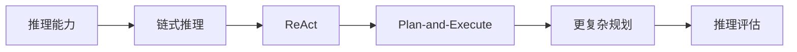

# 学前导读：推理与规划这一章到底在学什么

这一章解决的是：

> **Agent 到底怎样把复杂任务拆开、思考并推进。**

## 这一章的主线

```mermaid
flowchart LR
    A["推理能力"] --> B["链式推理"]
    B --> C["ReAct"]
    C --> D["Plan-and-Execute"]
    D --> E["更复杂规划"]
    E --> F["推理评估"]
```
