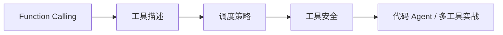

# 学前导读：工具这一章到底在学什么

这一章解决的是：

> **Agent 不只是会说，还要会做。**

## 这一章的主线

```mermaid
flowchart LR
    A["Function Calling"] --> B["工具描述"]
    B --> C["调度策略"]
    C --> D["工具安全"]
    D --> E["代码 Agent / 多工具实战"]
```
