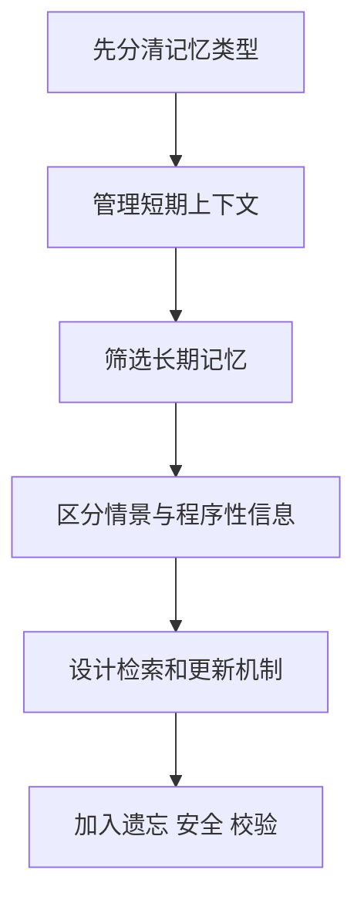
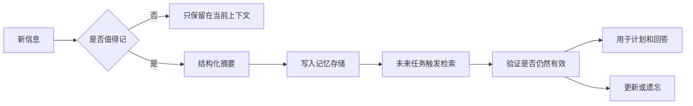

# 学前导读：记忆这一章到底在学什么

这一章解决的是：Agent 怎样不只是“当前这一轮会回答”，而是能在合适的时候记住、检索和使用历史信息。

记忆不是为了让 Agent 看起来更像人，而是为了服务任务。如果记忆不能帮助系统更好地完成目标、减少重复沟通、保持上下文一致或复用经验，它就可能只是增加复杂度和风险。

## 这一章在整个课程里的位置

你已经学过 Agent 基础、推理规划和工具调用。到记忆这一章，课程开始回答：当任务不是一次性完成，而是跨多轮、跨文件、跨时间持续推进时，Agent 怎样管理上下文和经验。

工具让 Agent 能行动，记忆让 Agent 能延续。没有记忆，Agent 每次都像第一次见到任务；记忆设计不好，Agent 又可能记错、记多、记乱，甚至把过期信息当成事实。

## 这一章真正要解决的问题

这一章要回答五个问题：短期记忆和长期记忆有什么区别；哪些信息值得记，哪些信息不该记；情景记忆和程序性记忆分别服务什么任务；记忆如何写入、检索、更新和遗忘；如何避免记忆污染、隐私风险和过期信息误导。

新人最容易误解的是：记得越多，Agent 越智能。真实情况是，记忆系统的质量取决于筛选、结构化、检索和更新机制。无关信息越多，反而越容易干扰决策。

## 新人推荐学习顺序

建议先学记忆总览，分清上下文窗口、短期记忆、长期记忆和外部存储。然后学短期记忆，理解多轮对话和任务状态如何被保留。接着学长期记忆，理解偏好、项目背景、稳定事实和可复用经验如何保存。再看情景记忆和程序性记忆，知道“发生过什么”和“以后怎么做”是两类不同信息。最后学习记忆工程实践，重点看写入规则、检索策略、更新机制和安全边界。

## 学这一章时要抓住的主线

这一章的主线可以概括为：记忆系统不是存储仓库，而是面向任务的上下文管理机制。

看懂这条线后，你会知道记忆的关键不是“存下来”，而是“什么时候存、存成什么、什么时候取、取出来是否可信、过期后怎样处理”。

## 这一章和后面章节的关系

记忆是 MCP、多 Agent、评估安全和部署的重要基础。MCP 可能让记忆连接到外部系统，多 Agent 会让不同角色共享或隔离记忆，评估安全会检查记忆是否带来隐私和错误传播风险，部署阶段则必须考虑权限、审计、数据保留和用户可控删除。

如果这一章没学稳，后面常见的问题是：Agent 每轮都重复问同样信息；长期记忆里保存了过期或无关内容；系统把用户偏好和事实混在一起；多 Agent 共享了不该共享的上下文；记忆检索结果没有验证就被当成真实依据。

## 本章小项目出口

学完这一章后，建议做一个“带记忆的学习规划助手”。它可以记住用户的学习目标、当前阶段、偏好的学习节奏和已完成项目；当用户下次询问时，系统能检索这些信息并给出更贴合的建议。

项目重点是设计记忆规则：哪些内容保存为长期偏好，哪些只是当前任务状态，哪些需要用户确认，哪些应该过期或删除。

## 过关标准

这一章结束时，你应该能解释短期记忆、长期记忆、情景记忆和程序性记忆的区别，能设计一个简单的记忆写入和检索流程，能说明记忆污染、过期信息和隐私风险为什么重要。

如果你能让一个 Agent 在多轮任务中正确使用历史信息，同时避免把无关或过期信息当成事实，就说明你已经掌握了记忆系统的入门能力。
