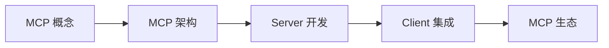

# 学前导读：MCP 这一章到底在学什么

这一章解决的是：

> **当工具和能力越来越多时，怎样用协议层把它们接得更统一。**

## 这一章的主线

```mermaid
flowchart LR
    A["MCP 概念"] --> B["MCP 架构"]
    B --> C["Server 开发"]
    C --> D["Client 集成"]
    D --> E["MCP 生态"]
```
