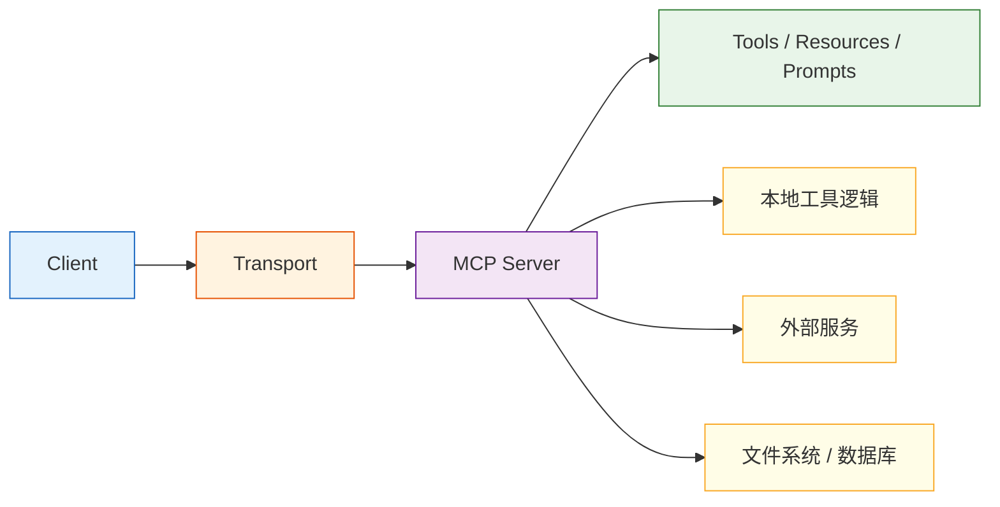

# MCP 架构与核心概念

:::tip 本节定位
上一节我们已经知道 MCP 是“工具接入层的统一协议”。  
这一节要继续往里走一步，回答：

> **一个 MCP 系统在结构上到底长什么样？**

你会看到，这一章的重点不是抽象口号，而是：

- 消息怎么流
- 谁负责什么
- 系统怎样从“发现工具”走到“真正执行工具”
:::

## 学习目标

- 理解 MCP 系统里的核心角色分工
- 看懂一条完整的工具发现与调用链路
- 理解 transport 在架构里的位置
- 建立对“协议流”而不是“单个接口”的理解

---

## 一、先把整张架构图看清楚



这张图里最值得记的不是节点名字，而是：

> **Client 不直接操作底层世界，而是通过 MCP Server 这个统一入口拿能力。**

---

## 二、Client 到底在做什么？

Client 的职责通常包括：

- 建立连接
- 发现 server 暴露了哪些能力
- 根据当前任务决定要不要调用
- 发起请求并接收结果

你可以把 client 理解成“使用者”。

在真实系统里，它可能是：

- IDE 插件
- 聊天助手
- 桌面 Agent
- 工作流引擎

它最核心的价值不是“自己会做事”，而是：

> **知道什么时候该向 server 要什么能力。**

---

## 三、Server 到底在做什么？

Server 的职责通常包括：

- 描述和暴露能力
- 接收 client 请求
- 调用本地或外部工具
- 返回结构化结果

换句话说，server 更像“能力提供方”。

它相当于对外说：

- 我有什么工具
- 每个工具怎么调用
- 我支持怎样的上下文对象

所以 server 是整个协议落地的核心承载体。

---

## 四、Transport 为什么不能忽略？

很多初学者会只盯着：

- client
- server

但真正让两者能沟通的，是 transport。

### 4.1 它在解决什么问题？

简单说，它决定：

> 这些协议消息到底通过什么通道传来传去。 

例如：

- 本地进程间通信
- 标准输入输出
- 网络连接

### 4.2 为什么 transport 很重要？

因为它会影响：

- 延迟
- 可靠性
- 部署形态
- 调试方式

所以 transport 不是“顺手一选”的小细节，而是架构层的一部分。

---

## 五、MCP 系统里最常见的三类能力

虽然大家经常说“工具”，但更完整一点看，常见暴露内容可以理解成三类：

### 5.1 Tools

能被调用执行的能力。

例如：

- 搜索
- 读文件
- 查天气

### 5.2 Resources

更偏“可读取的信息源”。

例如：

- 文档内容
- 配置数据
- 数据表快照

### 5.3 Prompts

更偏“可复用的提示模板”。

这三类东西并不完全一样，但都属于“对外暴露可用能力”的范畴。

---

## 六、一条完整消息流长什么样？

### 6.1 先发现工具

```python
list_request = {
    "jsonrpc": "2.0",
    "id": 1,
    "method": "tools/list",
    "params": {}
}

list_response = {
    "jsonrpc": "2.0",
    "id": 1,
    "result": {
        "tools": [
            {"name": "search_docs", "description": "搜索课程文档"},
            {"name": "get_weather", "description": "查询天气"}
        ]
    }
}

print(list_request)
print(list_response)
```

### 6.2 再调用工具

```python
call_request = {
    "jsonrpc": "2.0",
    "id": 2,
    "method": "tools/call",
    "params": {
        "name": "search_docs",
        "arguments": {"query": "退款政策"}
    }
}

call_response = {
    "jsonrpc": "2.0",
    "id": 2,
    "result": {
        "content": [{"type": "text", "text": "课程购买后 7 天内且学习进度低于 20% 可退款。"}]
    }
}

print(call_request)
print(call_response)
```

### 6.3 这两步真正说明了什么？

它说明 MCP 不是单纯“调一个函数”，而是先有：

1. 能力发现
2. 能力调用

这样 client 才不需要把所有工具细节都写死。

---

## 七、为什么说 MCP 是“解耦层”？

### 7.1 没有 MCP 时

客户端通常得直接知道：

- 工具怎么命名
- 参数怎么写
- 返回结果长什么样

这会导致 client 和 tool provider 强耦合。

### 7.2 有了 MCP 以后

client 更多依赖的是：

- 统一协议
- 统一发现方式
- 统一调用方式

这让系统形成一种更清晰的分层：

- 上层做任务编排
- 下层做能力提供

所以你可以把 MCP 理解成：

> **工具生态里的适配层和解耦层。**

---

## 八、一个最小的架构模拟

下面用纯 Python 模拟一个极简的 MCP 交互过程。

```python
class MockMCPServer:
    def __init__(self):
        self.tools = {
            "search_docs": lambda query: f"检索结果: {query}"
        }

    def list_tools(self):
        return [{"name": name} for name in self.tools]

    def call_tool(self, name, arguments):
        if name not in self.tools:
            return {"error": "unknown_tool"}
        return {"result": self.tools[name](**arguments)}

class MockMCPClient:
    def __init__(self, server):
        self.server = server

    def discover(self):
        return self.server.list_tools()

    def call(self, name, arguments):
        return self.server.call_tool(name, arguments)

server = MockMCPServer()
client = MockMCPClient(server)

print(client.discover())
print(client.call("search_docs", {"query": "退款政策"}))
```

### 8.2 这个例子很小，但非常有教学价值

因为它已经体现了三层分工：

- client 负责请求
- server 负责能力暴露
- tool 负责具体执行

只要这三层分工想清楚，后面再看更真实的 MCP 系统就会稳很多。

---

## 九、最常见的架构误区

### 9.1 把 server 当成工具本身

server 不是工具，而是：

> 工具的协议化出口。 

### 9.2 觉得 transport 可有可无

transport 直接影响部署和稳定性。

### 9.3 以为 MCP 自动解决权限和策略问题

不会。  
它解决的是“统一接入”，不是“自动治理”。

---

## 十、小结

这一节最重要的不是记住 client/server 这几个词，而是看懂：

> **MCP 架构的核心，是让能力提供方和能力使用方通过统一消息流和统一边界发生关系。**

只要这条流动逻辑清楚，后面再学 server 开发、client 集成和生态实践时，就不容易发虚。

---

## 练习

1. 用自己的话解释：为什么 client 和 server 的职责必须分开？
2. 想一想：如果 transport 换掉，为什么上层调用逻辑最好尽量不变？
3. 给 `MockMCPServer` 再加一个 `get_weather` 工具。
4. 用自己的话解释：为什么说 MCP 是“解耦层”，而不是“工具本身”？
