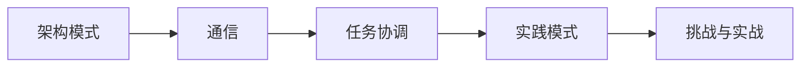

# 学前导读：多 Agent 这一章到底在学什么

这一章解决的是：

> **什么时候一个 Agent 不够，为什么要把任务拆给多个 Agent。**

## 这一章的主线

```mermaid
flowchart LR
    A["架构模式"] --> B["通信"]
    B --> C["任务协调"]
    C --> D["实践模式"]
    D --> E["挑战与实战"]
```
