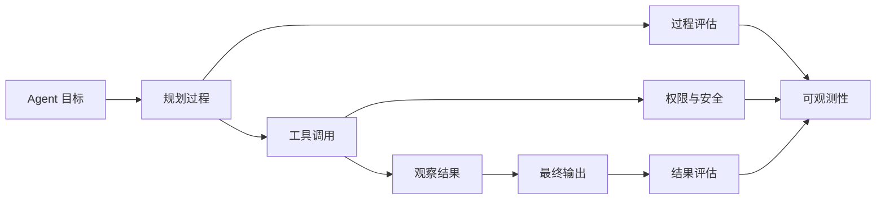
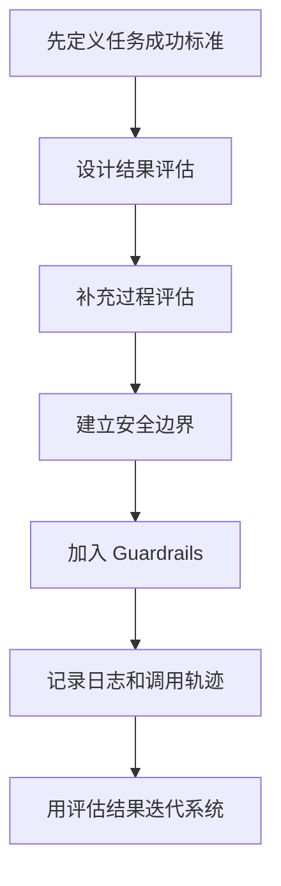
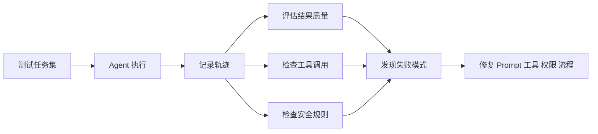

# 学前导读：评估与安全这一章到底在学什么

这一章解决的是：Agent 不只是要能跑，还要知道跑得好不好、安不安全、出了问题能不能看见。

很多 Agent Demo 只展示成功路径：输入一个目标，系统调用工具，最后输出一个看起来不错的结果。但真实系统里，更重要的问题是：它为什么这么做，过程是否可靠，工具调用是否越权，答案是否可验证，失败时能不能追踪，成本是否可控，用户是否能理解和干预。

## 这一章在整个课程里的位置

你已经学过 Agent 的目标、规划、工具、记忆、MCP 和多 Agent。到评估与安全这一章，课程开始从“能实现”转向“能信任”。

Agent 的风险比普通聊天系统更高，因为它不仅会生成内容，还可能调用工具、读取数据、修改文件、执行代码或触发外部流程。因此评估与安全不能放到最后随便补，而要成为 Agent 系统设计的一部分。

## 这一章真正要解决的问题

这一章要回答五个问题：怎样判断 Agent 是否完成了任务；除了最终答案，还应该如何评估规划、工具调用和中间观察；基准测试和自定义评估集各自有什么作用；Guardrails、权限控制、输入输出校验和人工确认怎样降低风险；日志、轨迹、成本和错误信息如何帮助调试和运维。

新人最容易忽略的是：Agent 的错误不一定出现在最终答案里。它可能在任务理解时就偏了，在工具选择时选错，在参数构造时传错，在观察结果总结时漏掉关键事实，最后输出看起来却很顺。这就是为什么 Agent 评估必须看过程。

## 新人推荐学习顺序

建议先学评估方法，分清结果评估、过程评估、人工评估和自动评估。然后看 benchmarks，知道公开基准能提供参考，但真实项目还需要自己的任务集。接着学安全与对齐，理解越权、提示注入、工具误用、数据泄露和幻觉的风险。再学 Guardrails，掌握输入过滤、输出校验、权限边界和人工确认。最后学可观测性，把日志、调用轨迹、错误、延迟和成本记录下来。

## 学这一章时要抓住的主线

这一章的主线可以概括为：评估让你知道系统是否有效，安全让你控制系统能做什么，可观测性让你知道问题发生在哪里。

看懂这条线后，你会知道评估不是上线前的一次打分，而是持续迭代机制。每次失败都应该能被归因：是模型理解错、计划错、工具错、权限错、资料错，还是最终表达错。

## 这一章和后面章节的关系

评估与安全是部署运维的前提。没有评估，你不知道系统是否值得上线；没有安全边界，Agent 调用工具会带来不可控风险；没有可观测性，上线后出现问题也无法定位。后面的部署章节会进一步把这些要求落到架构、日志、恢复、成本和生产实践里。

如果这一章没学稳，后面常见的问题是：Demo 看起来成功但没有可复现评估；工具权限过大；用户输入可以诱导系统泄露或误操作；出了问题只能看最终答案，找不到中间失败点；成本和延迟失控却没有记录。

## 本章小项目出口

学完这一章后，建议给前面做过的研究助手或学习助手 Agent 加一套评估与安全层。准备 10 到 20 个测试任务，记录每次执行的计划、工具调用、观察结果、最终输出和人工评分，并加入至少三个安全规则，例如敏感操作需要确认、工具参数必须校验、无来源信息不能强答。

项目重点是让 Agent 的行为可追踪、可评估、可复盘，而不是只看一次输出是否顺眼。

## 过关标准

这一章结束时，你应该能区分结果评估和过程评估，能设计一个小型 Agent 测试集，能说明 Guardrails、权限控制、输入输出校验和可观测性的作用，能根据调用轨迹定位 Agent 失败发生在哪一环。

如果你能把一个 Agent Demo 改造成带日志、评估样例、安全规则和失败复盘机制的系统，就达到了进入部署运维阶段的基础要求。
