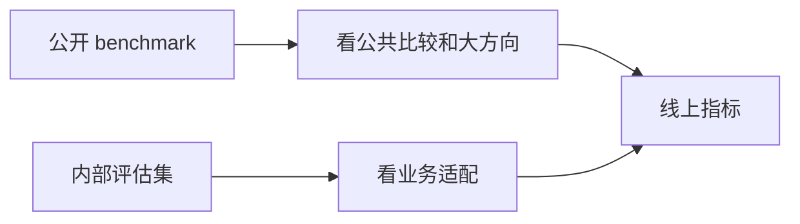

# Agent 评估基准

:::tip 本节定位
公开 benchmark 很重要，但也很容易让人产生错觉：

- 榜单高 = 一切都好

对 Agent 来说，这个错觉尤其危险。  
因为很多基准只能覆盖：

- 某类任务
- 某类环境
- 某类成功标准

这节课的重点，是帮你建立一个更成熟的 benchmark 观。
:::

## 学习目标

- 理解 benchmark 的价值和局限
- 理解为什么公开基准不能替代业务评估
- 学会设计“公开 benchmark + 自定义评估集”的组合策略
- 建立对榜单结果的正确解读方式

---

## 先建立一张地图

Benchmark 这节最适合新人的理解顺序不是“看榜单”，而是先看清：



所以这节真正想解决的是：

- benchmark 能告诉你什么
- benchmark 不能替代什么

## 一、benchmark 为什么重要？

因为它能提供：

- 公共题目
- 可复现比较
- 方法演进参考

如果没有公共 benchmark，  
大家会很难在同一标准下比较系统。

---

## 二、benchmark 为什么又不够？

### 1. 任务分布未必像你的业务

### 2. 环境约束未必像你的系统

### 3. 公开题目容易被过拟合

所以 benchmark 更像：

- 公共体检项目

而不是你业务唯一的上线标准。

---

## 三、先跑一个最小 benchmark 结果汇总示例

```python
systems = [
    {"name": "agent_a", "public_benchmark": 0.82, "internal_eval": 0.61},
    {"name": "agent_b", "public_benchmark": 0.78, "internal_eval": 0.73},
]

for item in systems:
    gap = round(item["public_benchmark"] - item["internal_eval"], 4)
    print({**item, "generalization_gap": gap})
```

### 3.1 这个例子最想表达什么？

公开 benchmark 高分，不一定等于内部业务也高分。  
两者之间的落差非常值得关注。

## 四、一个更稳的 benchmark 使用顺序

更建议这样用：

1. 先看公开 benchmark 找方向
2. 再做内部业务评估
3. 最后结合线上指标看真实效果

这三层合起来，才更接近真实上线判断。

### 4.1 一个新人可直接照抄的评估组合

如果你刚开始做 Agent 系统，最稳的组合通常是：

1. 一个公开 benchmark  
   用来知道自己大概处在什么水平。

2. 一组内部任务集  
   用来验证系统是否真的贴你的业务。

3. 一组线上回放样本  
   用来验证系统在真实使用场景里会不会失真。

这三层合在一起，比只盯一个 leaderboard 稳得多。

---

## 五、怎么更合理地使用 benchmark？

### 1. 先用公开 benchmark 看大方向

### 2. 再用内部评估集看业务适配

### 3. 最后结合线上指标做闭环

这三层合起来，才更接近真实系统评估。

---

## 六、最常见误区

### 1. 榜单高就直接上线

### 2. 内部评估完全不做

### 3. 只看单次跑分，不看稳定性

## 七、什么时候 benchmark 会特别容易误导你？

比较常见的是这几种情况：

- 你的任务分布和 benchmark 完全不一样
- 你的系统高度依赖工具或权限，而 benchmark 没覆盖这些约束
- 你的业务特别在意成本、延迟或可解释性，但 benchmark 只看结果

这时候 benchmark 仍然有参考价值，但已经不能当主指标。

---

## 小结

这节最重要的是建立一个判断：

> **benchmark 很重要，但它更适合做公共比较和方向判断，真正上线仍然要依赖内部任务评估与线上信号。**

## 这节最该带走什么

- benchmark 是公共坐标系，不是全部真相
- 榜单高分不等于业务适配
- 真正稳的判断一定是 benchmark、内部评估和线上数据一起看

---

## 练习

1. 想一想：为什么公开 benchmark 和内部业务指标可能差很多？
2. 如果一个系统榜单高但内测差，你会优先怀疑什么？
3. 你的业务更需要什么样的内部评估集？
4. 为什么说 benchmark 更像体检，不像最终诊断？
