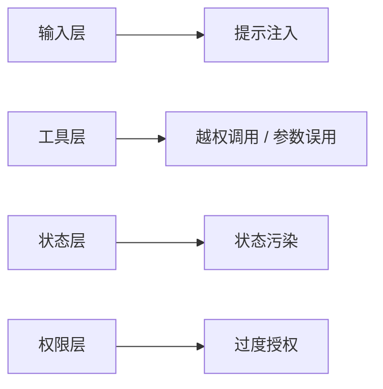

# Agent 安全与对齐

:::tip 本节定位
普通聊天系统主要风险常常停留在：

- 说错

而 Agent 风险更进一步：

- 做错

因为一旦接入工具和状态，错误会从文本层升级到动作层。  
这就是为什么 Agent 安全会比纯聊天复杂很多。
:::

## 学习目标

- 理解 Agent 和普通聊天系统在风险上的关键差异
- 学会按攻击面拆解 Agent 安全问题
- 理解提示注入、越权调用、状态污染等典型问题
- 建立“安全是系统设计问题”的意识

---

## 零、先建立一张地图

Agent 安全这节最适合新人的理解顺序不是“只盯 Prompt Injection”，而是先看清攻击面：



所以这节真正想解决的是：

- Agent 风险为什么会从“说错”升级到“做错”
- 为什么安全必须从系统攻击面整体去看

## 一、Agent 安全为什么更复杂？

因为 Agent 常常会：

- 调工具
- 读写状态
- 接触外部系统

这意味着失败不只是：

- 回答不准

还可能是：

- 调错接口
- 泄露数据
- 写坏状态

---

## 二、典型攻击面有哪些？

### 1. Prompt Injection

通过输入诱导系统违背原规则。

### 2. Tool Misuse

诱导调用不该调用的工具。

### 3. State Pollution

把恶意内容写进长期记忆或会话状态。

### 4. Over-Permission

系统权限过大，导致一旦出错后果更严重。

---

## 三、先看一个最小权限分级示例

```python
tool_permissions = {
    "search_docs": "low",
    "get_user_profile": "medium",
    "delete_account": "high",
}


def can_execute(tool_name, user_role):
    if tool_permissions[tool_name] == "high" and user_role != "admin":
        return False
    return True


print(can_execute("search_docs", "guest"))
print(can_execute("delete_account", "guest"))
print(can_execute("delete_account", "admin"))
```

### 3.1 这个例子最想表达什么？

Agent 安全的核心不是只靠模型“懂事”，  
还要靠系统层明确：

- 哪些动作谁可以做

### 3.2 一个新人最该先做的风险盘点

如果你正在做一个 Agent，第一步往往不是先加规则，  
而是先列清楚：

- 它能读什么
- 它能写什么
- 它能调用哪些高风险工具
- 它会不会把内容写进长期状态

这份清单本身就非常有价值。

## 四、一个新人可直接照抄的安全排查顺序

更稳的顺序通常是：

1. 先列出所有工具
2. 再给工具分权限等级
3. 再检查哪些状态会被写入
4. 最后再补提示注入和输出层规则

这样会比只在 Prompt 上打补丁更有效。

---

## 五、最常见误区

### 1. 只做输出过滤，不管工具权限

### 2. 以为安全只是 prompt 问题

### 3. 忽略状态和记忆层

## 六、什么时候“安全问题”其实是架构问题？

很常见的是下面这些情况：

- 工具权限没有分级
- 所有工具都对所有请求开放
- 状态写入没有边界
- 高风险动作没有确认机制

这时候问题已经不是“模型回答得对不对”，而是系统设计本身太松。

---

## 七、小结

这节最重要的是建立一个判断：

> **Agent 安全的复杂度来自工具、状态和权限的加入，因此它必须按系统攻击面整体设计，而不是只在输出层补丁式修补。**

## 八、这节最该带走什么

- Agent 安全是系统攻击面问题，不只是文本安全问题
- 工具、权限、状态和输入都要一起看
- 先收权限，再收行为，往往比单纯输出过滤更稳

---

## 练习

1. 列出你当前 Agent 里最危险的三个工具。
2. 为什么说状态污染也是安全问题？
3. 如果一个工具权限过大，最坏后果会是什么？
4. 想一想：为什么 Agent 安全不等于普通聊天安全的放大版？
