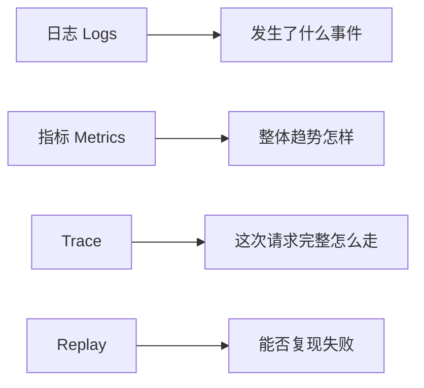
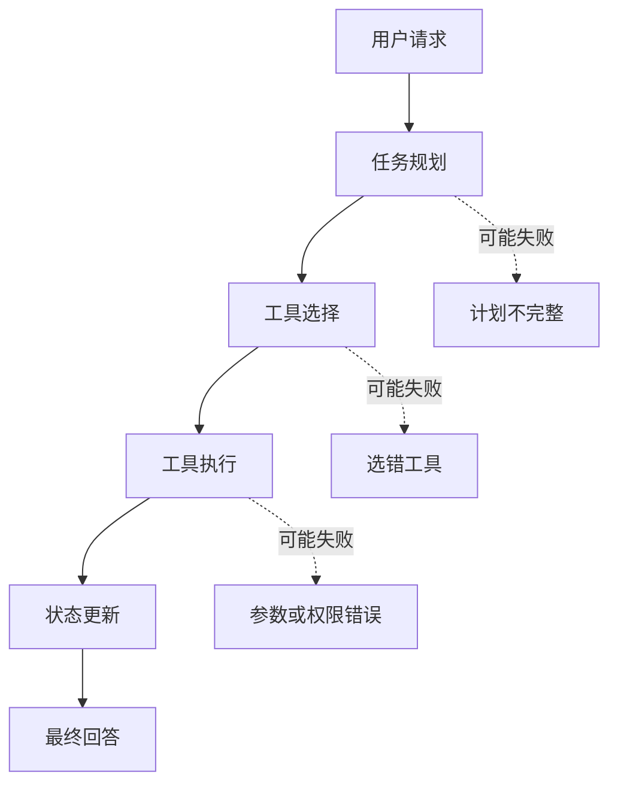

# Agent 可观测性

:::tip 本节定位
Agent 系统如果没有可观测性，很多问题会变成“看起来怪怪的，但不知道哪一步怪”。这节的核心是让系统内部过程可以被看见、被定位、被回放。
:::

## 学习目标

- 理解日志、指标、trace 和回放分别解决什么问题
- 知道为什么 Agent 比普通接口更需要轨迹级观测
- 能设计一个最小 Agent trace schema
- 能用观测数据定位工具调用、检索、规划和成本问题

---

## 先建立一张地图



普通接口通常只要知道请求成功还是失败、耗时多少、错误码是什么。Agent 不一样，一次请求可能包含多轮推理、多次检索、多个工具、状态变更和人工确认。如果只保存最终回答，你几乎无法解释它为什么答错、为什么调用错工具、为什么成本突然升高。

## 一、Agent 为什么特别需要可观测性

Agent 的失败经常不是单点失败，而是链路失败。比如用户问“帮我整理 RAG 复习资料”，系统可能先拆任务，再查课程文档，再生成计划，再调用文件工具。如果最后结果不好，原因可能是任务拆错、检索错、工具参数错、上下文丢失，也可能是模型在最后生成时忽略了来源。



所以 Agent 可观测性的目标不是“多打印几行日志”，而是能重建一次任务的执行轨迹。

## 二、四类最重要的观测对象

日志回答“发生了什么事件”，例如开始检索、调用工具、工具报错。指标回答“整体趋势怎样”，例如平均耗时、成功率、token 成本、工具失败率。Trace 回答“这次请求完整链路怎么走”，例如每一步输入、输出、状态变化。Replay 回答“能不能复现失败”，也就是保留足够上下文让你重新运行或人工分析。

| 类型 | 关注点 | 典型字段 |
|---|---|---|
| Logs | 单个事件 | timestamp、level、event、message |
| Metrics | 聚合趋势 | success_rate、latency_ms、cost、tool_error_rate |
| Trace | 请求链路 | request_id、step_id、node、input、output、status |
| Replay | 复现失败 | 原始输入、检索结果、工具返回、模型参数、最终输出 |

## 三、一个最小 trace schema

第一次做 Agent 可观测性时，不需要马上接复杂平台。先让每次请求留下结构化轨迹即可。

```python
from dataclasses import dataclass, asdict
from time import time
from uuid import uuid4


@dataclass
class TraceStep:
    request_id: str
    step_id: int
    node: str
    input_summary: str
    output_summary: str
    status: str
    latency_ms: int
    cost_tokens: int = 0


def run_agent(query):
    request_id = str(uuid4())
    trace = []

    start = time()
    plan = "先检索课程文档，再生成复习计划"
    trace.append(TraceStep(request_id, 1, "planner", query, plan, "ok", int((time() - start) * 1000)))

    start = time()
    docs = ["RAG 包含切分、向量化、检索、生成和引用检查"]
    trace.append(TraceStep(request_id, 2, "retriever", "RAG 复习", str(docs), "ok", int((time() - start) * 1000)))

    start = time()
    answer = "建议按：基础概念 -> 检索优化 -> 评估集 -> 项目复盘来复习。"
    trace.append(TraceStep(request_id, 3, "generator", str(docs), answer, "ok", int((time() - start) * 1000), cost_tokens=120))

    return answer, [asdict(step) for step in trace]


answer, trace = run_agent("帮我准备 RAG 阶段复习")
print(answer)
for step in trace:
    print(step)
```

这个例子最重要的不是代码复杂度，而是它把每一步都变成可检查对象。后面无论你用 LangGraph、LlamaIndex、CrewAI，还是自己写函数，底层都应该保留类似轨迹。

## 四、排查问题时怎么看 trace

当 Agent 输出质量差时，不要先改 Prompt。更稳的排查顺序是：先看计划是否正确，再看检索或工具结果是否正确，再看模型是否正确使用了这些结果，最后才看最终表达。

| 现象 | 优先看哪里 | 可能原因 |
|---|---|---|
| 回答跑题 | planner / retriever | 任务理解错、检索 query 错 |
| 编造来源 | retriever / generator | 没有命中文档、生成时未引用检索结果 |
| 工具没执行 | tool_select / tool_call | 工具描述不清、权限不足、参数 schema 错 |
| 成本突然升高 | metrics / trace | 循环调用、上下文过长、重试过多 |
| 偶发失败 | replay 样本 | 输入边界、外部服务波动、状态未持久化 |

## 五、最值得先记录的字段

如果只能先做最小版本，建议至少保留：request_id、user_query、plan、selected_tools、tool_inputs、tool_outputs、retrieved_docs、final_answer、latency_ms、token_usage、status、error_message。这些字段能覆盖大多数调试需求。

对于高风险 Agent，还应该记录 human_approval、permission_scope、rollback_action 和 audit_log。凡是涉及发消息、改文件、删数据、付款、发邮件的动作，都不能只留最终结果。

## 六、和现有工具的关系

真实项目里可以使用 LangSmith、OpenTelemetry、Arize Phoenix、Helicone 或云厂商日志系统来承载观测数据。课程里不要求你绑定某个工具，但要理解这些工具共同解决的是同一件事：把模型调用、检索、工具、状态和成本串成可查询的执行轨迹。

更重要的是，不要把工具当成可观测性的全部。即使用了平台，如果你的事件命名混乱、字段缺失、request_id 没有贯穿全链路，排障仍然会很困难。

## 七、常见误区

第一个误区是只记录最终答案。最终答案只能说明结果，不说明过程。第二个误区是只打自然语言日志，不保留结构化字段；这样后续很难统计和筛选。第三个误区是只在报错时记录，成功样本同样重要，因为你需要对比成功和失败链路的差异。第四个误区是没有成本指标，导致系统能跑但不可持续。

## 练习

1. 给上面的 trace 示例补充 `error_message` 和 `retry_count` 字段。
2. 设计一个 RAG Agent 的 trace schema，至少包含检索 query、命中文档、引用检查结果。
3. 找一个你之前写过的 LLM 示例，补上 request_id 和 latency_ms。
4. 思考：如果一个 Agent 可以删除文件，trace 中必须额外记录哪些安全字段？

## 过关标准

学完这一节后，你应该能解释日志、指标、trace、replay 的区别，能写出一个最小 Agent trace schema，能根据 trace 判断错误发生在规划、检索、工具还是生成阶段，并能把可观测性写进自己的 Agent 项目 README。
