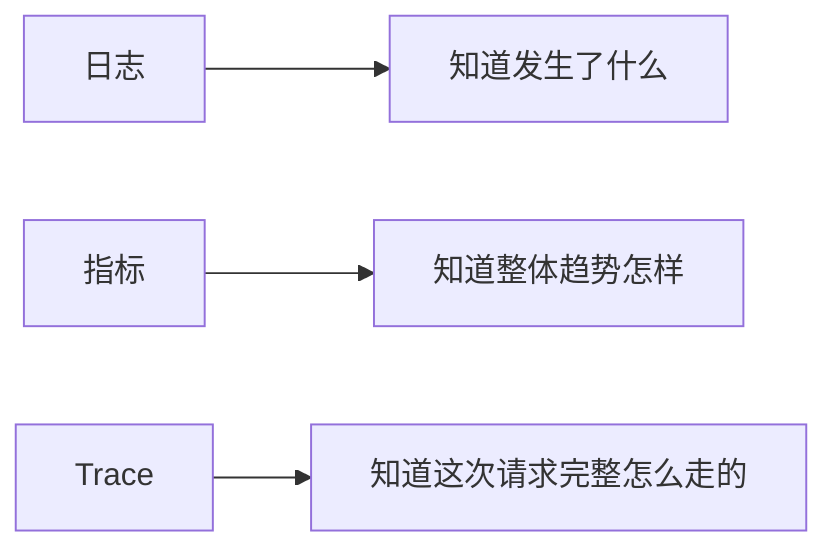

# Agent 可观测性

:::tip 本节定位
Agent 系统如果没有可观测性，很多问题会变成：

- 看起来怪怪的
- 但不知道哪一步怪

这节的核心就是：

> **让系统内部过程可以被看见、被定位、被回放。**
:::

## 学习目标

- 理解日志、trace、指标三者区别
- 理解为什么 Agent 特别需要轨迹级观测
- 通过可运行示例建立最小 trace 记录器
- 建立“没有观测就无法迭代”的工程意识

---

## 先建立一张地图

可观测性这节最适合新人的理解顺序不是“多打几条日志”，而是先看清：



所以这节真正想解决的是：

- 为什么 Agent 特别需要请求级链路观测
- 为什么只有最终答案日志远远不够

## 一、为什么 Agent 比普通接口更需要可观测性？

因为一次请求后面可能包含：

- 多轮推理
- 多个工具
- 中间状态变化

如果只看最终输出，很难知道问题发生在哪一步。

---

## 二、最常见的三类观测对象

### 1. 日志

回答：

- 发生了什么事件

### 2. 指标

回答：

- 整体趋势怎样

### 3. Trace

回答：

- 这次请求完整链路怎么走的

---

## 三、先跑一个最小 trace 记录器

```python
trace = []


def record(stage, payload):
    trace.append({"stage": stage, "payload": payload})


record("input", {"query": "退款规则是什么"})
record("tool_select", {"tool": "search_policy"})
record("tool_result", {"result": "7天内可退"})
record("final_answer", {"answer": "课程购买后 7 天内可退款"})

for item in trace:
    print(item)
```

### 3.1 这个例子最重要的地方是什么？

它说明可观测性不是只记录报错，  
而是把整条链都记下来。

## 四、一个新人可直接照抄的观测顺序

更稳的顺序通常是：

1. 先打关键事件日志
2. 再补核心指标
3. 最后补完整 trace 和回放能力

这样通常比一上来做大而全的观测系统更容易落地。

### 4.1 一开始最值得先记哪几类字段？

第一次给 Agent 加观测时，最值得先保留的是：

- 请求 id
- query
- 选了哪个工具
- 工具返回了什么
- 最终回答是什么
- 总耗时是多少

这几类字段先保住，后面很多问题就已经能定位一大半。

---

## 五、最常见误区

### 1. 只打日志，不打 trace

### 2. 指标太少，无法定位趋势

### 3. 不保留请求级回放信息

## 六、如果只能先补一种能力，最先补什么？

如果资源有限，最优先通常不是最复杂仪表盘，  
而是：

> **请求级 trace 和可回放样本。**

因为这会直接决定你能不能复现问题。

### 6.1 一个很适合新人的最小 trace 模板

第一次做 Agent 可观测性时，其实不需要很复杂。  
一个够用的最小模板通常就包含：

```text
request_id
query
chosen_tools
tool_outputs
final_answer
latency_ms
```

只要这几项能稳定留下来，很多问题就已经能被重新拼回去。

---

## 小结

这节最重要的是建立一个判断：

> **Agent 可观测性的核心，是让“这次请求发生了什么”可以被完整重建。**

## 这节最该带走什么

- 可观测性不是只看报错，而是能重建链路
- 日志、指标、trace 三者解决的是不同问题
- 没有 trace 和回放，很多 Agent 问题几乎无法稳定复现

## 如果继续往上做，最值得补什么

更值得继续补的通常是：

1. trace 可视化
2. 请求回放
3. 关键路径 latency 分析

这样系统就会从“能排障”进一步走到“能持续优化”。

---

## 练习

1. 给示例再加一个 `latency_ms` 字段。
2. 为什么说 trace 对 Agent 特别重要？
3. 想一想：日志和指标分别更适合回答什么问题？
4. 如果线上只剩最终答案日志，会给排障带来什么困难？
