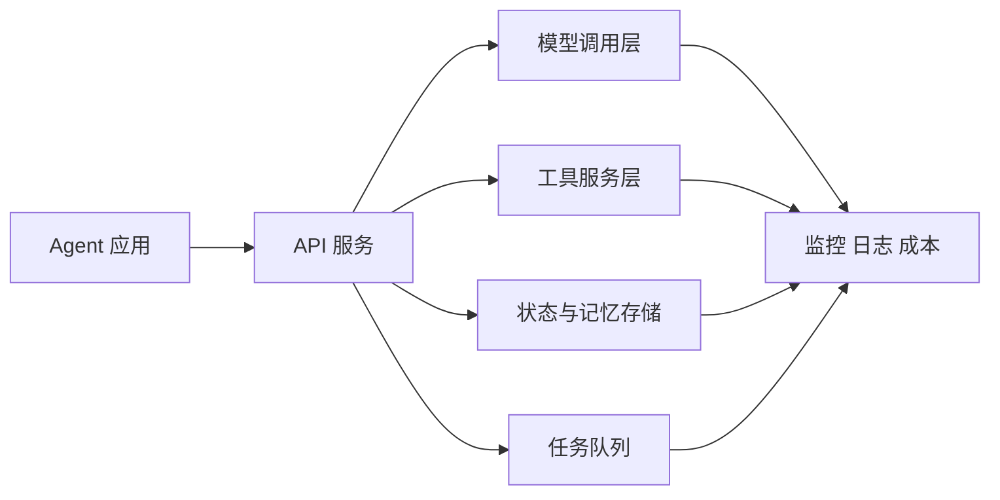
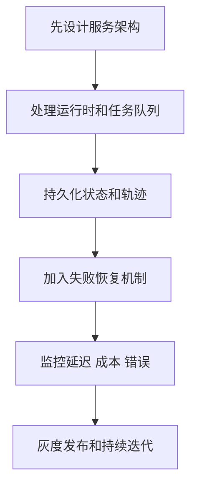
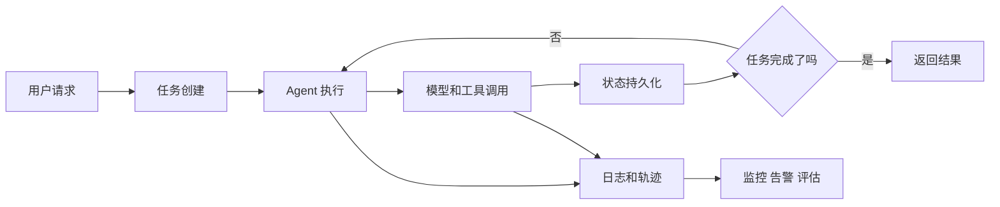

# 学前导读：部署与运维这一章到底在学什么

这一章解决的是：Agent 原型怎样真正变成一个能长期运行、能恢复、能控制成本、能被维护的系统。

很多 Agent 在本地 Demo 里看起来很好，但一到真实环境就会遇到新的问题：请求并发、模型超时、工具失败、状态丢失、任务中断、成本飙升、日志不全、权限配置复杂、用户反馈无法回流。部署与运维章要训练的就是这些生产系统思维。

## 这一章在整个课程里的位置

你已经学过 Agent 的核心能力，也学过评估与安全。到部署运维阶段，课程开始从“这个 Agent 能不能完成一次任务”转向“它能不能持续为用户提供服务”。

部署不是把代码放到服务器上就结束。对于 Agent 来说，部署还包含模型调用层、工具服务层、任务队列、状态存储、日志追踪、错误恢复、成本监控、权限管理和版本迭代。

## 这一章真正要解决的问题

这一章要回答五个问题：Agent 服务应该如何拆分架构；长任务、异步任务和中断恢复如何处理；状态、记忆、工具结果和执行轨迹应该怎样持久化；如何控制模型调用、工具调用和多 Agent 协作带来的成本；上线后如何通过日志、监控、告警和用户反馈持续改进。

新人最容易误解的是：只要 Agent 逻辑写出来，就可以上线。真实生产环境里，最难的往往不是让它成功跑一次，而是让它在失败、超时、并发、重试、权限变化和模型波动时仍然可控。

## 新人推荐学习顺序

建议先学部署架构，理解前端、后端、模型服务、工具服务和存储之间的关系。然后看运行时管理，重点理解同步任务、异步任务、长任务和队列。接着学持久化与恢复，知道任务状态、记忆、日志和中间结果为什么不能只放在内存里。再看成本优化，理解 token、模型选择、缓存、批处理和工具调用次数如何影响成本。最后学习生产最佳实践，把监控、告警、权限、灰度和回滚补上。

## 学这一章时要抓住的主线

这一章的主线可以概括为：部署 Agent，就是把模型、工具、状态和评估放进一个可运行、可观察、可恢复的工程系统。

看懂这条线后，你会知道生产 Agent 的关键不是“看起来智能”，而是每一步都能被记录、恢复、限制和优化。

## 这一章和后面章节的关系

部署运维是第九阶段走向真实项目的出口。它会连接最终综合项目，也会连接前面的评估、安全、工具和记忆设计。一个能上线的 Agent 项目，必须同时有功能闭环、错误处理、日志追踪、安全边界、成本意识和部署说明。

如果这一章没学稳，后面常见的问题是：本地能跑，上线就超时；任务中断后无法恢复；多轮状态丢失；日志只记录最终答案，无法定位失败；模型调用成本不可控；没有灰度和回滚策略。

## 本章小项目出口

学完这一章后，建议把前面的学习助手或研究助手 Agent 做成一个最小可部署版本。它应该有一个 API 入口，能创建任务、执行模型和工具调用、保存任务状态、记录调用轨迹，并在失败时返回可理解的错误信息。

项目可以不追求复杂界面，但必须包含部署说明、环境变量配置、日志记录、基础成本估算和至少一种失败恢复策略。

## 过关标准

这一章结束时，你应该能画出一个 Agent 应用的部署架构，能说明运行时管理、状态持久化、失败恢复、日志监控和成本优化分别解决什么问题，能把本地 Demo 改造成可重复启动、可观察、可配置的小型服务。

如果你能让一个 Agent 项目具备 API 入口、任务状态、调用日志、错误处理、成本记录和部署文档，就达到了 Agent 阶段的工程化出口标准。
