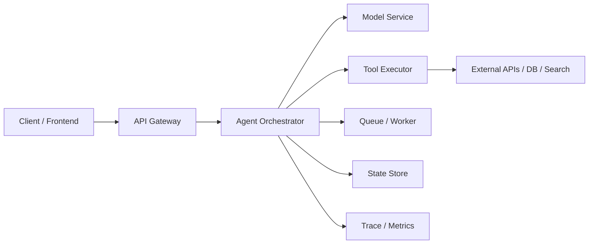

# Agent 部署架构

:::tip 本节定位
很多 Agent 项目一开始只有一段脚本：

- 收请求
- 调模型
- 打印答案

但真正上线时，我们通常需要的不是“一个脚本”，而是一套架构。

因为上线后必须同时面对：

- 并发
- 状态
- 工具依赖
- 日志审计
- 故障恢复

这一节要建立的就是这张架构地图。
:::

## 学习目标

- 理解 Agent 部署架构的核心模块分层
- 理解为什么“模型服务”只是其中一层
- 通过可运行示例掌握请求在架构中的流转
- 建立从 demo 到生产系统的整体视角

---

## 一、一个可上线的 Agent 系统通常包含哪些层？

### 1.1 接入层

负责：

- 接 HTTP / WebSocket / 内部 RPC 请求
- 做认证、限流、路由

### 1.2 编排层

负责：

- 选择工作流
- 调模型
- 决定工具调用
- 管理任务状态

这一层通常就是 Agent 的“大脑外壳”。

### 1.3 执行层

负责：

- 实际工具调用
- 模型推理服务
- 检索服务
- 外部 API 调用

### 1.4 状态与存储层

负责：

- 会话状态
- 长期记忆
- 任务 checkpoint
- 日志与审计

### 1.5 观测层

负责：

- 指标
- trace
- 错误告警

---

## 二、为什么“模型 API + 几个工具”还不够叫架构？

### 2.1 因为缺少状态边界

一旦任务变长，系统必须明确回答：

- 当前进行到哪一步
- 上一步结果是什么
- 失败后如何恢复

### 2.2 因为缺少执行边界

模型不应该直接承担：

- 权限控制
- 超时策略
- 工具审计

这些更适合由架构层负责。

### 2.3 因为缺少观测边界

如果线上出问题却无法回答：

- 卡在哪个工具
- 哪类请求最慢
- 哪类链路最容易失败

那系统就很难长期维护。

---

## 三、先看一个最小架构流转示例

这个示例不会真的起服务，  
但它会非常清楚地展示请求怎样在架构中流动：

1. 接入层接收请求
2. 编排层选择工具
3. 执行层调用工具
4. 存储层记录状态
5. 观测层打 trace

```python
def gateway(request):
    return {
        "request_id": request["request_id"],
        "user_id": request["user_id"],
        "message": request["message"],
    }


def orchestrator(envelope):
    if "退款" in envelope["message"]:
        return {"workflow": "refund_flow", "tool": "search_policy"}
    return {"workflow": "default_flow", "tool": "none"}


def tool_executor(tool_name, message):
    if tool_name == "search_policy":
        return {"policy_text": "退款需满足 7 天内且学习进度低于 20%。"}
    return {"note": "no_tool_used"}


def state_store(request_id, workflow, observation):
    return {
        "request_id": request_id,
        "workflow": workflow,
        "observation": observation,
    }


def trace_logger(request_id, stage, payload):
    return {"request_id": request_id, "stage": stage, "payload": payload}


request = {"request_id": "req-001", "user_id": "u-01", "message": "请告诉我退款规则"}

envelope = gateway(request)
trace = [trace_logger(envelope["request_id"], "gateway", envelope)]

decision = orchestrator(envelope)
trace.append(trace_logger(envelope["request_id"], "orchestrator", decision))

observation = tool_executor(decision["tool"], envelope["message"])
trace.append(trace_logger(envelope["request_id"], "tool_executor", observation))

persisted = state_store(envelope["request_id"], decision["workflow"], observation)
trace.append(trace_logger(envelope["request_id"], "state_store", persisted))

for item in trace:
    print(item)
```

### 3.1 这段代码真正想教什么？

不是“写几个函数”，  
而是让你脑子里出现清晰分层：

- 请求入口
- 决策逻辑
- 工具执行
- 状态保存
- 跟踪记录

这几个层一旦分清，架构就开始稳定。

### 3.2 为什么编排层和执行层要分开？

因为：

- 编排层负责“决定”
- 执行层负责“做事”

两者混在一起，后面很难做：

- 安全控制
- 独立扩缩容
- 调试

### 3.3 为什么状态存储不能只是日志？

因为日志更像“发生过什么”。  
真正的状态还包括：

- 当前步骤
- 当前上下文
- 是否可恢复

它比日志更偏“可继续执行”。

---

## 四、一个更常见的生产架构长什么样？

通常可以抽象成下面这条链：



这张图里的关键点是：

- 模型服务只是执行层的一部分
- 工具系统通常是独立执行层
- 状态和观测都应作为独立支撑层存在

---

## 五、什么时候需要队列和异步 worker？

### 5.1 长任务

例如：

- 生成长报告
- 多阶段数据整理
- 多工具异步流程

### 5.2 不适合阻塞用户请求的任务

例如：

- 批量总结
- 周报生成
- 长链路分析

### 5.3 为什么队列有帮助？

它能带来：

- 异步解耦
- 限流缓冲
- 失败重试

但代价是：

- 系统更复杂
- 状态管理更难

---

## 六、最容易踩的架构误区

### 6.1 误区一：所有逻辑都塞进一个服务

开始时简单，后期会变成：

- 工具执行和编排耦合
- 扩容困难
- 观测困难

### 6.2 误区二：有数据库就算有状态架构

数据库只是存储手段。  
真正关键是你有没有想清楚：

- 存什么
- 什么时候写
- 谁来恢复

### 6.3 误区三：上线后再补 trace 和 metrics

没有观测，出了问题几乎只能靠猜。

---

## 小结

这节最重要的不是记住多少基础设施名字，  
而是建立一张清楚的上线地图：

> **一个可上线的 Agent 系统，至少要分清接入、编排、执行、状态和观测五层；模型只是其中一层，而不是全部。**

只要这张地图在脑子里立住，  
你后面做运行时、恢复、成本和生产实践时，就会更顺。

---

## 练习

1. 把示例里的 `search_policy` 再扩成需要两个工具配合的流程，观察哪一层最适合做状态汇总。
2. 如果你要支持长任务异步执行，你会把队列放在哪一层？为什么？
3. 为什么说“模型服务”不能等同于“Agent 架构”？
4. 想一想：你的当前项目最缺的是接入层、执行层，还是观测层？
