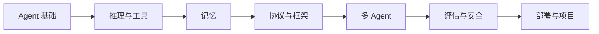

# 第九阶段：AI Agent 与智能体

| 信息 | 说明 |
|---|---|
| **预估学时** | 150～200 小时 |
| **前置要求** | 完成第八A+8B阶段 |

## 阶段概述

掌握 Agent 架构、推理、工具使用、记忆与多 Agent 系统

## 阶段导读

这一阶段最容易学乱，因为名词非常多。  
更稳的顺序是沿着 Agent 的结构来学：

1. 先知道什么是 Agent
2. 再补推理与工具
3. 再补记忆、协议、框架、多 Agent
4. 最后再看评估、安全、部署和项目

## 这一阶段的教学安排是否由浅入深？

整体上是顺的，而且对第一次系统学 Agent 的人来说，这种“先结构、再能力、再系统化”的路线是合理的。

更适合新人的理解主线是：

也就是说：

- **前四章在回答 Agent 到底是什么、靠什么运转**
- **第五到第七章在回答 Agent 系统怎样扩展成更复杂网络**
- **第八到第十章在回答怎样让它可评估、可上线、可交付**

### 建议学习顺序

1. 第一章：Agent 基础
2. 第二章：推理
3. 第三章：工具
4. 第四章：记忆
5. 第五章：MCP
6. 第六章：框架
7. 第七章：多 Agent
8. 第八章：评估与安全
9. 第九章：生产部署
10. 第十章：项目实践

## 更适合新人的学习节奏

如果你是第一次系统学 Agent，更稳的节奏通常是：

1. 先把第一章学完  
   先搞清 Agent 和普通聊天系统到底差在哪。

2. 再学第二、三章  
   先把推理、工具和 Function Calling 串起来。

3. 再学第四章  
   这时再去理解短期记忆、长期记忆和状态管理，会更自然。

4. 再看第五、第六章  
   先知道 MCP 和各种框架在系统里各自扮演什么角色。

5. 然后学第七章  
   再进入多 Agent，才不会一上来就把复杂度拉满。

6. 最后学第八到第十章  
   把评估、安全、部署和项目真正收口。

## 本阶段章节地图

| 章节 | 主题 | 主要解决什么问题 |
|---|---|---|
| 第一章 | Agent 基础 | 搞清 Agent 的边界、能力层级与系统结构 |
| 第二章 | 推理 | 学 ReAct、Plan-and-Execute 与规划方法 |
| 第三章 | 工具 | 学工具描述、调度、安全和代码 Agent |
| 第四章 | 记忆 | 学短期、长期、情景与程序性记忆 |
| 第五章 | MCP | 学协议化工具接入与能力网络 |
| 第六章 | 框架 | 学主流 Agent 框架的抽象和选型 |
| 第七章 | 多 Agent | 学协作、通信、协调和失败模式 |
| 第八章 | 评估与安全 | 学评测、护栏、观测和风险控制 |
| 第九章 | 生产部署 | 学运行时、恢复、成本与生产化实践 |
| 第十章 | 项目实践 | 把研究、分析和开发团队型 Agent 做成系统 |

### 学这一阶段最该带走什么

- 能说清 Agent 和普通聊天系统的差别
- 能判断什么时候要工具、什么时候要记忆、什么时候要多 Agent
- 能看懂一个 Agent 系统为什么能上线或为什么会失控

## 学这一阶段最容易犯的错

- 工具一多就想上多 Agent，而不是先把单 Agent 做稳
- 只演示成功路径，不设计失败恢复
- 没有评估、日志和权限控制就直接拼系统

## 这一阶段最值得优先补强的能力

- 能把“推理、工具、记忆、状态、评估”讲成一条系统链
- 能判断什么时候需要单 Agent、什么时候才值得多 Agent
- 能从项目目标反推：问题出在规划、工具、状态还是运行时

### 学完后的出口能力

- 能设计一个最小可用 Agent 系统
- 能为 Agent 增加评估、安全和运行时约束
- 能讲清楚 Agent 项目的模块边界和工程权衡
