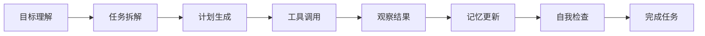
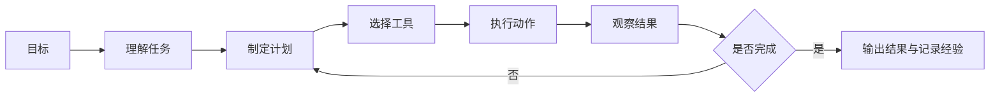

# 9 AI Agent 与智能体系统

这一阶段解决的是“怎样让 AI 不只是回答问题，而是围绕目标执行任务”。Agent 会把大模型、工具、记忆、规划、评估和系统工程组合起来，形成能持续行动的 AI 系统。

## 故事化导入：从聊天助手升级成任务队友

普通聊天机器人像一个坐在桌边回答问题的人，而 Agent 更像一个可以拿起工具、查看资料、拆解任务、执行步骤并回头检查结果的队友。它不只是“说”，还要“做”；不只是一次回答，还要围绕目标持续推进。

## 学习闯关地图

## 互动练习：先判断“需不需要 Agent”

每遇到一个 AI 应用想法，先问三个问题：它是不是多步骤任务，是否需要根据中间结果调整路线，是否需要调用外部工具或长期记忆。如果三个答案都是否，普通工作流或 RAG 可能更稳定；如果答案多为是，再考虑 Agent 架构。

## 项目彩蛋

本阶段的彩蛋作品是一名“研究助理 Agent”：它能把一个主题拆成问题，调用搜索或知识库工具，整理证据，生成报告，并记录哪些步骤成功、哪些步骤失败。这个项目会把前面学过的 Prompt、RAG、工具调用、日志和评估串成一个完整系统。

## 阶段定位

| 信息 | 说明 |
|---|---|
| 适合对象 | 已完成 LLM 应用与 RAG，希望构建自动化助手、研究助手、数据分析 Agent 或多 Agent 系统的学习者 |
| 预估学时 | 150～200 小时 |
| 前置要求 | 完成大模型原理和 LLM 应用开发主线 |
| 阶段产出 | 研究助手、数据分析 Agent、多 Agent 开发小组或自动化办公 Agent |

## 新手最小通关路线

新手先理解 Agent 的目标、状态、计划、工具、观察和记忆，不要急着堆复杂框架。只要能做出一个会拆解任务、调用一两个工具、记录执行过程并输出结果的最小 Agent，就算完成最小通关。

## 进阶深入路线

有经验的学习者可以深入 ReAct、Plan-and-Execute、记忆工程、MCP、多 Agent 协作、评估安全和生产化部署。进一步尝试比较固定工作流、RAG 和 Agent 在同一任务上的可靠性、成本和失败模式。

## Agent 和普通 LLM 应用有什么不同

普通 LLM 应用通常是固定流程：用户输入，系统组织上下文，模型输出答案。Agent 则更强调目标、状态和行动：它需要判断下一步做什么，选择工具，读取结果，更新上下文，必要时重新规划。

## 本阶段学习路径

第一章学习 Agent 基础概念，理解 Agent 和聊天机器人的区别、发展历史、能力层级和系统架构。

第二章学习推理与规划，包括 Chain-of-Thought、ReAct、Plan-and-Execute 和推理评估。

第三章学习工具使用与 Function Calling。你会理解工具描述、参数设计、调用策略、安全边界和代码执行型 Agent。

第四章学习记忆系统，包括短期记忆、长期记忆、情景记忆、程序性记忆和记忆工程。

第五章学习 MCP，理解模型和外部工具生态如何通过协议连接。

第六和第七章学习 Agent 框架与多 Agent 系统，包括 LangGraph、LlamaIndex、CrewAI、AutoGen 等。

第八到第十章学习评估、安全、部署和综合项目。

## 学完后你应该能做到

- 能解释 Agent 的目标、状态、工具、记忆和规划结构
- 能设计一个 ReAct 或 Plan-and-Execute 风格的执行流程
- 能为工具调用设计清晰参数和安全边界
- 能判断任务是否真的需要 Agent，而不是普通工作流或 RAG
- 能构建一个最小可用的研究助手或数据分析 Agent
- 能考虑 Agent 的评估、成本、权限和失败恢复

## 常见误区

不要把 Agent 理解成“给模型加工具”这么简单。工具只是其中一层，真正困难的是任务边界、上下文管理、错误恢复、权限控制和结果评估。

也不要所有任务都用 Agent。固定流程、规则明确、风险较高的任务，有时更适合传统工作流。Agent 更适合开放问题、多步骤探索、需要动态调用工具的场景。

## 阶段项目

基础版是实现一个研究助手，能把主题拆成问题、调用资料工具并生成结构化摘要。标准版需要加入执行日志、失败重试、结果自检和简单记忆。挑战版可以做数据分析 Agent 或多 Agent 开发小组，加入权限边界、成本控制、评估样例和恢复机制。

如果你想看更细的学习节奏，可以阅读 [学习指南：Agent 系统怎么学最不容易学乱](./study-guide.md)。