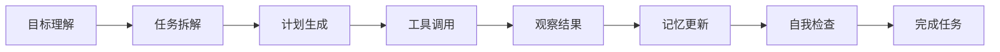
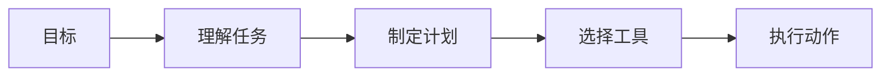
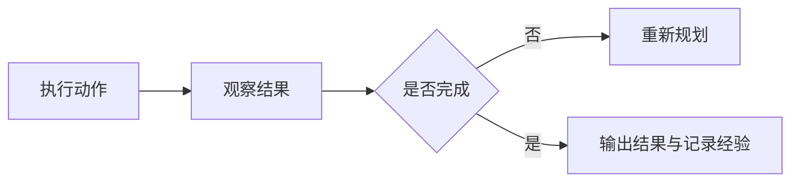
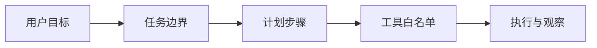
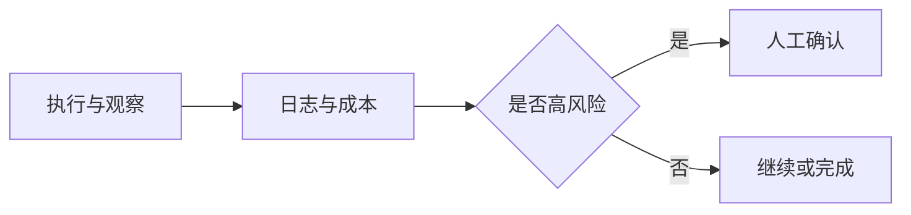

# 9 AI Agent 与智能体系统

这一阶段解决的是“怎样让 AI 不只是回答问题，而是围绕目标执行任务”。Agent 会把大模型、工具、记忆、规划、评估和系统工程组合起来，形成能持续行动的 AI 系统。

## 故事化导入：从聊天助手升级成任务队友

普通聊天机器人像一个坐在桌边回答问题的人，而 Agent 更像一个可以拿起工具、查看资料、拆解任务、执行步骤并回头检查结果的队友。它不只是“说”，还要“做”；不只是一次回答，还要围绕目标持续推进。

## 学习闯关地图



## 互动练习：先判断“需不需要 Agent”

每遇到一个 AI 应用想法，先问三个问题：它是不是多步骤任务，是否需要根据中间结果调整路线，是否需要调用外部工具或长期记忆。如果三个答案都是否，普通工作流或 RAG 可能更稳定；如果答案多为是，再考虑 Agent 架构。

## 项目彩蛋

本阶段的彩蛋作品是一名“研究助理 Agent”：它能把一个主题拆成问题，调用搜索或知识库工具，整理证据，生成报告，并记录哪些步骤成功、哪些步骤失败。这个项目会把前面学过的 Prompt、RAG、工具调用、日志和评估串成一个完整系统。

## 阶段定位

| 信息 | 说明 |
|---|---|
| 适合对象 | 已完成 LLM 应用与 RAG，希望构建自动化助手、研究助手、数据分析 Agent 或多 Agent 系统的学习者 |
| 预估学时 | 150～200 小时 |
| 前置要求 | 完成大模型原理和 LLM 应用开发主线 |
| 阶段产出 | 研究助手、数据分析 Agent、多 Agent 开发小组或自动化办公 Agent |

## 新手最小通关路线

新手先理解 Agent 的目标、状态、计划、工具、观察和记忆，不要急着堆复杂框架。只要能做出一个会拆解任务、调用一两个工具、记录执行过程并输出结果的最小 Agent，就算完成最小通关。

## 进阶深入路线

有经验的学习者可以深入 ReAct、Plan-and-Execute、记忆工程、MCP、多 Agent 协作、评估安全和生产化部署。进一步尝试比较固定工作流、RAG 和 Agent 在同一任务上的可靠性、成本和失败模式。

## 这一阶段的两种读法

新人读这一阶段时，先不要急着追框架名或复杂论文。第一遍只抓住“目标 → 计划 → 工具 → 观察 → 调整 → 记录”这条执行闭环，先做一个能完成小任务、能看到每一步轨迹、失败时能停下来的最小 Agent。

有经验的学习者可以把重点放在边界和可靠性上：什么时候不用 Agent，工具权限怎样限制，多步任务怎样评估，记忆怎样避免污染，失败时怎样恢复。你可以用同一个任务分别实现成固定工作流、RAG 和 Agent，对比它们的稳定性、成本、可解释性和维护难度。

## Agent 和普通 LLM 应用有什么不同

普通 LLM 应用通常是固定流程：用户输入，系统组织上下文，模型输出答案。Agent 则更强调目标、状态和行动：它需要判断下一步做什么，选择工具，读取结果，更新上下文，必要时重新规划。



前半段重点是把“想做什么”变成“下一步怎么做”。如果目标、计划或工具选择不清楚，Agent 后面很容易跑偏。



## AgentOps 精讲：让 Agent 可追踪、可控制、可恢复

2025～2026 年的 Agent 学习重点，已经从“让模型会调用工具”转向“让智能体系统可追踪、可控制、可评估”。一个可靠 Agent 不应该只展示成功结果，还要能说明目标是什么、为什么选择某个工具、传了哪些参数、观察到了什么、花了多少成本、失败时如何恢复、什么时候需要人工确认。

| 精讲主题 | 解决的问题 | 学习重点 |
|---|---|---|
| MCP | 工具、文件、数据库和业务系统接入方式不统一 | 理解模型与外部工具的标准连接方式 |
| Tool Schema | 模型不知道工具参数、约束和错误含义 | 设计清晰参数、返回值、错误信息和校验规则 |
| Agentic Workflow | 完全开放的 Agent 不稳定，固定流程又不够灵活 | 把确定步骤和模型决策结合起来 |
| Human-in-the-loop | 高风险动作不能默认自动执行 | 删除、发送、下单、改库、发布等步骤需要人工确认 |
| Agent Observability | 多步执行失败后无法复盘 | 记录计划、动作、观察、成本、错误和最终结果 |
| Agent Evaluation | 不能只看一次成功演示 | 用固定任务集评估完成率、步骤数、工具错误和越权行为 |
| Multi-agent Orchestration | 多角色协作容易互相等待或重复工作 | 明确角色、通信方式、停止条件和最终负责人 |

## 可控 Agent 的最小工程闭环

Agent 的核心不是“让模型自由发挥”，而是把自由度关进边界里。一个最小可控 Agent 可以先限制为：只允许调用白名单工具，只能读指定目录或资料，只能输出草稿而不能直接发布，高风险动作必须请求用户确认，每一步都写入执行轨迹。





做项目时，可以从“研究助理 Agent”开始：它能拆解问题、检索资料、生成摘要和记录轨迹，但不自动发送邮件、不删除文件、不修改数据库。这样既能展示 Agent 能力，也能体现工程边界。

## 本阶段学习路径

第一章学习 Agent 基础概念，理解 Agent 和聊天机器人的区别、发展历史、能力层级和系统架构。

第二章学习推理与规划，包括 Chain-of-Thought、ReAct、Plan-and-Execute 和推理评估。

第三章学习工具使用与 Function Calling。你会理解工具描述、参数设计、调用策略、安全边界和代码执行型 Agent。

第四章学习记忆系统，包括短期记忆、长期记忆、情景记忆、程序性记忆和记忆工程。

第五章学习 MCP，理解模型和外部工具生态如何通过协议连接。

第六和第七章学习 Agent 框架与多 Agent 系统，包括 LangGraph、LlamaIndex、CrewAI、AutoGen 等。

第八到第十章学习评估、安全、部署和综合项目。

## 学完后你应该能做到

- 能解释 Agent 的目标、状态、工具、记忆和规划结构
- 能设计一个 ReAct 或 Plan-and-Execute 风格的执行流程
- 能为工具调用设计清晰参数和安全边界
- 能判断任务是否真的需要 Agent，而不是普通工作流或 RAG
- 能构建一个最小可用的研究助手或数据分析 Agent
- 能考虑 Agent 的评估、成本、权限和失败恢复

## 常见误区

不要把 Agent 理解成“给模型加工具”这么简单。工具只是其中一层，真正困难的是任务边界、上下文管理、错误恢复、权限控制和结果评估。

也不要所有任务都用 Agent。固定流程、规则明确、风险较高的任务，有时更适合传统工作流。Agent 更适合开放问题、多步骤探索、需要动态调用工具的场景。

## Agent 错误剧场：会行动不等于可靠

如果 Agent 卡住循环，先检查停止条件是否清楚；如果工具调用错，先检查 schema、参数校验和权限边界；如果结果看似成功但不可复盘，说明缺少执行轨迹和日志；如果任务风险高，应该增加人工确认，而不是让 Agent 自动完成所有步骤。

## Agent 可运行小实验：先把轨迹打印出来

Agent 学习最小实验不一定需要复杂框架。可以先写一个只有两个工具的脚本：一个工具负责搜索课程资料，一个工具负责生成待办清单。每次工具调用都记录 `thought`、`action`、`input`、`observation` 和 `cost_estimate`。这样学习者能看到 Agent 不是魔法，而是一串可检查的步骤。

```python
trace = []

def call_tool(name, tool_input):
    if name == "search_docs":
        return "找到 RAGOps、AgentOps、评估集相关资料"
    if name == "make_todo":
        return "生成 3 个复习任务"
    return "工具不存在"

step = {
    "thought": "用户要准备 RAG 复习，先查课程资料",
    "action": "search_docs",
    "input": {"query": "RAGOps 评估 日志"},
}
step["observation"] = call_tool(step["action"], step["input"])
trace.append(step)

for item in trace:
    print(item)
```

这个实验的验收标准是：即使结果不完美，也能复盘每一步为什么发生。后面再把工具 schema、权限确认、失败重试、MCP 和多 Agent 加进来。

## Agent 失败案例库：先控制边界，再追求智能

| 现象 | 常见原因 | 定位方法 | 修复方向 |
|---|---|---|---|
| Agent 一直循环 | 目标和停止条件不清楚 | 查看每一步 thought 和 observation 是否重复 | 限制最大步数，增加完成条件和停止条件 |
| 工具参数经常错 | schema 太模糊，缺少参数校验 | 记录模型生成的原始参数和工具报错 | 明确字段类型、示例、默认值和错误信息 |
| 看似完成但不可复盘 | 没有执行轨迹 | 要求每一步记录计划、动作、观察和结果 | 加 trace 日志和任务摘要 |
| 调用了不该调用的工具 | 权限边界不清楚 | 检查工具白名单和风险等级 | 高风险工具人工确认，敏感工具默认关闭 |
| 多 Agent 互相等待 | 角色职责和最终负责人不清楚 | 查看消息流和任务交接点 | 明确角色、交付物、超时和仲裁者 |


| 复盘问题 | 你应该能回答什么 |
|---|---|
| 目标边界 | Agent 要完成什么，不负责什么，什么时候停止？ |
| 计划执行 | 它如何拆解任务、选择下一步、根据结果调整路线？ |
| 工具调用 | 工具 schema、参数校验、失败重试和权限边界是否清楚？ |
| 记忆状态 | 当前状态、长期偏好和历史经验是否分层管理？ |
| 失败恢复 | 工具失败、检索不到、结果不可信时系统怎么降级？ |
| 评估安全 | 有没有固定任务集、成本估算、安全边界和人工接管方式？ |

这一阶段真正的出口，是做出一个可追踪、可复盘、可评估的 Agent 项目，而不是只展示一次成功对话。

## 阶段交付物

| 交付物 | 最小版 | 作品集版 |
|---|---|---|
| 工具 schema | 至少定义 1～2 个工具 | 写清名称、用途、参数、返回值、错误和边界 |
| Agent trace | 打印一次执行步骤 | 保存 `agent_traces.jsonl`，能回放目标、动作、观察和决策 |
| 安全边界 | 设置最大步数 | 加工具白名单、风险分级、人工确认和审计日志 |
| 失败样本 | 记录一次工具失败 | 覆盖工具选错、参数错误、循环、越权和引用不支持 |
| 评估任务集 | 3～5 个固定任务 | 统计完成率、平均步数、工具错误率和成本 |
| README | 说明运行命令和示例输出 | 展示架构、trace 示例、权限边界、评估和限制 |

## 阶段验收 Rubric

| 等级 | 验收标准 | 作品集证据 |
|---|---|---|
| 基础通过 | Agent 能拆解任务、调用至少一个工具，并输出结构化结果 | 执行截图、工具 schema、最小 trace |
| 标准通过 | Agent 有失败重试、权限边界、日志记录和停止条件 | 失败恢复样例、人工确认截图、轨迹日志 |
| 优秀作品 | 能比较固定工作流、RAG 和 Agent 的适用边界，并评估成本和完成率 | 固定任务集、完成率表、成本估算、多方案对比 |

面试或作品集展示时，不要只展示一次成功对话。更好的讲法是：我把任务拆成目标、计划、工具、观察和停止条件，限制了工具权限，记录每一步 trace，并用固定任务集检查 Agent 是否会循环、越权或错误调用工具。

## 阶段项目

基础版是实现一个研究助手，能把主题拆成问题、调用资料工具并生成结构化摘要。标准版需要加入执行日志、失败重试、结果自检和简单记忆。挑战版可以做数据分析 Agent 或多 Agent 开发小组，加入权限边界、成本控制、评估样例和恢复机制。

如果你想看更细的学习节奏，可以阅读 [学习指南：Agent 系统怎么学最不容易学乱](./study-guide.md)。

## 和 AI 学习助手贯穿项目的关系

本阶段可以对应 AI 学习助手 v0.9：从问答升级为学习规划 Agent，能拆任务、查资料、调用工具并记录执行轨迹。 如果你正在按贯穿项目路线学习，建议本阶段结束时至少提交一次版本记录：本阶段新增了什么能力、如何运行、示例输入输出是什么、遇到了什么问题、下一步准备怎么改。

## 阶段通关标准

| 通关层级 | 你需要做到什么 |
|---|---|
| 最低通关 | 能设计工具、记忆、规划、MCP、框架、评估和安全边界。 |
| 推荐通关 | 完成本阶段至少一个可运行小项目，并在 README 中记录运行方式、示例输入输出和遇到的问题。 |
| 作品集通关 | 把本阶段产出接入“AI 学习助手”贯穿项目，留下截图、日志、评估样例和下一步计划。 |

学完本阶段后，不需要把所有细节都背下来。更重要的是能说清楚：本阶段解决什么问题，它和上一阶段的关系是什么，以及它会怎样支撑后续学习。后续可以继续做多模态 Agent、部署和毕业作品。

