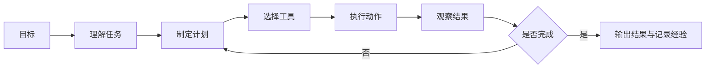

# 08 AI Agent 与智能体系统

这一阶段解决的是“怎样让 AI 不只是回答问题，而是围绕目标执行任务”。Agent 会把大模型、工具、记忆、规划、评估和系统工程组合起来，形成能持续行动的 AI 系统。

## 阶段定位

| 信息 | 说明 |
|---|---|
| 适合对象 | 已完成 LLM 应用与 RAG，希望构建自动化助手、研究助手、数据分析 Agent 或多 Agent 系统的学习者 |
| 预估学时 | 150～200 小时 |
| 前置要求 | 完成大模型原理和 LLM 应用开发主线 |
| 阶段产出 | 研究助手、数据分析 Agent、多 Agent 开发小组或自动化办公 Agent |

## Agent 和普通 LLM 应用有什么不同

普通 LLM 应用通常是固定流程：用户输入，系统组织上下文，模型输出答案。Agent 则更强调目标、状态和行动：它需要判断下一步做什么，选择工具，读取结果，更新上下文，必要时重新规划。

## 本阶段学习路径

第一章学习 Agent 基础概念，理解 Agent 和聊天机器人的区别、发展历史、能力层级和系统架构。

第二章学习推理与规划，包括 Chain-of-Thought、ReAct、Plan-and-Execute 和推理评估。

第三章学习工具使用与 Function Calling。你会理解工具描述、参数设计、调用策略、安全边界和代码执行型 Agent。

第四章学习记忆系统，包括短期记忆、长期记忆、情景记忆、程序性记忆和记忆工程。

第五章学习 MCP，理解模型和外部工具生态如何通过协议连接。

第六和第七章学习 Agent 框架与多 Agent 系统，包括 LangGraph、LlamaIndex、CrewAI、AutoGen 等。

第八到第十章学习评估、安全、部署和综合项目。

## 学完后你应该能做到

- 能解释 Agent 的目标、状态、工具、记忆和规划结构
- 能设计一个 ReAct 或 Plan-and-Execute 风格的执行流程
- 能为工具调用设计清晰参数和安全边界
- 能判断任务是否真的需要 Agent，而不是普通工作流或 RAG
- 能构建一个最小可用的研究助手或数据分析 Agent
- 能考虑 Agent 的评估、成本、权限和失败恢复

## 常见误区

不要把 Agent 理解成“给模型加工具”这么简单。工具只是其中一层，真正困难的是任务边界、上下文管理、错误恢复、权限控制和结果评估。

也不要所有任务都用 Agent。固定流程、规则明确、风险较高的任务，有时更适合传统工作流。Agent 更适合开放问题、多步骤探索、需要动态调用工具的场景。

## 阶段项目

推荐先做研究助手：输入一个主题，Agent 拆解问题、检索资料、整理摘要并生成报告。然后做数据分析 Agent，让它读取数据、制定分析计划、调用 Python 工具、输出图表和结论。

进阶项目可以做多 Agent 开发小组，让产品、开发、测试、文档等角色围绕一个小需求协作。

如果你想看更细的学习节奏，可以阅读 [学习指南：Agent 系统怎么学最不容易学乱](./study-guide.md)。