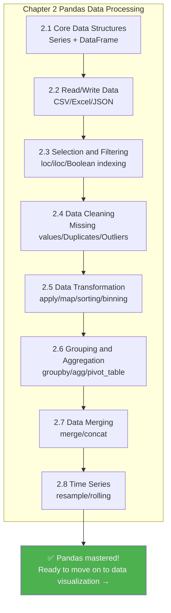

# Time Series

:::tip Section Focus
When many beginners first learn time series, the easiest misunderstanding is:

- It’s just a data column with dates added

A more reliable way to think about it is:

> **Once time is involved, many analyses are no longer just about “what is the value?”, but “how does it change over time?”**

So the most important thing in this section is not memorizing `resample()` and `rolling()`, but first building the intuition that “time changes the way we analyze data.”
:::

## Learning Objectives

- Master creating and converting date-time types
- Learn time series indexing and slicing
- Master resampling and frequency conversion
- Learn rolling window calculations (`rolling`)

---

## First, Build a Map

Time series is easier to understand as: “first turn dates into objects you can work with, then analyze along the time dimension”:


So what this section really aims to solve is:

- Why dates should not be treated like ordinary strings
- Why, once time data is organized properly, the analysis that follows becomes completely different

## Why Do We Need Time Series?

Many datasets are time-related—stock prices, sales data, website traffic, weather records... Handling time data is an essential skill in data analysis.

### A More Beginner-Friendly Overall Analogy

You can think of time series as:

- Adding a real, ordered timeline to your data

With that timeline in place, you can ask not only:

- What is it now?

But also questions like:

- Is it higher or lower than last month?
- Has it been rising over the last 7 days?
- How much difference is there between the same month last year and this year?

---

## Date-Time Types

### Create Timestamps

```python
import pandas as pd
import numpy as np

# Create a single timestamp
ts = pd.Timestamp("2024-01-15")
print(ts)        # 2024-01-15 00:00:00
print(ts.year)   # 2024
print(ts.month)  # 1
print(ts.day)    # 15
print(ts.day_name())  # Monday

# More formats
ts2 = pd.Timestamp("2024-01-15 14:30:00")
ts3 = pd.Timestamp(year=2024, month=3, day=20)
```

### Convert Strings to Dates

```python
# Convert a single column
dates = pd.Series(["2024-01-15", "2024-02-20", "2024-03-10"])
dt_series = pd.to_datetime(dates)
print(dt_series)
print(dt_series.dtype)  # datetime64[ns]

# Handle different formats
pd.to_datetime("15/01/2024", format="%d/%m/%Y")
pd.to_datetime("March 15, 2024", format="%B %d, %Y")

# Handle values that cannot be parsed
dirty = pd.Series(["2024-01-15", "not a date", "2024-03-10"])
clean = pd.to_datetime(dirty, errors="coerce")  # Unparseable values become NaT
print(clean)
# 0   2024-01-15
# 1          NaT   ← Not a Time
# 2   2024-03-10
```

### Date Ranges

```python
# Create a date range
dates = pd.date_range("2024-01-01", periods=10, freq="D")  # daily
print(dates)

# Different frequencies
pd.date_range("2024-01-01", periods=12, freq="ME")   # month-end
pd.date_range("2024-01-01", periods=4, freq="QE")    # quarter-end
pd.date_range("2024-01-01", "2024-12-31", freq="W")  # weekly

# Common frequency codes
# D = day, W = week, ME = month-end, MS = month-start, QE = quarter-end, YE = year-end
# h = hour, min = minute, s = second
# B = business day
```

### What Should You Remember First When Handling Date Columns for the First Time?

The most important thing to remember first is:

> **A date column should preferably be converted to a real datetime type before doing any time-based analysis.**

If you still keep it as a string,  
many things become hard to do naturally:

- Extract months
- Calculate time differences
- Do resampling

---

## Time Series Data

### Create a Time Series DataFrame

```python
# Simulate daily sales data for 2024
np.random.seed(42)
dates = pd.date_range("2024-01-01", periods=365, freq="D")
sales = pd.DataFrame({
    "Date": dates,
    "Sales": np.random.randint(5000, 20000, 365) + \
              np.sin(np.arange(365) * 2 * np.pi / 365) * 3000  # Add seasonality
})
sales = sales.set_index("Date")
print(sales.head())
print(sales.shape)  # (365, 1)
```

### Extract Date Components

```python
df = pd.DataFrame({
    "Date": pd.date_range("2024-01-01", periods=100, freq="D"),
    "Sales": np.random.randint(10, 100, 100)
})

# Use the dt accessor to extract date components
df["Year"] = df["Date"].dt.year
df["Month"] = df["Date"].dt.month
df["Day"] = df["Date"].dt.day
df["Weekday"] = df["Date"].dt.day_name()
df["IsWeekend"] = df["Date"].dt.dayofweek >= 5  # 5 = Saturday, 6 = Sunday
df["WeekNumber"] = df["Date"].dt.isocalendar().week

print(df.head())
```

### Time Index Slicing

When dates are used as the index, you can slice conveniently with strings:

```python
# sales uses a date index
# Select data for March 2024
print(sales.loc["2024-03"])

# Select the first quarter of 2024
print(sales.loc["2024-01":"2024-03"])

# Select a specific day
print(sales.loc["2024-06-15"])
```

### A Time Analysis Sequence That Beginners Should Remember First

A more reliable sequence is usually:

1. Convert to datetime first
2. Extract year / month / weekday first
3. Then set the date as the index
4. Finally do resampling and rolling windows

This sequence is especially important because many beginners learn in a jumpy way and end up mixing time indexes with ordinary columns.

---

## Resampling (`resample`)

Resampling is one of the core operations in time series—it changes the **time frequency** of the data.

### Downsampling (high frequency → low frequency)

```python
# Daily data → monthly data
monthly = sales.resample("ME").sum()  # Aggregate by month-end
print(monthly.head())

# Daily → weekly
weekly = sales.resample("W").mean()  # Weekly average

# Daily → quarterly
quarterly = sales.resample("QE").agg({
    "Sales": ["sum", "mean", "max"]
})
print(quarterly)
```

### Upsampling (low frequency → high frequency)

```python
# Monthly data → daily data (needs filling)
daily = monthly.resample("D").ffill()     # Forward fill
# or
daily = monthly.resample("D").interpolate()  # Interpolation
```

### A Beginner-Friendly Quick Reference Table

| What you want to do | Better first reaction |
|---|---|
| Daily → monthly | `resample()` downsampling |
| Monthly → daily | `resample()` upsampling |
| Look at the average of the last 7 days | `rolling()` |
| Look at the average from the start up to now | `expanding()` |

This table is especially useful for beginners because it compresses common time series operations back into a few familiar questions.

---

## Rolling Window (`rolling`)

A rolling window calculates statistics over consecutive N data points, and it is commonly used to smooth data and calculate moving averages.

### Moving Average

```python
# 7-day moving average (smooth daily fluctuations)
sales["MA7"] = sales["Sales"].rolling(window=7).mean()

# 30-day moving average (see long-term trend)
sales["MA30"] = sales["Sales"].rolling(window=30).mean()

print(sales.head(10))
# The first 6 days of MA7 are NaN (not enough 7 days to calculate)
```

### Other Rolling Statistics

```python
# Rolling standard deviation (volatility)
sales["STD7"] = sales["Sales"].rolling(7).std()

# Rolling maximum
sales["MAX7"] = sales["Sales"].rolling(7).max()

# Rolling sum
sales["SUM7"] = sales["Sales"].rolling(7).sum()
```

### `expanding`: Cumulative Calculations

```python
# Cumulative mean (mean from the beginning to the current point)
sales["Cumulative Mean"] = sales["Sales"].expanding().mean()

# Cumulative maximum
sales["Historical High"] = sales["Sales"].expanding().max()
```

### Why Is `rolling` So Common?

Because real time data usually fluctuates a lot.  
If you only look at the raw value for each day, it’s easy to get misled by the noise.

The most important value of `rolling` to remember first is:

- It helps you see trends through the noise

---

## Calculating Time Differences

```python
df = pd.DataFrame({
    "Signup Time": pd.to_datetime(["2023-01-15", "2023-06-20", "2024-01-10"]),
    "Last Login": pd.to_datetime(["2024-06-01", "2024-05-15", "2024-06-10"])
})

# Calculate time difference
df["Days Used"] = (df["Last Login"] - df["Signup Time"]).dt.days
print(df)

# Days since signup
df["Days Since Signup"] = (pd.Timestamp.now() - df["Signup Time"]).dt.days
```

---

## Practice: Sales Trend Analysis

```python
import pandas as pd
import numpy as np

np.random.seed(42)

# Create 2 years of daily sales data
dates = pd.date_range("2023-01-01", "2024-12-31", freq="D")
n = len(dates)

sales = pd.DataFrame({
    "Date": dates,
    "Sales": (
        10000 +                                    # Base value
        np.sin(np.arange(n) * 2 * np.pi / 365) * 3000 +  # Seasonality
        np.arange(n) * 5 +                         # Growth trend
        np.random.normal(0, 1000, n)               # Random fluctuation
    ).astype(int)
}).set_index("Date")

# 1. Monthly summary
monthly = sales.resample("ME").agg(
    Monthly_Sales=("Sales", "sum"),
    Daily_Average_Sales=("Sales", "mean"),
    Highest_Daily_Sales=("Sales", "max")
)
print("=== Monthly Summary ===")
print(monthly.head())

# 2. Use moving averages to see the trend
sales["MA30"] = sales["Sales"].rolling(30).mean()
print("\n=== 30-Day Moving Average (Last 5 Days) ===")
print(sales[["Sales", "MA30"]].tail())

# 3. Year-over-year growth (compare with the same month last year)
monthly_pivot = sales.resample("ME")["Sales"].sum()
monthly_pivot.index = monthly_pivot.index.to_period("M")
# Simply compare each month in 2024 vs the same month in 2023
m2024 = monthly_pivot["2024"]
m2023 = monthly_pivot["2023"]

print("\n=== 2024 vs 2023 Monthly Comparison ===")
for m24, m23 in zip(m2024.items(), m2023.items()):
    month = m24[0].month
    growth = (m24[1] - m23[1]) / m23[1] * 100
    print(f"  Month {month}: 2023={m23[1]:,.0f}, 2024={m24[1]:,.0f}, Growth={growth:+.1f}%")

# 4. Sales differences by weekday
sales_with_dow = sales.copy()
sales_with_dow["Weekday"] = sales_with_dow.index.day_name()
dow_avg = sales_with_dow.groupby("Weekday")["Sales"].mean()
print("\n=== Average Sales by Weekday ===")
print(dow_avg.sort_values(ascending=False))
```

### What Is the Most Important Thing to Learn from This Small Practice?

The most important thing is not a specific function name,  
but that time analysis usually starts with these steps:

1. Summarize first
2. Then look at the trend
3. Then look at year-over-year / month-over-month changes
4. Finally look at cyclic differences

This is much more stable than jumping straight into complex forecasting.

---

## Summary

| Operation | Method | Use |
|------|------|------|
| String to date | `pd.to_datetime()` | Type conversion |
| Date range | `pd.date_range()` | Generate consecutive dates |
| Extract components | `.dt.year/month/day` | Break down dates |
| Resampling | `.resample()` | Change time frequency |
| Rolling window | `.rolling()` | Moving average, smoothing |
| Cumulative calculation | `.expanding()` | Cumulative statistics |
| Time difference | subtraction + `.dt.days` | Calculate intervals |

## What Should You Take Away from This Section?

- Time series is not just “a date column added”; the analysis method changes too
- Convert dates to datetime first, then do slicing, resampling, and rolling windows
- `resample` changes the time frequency, while `rolling` helps you see local trends

---

## Chapter Summary: The Big Picture of Pandas

Congratulations on completing all of the Pandas content! Let’s review:



> **✅ Self-check:** Given a sales data CSV, can you use Pandas to clean missing values, group sales by month and product, and find the top-selling product for each month? Think back to the warm-up exercise from Chapter 1—isn’t it much more concise now?

---

## Hands-on Exercises

### Exercise 1: Date Handling

```python
# Create a DataFrame containing dates from "2024-01-01" to "2024-12-31"
# 1. Extract month and weekday
# 2. Mark whether it is a business day
# 3. Calculate the number of business days in each month
```

### Exercise 2: Time Series Analysis

```python
# Use the sales data above
# 1. Calculate 7-day and 30-day moving averages
# 2. Find the months with the highest and lowest sales
# 3. Calculate month-over-month growth rates (current month vs previous month)
# 4. Analyze sales differences between weekends and weekdays
```

### Exercise 3: Comprehensive Practice

```python
# Simulate an app user activity dataset (365 days)
# Include: date, DAU (daily active users), new users, revenue
# 1. Calculate WAU (weekly active users) and MAU (monthly active users)
# 2. Calculate the trend of 7-day retention rate
# 3. Use rolling to calculate the 30-day average ARPU (average revenue per user)
# 4. Find the month with the fastest user growth
```
