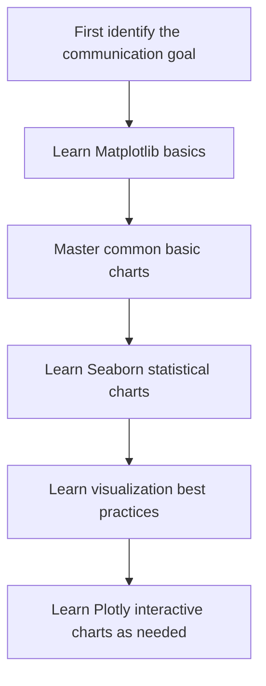
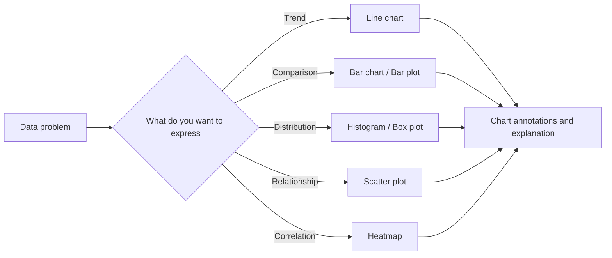

# Visualization Guide: Learn to Choose the Right Chart First, Then Learn to Polish It

This chapter answers one question: how do you turn trends, comparisons, distributions, and relationships in your data into charts that other people can understand at a glance?

When beginners first learn visualization, they often get overwhelmed by APIs: how to write `plot()`, how to tune parameters, how to change colors. But the most important first step in visualization is not memorizing functions. It is asking clearly: what exactly do I want the reader to see at a glance?

## Where This Chapter Fits in the Course

You have already learned Pandas, so you know how to read, clean, filter, and aggregate data. Visualization turns that organized data into graphical expressions, helping you explore data faster and helping others understand conclusions faster.

In later machine learning and project stages, visualization will also be used for EDA, feature distribution analysis, model result presentation, error analysis, and project reporting. So this chapter is not an “extra” about making charts look nicer. It is a core part of data analysis communication.

## The Real Problems This Chapter Solves

This chapter answers five questions: when should you use a line chart, bar chart, scatter plot, histogram, box plot, or heatmap; what scenarios are Matplotlib, Seaborn, and Plotly each best for; what is the difference between exploratory charts and presentation charts; how do titles, axes, legends, and colors make charts clearer; and how do you avoid misleading readers.

The most common mistake beginners make is starting to code before they have decided on the chart. Tools matter, but tools should serve the message. First decide whether you want to express a trend, comparison, distribution, relationship, or proportion, and then choose the chart.

## Recommended Learning Order for Beginners

It is recommended to start with Matplotlib, because it helps you understand Figure, Axes, axes, and basic plotting objects. Then learn Seaborn, which lets you create common statistical charts and exploratory analysis with less code. Next, learn visualization best practices so you understand chart selection, titles, colors, annotations, and how to avoid misleading visuals. Finally, learn Plotly when needed, for interactive charts, web display, or dynamic exploration.

## The Main Thread to Focus on in This Chapter

The main thread of this chapter can be summarized as: decide what you want to say first, then decide what chart to use, and only then talk about styling.

Once you understand this flow, you will know that “making charts look pretty” is not the goal. The goal is to help others understand the data faster.

## What the 4 Lessons in This Chapter Do

| Section | The problem it should help you solve |
|---|---|
| [4.1 Matplotlib Basics](./01-matplotlib.md) | Learn the most basic plotting actions and the Figure/Axes model |
| [4.2 Seaborn Statistical Visualization](./02-seaborn.md) | Do exploratory analysis and statistical charts faster with less code |
| [4.3 Interactive Visualization (Optional)](./03-plotly.md) | How to handle interactivity, presentations, and web charts when needed |
| [4.4 Visualization Best Practices](./04-best-practices.md) | Choose charts, colors, and avoid misleading visuals so the chart is truly readable |

## How This Chapter Connects to Later Stages

Visualization will run through later machine learning, deep learning, and LLM application projects. Machine learning needs charts to inspect data distributions, feature relationships, model errors, and evaluation results; deep learning needs training curves and prediction examples; Agent and RAG projects can also use charts to show evaluation data, call costs, and failure types.

If you do not build a solid foundation here, common problems later will be: data analysis reports with tables but no conclusions; machine learning projects that only give a score but no explanation; no curves for the training process; and project presentations that lack charts people can quickly understand.

## How Beginners and Advanced Learners Should Read This

When beginners study this chapter for the first time, focus on the main thread and the smallest runnable example. You do not need to understand every detail at once. As long as you can explain what problem this chapter solves, what the input and output are, and how the minimal project runs, you can keep moving forward.

More experienced learners can treat this chapter as a chance to fill gaps and practice engineering habits: focus on boundary conditions, failure cases, evaluation methods, code reproducibility, and how this chapter connects to what comes before and after. After reading, it is best to turn the content into your own project README or experiment notes.

## Suggested Study Time and Difficulty

| Study style | Suggested time | Goal |
|---|---|---|
| Quick overview | 20–30 minutes | Understand what this chapter solves and where it will be used later |
| Minimal completion | 1–2 hours | Run through a minimal example and finish the chapter’s small project goal |
| In-depth practice | Half a day to 1 day | Add error analysis, comparison experiments, or project README notes |

## Self-Check Questions for This Chapter

| Self-check question | Passing standard |
|---|---|
| What problem does this chapter solve? | You can explain its role in the course in one sentence |
| What are the minimal input and output? | You can clearly state what input the example needs and what result it produces |
| Where are the common failure points? | You can list at least one reason for an error, poor result, or misunderstanding |
| What can you turn into a lasting artifact after learning it? | You can write the output of this chapter into a project README, experiment notes, or portfolio |

## Small Project Goal for This Chapter

After finishing this chapter, it is recommended to create a “sales data visualization report.” Using sales data organized with Pandas, draw monthly trends, category comparisons, order amount distributions, the relationship between price and sales volume, regional heatmaps, or pivot tables, and write one conclusion for each chart.

The key point of the project is not the number of charts, but that each chart answers one clear question.

## Passing Criteria

By the end of this chapter, you should be able to choose appropriate charts based on trend, comparison, distribution, relationship, and correlation; draw basic charts with Matplotlib and Seaborn; explain what scenarios Plotly is suitable for; and use titles, axes, legends, and colors to make charts clearer.

If you can turn a dataset into 4 to 6 meaningful charts and explain why each chart was chosen, you have reached the beginner level for data visualization.

## What to Read Next

It is recommended to first read Matplotlib Basics, then Seaborn Statistical Visualization, then Visualization Best Practices, and finally Interactive Visualization with Plotly as needed.
