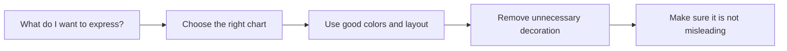
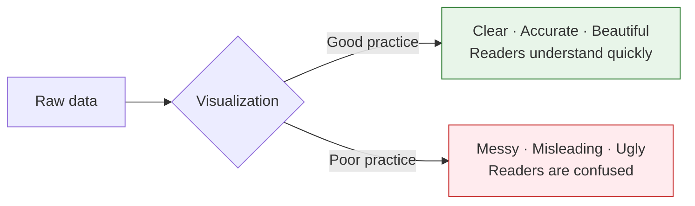
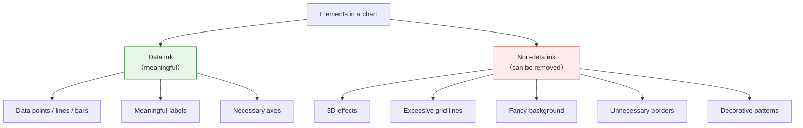
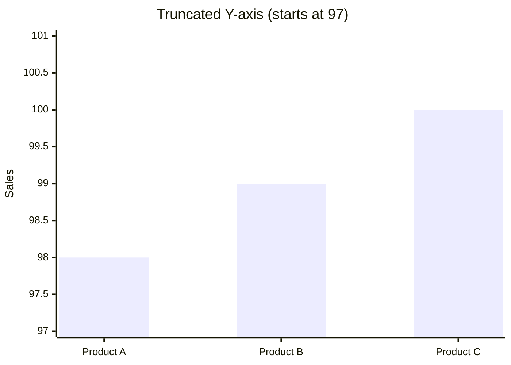
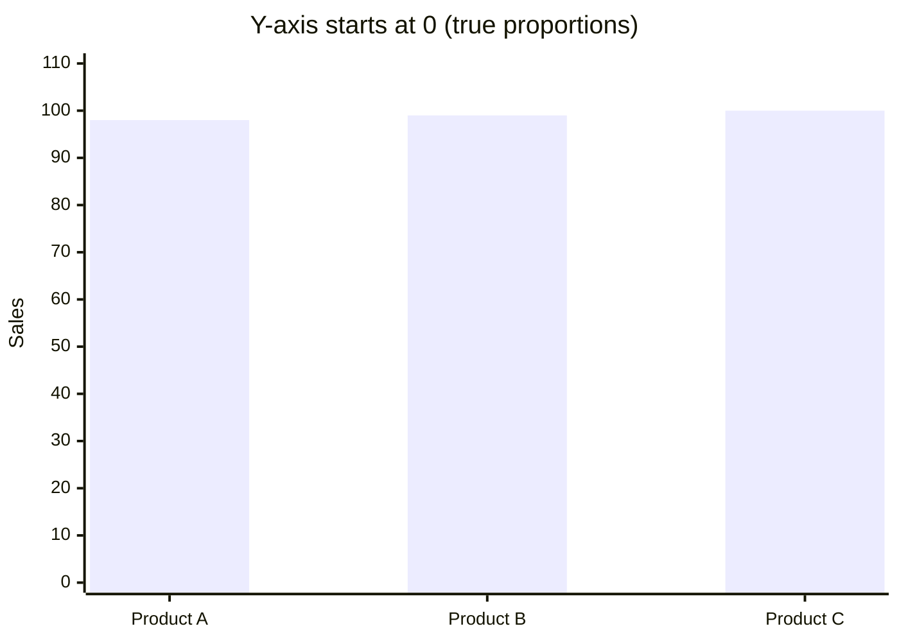
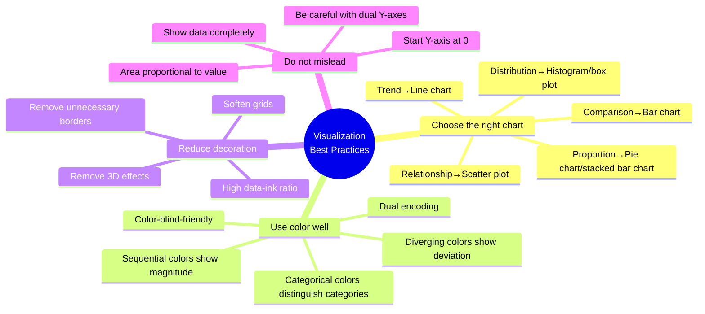

# Visualization Best Practices


:::tip Section focus
When many beginners learn visualization, they focus on:

- whether the colors look nice
- whether the style looks flashy enough

But the really important question is:

> **Does this chart help people understand faster, rather than make it easier to be misled?**

So the most important things in this section are not “beautification,” but:

- choosing the right chart
- reducing distractions
- communicating honestly
:::

## Learning objectives

- Master strategies for choosing chart types
- Understand color principles and color-blind-friendly design
- Understand the concept of “data-ink ratio”
- Identify and avoid common visualization misleading techniques

---

## First, build a map

It’s easier to understand visualization best practices in the order “communication goal -> chart choice -> reduce distractions -> prevent misleading”:



So what this section really wants to solve is:

- why making a chart does not automatically make it clear
- why many bad charts are not a code problem, but a communication-logic problem

---

## Why learn best practices?

> With the same data, good visualization lets people understand it in one second, while bad visualization makes people more and more confused, or even misleads them.



### A better beginner-friendly analogy

You can think of a chart as:

- a very short presentation

A good chart is like a clear presentation:

- you immediately know the key point

A bad chart is like:

- too much talk
- too much decoration
- but after hearing it, you still do not know the key point

So the most important thing in best practices is not “looking nice,” but:

- whether the information is easier to understand

---

## 1. Chart type selection guide

### Core principle: first ask yourself, “What do I want to show?”

```mermaid
flowchart TD
    Q["What do I want to show?"]

    Q --> T["Trend change"]
    Q --> C["Category comparison"]
    Q --> R["Relationship / correlation"]
    Q --> D["Data distribution"]
    Q --> P["Proportion / composition"]

    T --> T1["Line chart<br/>Suitable for time series"]
    T --> T2["Area chart<br/>Emphasizes accumulation"]

    C --> C1["Bar chart<br/>Most commonly used"]
    C --> C2["Horizontal bar chart<br/>Use when labels are long"]
    C --> C3["Radar chart<br/>Multidimensional scoring"]

    R --> R1["Scatter plot<br/>Relationship between two variables"]
    R --> R2["Heatmap<br/>Matrix relationships"]
    R --> R3["Bubble chart<br/>Relationship among three variables"]

    D --> D1["Histogram<br/>Check frequency"]
    D --> D2["Box plot<br/>Distribution + outliers"]
    D --> D3["Violin plot<br/>Distribution shape"]

    P --> P1["Pie chart<br/>Few-category proportions"]
    P --> P2["Stacked bar chart<br/>Multi-category proportions"]
    P --> P3["Treemap<br/>Hierarchical proportions"]

    style Q fill:#e3f2fd,stroke:#1565c0,color:#333
    style T fill:#fff3e0,stroke:#e65100,color:#333
    style C fill:#e8f5e9,stroke:#2e7d32,color:#333
    style R fill:#f3e5f5,stroke:#7b1fa2,color:#333
    style D fill:#fff8e1,stroke:#f57f17,color:#333
    style P fill:#fce4ec,stroke:#c62828,color:#333
```



### Detailed chart selection table

| My goal | Recommended chart | Not recommended | Explanation |
|---------|-------------------|-----------------|-------------|
| Show time trend | Line chart | Pie chart | Line charts are naturally suited to continuous change |
| Compare several categories | Bar chart | Pie chart (more than 6 categories) | Bar heights are easy to compare at a glance |
| See the relationship between two variables | Scatter plot | Line chart | Scatter plots show distribution and trends more directly |
| Check data distribution | Histogram / box plot | Line chart | Histograms show frequency distribution |
| Show proportion | Pie chart (few categories) / stacked bar chart | 3D pie chart | 3D pie charts distort area |
| Compare distribution differences | Box plot / violin plot | Only mean-value bar chart | Mean bars lose distribution information |
| Show a correlation matrix | Heatmap | Table | Color coding is more intuitive than numbers |

### Five questions worth remembering before you start drawing

Before you actually start making a chart, ask yourself:

1. Am I showing trend, comparison, distribution, or relationship?
2. Is this chart for my own exploration, or for reporting to others?
3. What should the reader notice first?
4. Which decorations can actually be removed?
5. Could this chart mislead people?

These 5 questions are more important than many plotting library parameters.

---

## 2. Color principles

### 1. Three uses of color

| Use | Scenario | Example |
|------|---------|------|
| **Categorical** (qualitative color) | Distinguish different categories | Male/female in different colors |
| **Sequential** (continuous color) | Represent magnitude | Temperature from blue to red |
| **Diverging** (two-sided color) | Data with a center value | Correlation coefficients from -1 to 1 |

### 2. Recommended color palettes

```python
import matplotlib.pyplot as plt
import seaborn as sns

# === Categorical colors (distinguish categories)===
# Matplotlib default palette (Tab10)
# Colors: blue, orange, green, red, purple, brown, pink, gray, yellow-green, cyan
# Suitable for: up to 10 categories

# Seaborn palettes
sns.color_palette("Set2")       # Soft tones
sns.color_palette("colorblind") # Color-blind-friendly!

# === Sequential colors (show magnitude)===
# From light to dark
# "Blues", "Greens", "Reds", "YlOrRd" (yellow-orange-red)

# === Diverging colors (has a center value)===
# "RdBu_r" (red-white-blue) — often used for correlation coefficients
# "RdYlGn" (red-yellow-green) — shows good/bad
```

### 3. Color-blind-friendly design

About 8% of men worldwide have color vision deficiency (the most common is red-green color blindness).

**Combinations to avoid:**

| Avoid | Why | Alternative |
|------|-----|-------------|
| Red + green | People with red-green color blindness cannot distinguish them | Blue + orange |
| Relying only on color | Color-blind readers cannot see the difference | Color + shape / line style |

**Recommended practice:**

```python
# Use a color-blind-friendly palette
sns.set_palette("colorblind")

# Or use different marker shapes + colors
markers = ["o", "s", "^", "D"]  # Circle, square, triangle, diamond
linestyles = ["-", "--", ":", "-."]  # Solid, dashed, dotted, dash-dot

# Example: dual encoding with color + line style
fig, ax = plt.subplots()
for i, (style, marker) in enumerate(zip(linestyles, markers)):
    ax.plot(range(10), [x + i*2 for x in range(10)],
            linestyle=style, marker=marker, label=f"Series {i+1}")
ax.legend()
plt.show()
```

:::tip Dual encoding
Do not rely on color alone to convey information. Use **shape, line style, labels, and patterns** together to help distinguish series, so the chart can still be understood even when printed in black and white.
:::

---

## 3. Data-ink ratio

### What is the data-ink ratio?

This concept comes from visualization master **Edward Tufte**:

> **Data-ink ratio = ink used to display data / all ink used in the chart**

Simply put: **remove all unnecessary decoration so that every drop of ink serves the data.**

### Reduce “chart junk”



### Practical comparison

**Bad practice (low data-ink ratio):**

```python
# ❌ Over-decorated
fig, ax = plt.subplots(figsize=(8, 5))
values = [25, 40, 30, 55, 45]
categories = ["A", "B", "C", "D", "E"]

ax.bar(categories, values, color="skyblue", edgecolor="navy", linewidth=2, hatch="//")
ax.set_facecolor("#f0f0f0")          # Background color
ax.grid(True, linewidth=2, alpha=1)  # Heavy grid
ax.set_title("Sales Data", fontsize=20, fontweight="bold",
             fontstyle="italic", color="red")
# Too much decoration makes the data less prominent
plt.show()
```

**Good practice (high data-ink ratio):**

```python
# ✅ Clean and clear
fig, ax = plt.subplots(figsize=(8, 5))

bars = ax.bar(categories, values, color="#4CAF50", width=0.6)

# Put values directly on the bars (reduces dependence on the axis)
for bar, val in zip(bars, values):
    ax.text(bar.get_x() + bar.get_width()/2, bar.get_height() + 1,
            str(val), ha="center", fontsize=12)

ax.set_title("Sales Data", fontsize=14)
ax.spines["top"].set_visible(False)     # Remove top border
ax.spines["right"].set_visible(False)   # Remove right border
ax.set_ylabel("Sales")

plt.tight_layout()
plt.show()
```

### Simplification checklist

| Element | Keep? | Reason |
|------|------|------|
| Top/right borders | Remove | No information value |
| Dense grid lines | Remove or soften | Use `alpha=0.2` |
| 3D effects | Remove | Distort proportions |
| Data labels | As needed | Sometimes more intuitive than the axis |
| Legend | As needed | Not needed when there is only one series |
| Background color | White background | Least distracting |

### A minimal clean template that beginners can remember first

If you are not sure how to make a chart look more “professional,” you can start with these defaults:

1. White background
2. Remove top and right borders
3. Make grid lines lighter
4. Let the title say only the key point
5. Use fewer exaggerated colors

Charts made this way are usually already clearer than many “carefully decorated” versions.

---

## 4. Common visualization misleading techniques

### Misleading 1: Truncating the Y-axis

The sales of three products are 98, 99, and 100 — almost the same. But if the Y-axis does not start at 0:

**Truncated Y-axis (starting from 97) — looks like a huge difference:**



Product C looks **3 times taller** than Product A! But in reality it is only 2% higher.

**Y-axis starts at 0 — true proportions:**



When the axis starts at 0, the three bars are almost the same height — that is the true picture of the data.

:::tip Key takeaway
**Not starting the Y-axis at 0** can make tiny differences look huge. This kind of misleading technique is very common in news media, so learn to spot it!
:::

**Code comparison:**

```python
import matplotlib.pyplot as plt

fig, axes = plt.subplots(1, 2, figsize=(12, 4))

data = [98, 99, 100]
labels = ["Product A", "Product B", "Product C"]

# ❌ Misleading: truncated Y-axis
axes[0].bar(labels, data, color="#F44336")
axes[0].set_ylim(97, 101)  # Y-axis starts at 97!
axes[0].set_title("❌ Truncated Y-axis (starts at 97)")
axes[0].set_ylabel("Sales")

# ✅ Correct: start at 0
axes[1].bar(labels, data, color="#4CAF50")
axes[1].set_ylim(0, 110)
axes[1].set_title("✅ Y-axis starts at 0")
axes[1].set_ylabel("Sales")

plt.tight_layout()
plt.show()
```

:::caution When can you avoid starting at 0?
For line charts that focus on **trend changes**, you can truncate the Y-axis (because readers are looking at the line’s movement). But bar charts, where bar area represents quantity, **must start at 0**.
:::

### Misleading 2: 3D pie charts

3D pie charts make the part closer to the viewer look larger:

```python
# ❌ 3D pie chart
# Matplotlib does not actually have a real 3D pie chart, but this shows the idea:
# slices in front appear larger due to perspective, and slices in back appear smaller
# causing readers to judge proportions incorrectly

# ✅ Correct approach: use a 2D pie chart or a bar chart instead
fig, axes = plt.subplots(1, 2, figsize=(12, 5))

labels = ["Python", "Java", "JS", "C++"]
sizes = [35, 25, 25, 15]

axes[0].pie(sizes, labels=labels, autopct="%1.0f%%")
axes[0].set_title("2D Pie Chart (clear)")

axes[1].barh(labels, sizes, color=["#4CAF50", "#2196F3", "#FFC107", "#FF5722"])
axes[1].set_xlabel("Proportion (%)")
axes[1].set_title("Bar Chart (more precise comparison)")

plt.tight_layout()
plt.show()
```

### Misleading 3: Dual Y-axis trap

```python
# ❌ Dual Y-axes may suggest a correlation that does not really exist
fig, ax1 = plt.subplots(figsize=(8, 5))

months = range(1, 13)
temp = [5, 7, 12, 18, 23, 28, 30, 29, 24, 17, 10, 6]
ice_cream = [20, 25, 35, 50, 70, 90, 95, 88, 60, 40, 22, 18]

ax1.plot(months, temp, "r-", label="Temperature")
ax1.set_ylabel("Temperature (°C)", color="r")

ax2 = ax1.twinx()
ax2.plot(months, ice_cream, "b-", label="Ice cream sales")
ax2.set_ylabel("Ice cream sales", color="b")

ax1.set_title("Temperature vs Ice Cream Sales")
plt.show()

# There is indeed a correlation here, but the scale of dual Y-axes can be adjusted arbitrarily
# making the two lines look perfectly aligned or completely unrelated
# A scatter plot is a more honest way to show correlation
```

### Misleading 4: Incorrect area/size mapping

```python
# ❌ Using diameter instead of area to represent quantity
# If A = 100, B = 200
# doubling the diameter -> area becomes 4 times larger -> readers think B is 4 times A

# ✅ Correct approach: map values to area
import numpy as np

values = [100, 200, 300]
# Area should be proportional to the value, so radius should be proportional to sqrt(value)
sizes = [v * 2 for v in values]  # Area proportional
```

### Summary of common misleading techniques

| Misleading method | Why it misleads | Correct approach |
|---------|-----------|---------|
| Truncated Y-axis | Exaggerates differences | Bar charts start at 0 |
| 3D pie chart | Distorts area proportions | Use 2D pie charts or bar charts |
| Dual Y-axis | Allows visual correlation to be manipulated | Use scatter plots or separate charts |
| Incorrect area usage | Distorts size perception | Make area proportional to the value |
| Selective display | Hides unfavorable data | Show complete data |
| Color manipulation | Bright colors emphasize small data | Use neutral colors as the main palette |

---

## 5. Full checklist

After finishing a chart, check it with this list:

```
☐ Is the chart type appropriate? (line vs. bar vs. scatter...)
☐ Does the title clearly express what the chart is saying?
☐ Do the axes have labels and units?
☐ Is the Y-axis start value reasonable? (bar charts should start at 0)
☐ Is the legend necessary and clear?
☐ Are the colors color-blind-friendly?
☐ Have unnecessary decorations been removed? (3D effects, fancy backgrounds)
☐ Do the data labels help understanding?
☐ Is the font large enough? (Can others read it clearly?)
☐ Is the data presentation honest? (No misleading tricks?)
```

### The safest default order for your first reporting chart

A more stable order is usually:

1. Choose the right chart first
2. Then make the title and axes clear
3. Then remove extra decoration
4. Finally, check whether anything is misleading

This is less likely to go off track than worrying about colors and shadows from the very beginning.

---

## 6. From “usable” to “easy to use” templates

### Minimal professional template

```python
import matplotlib.pyplot as plt
import numpy as np

def professional_style(ax):
    """One-click professional styling"""
    ax.spines["top"].set_visible(False)
    ax.spines["right"].set_visible(False)
    ax.grid(True, axis="y", alpha=0.2, linestyle="--")
    ax.tick_params(labelsize=10)

# Use the template
fig, ax = plt.subplots(figsize=(8, 5))

categories = ["Product A", "Product B", "Product C", "Product D", "Product E"]
values = [42, 38, 55, 29, 47]

bars = ax.bar(categories, values, color="#1976D2", width=0.6)

# Data labels
for bar, val in zip(bars, values):
    ax.text(bar.get_x() + bar.get_width()/2, bar.get_height() + 1,
            f"{val}k", ha="center", fontsize=11)

ax.set_title("2024 Sales of Each Product", fontsize=14, pad=15)
ax.set_ylabel("Sales (ten thousand yuan)")
ax.set_ylim(0, max(values) * 1.15)

professional_style(ax)
plt.tight_layout()
plt.show()
```

### Seaborn minimal template

```python
import seaborn as sns
import matplotlib.pyplot as plt

# Global settings
sns.set_theme(
    style="ticks",                         # Minimal tick style
    palette="colorblind",                   # Color-blind-friendly
    rc={
        "figure.figsize": (8, 5),
        "axes.spines.top": False,           # Remove top border
        "axes.spines.right": False,         # Remove right border
        "font.size": 11,
    }
)

# All later sns/plt charts will use this style
```

---

## Summary



**Three core sentences:**

1. **Choose the right chart** — let the data decide the chart type, not the other way around
2. **Less is more** — remove everything that does not serve the data
3. **Present honestly** — do not exaggerate, hide, or mislead

## What you should take away from this section

- The core of best practices is not “prettier,” but “clearer and more honest”
- Choosing the right chart matters much more than adding lots of styling
- The biggest visualization danger is not being flashy enough, but making people focus on the wrong thing

---

## Hands-on exercises

### Exercise 1: Improve an “ugly chart”

```python
# The chart below has many problems. Please transform it into a professional version:
import matplotlib.pyplot as plt

fig, ax = plt.subplots()
data = [45, 52, 38, 67, 41]
labels = ["Beijing", "Shanghai", "Guangzhou", "Shenzhen", "Hangzhou"]

ax.bar(labels, data, color=["red", "green", "blue", "yellow", "purple"],
       edgecolor="black", linewidth=3, hatch="xxx")
ax.set_ylim(30, 70)  # Truncated Y-axis!
ax.set_facecolor("#cccccc")
ax.grid(True, linewidth=3)
ax.set_title("SALES DATA!!!", fontsize=24, color="red")
plt.show()

# Problem list:
# 1. Y-axis does not start at 0 (misleading)
# 2. Colors are flashy and inconsistent
# 3. Background color is distracting
# 4. Grid is too thick
# 5. Title is unclear
# 6. Borders are unnecessary
# Please fix them one by one!
```

### Exercise 2: Chart selection practice

```
Please choose the appropriate chart type for each scenario and explain why:

1. Show the annual revenue change of a company from 2018 to 2024
2. Compare the average housing prices of 5 cities
3. Analyze the relationship between advertising spending and sales
4. Check the age distribution of 1,000 employees
5. Show the employee proportion of each department in a company (4 departments)
6. Compare the distribution differences among three groups of experimental data
```

### Exercise 3: Color-blind-friendly redesign

```python
# Transform the following chart into a color-blind-friendly version
# Requirement: use a color-blind-safe palette + dual encoding with different line styles/markers

fig, ax = plt.subplots()
x = range(10)
ax.plot(x, [i**1.5 for i in x], color="red", label="Model A")
ax.plot(x, [i**1.3 for i in x], color="green", label="Model B")
ax.plot(x, [i**1.1 for i in x], color="red", alpha=0.5, label="Model C")  # Too similar to A!
ax.legend()
plt.show()
```
