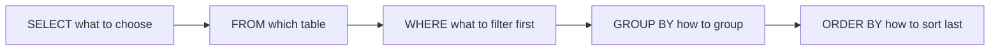
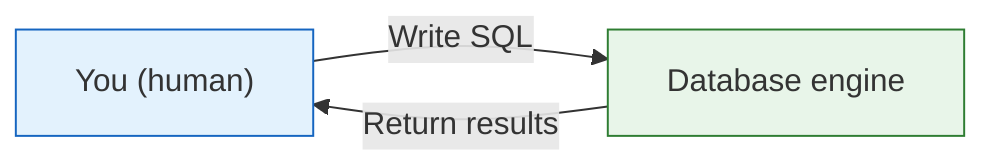
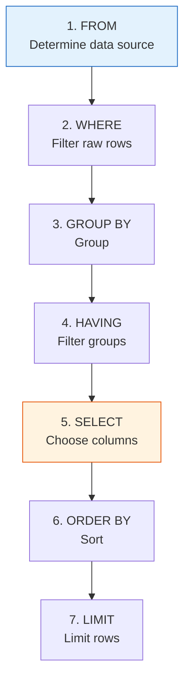
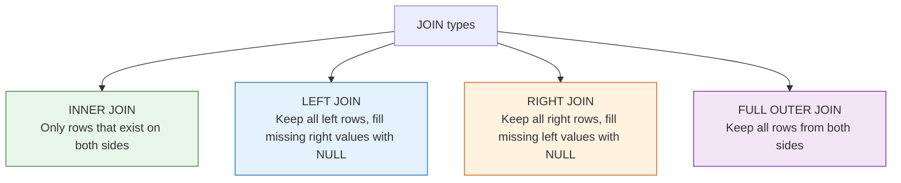

# SQL Basics


:::tip Section Overview
When many beginners first learn SQL, what trips them up most is not that the syntax is too much, but that they don’t know:

- What the relationship is between SQL and Pandas
- How the query order should be organized in their head

So the most important thing in this section is not memorizing every syntax rule first, but building a judgment:

> **In essence, SQL is a stable language for asking tables questions.**
:::

## Learning Objectives

- Master the four basic SQL operations: create, read, update, delete
- Use `SELECT` queries fluently
- Learn `WHERE` condition filtering
- Master `JOIN` for combining multiple tables
- Understand `GROUP BY` for grouped aggregation

---

## First, Build a Map

The best way for beginners to understand SQL is not to “memorize the syntax book from start to finish,” but to first see clearly:



So what this section really wants to solve is:

- How SQL queries actually flow in your head
- Why it corresponds to `Pandas` filtering, grouping, and merging

## What Is SQL?

**SQL** (Structured Query Language) is the language used to “talk” to databases. Whether you use SQLite, MySQL, or PostgreSQL, the SQL syntax is basically the same.



:::tip The Relationship Between SQL and Pandas
What SQL can do, Pandas can do for the most part too. In fact, many Pandas method names, such as `merge` and `groupby`, were borrowed from SQL. Learning them side by side works better.
:::

### A Better Analogy for Beginners

You can think of SQL as:

- You asking the database questions

And these questions are usually very straightforward:

- Which columns do I want?
- Which rows do I want?
- How should I group them?
- How do I connect two tables?

This analogy is especially useful for beginners because it pulls SQL back from “another language” into “how do I ask the table questions?”

---

## Preparation: Create a Practice Database

All examples in this section are based on this practice database. Please run the following first:

```python
import sqlite3

conn = sqlite3.connect(":memory:")  # In-memory database, disappears when closed
cursor = conn.cursor()

# Create users table
cursor.execute("""
    CREATE TABLE users (
        id INTEGER PRIMARY KEY,
        name TEXT NOT NULL,
        age INTEGER,
        city TEXT,
        salary REAL
    )
""")

# Create orders table
cursor.execute("""
    CREATE TABLE orders (
        order_id INTEGER PRIMARY KEY,
        user_id INTEGER,
        product TEXT,
        amount REAL,
        order_date TEXT,
        FOREIGN KEY (user_id) REFERENCES users(id)
    )
""")

# Insert user data
users_data = [
    (1, "Alice", 28, "Beijing", 15000),
    (2, "Bob", 35, "Shanghai", 22000),
    (3, "Charlie", 22, "Guangzhou", 8000),
    (4, "Diana", 42, "Beijing", 35000),
    (5, "Ethan", 30, "Shanghai", 18000),
    (6, "Fiona", 26, "Shenzhen", 12000),
]
cursor.executemany("INSERT INTO users VALUES (?, ?, ?, ?, ?)", users_data)

# Insert order data
orders_data = [
    (101, 1, "iPhone", 7999, "2024-11-01"),
    (102, 1, "AirPods", 999, "2024-11-05"),
    (103, 2, "MacBook", 14999, "2024-11-10"),
    (104, 3, "iPad", 3999, "2024-11-15"),
    (105, 2, "Keyboard", 599, "2024-11-20"),
    (106, 4, "Monitor", 2999, "2024-12-01"),
    (107, 5, "Mouse", 299, "2024-12-05"),
]
cursor.executemany("INSERT INTO orders VALUES (?, ?, ?, ?, ?)", orders_data)

conn.commit()

# Define a helper function for easier querying
def query(sql):
    cursor.execute(sql)
    cols = [desc[0] for desc in cursor.description]
    rows = cursor.fetchall()
    # Print header
    print(" | ".join(cols))
    print("-" * (len(" | ".join(cols))))
    for row in rows:
        print(" | ".join(str(v) for v in row))
    print()
```

---

## 1. Query Data (`SELECT`)

`SELECT` is the most commonly used SQL statement. It is used to retrieve data from tables.

### Basic Queries

```sql
-- Query all columns
SELECT * FROM users;

-- Query specific columns
SELECT name, age, city FROM users;

-- Give columns aliases
SELECT name AS name, age AS age FROM users;
```

```python
query("SELECT * FROM users")
# id | name | age | city | salary
# 1 | Alice | 28 | Beijing | 15000
# 2 | Bob | 35 | Shanghai | 22000
# ...
```

### `DISTINCT`: Remove Duplicates

```sql
-- Query all unique cities
SELECT DISTINCT city FROM users;
```

### `LIMIT`: Limit the Number of Rows

```sql
-- Take only the first 3 rows
SELECT * FROM users LIMIT 3;
```

### The Safest Default Order When Writing Your First Query

A more reliable order is usually:

1. Write `SELECT` first
2. Then write `FROM`
3. Then decide whether to add `WHERE`
4. Finally add sorting and grouping

This is less confusing than trying to mix all clauses together right away.

---

## 2. Condition Filtering (`WHERE`)

`WHERE` is like Pandas boolean indexing and is used to filter rows that meet certain conditions.

### Basic Comparisons

```sql
-- Age greater than 30
SELECT * FROM users WHERE age > 30;

-- City is Beijing
SELECT * FROM users WHERE city = 'Beijing';

-- Salary between 10000 and 20000
SELECT * FROM users WHERE salary BETWEEN 10000 AND 20000;
```

### Combined Conditions

```sql
-- AND: both conditions must be true
SELECT * FROM users WHERE city = 'Beijing' AND age > 25;

-- OR: either condition
SELECT * FROM users WHERE city = 'Beijing' OR city = 'Shanghai';

-- IN: within a list
SELECT * FROM users WHERE city IN ('Beijing', 'Shanghai', 'Shenzhen');

-- NOT: negation
SELECT * FROM users WHERE city NOT IN ('Beijing');
```

### Pattern Matching (`LIKE`)

```sql
-- % matches any characters (similar to Pandas str.contains)
SELECT * FROM users WHERE name LIKE 'A%';    -- starts with "A"
SELECT * FROM users WHERE name LIKE '%e';    -- ends with "e"
SELECT * FROM users WHERE email LIKE '%@mail%'; -- contains "@mail"
```

### Handling `NULL`

```sql
-- Check whether it is empty (do not use = NULL)
SELECT * FROM users WHERE city IS NULL;
SELECT * FROM users WHERE city IS NOT NULL;
```

### SQL vs Pandas Comparison

| Requirement | SQL | Pandas |
|------|-----|--------|
| Age greater than 30 | `WHERE age > 30` | `df[df["age"] > 30]` |
| City is Beijing | `WHERE city = 'Beijing'` | `df[df["city"] == "Beijing"]` |
| Multiple conditions with AND | `WHERE age > 30 AND city = 'Beijing'` | `df[(df["age"] > 30) & (df["city"] == "Beijing")]` |
| Multiple conditions with OR | `WHERE city IN ('Beijing', 'Shanghai')` | `df[df["city"].isin(["Beijing", "Shanghai"])]` |
| Pattern matching | `WHERE name LIKE 'A%'` | `df[df["name"].str.startswith("A")]` |
| Empty values | `WHERE city IS NULL` | `df[df["city"].isna()]` |

### A Comparison Table Beginners Should Remember First

| Question in your head | More like which SQL clause |
|---|---|
| Only look at records that meet the condition | `WHERE` |
| See which unique values exist in a table | `DISTINCT` |
| Just take the first few rows to check | `LIMIT` |
| Connect two tables | `JOIN` |
| Group first, then aggregate | `GROUP BY` |

This table is especially useful for beginners because it compresses SQL back into a few common types of questions instead of a long list of keywords.

---

## 3. Sorting (`ORDER BY`)

```sql
-- Sort by salary ascending (default)
SELECT * FROM users ORDER BY salary;

-- Sort by salary descending
SELECT * FROM users ORDER BY salary DESC;

-- Sort by city first, then salary descending within the same city
SELECT * FROM users ORDER BY city, salary DESC;
```

### Why Is `ORDER BY` Often Written Last?

Because sorting is more like:

- The result is already there, and now I want to see it in a certain order

This is not the same kind of problem as:

- Filtering first
- Grouping first

---

## 4. Aggregate Functions and Grouping (`GROUP BY`)

### Common Aggregate Functions

| Function | Purpose | Example |
|------|------|------|
| `COUNT(*)` | Count rows | How many records in total |
| `SUM(col)` | Sum values | Total salary |
| `AVG(col)` | Average value | Average age |
| `MAX(col)` | Maximum value | Highest salary |
| `MIN(col)` | Minimum value | Lowest age |

```sql
-- Basic aggregation
SELECT COUNT(*) AS total_people, AVG(salary) AS avg_salary, MAX(salary) AS highest_salary
FROM users;
```

### `GROUP BY`: Grouped Statistics

```sql
-- Count people and average salary by city
SELECT city, COUNT(*) AS people_count, AVG(salary) AS avg_salary
FROM users
GROUP BY city;
```

```
city | people_count | avg_salary
Beijing | 2 | 25000.0
Shanghai | 2 | 20000.0
Guangzhou | 1 | 8000.0
Shenzhen | 1 | 12000.0
```

### `HAVING`: Filter Grouped Results

```sql
-- Find cities with average salary above 15000
SELECT city, AVG(salary) AS avg_salary
FROM users
GROUP BY city
HAVING avg_salary > 15000;
```

:::tip `WHERE` vs `HAVING`
- `WHERE` filters **before** grouping (filters raw rows)
- `HAVING` filters **after** grouping (filters aggregated results)
:::

### SQL Execution Order

The writing order of SQL is different from the execution order:



---

## 5. Joining Multiple Tables (`JOIN`)

`JOIN` is one of SQL’s most powerful features. It lets you combine data from multiple tables.

### `INNER JOIN`

Returns only rows that match in **both** tables.

```sql
-- Query each user's order information
SELECT users.name, orders.product, orders.amount
FROM users
INNER JOIN orders ON users.id = orders.user_id;
```

```
name | product | amount
Zhang San | iPhone | 7999.0
Zhang San | AirPods | 999.0
Li Si | MacBook | 14999.0
Wang Wu | iPad | 3999.0
Li Si | Keyboard | 599.0
Zhao Liu | Monitor | 2999.0
Qian Qi | Mouse | 299.0
```

Note: Sun Ba has no orders, so he does not appear in the result.

### `LEFT JOIN`

Returns all rows from the left table; unmatched rows from the right table are shown as `NULL`.

```sql
-- Query all users and their orders (including users with no orders)
SELECT users.name, orders.product, orders.amount
FROM users
LEFT JOIN orders ON users.id = orders.user_id;
```

```
name | product | amount
Zhang San | iPhone | 7999.0
Zhang San | AirPods | 999.0
Li Si | MacBook | 14999.0
...
Sun Ba | None | None       ← No orders, but still shown
```

### Comparison of JOIN Types



:::tip SQL `JOIN` vs Pandas `merge`
| SQL | Pandas |
|-----|--------|
| `INNER JOIN` | `pd.merge(how="inner")` |
| `LEFT JOIN` | `pd.merge(how="left")` |
| `RIGHT JOIN` | `pd.merge(how="right")` |
| `ON users.id = orders.user_id` | `on="user_id"` or `left_on=, right_on=` |
:::

### Practical Combination: `JOIN` + `GROUP BY`

```sql
-- Query each user's total order amount
SELECT users.name, COUNT(orders.order_id) AS order_count, SUM(orders.amount) AS total_spent
FROM users
LEFT JOIN orders ON users.id = orders.user_id
GROUP BY users.id, users.name
ORDER BY total_spent DESC;
```

---

## 6. Insert, Update, Delete (`INSERT` / `UPDATE` / `DELETE`)

### Insert Data

```sql
-- Insert one row
INSERT INTO users (name, age, city, salary) VALUES ('Zhou Jiu', 29, 'Hangzhou', 16000);

-- Insert multiple rows
INSERT INTO users (name, age, city, salary) VALUES
    ('Wu Shi', 33, 'Chengdu', 13000),
    ('Zheng Shiyi', 27, 'Nanjing', 11000);
```

### Update Data

```sql
-- Give Zhang San a raise
UPDATE users SET salary = 18000 WHERE name = 'Zhang San';

-- Give all Beijing employees a 10% raise
UPDATE users SET salary = salary * 1.1 WHERE city = 'Beijing';
```

:::caution Always Add `WHERE` for `UPDATE`!
`UPDATE users SET salary = 0;` will set the salary of **all users** to zero! Forgetting `WHERE` is one of the most common disasters in database operations.
:::

### Delete Data

```sql
-- Delete a specific record
DELETE FROM users WHERE name = 'Zhou Jiu';

-- Delete all records with age less than 20
DELETE FROM users WHERE age < 20;
```

:::danger Always Add `WHERE` for `DELETE`!
`DELETE FROM users;` will delete **all data** in the table! Think carefully before doing this.
:::

### The Safest Default Order When Learning SQL for the First Time

A more reliable order is usually:

1. First write `SELECT / FROM / WHERE` correctly
2. Then add `ORDER BY`
3. Then add `GROUP BY / HAVING`
4. Finally learn `JOIN` and insert, update, delete

This is less confusing than memorizing all syntax blocks at once.

---

## SQL Statement Quick Reference

| Operation | SQL Syntax | Description |
|------|---------|------|
| Query all | `SELECT * FROM table_name` | Get all data |
| Query specific columns | `SELECT col1, col2 FROM table_name` | Get some columns |
| Condition filtering | `SELECT ... WHERE condition` | Filter rows |
| Sorting | `ORDER BY col DESC` | Sort descending |
| Limit rows | `LIMIT 10` | Take the first N rows |
| Remove duplicates | `SELECT DISTINCT col` | Unique values |
| Aggregation | `COUNT / SUM / AVG / MAX / MIN` | Statistical calculations |
| Grouping | `GROUP BY col` | Grouped statistics |
| Group filtering | `HAVING condition` | Filter grouped results |
| Inner join | `INNER JOIN table ON condition` | Intersection of two tables |
| Left join | `LEFT JOIN table ON condition` | All rows from the left table |
| Insert | `INSERT INTO table VALUES (...)` | Add data |
| Update | `UPDATE table SET col=value WHERE condition` | Modify data |
| Delete | `DELETE FROM table WHERE condition` | Delete data |

---

## Summary

SQL is the language for “talking” to databases. Its core consists of four types of operations:

| Category | Keyword | Purpose |
|------|--------|------|
| **Read** | `SELECT` | Query data (most common) |
| **Create** | `INSERT` | Insert new data |
| **Update** | `UPDATE` | Modify existing data |
| **Delete** | `DELETE` | Remove data |

Among them, `SELECT` together with `WHERE`, `JOIN`, and `GROUP BY` can cover most data analysis tasks.

## What You Should Take Away From This Section

- The most important thing about SQL is not that it has many keywords, but whether you can use it steadily to ask tables questions
- If you first think, “Which columns do I want, which rows do I want, and how should I group them?”, writing SQL will be much more stable than memorizing syntax
- Once `WHERE / GROUP BY / JOIN` becomes clear, most later queries can be understood step by step

---

## Hands-On Exercises

### Exercise 1: Basic Queries

```sql
-- Using the practice database above, complete the following queries:
-- 1. Query all users in Shanghai
-- 2. Query the top 3 people with the highest salaries
-- 3. Query the average salary for each city, sorted by average salary in descending order
```

### Exercise 2: JOIN Queries

```sql
-- 1. Query the names of all users and the products they have bought
-- 2. Query users who have never placed an order
--    Hint: LEFT JOIN + WHERE orders.order_id IS NULL
-- 3. Query the total order amount for each user, including users with no orders (show as 0)
```

### Exercise 3: Comprehensive Analysis

```sql
-- Complete this with one SQL statement:
-- Query the user name, number of orders, and total spending for users whose total spending exceeds 5000
-- Sort by total spending in descending order
```
