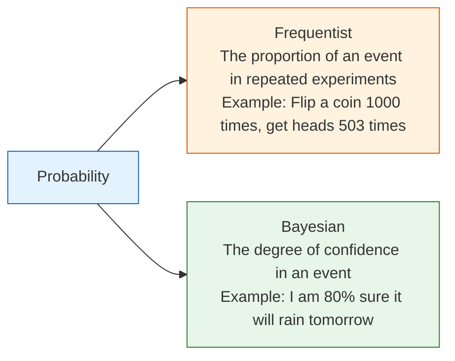
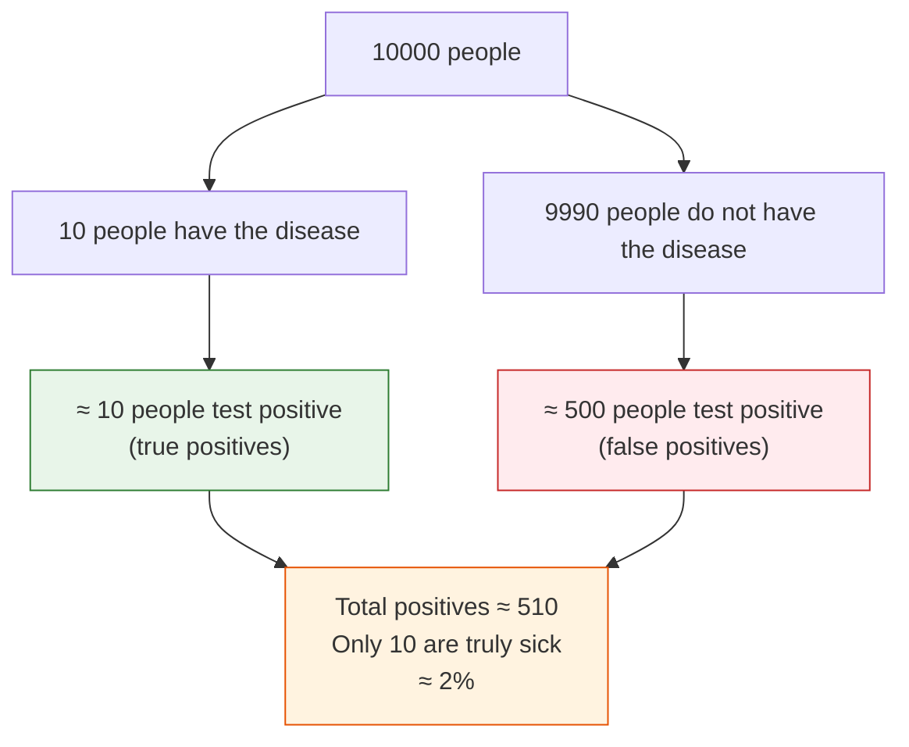
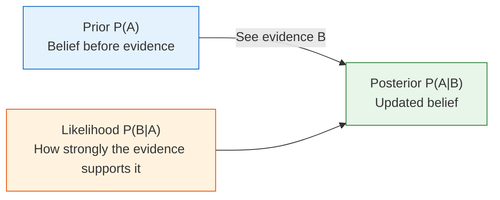

# Probability Basics: Measuring Uncertainty


:::tip Why learn probability?
AI is essentially about making decisions in "uncertainty." A model does not output "this image is definitely a cat," but rather "this image has a 95% probability of being a cat." Probability theory is the mathematical tool for handling uncertainty.
:::

## Learning Objectives

- Understand the two interpretations of probability (frequentist vs. Bayesian)
- Master conditional probability and joint probability
- Understand Bayes' theorem through classic examples
- Use Python simulations to verify probability formulas

## Historical Background: Where Did Bayes' Rule Come From?

The most important historical milestone in this section is:

| Year | Milestone | What it most importantly solved |
|---|---|---|
| 1763 | Bayes' Theorem (later organized and published by Price) | Laid the foundation for the main line of probabilistic inference: "How do we update our judgment when new evidence appears?" |

For beginners, the most important thing to remember first is not the details of the original paper, but:

> **The greatest value of Bayes' rule is not the formula itself, but that it clearly explains "prior judgment + new evidence = updated judgment."**

That is also why in machine learning later on:

- spam detection
- medical testing
- Naive Bayes

all repeatedly return to this update logic.

### Why has Bayes always felt "interesting" to many beginners?

Because unlike many formulas that are just about calculation,  
it feels more like answering a very real-life question:

- How did I originally judge this?
- Now that new evidence has arrived, should I change my mind?

This is especially easy to relate to.  
For example, medical testing, spam detection, risk control, and recommendation systems  
are all essentially not about "knowing the answer absolutely," but about:

- looking at evidence
- updating confidence

So the reason Bayes' rule has been remembered for so long  
is often not because it is "elegant,"  
but because it so closely resembles how people make judgments in the real world.

### Why has this been remembered by later generations?

Because it clearly told people for the first time:

- reasoning does not end once you have a conclusion
- reasoning can actually be updated continuously as evidence arrives

That sounds natural today, but historically it was important.  
You can think of Bayes' rule as a very simple but deeply influential idea:

> **What I originally thought is not important; what matters is whether I am willing to update my judgment after getting new evidence.**

That is why it is not just a mathematical formula,  
but more like an entire way of viewing an uncertain world.

## First, Set a Very Important Expectation

This section will not cover everything in probability theory.  
Its more realistic goals are:

- to help you see that "probability is not mysticism; it describes uncertainty"
- to help you see that "judgments update when new information arrives"
- to help you see what model output probabilities are really saying

So the most important goal in this section is not to memorize every formula perfectly,  
but to first clearly understand:

- events
- conditions
- updates

These three things.

---

## First, Build a Map

It is best to place this section back into the chapter as a whole:


What you really need to learn here is not just a few formulas, but:

- Many judgments in the world are not 0 or 1
- When new evidence appears, our judgments are updated
- This is exactly the basic idea behind AI models outputting probabilities

## 1. What Is Probability?

### 1.1 Two Interpretations



In AI, both interpretations are used:
- **When training models**: use frequentist methods (statistical patterns from large amounts of data)
- **When doing inference with models**: use Bayesian methods (updating beliefs based on observations)

### 1.1.1 A More Beginner-Friendly Analogy

You can first think of probability as "confidence" in two different contexts:

- Frequentist: like a statistical conclusion from repeated experiments
- Bayesian: like updating your subjective confidence after getting evidence

### 1.2 Experiencing "Frequency Is Probability" with Python

```python
import numpy as np
import matplotlib.pyplot as plt

plt.rcParams['font.sans-serif'] = ['Arial Unicode MS']
plt.rcParams['axes.unicode_minus'] = False

# Simulate coin flips
np.random.seed(42)
n_flips = 10000
results = np.random.choice(['Heads', 'Tails'], size=n_flips)

# As the number of flips increases, the proportion of heads approaches 0.5
cumulative_ratio = np.cumsum(results == 'Heads') / np.arange(1, n_flips + 1)

plt.figure(figsize=(10, 5))
plt.plot(cumulative_ratio, color='steelblue', linewidth=1)
plt.axhline(y=0.5, color='red', linestyle='--', label='Theoretical probability 0.5')
plt.xlabel('Number of flips')
plt.ylabel('Proportion of heads')
plt.title('Law of Large Numbers: The more trials, the closer the proportion gets to the true probability')
plt.legend()
plt.xscale('log')
plt.grid(True, alpha=0.3)
plt.show()
```

**Law of Large Numbers**: The more experiments you run, the closer the frequency gets to the true probability. This is why deep learning needs "big data."

---

## 2. Conditional Probability — "Given Some Information"

### 2.1 Intuitive Understanding

**Conditional probability P(A|B)** = the probability that A happens, given that B has already happened.

### 2.1.1 Why Does Conditional Probability Feel So Much Like How AI Thinks?

Because real-world judgments almost always happen in a context.

In other words, the most important thing about conditional probability is not the symbol, but this sentence:

> **Once we know more information, the original judgment should be updated.**

:::tip Life Example
- P(late | traffic jam) = the probability of being late given a traffic jam (much higher than usual)
- P(pass | studied hard) = the probability of passing given that you studied hard (also much higher than usual)
- P(is spam | contains "free") = the probability that an email containing the word "free" is spam
:::

### 2.2 Formula and Calculation

**P(A|B) = P(A and B) / P(B)**

A simple intuitive example:

```python
# A class of 100 students
# 60 like math, 50 like programming, 30 like both

n_total = 100
n_math = 60
n_code = 50
n_both = 30

# P(like programming | like math) = P(like both) / P(like math)
p_code_given_math = n_both / n_math
print(f"Among students who like math, the proportion who also like programming: {p_code_given_math:.1%}")  # 50%

# P(like math | like programming)
p_math_given_code = n_both / n_code
print(f"Among students who like programming, the proportion who also like math: {p_math_given_code:.1%}")  # 60%
```

**Note**: P(A|B) and P(B|A) are usually not equal!

### 2.2.1 This Is One of the Easiest Pitfalls for Beginners

When many people first learn this, they instinctively mix up:

- "Among people who like math, how many like programming"

with

- "Among people who like programming, how many like math"

But they have different denominators, so they are fundamentally different questions.

### 2.3 Joint Probability and Marginal Probability

```python
# Simulate data with NumPy
np.random.seed(42)
n = 10000

# Weather: sunny (0.7) / rainy (0.3)
weather = np.random.choice(['Sunny', 'Rainy'], n, p=[0.7, 0.3])

# Probability of carrying an umbrella depends on the weather
umbrella = np.where(
    weather == 'Rainy',
    np.random.choice(['Carry', 'No carry'], n, p=[0.8, 0.2]),  # 80% carry an umbrella when rainy
    np.random.choice(['Carry', 'No carry'], n, p=[0.1, 0.9])   # 10% carry an umbrella when sunny
)

# Joint probability table
import pandas as pd
df = pd.DataFrame({'Weather': weather, 'Umbrella': umbrella})
joint = pd.crosstab(df['Weather'], df['Umbrella'], normalize=True)
print("Joint probability table:")
print(joint.round(3))
print(f"\nMarginal probability P(rainy): {(weather == 'Rainy').mean():.3f}")
print(f"Marginal probability P(carry umbrella): {(umbrella == 'Carry').mean():.3f}")
```

| | Carry | No carry | Total (marginal probability) |
|---|------|------|---------|
| Sunny | 0.07 | 0.63 | 0.70 |
| Rainy | 0.24 | 0.06 | 0.30 |
| Total | 0.31 | 0.69 | 1.00 |

---

## 3. Bayes' Theorem — The Most Important Probability Formula in AI

### 3.1 Introduction: The Story of a Hospital Test

A rare disease has an incidence rate of 0.1% (1 in 1000 people has it). A hospital has a test:
- If you have the disease, the probability the test is positive is 99% (sensitivity)
- If you do not have the disease, the probability the test is positive is 5% (false positive rate)

**Question: If your test comes back positive, what is the probability that you really have the disease?**

Many people instinctively say "99%" — but the answer may surprise you.

### 3.2 Bayes' Formula

**P(Have disease | Positive) = P(Positive | Have disease) × P(Have disease) / P(Positive)**

```python
# Given conditions
p_disease = 0.001       # Prior probability: incidence rate 0.1%
p_positive_if_disease = 0.99    # Have disease → probability of positive
p_positive_if_healthy = 0.05    # No disease → probability of positive (false positive rate)

# P(Positive) = P(Positive|Have disease)×P(Have disease) + P(Positive|No disease)×P(No disease)
p_positive = (p_positive_if_disease * p_disease + 
              p_positive_if_healthy * (1 - p_disease))
print(f"P(Positive): {p_positive:.4f}")

# Bayes' formula
p_disease_if_positive = (p_positive_if_disease * p_disease) / p_positive
print(f"P(Have disease|Positive): {p_disease_if_positive:.4f}")  # ≈ 0.0194
print(f"Approximately {p_disease_if_positive:.1%}")             # ≈ 1.9%
```

**Result: only about 2%!** Even if the test is positive, the probability that you actually have the disease is only 2%.

### 3.3 Why Is It So Low?

Because the incidence rate is too low (0.1%), most positive results are actually false positives.

```python
# Simulate with 10000 people
n_people = 10000
n_sick = int(n_people * p_disease)        # 10 people have the disease
n_healthy = n_people - n_sick             # 9990 people do not have the disease

true_positive = n_sick * p_positive_if_disease    # have disease and test positive: ≈ 10
false_positive = n_healthy * p_positive_if_healthy # no disease but test positive: ≈ 500

total_positive = true_positive + false_positive

print(f"Out of 10000 people:")
print(f"  People with the disease: {n_sick}")
print(f"  People who test positive: {total_positive:.0f}")
print(f"    Of which true positives: {true_positive:.0f}")
print(f"    Of which false positives: {false_positive:.0f}")
print(f"  Proportion of truly sick among positive results: {true_positive/total_positive:.1%}")
```



### 3.4 The Core Idea of Bayes' Theorem



**Posterior = Prior × Likelihood / Normalization factor**

This is the core of Bayes: **continuously updating your belief with new evidence**.

### 3.5 Verifying Bayes' Theorem with Simulation

```python
# Monte Carlo simulation
np.random.seed(42)
n_sim = 1_000_000

# 1. Whether each person has the disease
has_disease = np.random.random(n_sim) < p_disease

# 2. Each person's test result
test_positive = np.where(
    has_disease,
    np.random.random(n_sim) < p_positive_if_disease,  # Have disease
    np.random.random(n_sim) < p_positive_if_healthy    # No disease
)

# 3. Among those who test positive, the proportion who are sick
positive_people = test_positive.sum()
positive_and_sick = (test_positive & has_disease).sum()

simulated_probability = positive_and_sick / positive_people
print(f"Simulated result P(Have disease|Positive): {simulated_probability:.4f}")
print(f"Formula result: {p_disease_if_positive:.4f}")
print(f"Difference: {abs(simulated_probability - p_disease_if_positive):.6f}")
```

---

## 4. Applications of Bayes' Theorem in AI

### 4.1 Naive Bayes Classifier

Spam filtering is a classic application of Bayes' theorem:

```python
# Simplified spam classification
# P(Spam | contains "free") = P(contains "free"|Spam) × P(Spam) / P(contains "free")

p_spam = 0.3                      # 30% of emails are spam
p_free_given_spam = 0.8           # 80% of spam emails contain "free"
p_free_given_ham = 0.05           # 5% of normal emails contain "free"

# P(contains "free")
p_free = p_free_given_spam * p_spam + p_free_given_ham * (1 - p_spam)

# Bayes
p_spam_given_free = p_free_given_spam * p_spam / p_free
print(f"Probability that an email containing 'free' is spam: {p_spam_given_free:.1%}")
# ≈ 87.3%
```

### 4.2 More AI Applications

| Application | Prior | Likelihood | Posterior |
|------|------|------|------|
| Spam filtering | Probability that an email is spam | Probability that spam contains a certain word | Probability that it is spam given the word |
| Medical diagnosis | Incidence rate of a disease | Probability of a positive test when diseased | Probability of truly being sick after a positive result |
| Recommendation systems | Probability that a user likes a category | Probability that users who like that category watch a certain movie | Probability that the user will watch this movie |
| Language models | Probability of a word appearing | Probability that the word appears given the context | Most likely next word |

---

## 5. Independence — A Powerful Tool for Simplifying Calculations

### 5.1 What Is Independence?

Two events are **independent**, meaning the occurrence of one does not affect the probability of the other.

**P(A and B) = P(A) × P(B)**  (only when A and B are independent)

```python
# Flipping two coins — the two flips are independent
p_head = 0.5

# Both are heads
p_both_heads = p_head * p_head
print(f"Both flips are heads: {p_both_heads}")  # 0.25

# Simulation check
n = 100000
coin1 = np.random.random(n) < 0.5
coin2 = np.random.random(n) < 0.5
both = (coin1 & coin2).mean()
print(f"Simulated result: {both:.4f}")  # ≈ 0.25
```

### 5.2 The Independence Assumption in AI

Naive Bayes is called "naive" because it **assumes all features are independent** (although in reality they often are not, the method still works surprisingly well).

```python
# Naive Bayes: assume each word appears independently
# P(Spam|"free","winner","click") ∝ P(Spam) × P("free"|Spam) × P("winner"|Spam) × P("click"|Spam)

p_spam = 0.3
words = {
    "free": (0.8, 0.05),    # (P(word|spam), P(word|normal))
    "winner": (0.6, 0.01),
    "click": (0.7, 0.1),
}

# Compute numerator
score_spam = p_spam
score_ham = 1 - p_spam

for word, (p_word_spam, p_word_ham) in words.items():
    score_spam *= p_word_spam
    score_ham *= p_word_ham

# Normalize
p_spam_given_words = score_spam / (score_spam + score_ham)
print(f"Probability that an email containing 'free' + 'winner' + 'click' is spam: {p_spam_given_words:.1%}")
```

---

## After Learning This, What Should You Bring to the Next Section?

After finishing probability basics, the most worthwhile questions to carry forward are:

1. If a single event can be described by probability, what will a collection of many random outcomes look like overall?
2. Why do some phenomena always seem like bell curves, while others look more like count distributions?
3. Why are noise, initialization, and errors in models so often tied to certain distributions?

These three questions will naturally lead you to:

- [Probability Distributions: Patterns Behind Data](./02-distributions.md)

:::info Connecting to Later Sections
- **Next section**: Probability Distributions — Patterns Behind Data
- **5 Introduction to Machine Learning and Practice**: The Naive Bayes classifier is directly based on Bayes' theorem
- **5 Introduction to Machine Learning and Practice**: The output of logistic regression is the conditional probability P(y=1|x)
- **7 LLM Principles, Prompting, and Fine-Tuning**: The generation of a large language model is a probability distribution over the next token
:::

---

## Summary

| Concept | Intuition | Formula / Code |
|------|------|----------|
| Probability | A measure of uncertainty (0~1) | `np.random.random() < p` |
| Conditional probability | Probability of A given B has occurred | P(A\|B) = P(A and B) / P(B) |
| Joint probability | Probability of A and B happening together | `pd.crosstab(normalize=True)` |
| Bayes' theorem | Updating beliefs with evidence | Posterior = Prior × Likelihood / Normalization |
| Independence | No mutual influence | P(A and B) = P(A) × P(B) |

## What Should You Take Away from This Section?

- Probability describes uncertainty; it does not pretend things are absolutely certain
- The most important intuition for conditional probability is: "when information changes, the judgment should change too"
- The most important thing to remember about Bayes is: "prior + evidence -> updated judgment"
- That is why many outputs in AI are naturally probabilities, not absolute conclusions

## Hands-on Exercises

### Exercise 1: Conditional Probability

From a standard 52-card deck, draw one card at random:
1. P(hearts) = ?
2. P(hearts | red card) = ? (given that it is a red card)
3. P(A | hearts) = ? (given that it is a heart)

Use Python to simulate and verify 100000 trials.

### Exercise 2: Bayes Update

A factory has two production lines, A and B. Line A produces 60% of the products, and line B produces 40%. The defect rate of A is 2%, and the defect rate of B is 5%.

If a randomly selected product is found to be defective, what is the probability that it came from production line B?

### Exercise 3: Simulate Bayes' Theorem

Modify the disease testing example by changing the incidence rate to 1% (instead of 0.1%), and see how the probability of having the disease after a positive test changes. Verify it using both simulation and the formula.
