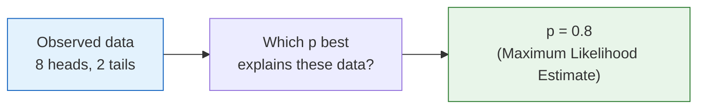
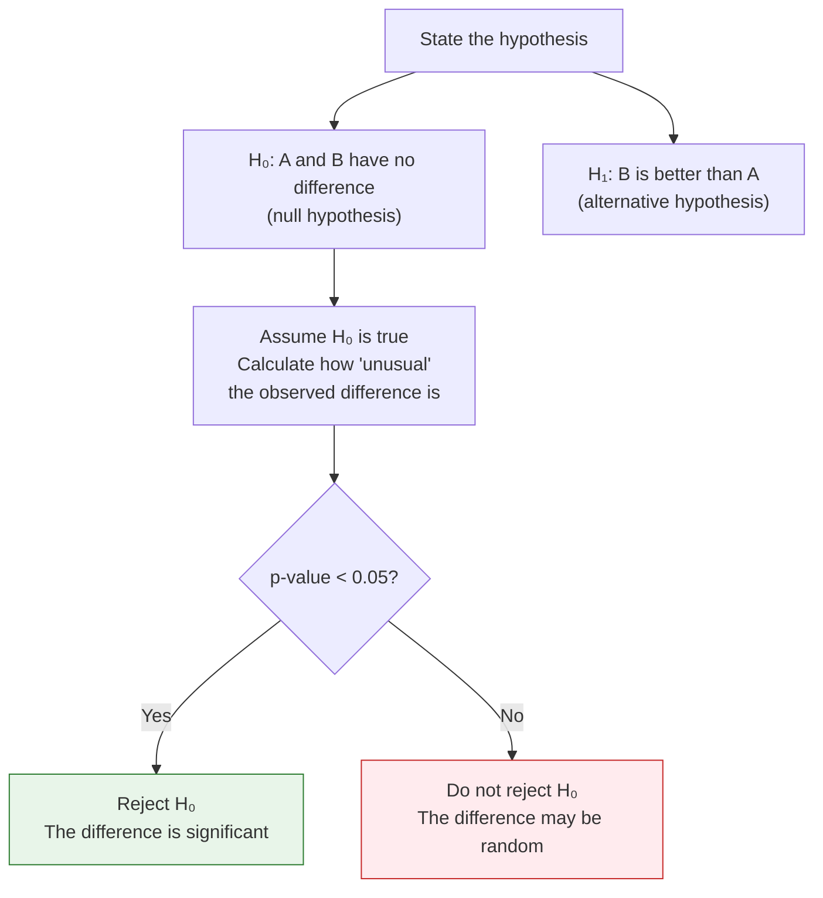
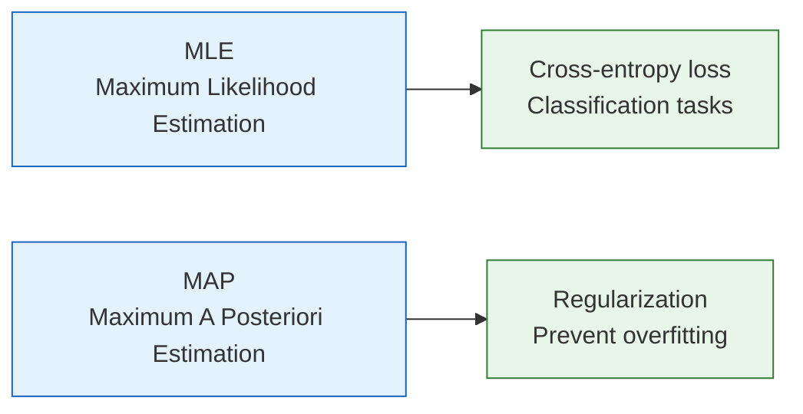

# Basics of Statistical Inference


:::tip Statistical inference = inferring rules from data
In the previous section, we learned about various probability distributions. But in the real world, we often do not know the parameters of a distribution (for example, what is the probability that a coin lands heads?). Statistical inference is **using observed data to infer the parameters of the distribution**.
:::

## Learning Objectives

- Understand the intuition behind Maximum Likelihood Estimation (MLE) — why do we "maximize probability"?
- Understand Maximum A Posteriori Estimation (MAP) — adding prior knowledge
- Understand hypothesis testing and p-values (A/B testing mindset)
- Implement MLE in Python

## Historical Background: How Did MLE and EM Come About?

There are two especially important historical milestones in this section:

| Year | Milestone | Key Author(s) | What did it solve most importantly? |
|---|---|---|---|
| 1922 | Maximum Likelihood Estimation | Ronald Fisher | Systematized the idea of "the parameters that best explain the observed data," becoming an important foundation for statistical learning and loss functions |
| 1977 | EM Algorithm | Dempster, Laird, Rubin | Provided a stable iterative framework for parameter estimation problems with latent variables and missing information |

There is a very important distinction here:

- **MLE** is more like a complete field / principle
- **EM** is more like a classic method for finding MLE in certain difficult scenarios

So for beginners learning this section for the first time, the most important thing to know is:

> **MLE answers "which parameters look most like the truth," while EM answers "when there are unseen parts in the problem, how do we step by step approach those parameters."**

### Why is this line especially appealing to many beginners?

Because it explains "inferring rules from data" in a way that feels like solving a case:

- You do not directly see the truth
- No one tells you the parameters
- But you already have many observed clues

So the question becomes:

- Which explanation best connects all these clues?

MLE makes people feel like "a detective,"  
EM makes people feel like "feeling their way through a black box,"  
and that is also why many people, when they first seriously learn statistical inference, suddenly feel:

> **So model training is not just calculating formulas — it is a step-by-step reverse inference process.**

### Why did this line later become so important for statistical learning?

Because it explains a very simple question extremely clearly:

- Since the world will not directly tell you the parameters
- You should infer them backward from data

The most appealing part of MLE is precisely that it feels like detective work:

- The scene already has many clues
- You do not know the truth
- But you can ask: which explanation is most likely what really happened?

And EM is more like saying:

- If part of the information at the scene is completely invisible
- Then do not give up; guess once, refine it, and keep approaching the answer repeatedly

So the reason this main line is so attractive to beginners is:

> **It makes "inferring rules from data" feel like a process with steps, strategy, and gradual approximation for the first time.**

## First, set an important learning expectation

This section can easily make beginners feel nervous as soon as they see `MLE / MAP / p-value`.  
But the most important thing here is not to instantly master statistical inference as completely as in a statistics course, but to first understand:

- After seeing data, what are we trying to infer?
- What does "the model that best explains the data" mean mathematically?
- Why do these ideas eventually grow directly into loss functions, regularization, and A/B testing?

---

## First, build a map

The previous two sections were about "how probability is defined" and "what distributions look like." Starting from this section, we enter:

> **Now that we have data, how do we infer the underlying parameters and conclusions?**


The most important thing in this lesson is not memorizing terminology, but first grasping:

- MLE: which parameters best explain these data?
- MAP: in addition to the data, also consider prior knowledge
- Hypothesis testing: after seeing a difference, how do we judge whether it is just by chance?

## 1. Maximum Likelihood Estimation (MLE)

### 1.1 Intuition: Which parameters best explain the data?

You pick up a coin and do not know whether it is fair. You toss it 10 times: **HHTHHHTHHH** (8 heads, 2 tails).

**Question: what is the most likely probability p of landing heads?**

Intuition tells you: p ≈ 0.8. MLE turns this intuition into math — **find the parameter value that makes the observed data most likely to occur**.

### 1.1.1 A more beginner-friendly analogy

You can first think of MLE as a "detective reconstructing the case" process:

- You have already seen a series of clues (observed data)
- Now you infer backward: which parameter setting looks most like what really happened?

So the core of MLE is not "maximizing for the sake of maximizing," but:

> **Find the parameters that best explain the data in front of you.**



### 1.2 Understanding with code

```python
import numpy as np
import matplotlib.pyplot as plt
from scipy import stats

plt.rcParams['font.sans-serif'] = ['Arial Unicode MS']
plt.rcParams['axes.unicode_minus'] = False

# Observed data: 10 tosses, 8 heads and 2 tails
n_heads = 8
n_tails = 2
n_total = n_heads + n_tails

# For different p values, compute the probability of generating this data (likelihood function)
p_values = np.linspace(0.01, 0.99, 1000)

# Likelihood function: L(p) = C(n,k) * p^k * (1-p)^(n-k)
# We can ignore C(n,k) because it does not depend on p
likelihood = p_values**n_heads * (1 - p_values)**n_tails

# MLE: the p that maximizes the likelihood
p_mle = p_values[np.argmax(likelihood)]
print(f"MLE estimate: p = {p_mle:.3f}")

# Visualization
plt.figure(figsize=(10, 5))
plt.plot(p_values, likelihood, color='steelblue', linewidth=2)
plt.axvline(x=p_mle, color='red', linestyle='--', linewidth=2, label=f'MLE: p = {p_mle:.2f}')
plt.fill_between(p_values, likelihood, alpha=0.1, color='steelblue')
plt.xlabel('p (heads probability)')
plt.ylabel('Likelihood L(p)')
plt.title(f'Likelihood function: tossing a coin 10 times, {n_heads} heads and {n_tails} tails')
plt.legend(fontsize=12)
plt.grid(True, alpha=0.3)
plt.show()
```

### 1.3 Mathematical intuition behind MLE

The answer from MLE is actually very simple: **p = number of heads / total number of tosses = 8/10 = 0.8**

But the value of MLE is that it is a **general framework** — for any distribution, you can use the same idea to find the parameters.

### 1.3.1 Why is this especially important for AI?

Because many loss functions, on the surface, look like they are "doing optimization,"  
but from a deeper perspective, they are actually:

- finding a set of parameters
- so that those parameters best explain the training data

In other words, MLE is the common language behind many training objectives.

### 1.4 More data = more accurate estimates

```python
# True p = 0.6
true_p = 0.6
n_experiments = [10, 50, 100, 500, 2000]

fig, axes = plt.subplots(1, len(n_experiments), figsize=(20, 4))

for ax, n in zip(axes, n_experiments):
    # Toss the coin n times
    heads = np.random.binomial(n, true_p)
    
    # Likelihood function
    p_vals = np.linspace(0.01, 0.99, 500)
    ll = heads * np.log(p_vals) + (n - heads) * np.log(1 - p_vals)
    ll = np.exp(ll - ll.max())  # Normalize
    
    p_mle = heads / n
    
    ax.plot(p_vals, ll, color='steelblue', linewidth=2)
    ax.axvline(x=true_p, color='green', linestyle='--', label=f'True p={true_p}')
    ax.axvline(x=p_mle, color='red', linestyle='--', label=f'MLE={p_mle:.3f}')
    ax.set_title(f'n = {n}')
    ax.set_xlabel('p')
    ax.legend(fontsize=8)

plt.suptitle('More data means a more accurate and more certain MLE (the curve becomes narrower)', fontsize=13)
plt.tight_layout()
plt.show()
```

**Interpretation**: The more data you have, the narrower the peak of the likelihood function and the closer it gets to the true value. This is the power of "big data."

---

## 2. Maximum A Posteriori Estimation (MAP)

### 2.1 The problem with MLE

If you only toss a coin 3 times and all three are heads, MLE will tell you p = 3/3 = 1.0 — "this coin always lands heads."

That is clearly unreasonable. Our **common sense** tells us that for most coins, p should be close to 0.5.

### 2.2 MAP: adding prior knowledge

MAP adds a "prior" on top of MLE — your prior belief about the parameters:

**MAP = likelihood × prior**

### 2.2.1 A better way to remember it

If MLE is:

- only looking at the evidence in front of you

Then MAP is more like:

- the evidence in front of you + your original common sense about the world

So it is very suitable for explaining many phenomena in AI:

- Why adding a constraint to keep parameters from getting too large makes training more stable
- Why regularization is not just a trick, but a kind of prior assumption

```python
# Data: 3 tosses, all heads
n, k = 3, 3

p_values = np.linspace(0.01, 0.99, 1000)

# Likelihood function
likelihood = p_values**k * (1 - p_values)**(n - k)

# Prior: we believe p is likely near 0.5 (represented by a Beta distribution)
prior = stats.beta.pdf(p_values, a=5, b=5)  # Prior centered at 0.5

# Posterior ∝ likelihood × prior
posterior = likelihood * prior
posterior = posterior / np.trapz(posterior, p_values)  # Normalize

# Find the maximum
p_mle = p_values[np.argmax(likelihood)]
p_map = p_values[np.argmax(posterior)]

print(f"MLE: p = {p_mle:.3f}")
print(f"MAP: p = {p_map:.3f}")

# Visualization
fig, ax = plt.subplots(figsize=(10, 5))
ax.plot(p_values, likelihood / np.trapz(likelihood, p_values), 
        '--', color='coral', linewidth=2, label='Likelihood function')
ax.plot(p_values, prior / np.trapz(prior, p_values), 
        '--', color='green', linewidth=2, label='Prior')
ax.plot(p_values, posterior, color='steelblue', width=0.01, label='Posterior')
ax.axvline(x=p_mle, color='coral', linestyle=':', alpha=0.7, label=f'MLE = {p_mle:.2f}')
ax.axvline(x=p_map, color='steelblue', linestyle=':', alpha=0.7, label=f'MAP = {p_map:.2f}')
ax.set_xlabel('p')
ax.set_ylabel('Probability density')
ax.set_title('MLE vs MAP (with only 3 data points)')
ax.legend()
ax.grid(True, alpha=0.3)
plt.show()
```

**Interpretation**:
- MLE gives p = 1.0 (completely biased by very little data)
- MAP gives p≈0.69 (a compromise between data and prior)
- As the amount of data increases, MAP and MLE will converge

### 2.3 MLE vs MAP

| | MLE | MAP |
|---|-----|-----|
| Uses prior? | No | Yes |
| When data is small | Easy to overfit | More stable |
| When data is large | Approaches MAP | Approaches MLE |
| Corresponding idea in AI | Ordinary training | Regularization (e.g. L2 regularization = Gaussian prior) |

:::tip AI connection
**L2 regularization** (also called weight decay) is essentially MAP — it assumes the prior on weights is a normal distribution with mean 0, encouraging weights not to become too large. This is why regularization helps prevent overfitting.
:::

---

## 3. Hypothesis Testing and A/B Testing

### 3.1 A daily-life scenario

You changed the color of a website button (version A uses blue, version B uses green), and version B’s click-through rate increased by 2%.

**Question: is this difference real, or just random fluctuation?**

### 3.2 The idea behind hypothesis testing



### 3.3 Intuition for p-values

**p-value = the probability of getting a difference this large (or larger) just by random fluctuation, assuming there is no real difference.**

- Small p-value (for example, 0.01) → "If there were really no difference, this result would almost never happen" → the difference is real
- Large p-value (for example, 0.3) → "Even if there were no real difference, this result would still be common" → it may just be random fluctuation

### 3.4 A/B testing in practice

```python
# Simulate an A/B test
np.random.seed(42)

# Group A: blue button, true click-through rate 10%
n_a = 1000
clicks_a = np.random.binomial(n_a, 0.10)
rate_a = clicks_a / n_a

# Group B: green button, true click-through rate 12% (really better)
n_b = 1000
clicks_b = np.random.binomial(n_b, 0.12)
rate_b = clicks_b / n_b

print(f"Group A click-through rate: {rate_a:.1%} ({clicks_a}/{n_a})")
print(f"Group B click-through rate: {rate_b:.1%} ({clicks_b}/{n_b})")
print(f"Difference: {rate_b - rate_a:.1%}")

# Use a z-test
from scipy.stats import norm

# Pooled proportion
p_pool = (clicks_a + clicks_b) / (n_a + n_b)
# Standard error
se = np.sqrt(p_pool * (1 - p_pool) * (1/n_a + 1/n_b))
# z statistic
z = (rate_b - rate_a) / se
# p-value (one-sided)
p_value = 1 - norm.cdf(z)

print(f"\nz statistic: {z:.3f}")
print(f"p-value: {p_value:.4f}")

if p_value < 0.05:
    print("→ p < 0.05, the difference is significant! Version B is indeed better.")
else:
    print("→ p >= 0.05, the difference is not significant and may be due to random fluctuation.")
```

### 3.5 Understanding p-values through simulation

```python
# Simulation: if A and B really had no difference (both 10%), how large a difference would we see?
np.random.seed(42)
n_simulations = 10000
simulated_diffs = []

for _ in range(n_simulations):
    # Both groups use the same probability of 10%
    sim_a = np.random.binomial(1000, 0.10) / 1000
    sim_b = np.random.binomial(1000, 0.10) / 1000
    simulated_diffs.append(sim_b - sim_a)

simulated_diffs = np.array(simulated_diffs)

# Plot the distribution
observed_diff = rate_b - rate_a

plt.figure(figsize=(10, 5))
plt.hist(simulated_diffs, bins=50, density=True, color='steelblue', 
         edgecolor='white', alpha=0.7, label='Difference distribution under the null hypothesis')
plt.axvline(x=observed_diff, color='red', linewidth=2, linestyle='--',
            label=f'Observed difference: {observed_diff:.3f}')

# p-value = area to the right of the red line
p_sim = (simulated_diffs >= observed_diff).mean()
plt.fill_between(np.linspace(observed_diff, 0.08, 100),
                 0, 30, alpha=0.3, color='red', label=f'p-value ≈ {p_sim:.4f}')

plt.xlabel('Click-through rate difference (B - A)')
plt.ylabel('Density')
plt.title('Intuition for p-values: how "unusual" is the observed difference?')
plt.legend()
plt.grid(True, alpha=0.3)
plt.show()
```

---

## 4. The Connection Between MLE and Loss Functions

### 4.1 MLE = minimizing cross-entropy

This is a very important connection — **in classification problems, maximizing likelihood is equivalent to minimizing cross-entropy loss**.

```python
# Binary classification problem
# Model prediction: p_hat = the probability the model assigns to label 1
# True label: y ∈ {0, 1}

# Likelihood function
# L = ∏ p_hat^y * (1-p_hat)^(1-y)

# Take logarithm (log-likelihood)
# log L = Σ [y * log(p_hat) + (1-y) * log(1-p_hat)]

# Maximize log L = minimize -log L = minimize cross-entropy!

# Example
y_true = np.array([1, 0, 1, 1, 0])
p_pred = np.array([0.9, 0.2, 0.8, 0.7, 0.3])

# Cross-entropy (manual)
cross_entropy = -np.mean(
    y_true * np.log(p_pred) + (1 - y_true) * np.log(1 - p_pred)
)
print(f"Cross-entropy loss: {cross_entropy:.4f}")

# Log-likelihood (manual)
log_likelihood = np.mean(
    y_true * np.log(p_pred) + (1 - y_true) * np.log(1 - p_pred)
)
print(f"Log-likelihood: {log_likelihood:.4f}")
print(f"Cross-entropy = -log-likelihood: {-log_likelihood:.4f}")
```

:::info Why is this important?
When you see `nn.CrossEntropyLoss()` or `nn.BCELoss()` in PyTorch, now you know — **they are essentially doing maximum likelihood estimation**. Loss functions are not defined arbitrarily; they have a deep probabilistic foundation.
:::

---

## What should you take into the next section?

After reading this section, the most valuable questions to bring to the next one are:

1. If a model predicts a distribution, how do we measure how different two distributions are?
2. Why can cross-entropy feel both like an information theory concept and a training loss?
3. Why does KL divergence keep showing up in VAE, RLHF, and distillation?

These questions will naturally lead you to:

- [Basics of Information Theory](./04-information-theory.md)



:::info Connection to later sections
- **Next section**: Information theory — understand cross-entropy from another perspective
- **Station 5**: The loss function of logistic regression is cross-entropy (from MLE)
- **Station 5**: The probabilistic interpretation of regularization (L1/L2) is MAP
- **Station 6**: Neural network training = minimizing loss functions = doing MLE/MAP
:::

---

## Summary

| Concept | Intuition | Formula/Code |
|------|------|----------|
| MLE | Find the parameters that best explain the data | Maximize the likelihood function |
| MAP | MLE + prior knowledge | Maximize likelihood × prior |
| p-value | How "unusual" the difference is | The probability of observing such a difference under the null hypothesis |
| A/B testing | Compare whether two groups have a real difference | `scipy.stats` |
| Cross-entropy | Minimizing cross-entropy = MLE | `nn.CrossEntropyLoss()` |

## Hands-on Exercises

### Exercise 1: Coin Toss MLE

Toss a coin 100 times and get 62 heads.
1. Use MLE to estimate p
2. Plot the likelihood function
3. If the prior is Beta(10, 10), what is the MAP estimate?

### Exercise 2: A/B Testing

Simulate an A/B test: Group A (n=500) has a true conversion rate of 8%, and Group B (n=500) has a true conversion rate of 8% (no difference). Run 1000 experiments and count how many times the p-value is less than 0.05 (this is the "false positive rate," which should be about 5% in theory).

### Exercise 3: MLE for a Normal Distribution

Generate 200 samples from N(5, 2), use MLE to estimate the mean and standard deviation (for a normal distribution, the MLE is: mean = sample mean, standard deviation = sample standard deviation), and compare with the true values.
