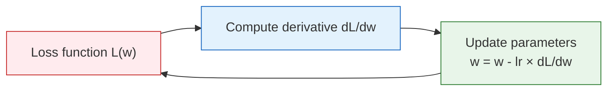

# Derivatives: The Intuition of Rate of Change


:::tip No need to memorize formulas
This section will not test your ability to derive formulas. The core goal is to help you understand the intuition that **derivative = speed of change**, and to be able to compute derivatives with Python. Later, when you learn gradient descent, you’ll find that derivatives tell you "which direction to adjust parameters to make the loss smaller."
:::

## Learning Objectives

- Intuitively understand derivative = tangent slope = rate of change
- Use everyday scenarios (speed, stock prices) to understand derivatives
- Master common differentiation rules
- Use Python for numerical differentiation and visualization

## First, set a very important learning expectation

This section is not meant to make you "someone who can derive every derivative" right away,  
but to help you truly understand:

- What a derivative is describing
- Why it is directly related to how a model updates its parameters

If you finish one reading and still can’t confidently solve lots of derivative problems, that is completely normal.  
What matters more is:

- Can you explain a derivative as a "rate of change"?
- Can you connect it to later topics like loss changes and parameter updates?

---

## First, build a map

It’s best to place this section back into the context of the whole chapter:


So this section is not an isolated math topic; it is laying the foundation for the optimization storyline that follows.

## 1. What Is a Derivative?

### 1.1 "Rate of change" in daily life

| Scenario | Variable | Rate of change (derivative) |
|------|------|--------------|
| Driving | Distance changes over time | Speed (km/h) |
| Stocks | Stock price changes over time | Rise/fall speed |
| Learning | Score changes over practice time | Learning efficiency |
| AI training | Loss changes over training steps | Convergence speed |

**A derivative = the speed at which some quantity changes at a particular moment.**

### 1.1.1 A more beginner-friendly analogy

If "tangent slope" still feels a bit abstract, you can first think of a derivative as:

- the "current speed" on a dashboard

For example, when driving:

- total distance is an accumulated value
- speed is how fast you are changing right now

So a derivative is not asking "how much has it changed in total,"  
but instead asking:

> **At this moment, how fast is it changing?**

### 1.2 Geometric intuition: tangent slope

```python
import numpy as np
import matplotlib.pyplot as plt

plt.rcParams['font.sans-serif'] = ['Arial Unicode MS']
plt.rcParams['axes.unicode_minus'] = False

# Function f(x) = x²
def f(x):
    return x ** 2

# Tangent line at x=1
x0 = 1
slope = 2 * x0  # f'(x) = 2x → f'(1) = 2

x = np.linspace(-1, 3, 200)
tangent = slope * (x - x0) + f(x0)

plt.figure(figsize=(8, 6))
plt.plot(x, f(x), 'steelblue', linewidth=2, label='f(x) = x²')
plt.plot(x, tangent, 'r--', linewidth=2, label=f'Tangent line (slope = {slope})')
plt.plot(x0, f(x0), 'ro', markersize=10, zorder=5)
plt.annotate(f'x={x0}, slope={slope}', xy=(x0, f(x0)), 
             xytext=(x0+0.5, f(x0)+1.5), fontsize=12,
             arrowprops=dict(arrowstyle='->', color='gray'))
plt.xlim(-1, 3)
plt.ylim(-1, 8)
plt.xlabel('x')
plt.ylabel('f(x)')
plt.title('Derivative = Tangent Slope')
plt.legend()
plt.grid(True, alpha=0.3)
plt.show()
```

**Interpretation**: The derivative of f(x) = x² at x = 1 is 2, which means "when x increases a little near 1, f(x) increases by about twice as much."

### 1.3 Numerical differentiation — approximate with Python

You don’t need to know the formula; as long as you can compute function values, you can compute derivatives:

**f'(x) ≈ (f(x + h) - f(x - h)) / (2h)** (take h as a very small number)

```python
def numerical_derivative(f, x, h=1e-7):
    """Compute the numerical derivative using the central difference method"""
    return (f(x + h) - f(x - h)) / (2 * h)

# Test: the derivative of f(x) = x² should be 2x
f = lambda x: x ** 2

for x0 in [0, 1, 2, 3]:
    approx = numerical_derivative(f, x0)
    exact = 2 * x0
    print(f"x={x0}: numerical derivative={approx:.6f}, exact derivative={exact}")
```

:::tip Numerical differentiation vs. analytical differentiation
- **Analytical differentiation**: derive using formulas (e.g. (x²)' = 2x), exact but requires mathematical skill
- **Numerical differentiation**: approximate with code, simple but with small errors
- **Automatic differentiation** (used by PyTorch): combines accuracy and automation; you’ll learn it in Station 6
:::

---

## 2. Common Differentiation Rules

You don’t need to memorize all the rules. Just get familiar with the most common ones:

### 2.1 Basic rule cheat sheet

| Function | Derivative | Example |
|------|------|------|
| Constant c | 0 | (5)' = 0 |
| x to the n-th power | n × x to the (n-1)-th power | (x³)' = 3x² |
| e to the x power | e to the x power | (eˣ)' = eˣ |
| ln(x) | 1/x | (ln x)' = 1/x |
| sin(x) | cos(x) | (sin x)' = cos x |

### 2.2 Verify with Python

```python
# Verify common differentiation rules
functions = [
    ("x³",      lambda x: x**3,       lambda x: 3*x**2),
    ("eˣ",      lambda x: np.exp(x),  lambda x: np.exp(x)),
    ("ln(x)",   lambda x: np.log(x),  lambda x: 1/x),
    ("sin(x)",  lambda x: np.sin(x),  lambda x: np.cos(x)),
]

print(f"{'Function':<10} {'x':<5} {'Numerical Derivative':<15} {'Analytical Derivative':<15} {'Error':<15}")
print("-" * 60)

for name, f, f_prime in functions:
    x0 = 1.0
    numerical = numerical_derivative(f, x0)
    analytical = f_prime(x0)
    error = abs(numerical - analytical)
    print(f"{name:<10} {x0:<5} {numerical:<15.8f} {analytical:<15.8f} {error:<15.2e}")
```

### 2.3 Visualization: functions and their derivatives

```python
fig, axes = plt.subplots(2, 2, figsize=(14, 10))

cases = [
    ('f(x) = x²', lambda x: x**2, lambda x: 2*x),
    ('f(x) = x³', lambda x: x**3, lambda x: 3*x**2),
    ('f(x) = sin(x)', np.sin, np.cos),
    ('f(x) = eˣ', np.exp, np.exp),
]

for ax, (name, f, f_prime) in zip(axes.flat, cases):
    x = np.linspace(-2, 2, 200)
    ax.plot(x, f(x), 'steelblue', linewidth=2, label='f(x)')
    ax.plot(x, f_prime(x), 'coral', linewidth=2, linestyle='--', label="f'(x)")
    ax.axhline(y=0, color='gray', linewidth=0.5)
    ax.set_title(name, fontsize=12)
    ax.legend()
    ax.grid(True, alpha=0.3)

plt.suptitle('Functions (blue) and derivatives (red)', fontsize=14)
plt.tight_layout()
plt.show()
```

---

## 3. The Role of Derivatives in AI

### 3.1 The derivative of the loss function = the direction of optimization



**A derivative tells you: which direction should the parameters move so that the loss becomes smaller.** This is the core idea of gradient descent (we’ll explain it in detail in the next subsection).

### 3.2 Derivatives of common AI functions

```python
# Sigmoid function and its derivative
def sigmoid(x):
    return 1 / (1 + np.exp(-x))

def sigmoid_derivative(x):
    s = sigmoid(x)
    return s * (1 - s)

# ReLU function and its derivative
def relu(x):
    return np.maximum(0, x)

def relu_derivative(x):
    return (x > 0).astype(float)

fig, axes = plt.subplots(1, 2, figsize=(14, 5))
x = np.linspace(-5, 5, 200)

# Sigmoid
axes[0].plot(x, sigmoid(x), 'steelblue', linewidth=2, label='sigmoid(x)')
axes[0].plot(x, sigmoid_derivative(x), 'coral', linewidth=2, linestyle='--', label="sigmoid'(x)")
axes[0].set_title('Sigmoid and its derivative')
axes[0].legend()
axes[0].grid(True, alpha=0.3)

# ReLU
axes[1].plot(x, relu(x), 'steelblue', linewidth=2, label='ReLU(x)')
axes[1].plot(x, relu_derivative(x), 'coral', linewidth=2, linestyle='--', label="ReLU'(x)")
axes[1].set_title('ReLU and its derivative')
axes[1].legend()
axes[1].grid(True, alpha=0.3)

plt.tight_layout()
plt.show()
```

**Problem with the Sigmoid derivative**: when x is far from 0, the derivative approaches 0 ("vanishing gradient"), which is why deep networks more often use ReLU.

---

## After learning this, what question should you bring to the next section?

After reading about derivatives, the most valuable questions to carry forward are:

1. If a function has more than one variable, how should its rate of change be represented?
2. If there are many parameters, in which direction should the model change them together?
3. Why does "the derivative of one variable" naturally grow into "the gradient of multiple variables"?

These three questions will naturally lead you to:

- [Partial Derivatives and Gradients](./02-partial-derivatives-gradient.md)

:::info Connect to what comes next
- **Next section**: Partial derivatives and gradients — "directional change" when there are multiple variables
- **Section 3.3**: Gradient descent — optimize the model step by step using derivatives
- **Station 6**: PyTorch `autograd` automatically computes derivatives for you (automatic differentiation)
:::

---

## Summary

| Concept | Intuition | Python implementation |
|------|------|------------|
| Derivative | The rate of change of a function at a point | `(f(x+h) - f(x-h)) / (2h)` |
| Tangent slope | Geometric meaning of a derivative | Visualize by drawing a tangent line |
| Common rules | Power, exponential, logarithmic, trigonometric functions | Verify with numerical derivatives |
| Role in AI | Derivatives indicate the direction of optimization | Foundation of gradient descent |

## What should you take away from this section?

- The most important intuition about derivatives is "the current rate of change"
- Numerical differentiation helps you see change first, instead of forcing you to memorize derivations first
- The most crucial role of derivatives in AI is telling the model which direction to adjust its parameters

## Hands-on Exercises

### Exercise 1: Numerical differentiation

Use the `numerical_derivative` function to compute the derivative of the following functions at x=2, and compare with the exact values:
1. f(x) = 3x² + 2x - 1
2. f(x) = 1/x
3. f(x) = x × sin(x)

### Exercise 2: Plot derivative graphs

Plot f(x) = x³ - 3x and its derivative f'(x) = 3x² - 3 over the range [-3, 3]. Observe: where f'(x) = 0 (x = ±1), what feature of f(x) does that correspond to?

### Exercise 3: Sigmoid gradient vanishing

Plot the derivative of Sigmoid, find the maximum value of the derivative and where it occurs. Explain why this leads to the "vanishing gradient" problem.
