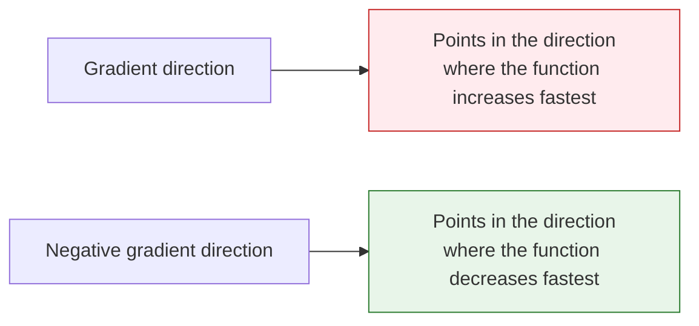

# Partial Derivatives and Gradients: The Directions of Change in Multivariable Functions


## Learning Objectives

- Understand partial derivatives — hold other variables fixed and look at the effect of one variable
- Understand gradients — vectors made up of all partial derivatives, pointing in the "steepest ascent" direction
- Visualize gradients on 3D surfaces
- Understand the core role of gradients in neural network training

## First Get the Basics / Then Go Deeper

If this is your first time studying this section, you do not need to be able to derive complicated functions right away. As a beginner, it is enough to understand these three sentences: a partial derivative is "change one variable only and see the effect," a gradient is "put all partial derivatives together as a direction," and a negative gradient is "the direction in which the loss decreases fastest."

If you already have some math background, you can go further: why the gradient direction is perpendicular to contour lines, why the learning rate affects the result of moving along the negative gradient, and what `loss.backward()` in PyTorch is actually helping you compute automatically.

## First, Set a Very Important Learning Expectation

This section is often the first place where many beginners feel that "math is starting to get a bit hard."

But the most important thing here is not to fully master multivariable calculus all at once. Instead, first understand:

- Why the derivative of a single variable naturally expands into partial derivatives
- Why a gradient bundles many rates of change into one direction
- Why it directly determines how model parameters should be adjusted

---

## First, Build a Map

### Start with a Story: You Are Tuning a Complex Machine

Imagine a coffee machine in front of you. The taste of the coffee is determined by many knobs together: water temperature, grind size, coffee amount, and extraction time. Now the coffee tastes too bitter. You cannot just ask, "Where is the whole thing wrong?" Instead, you need to test one by one: what happens if you only change the temperature, only change the grind size, only change the time?

That is what partial derivatives do: they first hold all other knobs fixed and look at the effect of one knob on the result. A gradient then combines the effects of all knobs into a "tuning guide," telling you which direction the overall adjustment should go.

In the previous section, you saw "how one variable changes." In this section, we upgrade the problem to:

> **If a function is affected by many variables at the same time, how do we know which direction to adjust it?**


The most important thing in this lesson is not memorizing symbols first, but understanding first:

- A partial derivative looks at one variable under the condition that "other variables do not change"
- A gradient packages all local change information into a vector

## 1. Partial Derivatives — "Change One Variable Only"

### 1.1 From Single Variable to Multiple Variables

The derivative in the previous section had only one variable. But in AI, loss functions usually depend on **thousands or even millions of parameters**.

The idea of a partial derivative is simple: **hold all other variables fixed and only look at how changing one variable affects the result.**

### 1.1.1 A Beginner-Friendly Analogy

You can think of partial derivatives as "a single knob on a mixing board":

- First, you turn only one knob
- Leave all the other knobs alone for now
- See how the output changes

That is the most important first intuition behind partial derivatives:

> **First look at the effect of one variable separately.**

```python
import numpy as np
import matplotlib.pyplot as plt
from mpl_toolkits.mplot3d import Axes3D

plt.rcParams['font.sans-serif'] = ['Arial Unicode MS']
plt.rcParams['axes.unicode_minus'] = False
```

### 1.2 Everyday Intuition

Suppose your exam score depends on "study time" and "sleep time":

**Score = f(study_time, sleep_time)**

- Partial derivative ∂f/∂study_time = **keep sleep fixed**; if you study one more hour, how much does your score improve?
- Partial derivative ∂f/∂sleep_time = **keep study fixed**; if you sleep one more hour, how much does your score improve?

### 1.3 Mathematical Example

f(x, y) = x² + y²

- ∂f/∂x = 2x (treat y as a constant, differentiate only with respect to x)
- ∂f/∂y = 2y (treat x as a constant, differentiate only with respect to y)

```python
# Numerical partial derivative
def partial_derivative(f, args, var_index, h=1e-7):
    """Compute the partial derivative of multivariable function f with respect to the variable at var_index"""
    args_plus = list(args)
    args_minus = list(args)
    args_plus[var_index] += h
    args_minus[var_index] -= h
    return (f(*args_plus) - f(*args_minus)) / (2 * h)

# f(x, y) = x² + y²
f = lambda x, y: x**2 + y**2

# Partial derivatives at (1, 2)
x0, y0 = 1, 2
df_dx = partial_derivative(f, [x0, y0], 0)
df_dy = partial_derivative(f, [x0, y0], 1)

print(f"At ({x0}, {y0}):")
print(f"  ∂f/∂x = {df_dx:.4f} (exact value: {2*x0})")
print(f"  ∂f/∂y = {df_dy:.4f} (exact value: {2*y0})")
```

---

## 2. Gradient — "The Direction of Steepest Ascent"

### 2.1 Definition

**Gradient = a vector made up of all partial derivatives.**

### 2.1.1 A More Memorable Way to Say It

You can first understand the gradient as:

- Each variable has a "local rate of change"
- The gradient bundles these rates of change into one arrow

The most important job of this arrow is not to look nice, but to:

- Tell you which direction the function rises fastest

For f(x, y): gradient = [∂f/∂x, ∂f/∂y]

```python
def gradient(f, args, h=1e-7):
    """Compute the gradient of a multivariable function"""
    grad = []
    for i in range(len(args)):
        grad.append(partial_derivative(f, args, i, h))
    return np.array(grad)

# Gradient at (1, 2)
grad = gradient(f, [1, 2])
print(f"Gradient: {grad}")  # [2, 4]
```

### 2.2 The Directional Meaning of the Gradient



**Key insight**: The gradient points in the direction of the steepest uphill climb. So if you want the loss function to go down, you should move in the **negative gradient direction**. This is the principle behind gradient descent.

### 2.2.1 Why Is This Especially Important for AI?

Because when training a model, the one thing you most want to know is:

- Which way should the parameters be adjusted now?

And that is exactly what the gradient answers.

### 2.2.2 A Better Overall Analogy for Beginners

You can think of the gradient as:

- You standing on a hillside, with the steepest uphill arrow under your feet

If you want to go higher, move along the gradient direction;  
if you want to go lower, move along the negative gradient direction.

This analogy is especially worth remembering first, because it turns the abstract idea of "a vector made up of partial derivatives" back into a very concrete action question:

- Which way should I step right now?

### 2.3 Visualization: The Gradient on a 3D Surface

```python
# f(x, y) = x² + y² (bowl-shaped surface)
x = np.linspace(-3, 3, 100)
y = np.linspace(-3, 3, 100)
X, Y = np.meshgrid(x, y)
Z = X**2 + Y**2

# 3D surface plot
fig = plt.figure(figsize=(14, 5))

# Left: 3D surface
ax1 = fig.add_subplot(121, projection='3d')
ax1.plot_surface(X, Y, Z, cmap='coolwarm', alpha=0.8)
ax1.set_xlabel('x')
ax1.set_ylabel('y')
ax1.set_zlabel('f(x,y)')
ax1.set_title('f(x,y) = x² + y² (3D view)')

# Right: contour lines + gradient arrows
ax2 = fig.add_subplot(122)
contour = ax2.contourf(X, Y, Z, levels=20, cmap='coolwarm', alpha=0.7)
plt.colorbar(contour, ax=ax2)

# Draw gradient arrows at several points
points = [(-2, -2), (-1, 1), (1, -1), (2, 2), (0.5, 0.5)]
for px, py in points:
    gx, gy = 2*px, 2*py  # analytic gradient
    ax2.quiver(px, py, gx, gy, color='black', scale=30, width=0.005)

ax2.set_xlabel('x')
ax2.set_ylabel('y')
ax2.set_title('Contour lines + gradient directions (arrows)\nArrows point toward the direction of fastest increase')
ax2.set_aspect('equal')

plt.tight_layout()
plt.show()
```

**Interpretation**:
- In the contour plot, the arrows (gradients) are always **perpendicular to the contour lines** and point uphill
- The farther away from the center, the larger the gradient (the longer the arrows) — this means the function changes more sharply
- At the lowest point (0,0), the gradient is [0,0] — you are already at the bottom

### 2.4 The Gradient on a Non-Bowl Surface

```python
# A more interesting function: with multiple extrema
def rosenbrock(x, y):
    return (1 - x)**2 + 100 * (y - x**2)**2

x = np.linspace(-2, 2, 200)
y = np.linspace(-1, 3, 200)
X, Y = np.meshgrid(x, y)
Z = rosenbrock(X, Y)

fig, ax = plt.subplots(figsize=(10, 8))
contour = ax.contourf(X, Y, np.log1p(Z), levels=30, cmap='viridis', alpha=0.8)
plt.colorbar(contour, ax=ax, label='log(1 + f(x,y))')

# Draw gradients at several points
for px, py in [(-1, 1), (0, 0), (1, 1), (1.5, 2)]:
    grad = gradient(rosenbrock, [px, py])
    # Scale the gradient for display
    norm = np.linalg.norm(grad)
    if norm > 0:
        grad_scaled = grad / norm * 0.3
        ax.quiver(px, py, -grad_scaled[0], -grad_scaled[1], 
                  color='red', scale=3, width=0.008)

ax.plot(1, 1, 'r*', markersize=20, label='Minimum (1, 1)')
ax.set_xlabel('x')
ax.set_ylabel('y')
ax.set_title('Rosenbrock function (a classic optimization test function)\nRed arrows = negative gradient direction (descent direction)')
ax.legend(fontsize=12)
plt.show()
```

---

## 3. The Meaning of Gradients in Neural Networks

### 3.1 The Gradient of the Loss Function

In a neural network:
- **Parameters** = thousands to billions of weights [w1, w2, ..., wn]
- **Loss function** = L(w1, w2, ..., wn)
- **Gradient** = [∂L/∂w1, ∂L/∂w2, ..., ∂L/∂wn]

The gradient tells us: **which way each weight should increase or decrease so that the loss becomes smaller.**

```python
# Simulation: a simple model with only 2 parameters
# Loss function L(w1, w2) = (w1 - 3)² + (w2 + 1)²
# Optimal solution: w1 = 3, w2 = -1

def loss(w1, w2):
    return (w1 - 3)**2 + (w2 + 1)**2

# Current parameters
w1, w2 = 0, 0
grad = gradient(loss, [w1, w2])

print(f"Current parameters: w1={w1}, w2={w2}")
print(f"Current loss: {loss(w1, w2)}")
print(f"Gradient: {grad}")
print(f"→ Partial derivative with respect to w1 = {grad[0]:.1f} (negative → w1 should increase)")
print(f"→ Partial derivative with respect to w2 = {grad[1]:.1f} (positive → w2 should decrease)")
```

### 3.2 The Challenge of High-Dimensional Gradients

| Model | Number of parameters | Gradient dimension |
|------|---------|---------|
| Linear regression | a few ~ hundreds | a few ~ hundreds |
| CNN (ResNet-50) | 25 million | 25 million-dimensional gradient |
| BERT | 110 million | 110 million-dimensional gradient |
| GPT-3 | 175 billion | 175 billion-dimensional gradient |

Although the dimensionality is extremely high, the rule for computing the gradient is the same — the partial derivative of each parameter. PyTorch's `autograd` automatically computes this efficiently for you.

### 3.3 Another Minimal Example of "Updating Parameters by Gradient"

```python
def loss(w1, w2):
    return (w1 - 3)**2 + (w2 + 1)**2


def grad_loss(w1, w2):
    return np.array([2 * (w1 - 3), 2 * (w2 + 1)])


w = np.array([0.0, 0.0])
lr = 0.1

for step in range(3):
    grad = grad_loss(w[0], w[1])
    w = w - lr * grad
    print(f"step={step+1}, w={np.round(w, 4)}, loss={round(loss(w[0], w[1]), 4)}")
```

This example is especially good for beginners because it turns the idea that "the gradient is just a direction" into something concrete for the first time:

- How parameters are updated step by step

In other words, a gradient is not just a mathematical object;  
it directly becomes the update action during training.

### 3.4 A Comparison Table That Beginners Should Remember First

| Concept | The most important question to remember |
|------|------|
| Partial derivative | If I turn only this one knob, how does the result change? |
| Gradient | If I combine the rates of change of all knobs, which direction should I adjust? |
| Negative gradient | If I want the loss to go down, which way should I move? |

This table is especially useful for beginners because it compresses "multivariable calculus" back into a few actionable questions.

### 3.5 A Common Mistake: Updating Loss in the Gradient Direction

When many beginners first write gradient descent, they accidentally write:

```python
w = w + lr * grad
```

If your goal is to make the loss smaller, this is usually the wrong direction. Because the gradient points in the direction of the fastest increase of the function value, minimizing the loss means moving along the negative gradient:

```python
w = w - lr * grad
```

You can see the difference more clearly with the following small example:

```python
def loss_1d(w):
    return (w - 3) ** 2


def grad_1d(w):
    return 2 * (w - 3)


for direction in ["wrong", "right"]:
    w = 0.0
    lr = 0.1
    print("\nDirection:", direction)
    for step in range(3):
        grad = grad_1d(w)
        if direction == "wrong":
            w = w + lr * grad
        else:
            w = w - lr * grad
        print(f"step={step+1}, w={w:.3f}, loss={loss_1d(w):.3f}")
```

This wrong example is worth remembering: if you find that training makes the loss larger and larger, the first thing you should check is the update direction and the learning rate.

---

## After Learning This, What Is the Best Next Step?

After understanding partial derivatives and gradients, the most worthwhile questions to take to the next section are:

1. If the gradient already tells me the direction, how do I actually move along that direction?
2. Why does training not finish in one step, but instead updates round by round?
3. Beyond "where should I move," what else does the learning rate determine?

The next section to read is usually:

- [Gradient Descent](./03-gradient-descent.md)

:::info Connecting to What Comes Next
- **Next section**: Gradient Descent — step by step along the negative gradient to find the minimum of the loss function
- **Section 3.4**: Chain Rule — how to efficiently compute gradients for complex networks
- **Station 6**: PyTorch's `loss.backward()` is doing gradient computation
:::

---

## Summary

| Concept | Intuition | Python |
|------|------|--------|
| Partial derivative | Hold other variables fixed and see the effect of one variable | `partial_derivative(f, args, i)` |
| Gradient | A vector of all partial derivatives, pointing in the steepest ascent direction | `gradient(f, args)` |
| Negative gradient | Points in the steepest descent direction | `-gradient(f, args)` |
| Gradient magnitude | How sharply the function changes | `np.linalg.norm(grad)` |

## What You Should Take Away Most from This Section

- The most important intuition behind partial derivatives is: "look at how one variable affects the result first"
- The most important intuition behind gradients is: "bundle many local rates of change into one direction"
- In AI, the most important value of gradients is telling the model parameters which way to adjust

## The Learning Loop for This Section

After finishing this section, you can use the following table to check whether you truly understand it:

| Level | What you should be able to do |
|---|---|
| Intuition | Explain what "change one variable only" and "descend along the negative gradient" mean |
| Code | Use numerical differences to compute the partial derivatives and gradient of a 2D function |
| Image | Understand why gradient arrows in contour plots point uphill |
| AI connection | Clearly explain why gradients are needed to update parameters when training models |

---

## Hands-On Exercises

### Exercise 1: Compute the Gradient

Use the `gradient` function to compute the gradient of f(x, y) = x²y + xy² at (2, 3). Verify it by hand (∂f/∂x = 2xy + y², ∂f/∂y = x² + 2xy).

### Exercise 2: Visualize the Gradient Field

Draw the contour plot and gradient arrows for f(x, y) = sin(x) + cos(y) (use `plt.quiver`).

### Exercise 3: Gradient of Three Variables

For f(x, y, z) = x² + 2y² + 3z², compute the gradient at (1, 1, 1), and determine which direction changes fastest.
