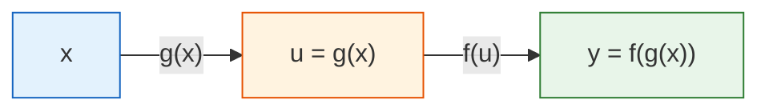
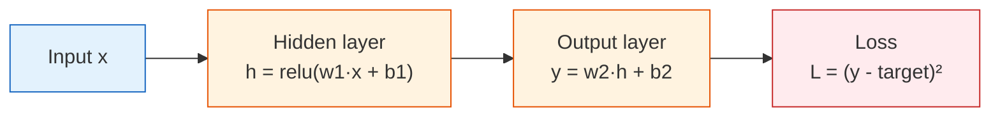
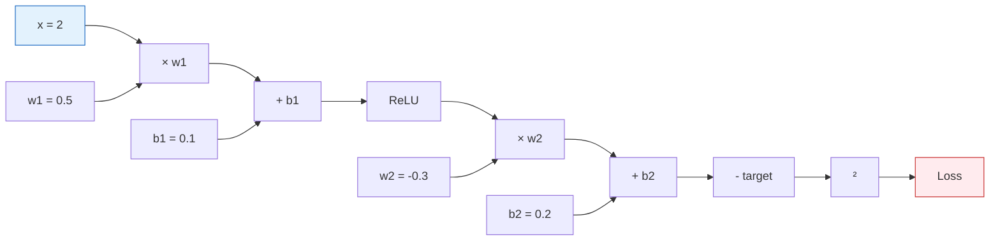
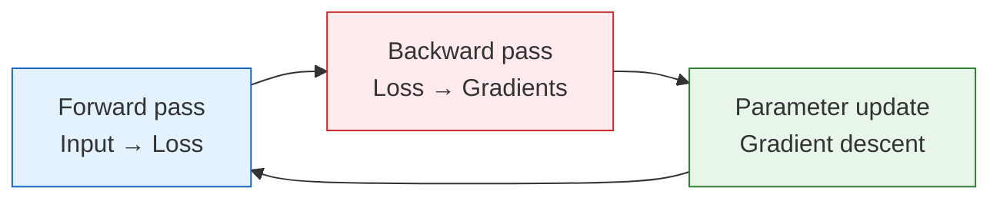

# Chain Rule and Backpropagation Preview


:::tip This section is the bridge between mathematics and deep learning
The chain rule explains a core question: **For a neural network with hundreds of layers, how do we compute the derivative of the loss function with respect to each parameter?** The answer is backpropagation — in essence, it is the systematic application of the chain rule.
:::

## Learning Objectives

- Understand the chain rule — how to differentiate composite functions
- Manually derive backpropagation for a simple two-layer network
- Understand computation graphs — why PyTorch needs them
- Get ready for deep learning in Station 6

## First, set a very important learning expectation

This section is one of the easiest places in Station 4 to make newcomers feel overwhelmed.  
So what you should focus on first in this section is not every formula, but:

- A complex network is still just many simple steps linked together
- Backpropagation is not a mysterious algorithm; it is the chain rule applied layer by layer
- PyTorch’s `backward()` is essentially helping you do this automatically

---

## First, build a map

This lesson is the bridge from Station 4 to deep learning in Station 6.


If what you learned before was:

- Derivatives: how one quantity changes
- Gradients: how many quantities change together
- Gradient descent: how to update parameters

Then what this lesson adds is:

- In a many-layer network, how the gradient is actually computed layer by layer

## 1. The Chain Rule — the "Peel the Onion" Method

### 1.1 Intuition

If a function has a nested structure — one function wrapped inside another — then its derivative is **found by peeling it layer by layer and multiplying the derivatives at each layer**.



**Chain rule: dy/dx = (dy/du) × (du/dx)**

"The rate of change of y with respect to x = the rate of change of y with respect to u × the rate of change of u with respect to x"

### 1.1.1 A more beginner-friendly analogy

You can first think of the chain rule as a row of gears:

- The first gear turns a little
- It causes the second gear to turn
- The second gear then drives the third

So how the last quantity changes depends on the multiplier for “passing along change” at each intermediate layer.

That is why the core action of the chain rule is:

- Break the function apart layer by layer
- Multiply the rates of change layer by layer

### 1.2 Everyday intuition

If your salary increases by 10% and prices increase by 5%, how does your real purchasing power change?

- Salary change → affects your wallet → affects purchasing power
- Total change = salary change rate × conversion rate

Multiply the change rates of each step = the overall change rate.

### 1.3 Calculation Example

```python
import numpy as np

# Example: y = (3x + 2)²
# Decomposition: u = 3x + 2, y = u²
# dy/dx = dy/du × du/dx = 2u × 3 = 6(3x + 2)

# Method 1: Chain rule
def chain_rule_example(x):
    u = 3 * x + 2        # inner function
    y = u ** 2            # outer function
    
    du_dx = 3             # derivative of inner function
    dy_du = 2 * u         # derivative of outer function
    dy_dx = dy_du * du_dx # chain rule
    
    return y, dy_dx

# Method 2: numerical check
def numerical_derivative(f, x, h=1e-7):
    return (f(x + h) - f(x - h)) / (2 * h)

f = lambda x: (3*x + 2)**2

x0 = 1
y, dy_dx_chain = chain_rule_example(x0)
dy_dx_numerical = numerical_derivative(f, x0)

print(f"x = {x0}")
print(f"  Chain rule: dy/dx = {dy_dx_chain}")
print(f"  Numerical check: dy/dx = {dy_dx_numerical:.4f}")
```

### 1.4 Multi-layer chain rule

What if there are even more nested layers? The same idea still works, layer by layer:

```python
# y = sin(exp(x²))
# Decomposition: a = x², b = exp(a), y = sin(b)
# dy/dx = dy/db × db/da × da/dx
#       = cos(b) × exp(a) × 2x

x0 = 0.5
a = x0 ** 2
b = np.exp(a)
y = np.sin(b)

da_dx = 2 * x0
db_da = np.exp(a)
dy_db = np.cos(b)

dy_dx = dy_db * db_da * da_dx

# Numerical check
f = lambda x: np.sin(np.exp(x**2))
dy_dx_num = numerical_derivative(f, x0)

print(f"Chain rule: {dy_dx:.6f}")
print(f"Numerical check: {dy_dx_num:.6f}")
```

---

## 2. Backpropagation — a Systematic Use of the Chain Rule

### 2.1 A Two-Layer Neural Network



### 2.2 Forward Pass

```python
# A simple two-layer network
np.random.seed(42)

# Input and target
x = 2.0
target = 1.0

# Parameters
w1 = 0.5
b1 = 0.1
w2 = -0.3
b2 = 0.2

# --- Forward pass ---
# Layer 1: linear + ReLU
z1 = w1 * x + b1
h = max(0, z1)       # ReLU

# Layer 2: linear
y = w2 * h + b2

# Loss
loss = (y - target) ** 2

print("=== Forward Pass ===")
print(f"z1 = w1*x + b1 = {w1}*{x} + {b1} = {z1}")
print(f"h  = ReLU(z1) = {h}")
print(f"y  = w2*h + b2 = {w2}*{h} + {b2} = {y}")
print(f"loss = (y - target)² = ({y} - {target})² = {loss:.4f}")
```

### 2.2.1 Why must we always compute the forward pass before the backward pass?

Because backpropagation does not happen out of thin air.  
It must be based on the intermediate values already computed during the forward pass:

- `z1`
- `h`
- `y`
- `loss`

So a very stable way to understand it is:

- The forward pass lays out the path
- The backward pass follows this path and sends gradients back layer by layer

### 2.3 Backward Pass

**Starting from the loss, compute the gradient of each parameter layer by layer:**

```python
# --- Backward pass ---
# Start from the last layer and work backward using the chain rule

# dL/dy
dL_dy = 2 * (y - target)
print(f"\n=== Backward Pass ===")
print(f"dL/dy = 2*(y-target) = {dL_dy:.4f}")

# dL/dw2 = dL/dy × dy/dw2 = dL/dy × h
dL_dw2 = dL_dy * h
print(f"dL/dw2 = dL/dy × h = {dL_dy:.4f} × {h} = {dL_dw2:.4f}")

# dL/db2 = dL/dy × dy/db2 = dL/dy × 1
dL_db2 = dL_dy * 1
print(f"dL/db2 = dL/dy × 1 = {dL_db2:.4f}")

# dL/dh = dL/dy × dy/dh = dL/dy × w2
dL_dh = dL_dy * w2
print(f"dL/dh  = dL/dy × w2 = {dL_dy:.4f} × {w2} = {dL_dh:.4f}")

# dL/dz1 = dL/dh × dh/dz1 (ReLU derivative: 1 when z1 > 0, otherwise 0)
relu_grad = 1.0 if z1 > 0 else 0.0
dL_dz1 = dL_dh * relu_grad
print(f"dL/dz1 = dL/dh × relu'(z1) = {dL_dh:.4f} × {relu_grad} = {dL_dz1:.4f}")

# dL/dw1 = dL/dz1 × dz1/dw1 = dL/dz1 × x
dL_dw1 = dL_dz1 * x
print(f"dL/dw1 = dL/dz1 × x = {dL_dz1:.4f} × {x} = {dL_dw1:.4f}")

# dL/db1 = dL/dz1 × dz1/db1 = dL/dz1 × 1
dL_db1 = dL_dz1 * 1
print(f"dL/db1 = dL/dz1 × 1 = {dL_db1:.4f}")
```

### 2.4 Update Parameters with the Gradients

```python
lr = 0.1

print(f"\n=== Parameter Update (lr={lr}) ===")
print(f"w1: {w1:.4f} → {w1 - lr * dL_dw1:.4f}")
print(f"b1: {b1:.4f} → {b1 - lr * dL_db1:.4f}")
print(f"w2: {w2:.4f} → {w2 - lr * dL_dw2:.4f}")
print(f"b2: {b2:.4f} → {b2 - lr * dL_db2:.4f}")

# Update
w1 -= lr * dL_dw1
b1 -= lr * dL_db1
w2 -= lr * dL_dw2
b2 -= lr * dL_db2

# Check whether the loss decreased
z1_new = w1 * x + b1
h_new = max(0, z1_new)
y_new = w2 * h_new + b2
loss_new = (y_new - target) ** 2

print(f"\nLoss change: {loss:.4f} → {loss_new:.4f} ({'↓ decreased!' if loss_new < loss else '↑ increased'})")
```

---

## 3. Computation Graphs — the Data Structure Behind Backpropagation

### 3.1 What Is a Computation Graph?

**Computation graph = a directed graph that represents each operation as a node.**



**Forward pass**: compute in the direction of the arrows, from input to loss.

**Backward pass**: go against the arrows, from the loss back to each parameter’s gradient.

### 3.1.1 Why does a computation graph suddenly make everything clear?

Because it reduces a “complex network” into many small nodes:

- Multiplication
- Addition
- Activation
- Loss

Once you see the network as a graph made of these connected nodes,  
backpropagation no longer feels like magic, but more like:

- Sending gradients back along the graph layer by layer

### 3.2 Why Does PyTorch Need a Computation Graph?

```python
# In PyTorch (we will study this in detail in Station 6)
# import torch
# 
# x = torch.tensor(2.0)
# w1 = torch.tensor(0.5, requires_grad=True)
# b1 = torch.tensor(0.1, requires_grad=True)
# w2 = torch.tensor(-0.3, requires_grad=True)
# b2 = torch.tensor(0.2, requires_grad=True)
# 
# # Forward pass (PyTorch automatically builds the computation graph)
# h = torch.relu(w1 * x + b1)
# y = w2 * h + b2
# loss = (y - 1.0) ** 2
# 
# # Backward pass (one line of code, all gradients computed automatically!)
# loss.backward()
# 
# print(w1.grad)  # dL/dw1
# print(b1.grad)  # dL/db1
# print(w2.grad)  # dL/dw2
# print(b2.grad)  # dL/db2
```

During the forward pass, PyTorch automatically records each operation it performs (building the computation graph), and then `loss.backward()` propagates backward along the graph, using the chain rule to compute the gradient of each parameter automatically.

:::info Why is this so powerful?
Manually computing the gradients of 4 parameters is already tedious. GPT-3 has 175 billion parameters — manual calculation would be impossible. PyTorch’s automatic differentiation engine (`autograd`) lets you write only the forward pass code, while gradient computation is fully automated.
:::

---

## 4. Full Example: Training a Small Network

Put the forward pass + backward pass + parameter update together to train a two-layer network:

```python
import matplotlib.pyplot as plt

# Data
np.random.seed(42)
X_data = np.random.uniform(-2, 2, 50)
y_data = X_data ** 2 + np.random.randn(50) * 0.3  # y = x² + noise

# Two-layer network parameters
w1 = np.random.randn()
b1 = 0.0
w2 = np.random.randn()
b2 = 0.0

lr = 0.01
losses = []

for epoch in range(500):
    total_loss = 0
    
    for x, target in zip(X_data, y_data):
        # === Forward pass ===
        z1 = w1 * x + b1
        h = max(0, z1)
        y_pred = w2 * h + b2
        loss = (y_pred - target) ** 2
        total_loss += loss
        
        # === Backward pass ===
        dL_dy = 2 * (y_pred - target)
        dL_dw2 = dL_dy * h
        dL_db2 = dL_dy
        dL_dh = dL_dy * w2
        dL_dz1 = dL_dh * (1.0 if z1 > 0 else 0.0)
        dL_dw1 = dL_dz1 * x
        dL_db1 = dL_dz1
        
        # === Update parameters ===
        w1 -= lr * dL_dw1
        b1 -= lr * dL_db1
        w2 -= lr * dL_dw2
        b2 -= lr * dL_db2
    
    losses.append(total_loss / len(X_data))
    if epoch % 100 == 0:
        print(f"Epoch {epoch}: loss = {losses[-1]:.4f}")

# Visualization
fig, axes = plt.subplots(1, 2, figsize=(14, 5))

axes[0].plot(losses, color='coral', linewidth=2)
axes[0].set_xlabel('Epoch')
axes[0].set_ylabel('Loss')
axes[0].set_title('Training Loss')
axes[0].grid(True, alpha=0.3)

x_test = np.linspace(-2, 2, 200)
y_pred_test = []
for x in x_test:
    z1 = w1 * x + b1
    h = max(0, z1)
    y_pred_test.append(w2 * h + b2)

axes[1].scatter(X_data, y_data, alpha=0.4, s=20, color='gray', label='Data')
axes[1].plot(x_test, x_test**2, 'g--', linewidth=2, label='y = x² (true)')
axes[1].plot(x_test, y_pred_test, 'r-', linewidth=2, label='Network prediction')
axes[1].set_title('Fit result (two-layer network, 1 hidden neuron)')
axes[1].legend()
axes[1].grid(True, alpha=0.3)

plt.tight_layout()
plt.show()
```

:::tip Limitation of using only 1 neuron
This network has only 1 hidden neuron (essentially a piecewise linear function), so it is not enough to perfectly fit x². Adding more neurons can fit it better — this is what you will learn in Station 6.
:::

---

## Summary

| Concept | Intuition |
|------|------|
| Chain rule | The derivative of a composite function = the product of derivatives at each layer |
| Forward pass | Compute step by step from input to loss |
| Backward pass | Compute gradients step by step from loss back to parameters |
| Computation graph | Records the operations and supports automatic differentiation |
| Automatic differentiation | PyTorch automatically computes all gradients for you |

## What should you take away from this lesson?

- The most important intuition of the chain rule is that “changes pass through multiple layers step by step”
- The most important intuition of backpropagation is that “starting from the loss, gradients are passed back layer by layer”
- The most important value of a computation graph is that it turns this into a process that can be recorded and automated



:::info Chapter Review & Stage Summary
In the three calculus lessons + this lesson, you learned:
1. **Derivatives**: the speed of change, and the direction for optimization
2. **Partial derivatives and gradients**: the direction in a multivariable setting, pointing toward the steepest ascent
3. **Gradient descent**: the core of AI training — taking steps along the negative gradient
4. **Chain rule and backpropagation**: efficiently computing the gradient of each parameter

**🔖 Station 4 complete!**

You now have mastered the three major mathematical foundations needed for AI:
- **Linear algebra**: vectors, matrices, eigenvalues — data representation and transformation
- **Probability and statistics**: probability distributions, Bayes, MLE — uncertainty and loss functions
- **Calculus**: derivatives, gradients, gradient descent — how models learn

**🔀 Next step**: move on to **Station 5 · Machine Learning** and apply these mathematical tools to practical machine learning algorithms.
:::

---

## Hands-On Exercises

### Exercise 1: Manual Chain Rule

For y = (2x + 1)³, use the chain rule to find dy/dx, and verify it at x = 1.

### Exercise 2: Extend the Network

Change the two-layer network in Section 4 to have 3 hidden neurons (w1 becomes 3 weights), and manually write out the forward pass and backward pass code.

### Exercise 3: Compare Manual vs. Automatic

If you have PyTorch installed, use `torch.autograd` to compute the gradients of all parameters in Section 2, and compare them with your manual results.

```python
# Hint
import torch

x = torch.tensor(2.0)
w1 = torch.tensor(0.5, requires_grad=True)
# ... add code here ...
# loss.backward()
# print(w1.grad)
```
