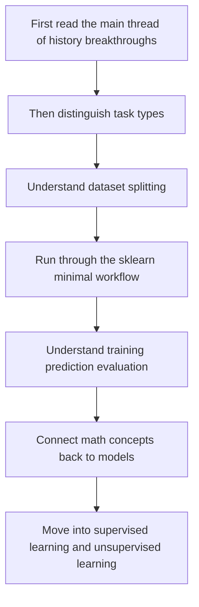
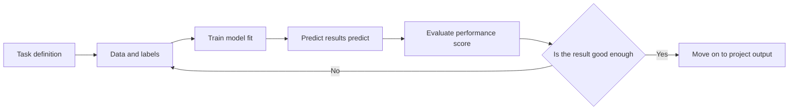

# Pre-study Guide: What Is This Chapter on Machine Learning Basics Really About?

This chapter is not about memorizing algorithm names. Instead, it helps you first build a “sense of the map” for machine learning projects. If you master this chapter well, the later topics—supervised learning, unsupervised learning, model evaluation, feature engineering, and project practice—will no longer feel like scattered concepts.

## Where This Chapter Fits in the Whole Course

You have already learned Python, data analysis, and the minimum foundation of AI math. From here, the course begins to move from “processing data” to “letting models learn patterns from data.”

The key change in this step is: in traditional programming, humans mainly write rules, while in machine learning, you prepare data, define the goal, choose a model, train the model, and then use evaluation results to judge whether the model has really learned the pattern.

The first half focuses on getting “data” and “math” ready: you first learn to read and process data, and then understand vectors, probability, and optimization—the concepts machine learning will use again and again.

## The Real Problems This Chapter Solves

This chapter first answers four basic questions: how machine learning differs from traditional programming; why you need to distinguish tasks such as classification, regression, and clustering; why training sets, validation sets, and test sets should not be mixed; and why `scikit-learn` can organize training, prediction, and evaluation into a unified workflow.

Beginners often turn machine learning into a “list of algorithms.” But what matters more is understanding this first: each algorithm serves a specific type of task, and the task, data, features, and evaluation method together determine whether the model is meaningful.

## Recommended Learning Order for Beginners

It is recommended to first read the “main thread of machine learning history breakthroughs” and place Bayes, linear models, decision trees, SVM, random forests, Boosting, and sklearn into one technical evolution line. Then read “What Is Machine Learning” to establish the axes of supervised learning, unsupervised learning, classification, regression, clustering, training sets, and test sets. Next, read the `Scikit-learn` introduction to understand the shortest modeling workflow of `fit / predict / score`. Finally, revisit “How Math Really Flows into Machine Learning” to connect the linear algebra, probability and statistics, and calculus from Station 4 into model training.

## The Main Thread You Should Focus on While Studying This Chapter

You can remember this chapter as a minimal closed loop: first identify the task, then prepare the data and labels, then choose a baseline model, use `fit` to train, use `predict` to make predictions, use `score` or other metrics to evaluate, and finally decide whether to improve features, switch models, or recheck the data based on the results.

## How This Chapter Relates to Later Chapters

This chapter is the entry point to Station 5. Later, supervised learning will expand classification and regression, unsupervised learning will expand clustering and dimensionality reduction, model evaluation will tell you whether the score is trustworthy, feature engineering will show you how to make data more suitable for models, and project practice will combine all of this into a complete modeling workflow.

If this chapter is not learned well, common problems later are: you have seen each algorithm, but you do not know when to use it; the code runs, but you do not know whether the result is trustworthy; the model score is very high, but you do not realize that data leakage or evaluation mistakes may have occurred.

If you want to first understand “why these algorithms appeared,” you can read [1.2 Main Thread of Machine Learning History Breakthroughs](./04-history-breakthroughs.md). It will map Bayes, MLE, EM, linear models, decision trees, SVM, random forests, Boosting, XGBoost, and sklearn to the corresponding learning chapters.

## How Beginners and Advanced Learners Should Read This

When beginners study this chapter for the first time, focus on the main thread and the minimal runnable example. You do not need to understand every detail at once. As long as you can explain what problem this chapter solves, what the inputs and outputs are, and how the minimal project runs, you can keep moving forward.

Experienced learners can use this chapter for gap filling and engineering practice: pay attention to boundary conditions, failure cases, evaluation methods, code reproducibility, and how it connects to the stages before and after. After reading, it is best to record the content of this chapter in your own project README or experiment notes.

## Suggested Study Time and Difficulty

| Study Method | Suggested Time | Goal |
|---|---|---|
| Quick overview | 20–30 minutes | Understand what problem this chapter solves and where it will be used later |
| Minimum pass | 1–2 hours | Run through a minimal example and complete the chapter’s small project exit task |
| Deep practice | Half a day to 1 day | Add error analysis, comparison experiments, or project README notes |

## Self-check Questions for This Chapter

| Self-check Question | Passing Standard |
|---|---|
| What problem does this chapter solve? | You can explain its position in the whole course in one sentence |
| What are the minimum input and output? | You can clearly say what input the example needs and what result it produces |
| Where are the common failure points? | You can list at least one reason for an error, poor performance, or misunderstanding |
| What can you preserve after learning? | You can write this chapter’s output into a project README, experiment notes, or portfolio |

## Small Project Exit Task for This Chapter

After finishing this chapter, it is recommended to do a minimal classification or regression exercise. You can use a built-in sklearn dataset and complete data loading, train-test splitting, model training, prediction, evaluation, and a brief conclusion. The project does not need to be complex, but it must clearly explain: whether it is classification or regression, what the input features are, what the target label is, what evaluation metric is used, and whether the model result can serve as a baseline.

## Passing Criteria

By the end of this chapter, you should be able to explain in your own words the difference between machine learning and traditional programming, distinguish classification, regression, and clustering, explain why training sets and test sets must be separated, understand what `fit / predict / score` means, and run through a minimal sklearn modeling workflow.

If you can also proactively ask, “Is this score trustworthy?”, “Is there data leakage?”, and “What is the baseline?”, that means you are no longer just learning APIs—you are building a machine learning project mindset.
