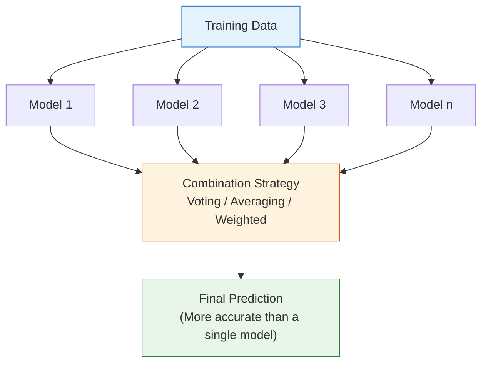
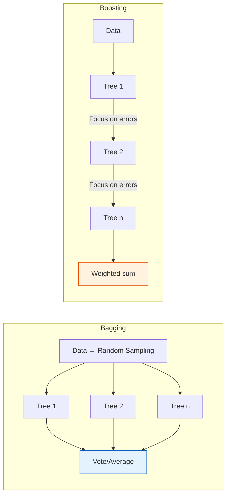
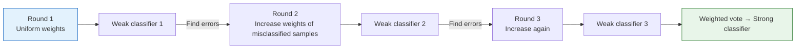
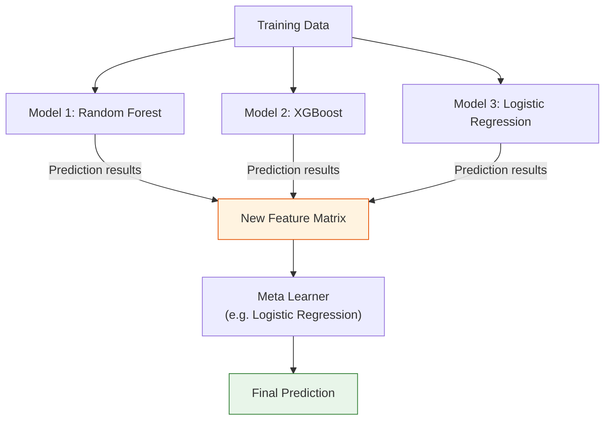
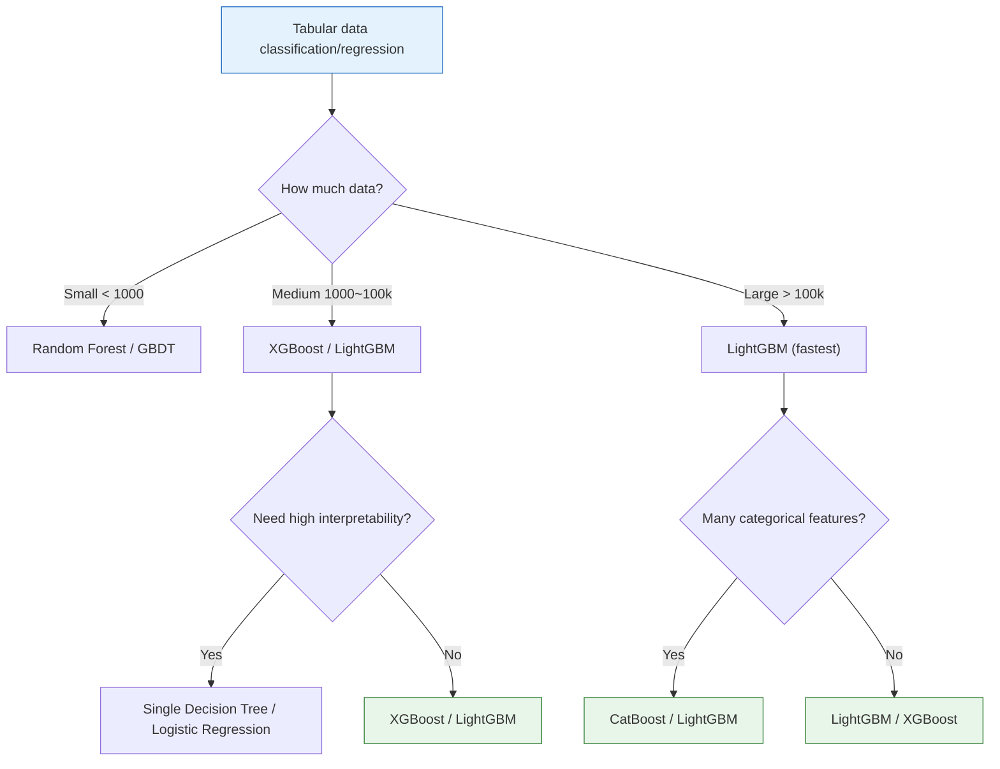

# Ensemble Learning


:::tip Section Overview
Ensemble learning is the **most commonly used** technique in ML competitions and industry. The core idea is simple: **many hands make light work**—combining multiple weak models can perform better than a single strong model. XGBoost and LightGBM are still the "default first choice" for tabular data.
:::

## Learning Objectives

- Understand the principles of Bagging and Random Forest
- Understand the principles of Boosting and AdaBoost
- Master GBDT and XGBoost
- Learn about LightGBM and CatBoost
- Learn the Stacking strategy

## First, let’s set a very important learning expectation

The part of this section that most easily creates pressure for beginners is not that the ideas are too hard, but that there are suddenly too many names:

- Random Forest
- AdaBoost
- GBDT
- XGBoost
- LightGBM
- CatBoost

What you should focus on first is not memorizing all of them, but distinguishing between:

> **In essence, ensemble learning mainly has two paths: Bagging, which votes in parallel, and Boosting, which corrects errors in sequence.**

Once these two paths are clear, the model names later on won’t feel like scattered facts.

---

## Let’s build a map first

What most easily confuses beginners about ensemble learning is not that there are too few concepts, but that there are too many names:

- Bagging
- Random Forest
- AdaBoost
- GBDT
- XGBoost
- LightGBM
- CatBoost

If you try to remember them by tool name from the start, it becomes very fragmented. A more stable learning order is:


As long as you first separate the two main lines—“parallel voting” and “sequential error correction”—the model names later on won’t get mixed up so easily.

---

## 1. The Core Idea of Ensemble Learning

### 1.1 Understand Ensemble Learning with a Diagram



### 1.2 Why does it work?

Every model makes mistakes, but **different models often make different mistakes**. Multiple models “vote” and can correct one another.

```python
import numpy as np

# Simulation: 3 independent models with 70% accuracy
np.random.seed(42)
n = 10000
true_labels = np.random.randint(0, 2, n)

# Each model predicts independently
accs = []
for _ in range(3):
    # 70% chance of being correct
    correct = np.random.random(n) < 0.7
    pred = np.where(correct, true_labels, 1 - true_labels)
    accs.append(pred)

accs = np.array(accs)

# Majority vote
ensemble_pred = (accs.sum(axis=0) >= 2).astype(int)

print(f"Model 1 accuracy: {np.mean(accs[0] == true_labels):.1%}")
print(f"Model 2 accuracy: {np.mean(accs[1] == true_labels):.1%}")
print(f"Model 3 accuracy: {np.mean(accs[2] == true_labels):.1%}")
print(f"Ensemble voting accuracy: {np.mean(ensemble_pred == true_labels):.1%}")
```

### 1.3 Two major schools

| | Bagging | Boosting |
|---|---------|---------|
| Idea | Train in parallel, then vote | Train sequentially, correct errors |
| Source of diversity | Random sampling of data and features | Focus on the errors from the previous round |
| What it reduces | Variance | Bias |
| Representative algorithms | Random Forest | AdaBoost, GBDT, XGBoost |
| Tendency to overfit | Less likely | More likely (needs early stopping) |



### 1.4 Don’t rush to memorize model names yet—first remember two things

What you should remember first in this section is not the library names, but these two sentences:

- **Bagging** is like “asking several people to make independent judgments, then voting”
- **Boosting** is like “a teacher correcting homework: whatever was wrong in the previous round gets special attention in the next round”

These two sentences can explain the family relationships of most later models.

### 1.5 A more beginner-friendly analogy

If you want to remember these two main paths more firmly, you can use this analogy directly:

- **Bagging** is like a meeting vote: find many people to judge independently, then combine the opinions
- **Boosting** is like teacher correction: wherever the previous round went wrong, the next round focuses on fixing that part

This is easier to build an overall sense of the method than diving into library names and parameters too early.


When reading this diagram, first distinguish the two ways of “getting stronger”: Random Forest reduces fluctuations by averaging many trees, while Boosting gradually improves expressiveness by having later rounds correct earlier mistakes. One is like group voting, the other like continuous correction. After that, when you see XGBoost, LightGBM, and CatBoost, you won’t just remember the names.

---

## 2. Bagging and Random Forest

### 2.1 The Principle of Bagging

**Bootstrap Aggregating = bootstrap sampling + aggregation**

1. Randomly sample multiple datasets from the training set **with replacement**
2. Train one decision tree on each sampled dataset
3. For classification: majority vote; for regression: average the outputs

```python
# Intuition for bootstrap sampling
np.random.seed(42)
data = np.arange(1, 11)  # Original data: [1, 2, ..., 10]

print("Original data:", data)
for i in range(3):
    sample = np.random.choice(data, size=len(data), replace=True)
    print(f"Bootstrap sample {i+1}: {sorted(sample)}")
    # Note: some values are repeated, and some are not selected
```

### 2.2 Random Forest

Random Forest = Bagging + **random feature selection**

At each split, the tree only chooses the best split from a **random subset of features**. This increases diversity among trees.

### 2.2.1 Why is Random Forest usually more stable than a single tree?

Because it does two things that a single tree cannot do:

- Randomly samples the data
- Randomly selects features as well

This makes each tree a little different.  
A single tree can easily become overly sensitive to certain samples or certain features, while Random Forest reduces that instability by “averaging many trees that are not exactly the same.”

```python
from sklearn.ensemble import RandomForestClassifier
from sklearn.datasets import make_moons
from sklearn.model_selection import train_test_split
import matplotlib.pyplot as plt
import numpy as np

# Generate data
X, y = make_moons(n_samples=500, noise=0.3, random_state=42)
X_train, X_test, y_train, y_test = train_test_split(X, y, test_size=0.2, random_state=42)

# Compare single tree vs Random Forest
from sklearn.tree import DecisionTreeClassifier

dt = DecisionTreeClassifier(random_state=42)
dt.fit(X_train, y_train)

rf = RandomForestClassifier(n_estimators=100, random_state=42)
rf.fit(X_train, y_train)

print(f"Single Decision Tree | Train: {dt.score(X_train, y_train):.1%} | Test: {dt.score(X_test, y_test):.1%}")
print(f"Random Forest        | Train: {rf.score(X_train, y_train):.1%} | Test: {rf.score(X_test, y_test):.1%}")

# Visualize decision boundary comparison
fig, axes = plt.subplots(1, 2, figsize=(12, 5))

for ax, model, name in zip(axes, [dt, rf], ['Single Decision Tree', 'Random Forest (100 trees)']):
    x_min, x_max = X[:, 0].min() - 0.5, X[:, 0].max() + 0.5
    y_min, y_max = X[:, 1].min() - 0.5, X[:, 1].max() + 0.5
    xx, yy = np.meshgrid(np.linspace(x_min, x_max, 200),
                          np.linspace(y_min, y_max, 200))
    Z = model.predict(np.c_[xx.ravel(), yy.ravel()]).reshape(xx.shape)
    ax.contourf(xx, yy, Z, alpha=0.3, cmap='coolwarm')
    ax.scatter(X_test[:, 0], X_test[:, 1], c=y_test, cmap='coolwarm', s=20, edgecolors='w', linewidth=0.5)
    test_acc = model.score(X_test, y_test)
    ax.set_title(f'{name}\nTest accuracy: {test_acc:.1%}')
    ax.grid(True, alpha=0.3)

plt.tight_layout()
plt.show()
```

### 2.3 Key hyperparameters of Random Forest

| Parameter | Description | Recommendation |
|------|------|------|
| `n_estimators` | Number of trees | 100~500 |
| `max_depth` | Maximum depth of each tree | None or 10~20 |
| `max_features` | Number of features considered at each split | 'sqrt' (classification), 'log2' |
| `min_samples_split` | Minimum samples required to split a node | 2~10 |
| `min_samples_leaf` | Minimum samples required at a leaf node | 1~5 |

### 2.4 What is the more stable order for tuning Random Forest for the first time?

It is recommended to follow this order:

1. First increase `n_estimators` to a sufficiently large value, such as `100~300`
2. Then look at `max_depth`
3. Then look at `min_samples_leaf`
4. Finally, fine-tune `max_features`

The reason is:

- Too few trees cause large fluctuations, which makes it hard to judge performance
- `max_depth` and `min_samples_leaf` directly affect whether the model overfits
- `max_features` is more for fine-tuning

### 2.5 What is the most important thing to remember when using Random Forest for the first time?

The most important thing to remember is not:

- that it is more advanced than a single tree

But rather:

- that it is essentially using “many trees that are not exactly the same” to reduce variance

So the biggest default value of Random Forest is usually:

- More stable
- Less likely to overfit to the extent a single tree does
- A strong baseline for tabular data

```python
# Number of trees vs accuracy
n_trees = [1, 5, 10, 30, 50, 100, 200, 500]
train_scores = []
test_scores = []

for n in n_trees:
    rf = RandomForestClassifier(n_estimators=n, random_state=42)
    rf.fit(X_train, y_train)
    train_scores.append(rf.score(X_train, y_train))
    test_scores.append(rf.score(X_test, y_test))

plt.figure(figsize=(8, 5))
plt.plot(n_trees, train_scores, 'bo-', label='Training set')
plt.plot(n_trees, test_scores, 'ro-', label='Test set')
plt.xlabel('Number of trees (n_estimators)')
plt.ylabel('Accuracy')
plt.title('Effect of the number of trees on Random Forest performance')
plt.legend()
plt.grid(True, alpha=0.3)
plt.show()
```

---

## 3. Boosting Methods

### 3.1 AdaBoost

**Idea**: Each round focuses on the **samples misclassified in the previous round**, giving them higher weights.



```python
from sklearn.ensemble import AdaBoostClassifier
from sklearn.tree import DecisionTreeClassifier

# AdaBoost uses a shallow decision tree by default (decision stump)
ada = AdaBoostClassifier(
    estimator=DecisionTreeClassifier(max_depth=1),
    n_estimators=50,
    learning_rate=1.0,
    random_state=42
)
ada.fit(X_train, y_train)
print(f"AdaBoost | Train: {ada.score(X_train, y_train):.1%} | Test: {ada.score(X_test, y_test):.1%}")
```

### 3.2 GBDT (Gradient Boosting Decision Tree)

**Idea**: Each new tree fits not the original labels, but the **residuals** (prediction errors) of all previous trees.

> **Fm(x) = Fm-1(x) + η × hm(x)**

Here, `hm(x)` is the residual fitted by the m-th tree, and `η` is the learning rate.

### 3.2.1 The most important intuition to remember about GBDT

If you want to explain GBDT in just one sentence, remember this:

> **Where the previous round did not fit well, the next round focuses on fixing it.**

This is very different from Random Forest.  
Random Forest is “everyone judges independently and then averages,” while GBDT is “fixing the holes round by round.”

```python
from sklearn.ensemble import GradientBoostingClassifier

gbdt = GradientBoostingClassifier(
    n_estimators=100,
    learning_rate=0.1,
    max_depth=3,
    random_state=42
)
gbdt.fit(X_train, y_train)
print(f"GBDT | Train: {gbdt.score(X_train, y_train):.1%} | Test: {gbdt.score(X_test, y_test):.1%}")
```

### 3.3 GBDT Regression — intuitive understanding

```python
from sklearn.ensemble import GradientBoostingRegressor
from sklearn.tree import DecisionTreeRegressor

# Use a regression problem to intuitively understand "fitting residuals"
np.random.seed(42)
X_demo = np.linspace(0, 10, 100).reshape(-1, 1)
y_demo = np.sin(X_demo.ravel()) + np.random.randn(100) * 0.2

fig, axes = plt.subplots(2, 3, figsize=(15, 9))

# Manually simulate the GBDT process
current_pred = np.zeros(len(y_demo))
learning_rate = 0.5

for i in range(6):
    ax = axes[i // 3][i % 3]

    # Compute residuals
    residual = y_demo - current_pred

    # Fit a decision tree to the residuals
    tree = DecisionTreeRegressor(max_depth=2, random_state=42)
    tree.fit(X_demo, residual)
    tree_pred = tree.predict(X_demo)

    # Update predictions
    current_pred += learning_rate * tree_pred

    ax.scatter(X_demo, y_demo, s=10, alpha=0.5, color='steelblue')
    ax.plot(X_demo, current_pred, 'r-', linewidth=2, label=f'Current prediction')
    ax.set_title(f'After tree {i+1}\nMSE={np.mean((y_demo - current_pred)**2):.4f}')
    ax.legend(fontsize=8)
    ax.grid(True, alpha=0.3)

plt.suptitle('GBDT Step-by-Step Residual Fitting', fontsize=13)
plt.tight_layout()
plt.show()
```

---

## 4. XGBoost

### 4.1 Improvements in XGBoost

XGBoost (eXtreme Gradient Boosting) is the **engineering-optimized version** of GBDT:

| Feature | GBDT | XGBoost |
|------|------|---------|
| Regularization | None | L1 + L2 regularization (reduces overfitting) |
| Missing values | Requires preprocessing | Handled automatically |
| Parallelism | Sequential | Feature-level parallelism (10x faster) |
| Column sampling | None | Supported (similar to Random Forest) |
| Early stopping | None | Supports `early_stopping_rounds` |

### 4.2 Installation and usage

```bash
pip install xgboost
```

```python
import xgboost as xgb
from sklearn.datasets import load_wine
from sklearn.model_selection import train_test_split
from sklearn.metrics import accuracy_score

# Load data
wine = load_wine()
X, y = wine.data, wine.target
X_train, X_test, y_train, y_test = train_test_split(X, y, test_size=0.2, random_state=42)

# Train XGBoost
xgb_model = xgb.XGBClassifier(
    n_estimators=100,
    max_depth=4,
    learning_rate=0.1,
    random_state=42,
    use_label_encoder=False,
    eval_metric='mlogloss',
)
xgb_model.fit(X_train, y_train)

print(f"XGBoost | Train: {xgb_model.score(X_train, y_train):.1%} | Test: {xgb_model.score(X_test, y_test):.1%}")
```

### 4.3 Key hyperparameters of XGBoost

| Parameter | Description | Recommended range |
|------|------|---------|
| `n_estimators` | Number of trees | 100~1000 |
| `max_depth` | Maximum tree depth | 3~8 |
| `learning_rate` | Learning rate (shrinkage) | 0.01~0.3 |
| `subsample` | Fraction of samples used by each tree | 0.6~1.0 |
| `colsample_bytree` | Fraction of features used by each tree | 0.6~1.0 |
| `reg_alpha` | L1 regularization coefficient | 0~1 |
| `reg_lambda` | L2 regularization coefficient | 1~5 |

### 4.3.1 When tuning XGBoost for the first time, which parameters should you change first?

Don’t turn on a dozen parameters all at once. A more stable order is:

1. Set `learning_rate` first
2. Then pair it with `n_estimators`
3. Then look at `max_depth`
4. Finally look at `subsample`, `colsample_bytree`, and the regularization terms

A very practical rule of thumb is:

- A smaller learning rate with more trees is usually more stable than taking big steps
- If the depth is too large, Boosting methods can easily start memorizing the training set

### 4.4 Early Stopping

```python
# Early stopping: stop if validation performance does not improve for N consecutive rounds
xgb_model = xgb.XGBClassifier(
    n_estimators=1000,   # Set a very large number
    max_depth=4,
    learning_rate=0.1,
    random_state=42,
    eval_metric='mlogloss',
    early_stopping_rounds=20,  # Stop if there is no improvement for 20 rounds
)

xgb_model.fit(
    X_train, y_train,
    eval_set=[(X_test, y_test)],
    verbose=False
)

print(f"Best iteration: {xgb_model.best_iteration}")
print(f"Test accuracy: {xgb_model.score(X_test, y_test):.1%}")
```

### 4.5 Feature importance

```python
# Feature importance in XGBoost
importance = xgb_model.feature_importances_
sorted_idx = np.argsort(importance)

plt.figure(figsize=(8, 6))
plt.barh(range(len(sorted_idx)), importance[sorted_idx], color='coral')
plt.yticks(range(len(sorted_idx)), np.array(wine.feature_names)[sorted_idx])
plt.xlabel('Feature importance')
plt.title('XGBoost Feature Importance (Wine Dataset)')
plt.grid(axis='x', alpha=0.3)
plt.tight_layout()
plt.show()
```

---

## 5. LightGBM and CatBoost

### 5.1 LightGBM

LightGBM is an efficient gradient boosting framework developed by Microsoft, and it is **faster** than XGBoost:

| Feature | Description |
|------|------|
| **Leaf-wise growth** | Grows by leaves instead of by levels, making it more efficient |
| **Histogram optimization** | Bins feature values to speed up split point search |
| **Native support for categorical features** | No manual One-Hot encoding required |
| **Very fast training** | Several times faster than XGBoost on large datasets |

```bash
pip install lightgbm
```

```python
import lightgbm as lgb

lgb_model = lgb.LGBMClassifier(
    n_estimators=100,
    max_depth=4,
    learning_rate=0.1,
    random_state=42,
    verbose=-1,
)
lgb_model.fit(X_train, y_train)
print(f"LightGBM | Train: {lgb_model.score(X_train, y_train):.1%} | Test: {lgb_model.score(X_test, y_test):.1%}")
```

### 5.2 CatBoost

CatBoost (Categorical Boosting) is a framework developed by Yandex, and it is especially good at handling **categorical features**:

| Feature | Description |
|------|------|
| **Categorical feature handling** | Automatically handled, no encoding needed |
| **Ordered Boosting** | Reduces prediction shift |
| **Strong default parameters** | Usually works well out of the box |

```bash
pip install catboost
```

```python
from catboost import CatBoostClassifier

cat_model = CatBoostClassifier(
    iterations=100,
    depth=4,
    learning_rate=0.1,
    random_seed=42,
    verbose=0,
)
cat_model.fit(X_train, y_train)
print(f"CatBoost | Train: {cat_model.score(X_train, y_train):.1%} | Test: {cat_model.score(X_test, y_test):.1%}")
```

### 5.3 Comparison of the three major Boosting frameworks

| | XGBoost | LightGBM | CatBoost |
|---|---------|----------|----------|
| Developer | Tianqi Chen | Microsoft | Yandex |
| Growth strategy | Level-wise | Leaf-wise | Symmetric tree |
| Speed | Medium | Fastest | Medium |
| Categorical features | Need encoding | Native support | Best support |
| Default performance | Good | Good | Usually best |
| Kaggle usage | Very common | Very common | Fairly common |

### 5.4 When you do your first tabular-data project, which model is the safest choice?

If this is your first structured tabular-data task, you can choose like this:

- Want stability, simple interpretation, and fast training: try Random Forest first
- Want a higher upper bound: then try XGBoost / LightGBM
- Have lots of categorical features: prioritize CatBoost

This order is more stable than “pick whatever is hottest first,” because it helps you build a baseline first and then improve the ceiling step by step.

### 5.5 The safest reading order when learning ensemble methods for the first time

If this is your first time studying this section, it is recommended to understand it in this order:

1. First think through the strengths and weaknesses of a single tree
2. Then separate Bagging from Boosting
3. First view Random Forest as a “more stable tree”
4. Then view GBDT / XGBoost as “trees that correct errors round by round”
5. Finally look at engineering-optimized versions like LightGBM / CatBoost

This way, you won’t turn this section into a flat list of many model names.

---

## 6. Stacking — Model Stacking

### 6.1 Principle

Use the prediction results of multiple different models as **new features**, and then train another model to make the final prediction.



### 6.2 sklearn implementation

```python
from sklearn.ensemble import StackingClassifier, RandomForestClassifier, GradientBoostingClassifier
from sklearn.linear_model import LogisticRegression
from sklearn.svm import SVC

# Base models
estimators = [
    ('rf', RandomForestClassifier(n_estimators=50, random_state=42)),
    ('gbdt', GradientBoostingClassifier(n_estimators=50, random_state=42)),
    ('svm', SVC(probability=True, random_state=42)),
]

# Stacking
stack = StackingClassifier(
    estimators=estimators,
    final_estimator=LogisticRegression(max_iter=1000),
    cv=5  # Use 5-fold cross-validation to generate meta-features
)

stack.fit(X_train, y_train)
print(f"Stacking | Train: {stack.score(X_train, y_train):.1%} | Test: {stack.score(X_test, y_test):.1%}")
```

### 6.3 Why isn’t Stacking the first step for beginners?

Because although Stacking can be stronger, it has higher requirements for experimental design:

- It is easier to cause data leakage
- It depends more on cross-validation
- It is harder to explain why the final result works

So a safer learning path is usually:

- First learn a single-model baseline
- Then learn Random Forest and Boosting
- Only then try Stacking

---

## 7. Comprehensive Comparison in Practice

```python
from sklearn.ensemble import (
    RandomForestClassifier, AdaBoostClassifier,
    GradientBoostingClassifier, StackingClassifier
)
from sklearn.tree import DecisionTreeClassifier
from sklearn.linear_model import LogisticRegression
from sklearn.datasets import load_wine
from sklearn.model_selection import train_test_split, cross_val_score
import numpy as np
import matplotlib.pyplot as plt

# Data
wine = load_wine()
X, y = wine.data, wine.target
X_train, X_test, y_train, y_test = train_test_split(X, y, test_size=0.2, random_state=42)

# All models
models = {
    "Decision Tree": DecisionTreeClassifier(max_depth=5, random_state=42),
    "Random Forest": RandomForestClassifier(n_estimators=100, random_state=42),
    "AdaBoost": AdaBoostClassifier(n_estimators=100, random_state=42),
    "GBDT": GradientBoostingClassifier(n_estimators=100, random_state=42),
}

# Try importing XGBoost and LightGBM
try:
    import xgboost as xgb
    models["XGBoost"] = xgb.XGBClassifier(n_estimators=100, random_state=42,
                                            eval_metric='mlogloss')
except ImportError:
    pass

try:
    import lightgbm as lgb
    models["LightGBM"] = lgb.LGBMClassifier(n_estimators=100, random_state=42, verbose=-1)
except ImportError:
    pass

# Cross-validation evaluation
results = {}
for name, model in models.items():
    cv_scores = cross_val_score(model, X_train, y_train, cv=5, scoring='accuracy')
    model.fit(X_train, y_train)
    test_score = model.score(X_test, y_test)
    results[name] = {
        'cv_mean': cv_scores.mean(),
        'cv_std': cv_scores.std(),
        'test': test_score
    }
    print(f"{name:12s} | CV: {cv_scores.mean():.1%} ± {cv_scores.std():.1%} | Test: {test_score:.1%}")

# Visualization
fig, ax = plt.subplots(figsize=(10, 5))
names = list(results.keys())
cv_means = [v['cv_mean'] for v in results.values()]
cv_stds = [v['cv_std'] for v in results.values()]
test_scores = [v['test'] for v in results.values()]

x = np.arange(len(names))
width = 0.35
bars1 = ax.bar(x - width/2, cv_means, width, yerr=cv_stds, label='CV Mean', color='steelblue', capsize=3)
bars2 = ax.bar(x + width/2, test_scores, width, label='Test Set', color='coral')

ax.set_xticks(x)
ax.set_xticklabels(names, rotation=20, ha='right')
ax.set_ylabel('Accuracy')
ax.set_title('Comparison of Ensemble Learning Methods (Wine Dataset)')
ax.set_ylim(0.8, 1.05)
ax.legend()
ax.grid(axis='y', alpha=0.3)

plt.tight_layout()
plt.show()
```

---

## 8. How to choose an algorithm?



:::tip Practical Advice
1. **First choice**: Start with LightGBM or XGBoost to get a baseline
2. **Tuning order**: `n_estimators` → `learning_rate` → `max_depth` → regularization parameters
3. **Early stopping**: Be sure to use `early_stopping_rounds`
4. **Competition boosting**: Stack multiple models
:::

---

## 10. The Safest Default Order for Bringing Ensemble Learning into a Project for the First Time

When you introduce ensemble learning into a project for the first time, you can follow this order:

1. First build a linear model or single-tree baseline
2. If the single tree is too unstable, try Random Forest first
3. If you already have a clear evaluation framework, then try GBDT / XGBoost
4. Finally, consider finer parameter optimization and model blending

This is closer to how real projects are progressed, and it is less likely to trap you in complicated tuning right away.

:::info Connect to the next chapters
- **Chapter 3**: Unsupervised Learning — clustering, dimensionality reduction, anomaly detection
- **Chapter 4**: Model Evaluation — cross-validation, bias-variance tradeoff, hyperparameter tuning
:::

---

## Summary

| Method | Idea | Representative | Characteristics |
|------|------|------|------|
| **Bagging** | Parallel + voting | Random Forest | Reduces variance, less prone to overfitting |
| **Boosting** | Sequential + error correction | XGBoost, LightGBM | Reduces bias, usually performs best |
| **Stacking** | Model stacking | Various combinations | Fully leverages the strengths of different models |

## What should you take away from this section?

If you only take away one sentence, I hope you remember this:

> **The essence of ensemble learning is not “more models,” but combining many imperfect trees into a more stable or stronger system in different ways.**

So the real key takeaways should be:

- Distinguish Bagging from Boosting
- Know why Random Forest is stable
- Know why GBDT / XGBoost are powerful
- Know how to choose a path when starting a tabular-data project for the first time

## Hands-on Exercises

### Exercise 1: Random Forest Tuning

Use the `make_moons` dataset, try different `n_estimators` values (10, 50, 100, 200, 500) and `max_depth` values (3, 5, 10, None), and find the best combination. Plot a heatmap.

### Exercise 2: XGBoost Early Stopping

Train XGBoost on the Wine dataset, set `n_estimators=1000`, `early_stopping_rounds=10`, and observe the best iteration. Try different `learning_rate` values to see how the best iteration changes.

### Exercise 3: Full Comparison

Use the Iris dataset to compare all algorithms introduced in this section (Decision Tree, Random Forest, AdaBoost, GBDT, XGBoost, LightGBM). Evaluate with 5-fold cross-validation and plot a comparison bar chart.

### Exercise 4: Stacking Experiment

Create a Stacking model, use Random Forest + XGBoost + KNN as the base models, and Logistic Regression as the meta learner. Compare the results against each base model used alone.
