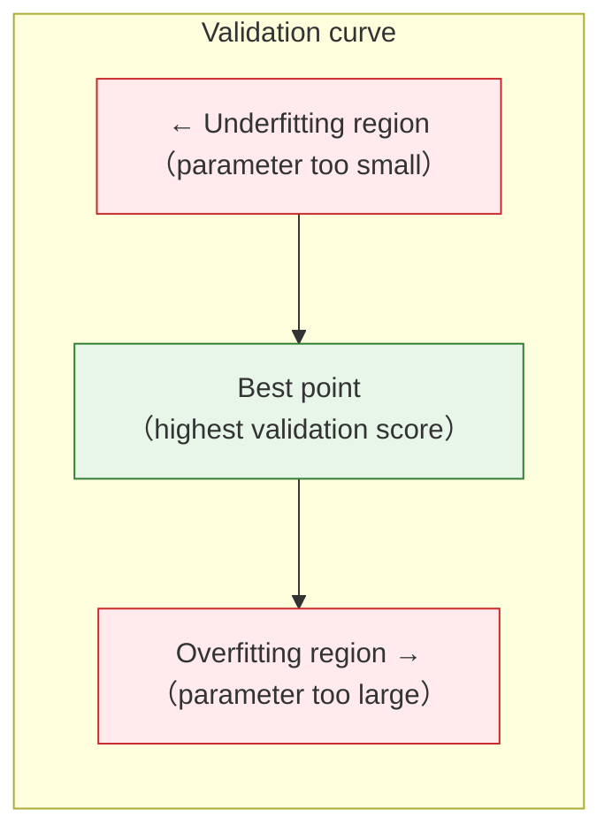
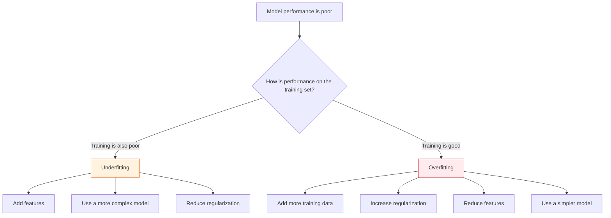

# Bias-Variance Tradeoff


:::tip Section overview
**Bias-Variance Tradeoff** is one of the most important theoretical frameworks in machine learning. It explains why models underfit or overfit, and how to find the best balance between the two.
:::

## Learning objectives

- Deeply understand bias and variance
- Understand the essence of underfitting and overfitting
- Master learning curve analysis
- Master validation curve analysis
- Understand how regularization affects bias and variance

## First, set a very important learning expectation

This section is one of the places in Station 5 where beginners most easily think, “I understand the concepts, but I don’t know how to judge them when solving problems.”  
That’s because bias, variance, underfitting, and overfitting sound theoretical, but their real value is actually very practical:

> **They help you decide what to change next when a model is not performing well.**

So on your first pass, the most valuable thing is not memorizing the error decomposition, but building this kind of judgment:

- Is the model too simple, or too sensitive?
- Should I increase complexity, add data, or add regularization?

---

## First, build a map

For beginners, the best way to understand bias-variance is not to start with term definitions, but to first see its role in machine learning decisions:


So what this section is really trying to solve is:

- Why you should not make random changes when model performance is poor
- How to base “what to do next” on evidence

## 1. What are bias and variance?

### 1.1 Intuition — a target-shooting analogy

```mermaid
flowchart LR
    subgraph Low bias, low variance
        A["🎯 Hits the bullseye every time<br/>（ideal model）"]
    end
    subgraph Low bias, high variance
        B["🎯 On average around the bullseye<br/>but spread out a lot<br/>（overfitting）"]
    end
    subgraph High bias, low variance
        C["🎯 Always misses the bullseye<br/>but stays clustered<br/>（underfitting）"]
    end
    subgraph High bias, high variance
        D["🎯 Off target and scattered<br/>（worst）"]
    end
```

| | Bias | Variance |
|---|------|----------|
| Meaning | Systematic deviation between the model’s predictions and the true values | How sensitive the model is to different training data |
| High → | Underfitting (model is too simple) | Overfitting (model is too complex) |
| Solution | Increase model complexity | Reduce model complexity, increase data |

### 1.1.1 A more beginner-friendly way to think about it

If you do not want to get stuck in terminology right away, you can remember it like this:

- **High bias**: the model is too rigid and cannot learn well no matter how much you train it
- **High variance**: the model is too sensitive; change the data a little and it changes a lot

These two sentences are not fully rigorous, but they are very useful for building intuition on the first pass.

### 1.2 Total error decomposition

> **Total error = bias² + variance + irreducible error (noise)**

### 1.3 Don’t rush to memorize the formula; first remember one sentence

For beginners, a more practical way to remember it is usually:

- **High bias**: the model is too “dumb” and cannot learn well
- **High variance**: the model is too “sensitive” and changes a lot when the data changes

As long as you first remember this, learning curves and validation curves will be much easier to understand later.

```python
import numpy as np
import matplotlib.pyplot as plt

# Visualize the bias-variance tradeoff
complexity = np.linspace(0.1, 10, 100)
bias_sq = 5 / complexity
variance = 0.5 * complexity
noise = 0.5 * np.ones_like(complexity)
total = bias_sq + variance + noise

plt.figure(figsize=(8, 5))
plt.plot(complexity, bias_sq, 'b-', linewidth=2, label='Bias²')
plt.plot(complexity, variance, 'r-', linewidth=2, label='Variance')
plt.plot(complexity, noise, 'g--', linewidth=1, label='Noise (irreducible)')
plt.plot(complexity, total, 'k-', linewidth=2, label='Total error')

best_idx = np.argmin(total)
plt.axvline(x=complexity[best_idx], color='orange', linestyle=':', label='Optimal complexity')

plt.xlabel('Model complexity')
plt.ylabel('Error')
plt.title('Bias-Variance Tradeoff')
plt.legend()
plt.grid(True, alpha=0.3)
plt.show()
```

---

## 2. Observing bias and variance in practice

### 2.1 Demonstration with polynomial regression

```python
from sklearn.preprocessing import PolynomialFeatures
from sklearn.linear_model import LinearRegression
from sklearn.pipeline import make_pipeline

# Generate nonlinear data
np.random.seed(42)
n = 30
X = np.sort(np.random.uniform(-3, 3, n))
y_true_func = lambda x: np.sin(x)
y = y_true_func(X) + np.random.randn(n) * 0.3

x_plot = np.linspace(-3.5, 3.5, 200)

fig, axes = plt.subplots(1, 3, figsize=(15, 4))
configs = [
    (1, 'Underfitting (degree=1)\nHigh bias, low variance'),
    (4, 'Just right (degree=4)\nBalanced bias and variance'),
    (15, 'Overfitting (degree=15)\nLow bias, high variance'),
]

for ax, (deg, title) in zip(axes, configs):
    # Train multiple times on different data subsets to observe variance
    for seed in range(10):
        np.random.seed(seed)
        X_sample = np.sort(np.random.uniform(-3, 3, n))
        y_sample = y_true_func(X_sample) + np.random.randn(n) * 0.3

        model = make_pipeline(PolynomialFeatures(deg, include_bias=False), LinearRegression())
        model.fit(X_sample.reshape(-1, 1), y_sample)
        y_pred = model.predict(x_plot.reshape(-1, 1))
        y_pred = np.clip(y_pred, -3, 3)
        ax.plot(x_plot, y_pred, alpha=0.3, color='steelblue')

    ax.plot(x_plot, y_true_func(x_plot), 'r--', linewidth=2, label='True function')
    ax.scatter(X, y, color='black', s=20, zorder=5)
    ax.set_title(title)
    ax.set_ylim(-3, 3)
    ax.legend(fontsize=8)
    ax.grid(True, alpha=0.3)

plt.suptitle('Bias-Variance intuition (10 trainings on different datasets)', fontsize=13)
plt.tight_layout()
plt.show()
```

:::note Key observations
- **degree=1**: the 10 lines almost overlap (low variance), but all deviate from the true function (high bias)
- **degree=15**: the 10 lines differ a lot (high variance), but on average are closer to the true function (low bias)
- **degree=4**: the 10 lines are relatively consistent (moderate variance) and close to the true function (moderate bias)
:::

---

## 3. Learning curves

### 3.1 What is a learning curve?

A learning curve shows how **training set size** affects model performance. It can tell you:
- Whether the model is underfitting or overfitting
- Whether adding more data will help


When reading a learning curve, first look at the gap between the two lines. If both training and validation scores are low, usually start by checking underfitting; if training is high, validation is low, and the two lines are far apart, usually start by checking overfitting; if validation keeps improving as more data is added, then more data may really help.

```python
from sklearn.model_selection import learning_curve
from sklearn.tree import DecisionTreeClassifier
from sklearn.datasets import load_digits

digits = load_digits()
X, y = digits.data, digits.target

def plot_learning_curve(model, X, y, title, ax):
    train_sizes, train_scores, val_scores = learning_curve(
        model, X, y, cv=5,
        train_sizes=np.linspace(0.1, 1.0, 10),
        scoring='accuracy', n_jobs=-1
    )

    train_mean = train_scores.mean(axis=1)
    train_std = train_scores.std(axis=1)
    val_mean = val_scores.mean(axis=1)
    val_std = val_scores.std(axis=1)

    ax.fill_between(train_sizes, train_mean - train_std, train_mean + train_std, alpha=0.1, color='blue')
    ax.fill_between(train_sizes, val_mean - val_std, val_mean + val_std, alpha=0.1, color='red')
    ax.plot(train_sizes, train_mean, 'bo-', label='Training set')
    ax.plot(train_sizes, val_mean, 'ro-', label='Validation set')
    ax.set_xlabel('Number of training samples')
    ax.set_ylabel('Accuracy')
    ax.set_title(title)
    ax.legend()
    ax.grid(True, alpha=0.3)

fig, axes = plt.subplots(1, 3, figsize=(18, 5))

# Underfitting model
plot_learning_curve(
    DecisionTreeClassifier(max_depth=1, random_state=42),
    X, y, 'Underfitting (max_depth=1)\nLow training and validation scores', axes[0]
)

# Just-right model
plot_learning_curve(
    DecisionTreeClassifier(max_depth=10, random_state=42),
    X, y, 'Moderate complexity (max_depth=10)', axes[1]
)

# Overfitting model
plot_learning_curve(
    DecisionTreeClassifier(max_depth=None, random_state=42),
    X, y, 'Overfitting (max_depth=None)\nLarge gap between training and validation', axes[2]
)

plt.tight_layout()
plt.show()
```

### 3.2 How to interpret learning curves

| Phenomenon | Diagnosis | Solution |
|------|------|---------|
| Both training and validation are low | **Underfitting** | Increase model complexity |
| Training is high, validation is low | **Overfitting** | More data / regularization / simpler model |
| The two lines converge and are both high | **Just right** | The model is good |
| Validation is still rising | More data needed | Collect more data |

### 3.3 Why are learning curves so important in Andrew Ng’s course style?

Because they are especially good at answering:

- Is it worth adding more data?
- Is the model underfitting or overfitting right now?

Many people skip this step and go straight to changing models.  
But learning curves are exactly the core evidence for “diagnose first, then decide the next step.”

---

## 4. Validation curves

### 4.1 What is a validation curve?

A validation curve shows how **one hyperparameter** affects model performance and helps you find the best value.

```python
from sklearn.model_selection import validation_curve

# Effect of max_depth on a decision tree
param_range = range(1, 25)
train_scores, val_scores = validation_curve(
    DecisionTreeClassifier(random_state=42), X, y,
    param_name='max_depth', param_range=param_range,
    cv=5, scoring='accuracy', n_jobs=-1
)

train_mean = train_scores.mean(axis=1)
train_std = train_scores.std(axis=1)
val_mean = val_scores.mean(axis=1)
val_std = val_scores.std(axis=1)

plt.figure(figsize=(8, 5))
plt.fill_between(param_range, train_mean - train_std, train_mean + train_std, alpha=0.1, color='blue')
plt.fill_between(param_range, val_mean - val_std, val_mean + val_std, alpha=0.1, color='red')
plt.plot(param_range, train_mean, 'bo-', label='Training set')
plt.plot(param_range, val_mean, 'ro-', label='Validation set')
plt.xlabel('max_depth')
plt.ylabel('Accuracy')
plt.title('Validation curve: effect of max_depth')
plt.legend()
plt.grid(True, alpha=0.3)

best_depth = param_range[np.argmax(val_mean)]
plt.axvline(x=best_depth, color='green', linestyle='--', label=f'Best depth = {best_depth}')
plt.legend()
plt.show()
```

### 4.2 How to interpret validation curves



---

## 5. How regularization affects bias and variance

```python
from sklearn.linear_model import Ridge
from sklearn.preprocessing import PolynomialFeatures, StandardScaler
from sklearn.pipeline import make_pipeline
from sklearn.model_selection import cross_val_score

# Nonlinear data
np.random.seed(42)
X_nl = np.sort(np.random.uniform(-3, 3, 100)).reshape(-1, 1)
y_nl = np.sin(X_nl.ravel()) + np.random.randn(100) * 0.3

# High-degree polynomial + different regularization strengths
alphas = [0.0001, 0.001, 0.01, 0.1, 1, 10, 100]
train_scores = []
cv_scores = []

for alpha in alphas:
    model = make_pipeline(
        StandardScaler(),
        PolynomialFeatures(degree=10, include_bias=False),
        Ridge(alpha=alpha)
    )
    model.fit(X_nl, y_nl)
    train_scores.append(model.score(X_nl, y_nl))

    cv = cross_val_score(model, X_nl, y_nl, cv=5)
    cv_scores.append(cv.mean())

fig, axes = plt.subplots(1, 2, figsize=(14, 5))

# alpha vs score
axes[0].plot(alphas, train_scores, 'bo-', label='Training set')
axes[0].plot(alphas, cv_scores, 'ro-', label='CV validation set')
axes[0].set_xscale('log')
axes[0].set_xlabel('Regularization strength α')
axes[0].set_ylabel('R² score')
axes[0].set_title('Regularization strength vs model performance')
axes[0].legend()
axes[0].grid(True, alpha=0.3)

# Fit curve comparison
x_plot = np.linspace(-3.5, 3.5, 200).reshape(-1, 1)
for alpha, color, ls in [(0.0001, 'blue', '--'), (0.1, 'green', '-'), (100, 'orange', ':')]:
    model = make_pipeline(
        StandardScaler(),
        PolynomialFeatures(degree=10, include_bias=False),
        Ridge(alpha=alpha)
    )
    model.fit(X_nl, y_nl)
    y_pred = model.predict(x_plot)
    axes[1].plot(x_plot, np.clip(y_pred, -3, 3), color=color, linestyle=ls,
                  linewidth=2, label=f'α={alpha}')

axes[1].scatter(X_nl, y_nl, s=15, alpha=0.5, color='gray')
axes[1].plot(x_plot, np.sin(x_plot), 'r--', linewidth=1, label='True function')
axes[1].set_title('Fit quality under different regularization strengths')
axes[1].set_ylim(-3, 3)
axes[1].legend()
axes[1].grid(True, alpha=0.3)

plt.tight_layout()
plt.show()
```

| α value | Bias | Variance | Status |
|------|------|------|------|
| Very small (0.0001) | Low | High | Overfitting |
| Moderate (0.1) | Moderate | Moderate | Just right |
| Very large (100) | High | Low | Underfitting |

---

## 6. Practical diagnosis flow



### 6.1 What is the most important part of this diagram?

It teaches you:

> When model performance is poor, do not randomly change methods first. First determine whether it is a bias problem or a variance problem.

This is one of the most important engineering mindsets in the second half of Station 5.

### 6.2 The safest default order when diagnosing for the first time

If this is your first time facing “poor model performance,” you can judge it in this order:

1. First check whether the training score is high
2. Then check how large the gap is between validation / cross-validation scores
3. If both training and validation are poor, suspect underfitting first
4. If training is good but validation is poor, suspect overfitting first
5. Finally decide whether to increase complexity, add data, or add regularization

This is much more stable than “try every method,” because you are diagnosing first and prescribing second.

---

## If this still feels abstract after studying it, what should you focus on first?

If this section still feels a bit abstract, the most important thing is not every term, but these three sentences:

1. If both training and validation are poor, first suspect underfitting
2. If training is very good but validation is very poor, first suspect overfitting
3. Diagnosis comes before tuning; evidence comes before trying things

Once these three ideas start to stick, this section has truly helped you.

---

## Summary

| Key point | Explanation |
|------|------|
| Bias | Systematic error caused by a model being too simple |
| Variance | Sensitivity to data changes caused by a model being too complex |
| Tradeoff | Reducing bias usually increases variance, and vice versa |
| Learning curve | Training set size vs performance, used to diagnose underfitting/overfitting |
| Validation curve | Hyperparameter vs performance, used to find the best value |
| Regularization | Larger α → higher bias, lower variance |

:::info Next up
- **Next section**: Hyperparameter tuning — systematically searching for the best parameters
:::

## What you should take away from this section

- Bias-variance is not theoretical decoration; it is a framework for deciding what to do next
- Learning curves and validation curves are tools for turning intuition into evidence
- If you can diagnose underfitting and overfitting, you have already made a big step forward in machine learning projects

## Hands-on exercises

### Exercise 1: Learning curve diagnosis

Use `load_digits()` to draw learning curves for a random forest (`n_estimators=100`) and logistic regression. Which one is more likely to overfit?

### Exercise 2: Validation curve

Use `load_wine()` to draw a validation curve for random forest `n_estimators` (10~500) and find the optimal number of trees.

### Exercise 3: Regularization experiment

Use polynomial regression (degree=15) + Ridge regression, and plot a validation curve for alpha (from 0.0001 to 1000). Mark the underfitting region and overfitting region on the same figure.
