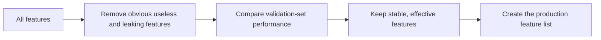

# Feature Selection


:::tip This section’s focus
Feature selection is not about removing as many features as possible. It is about balancing performance, stability, interpretability, and cost. The real goal is to keep features that are useful for the task, available in production, and free of leakage.
:::

## Learning Objectives

- Understand why more features are not always better
- Master the three basic approaches: filter methods, wrapper methods, and embedded methods
- Use a validation set to determine whether feature selection is actually effective
- Understand the relationship between feature selection, business interpretability, and production cost

---

## Why Feature Selection Is Needed

Too many features bring several problems: more noise, slower training, greater risk of overfitting, higher interpretation cost, and more complex production dependencies. In real-world business settings, one feature may mean an additional data source, an API, a permission, or a piece of maintenance logic.



## 1. First, Remove Features That Should Not Enter the Model

The first step is not an advanced algorithm, but manual inspection. Usually, you should prioritize removing: unique IDs, fields that only appear after the target outcome, fields with extremely high missing rates and no business meaning, fields that cannot be reliably obtained in training and production, and clearly duplicated fields.

```python
cols_to_drop = ["user_id", "order_id"]
X = df.drop(columns=cols_to_drop + ["target"])
y = df["target"]
```

An ID is not always useless, but beginners should be careful. Many IDs can cause the model to memorize training samples instead of learning generalizable patterns.

## 2. Filter Methods: First Look at the Statistical Relationship of Each Feature

Filter methods do not depend on a specific model. They first screen features using statistical metrics. For example, numerical features can use correlation coefficients, categorical features can use chi-square tests, and text or high-dimensional features can use variance.

```python
from sklearn.feature_selection import SelectKBest, f_classif

selector = SelectKBest(score_func=f_classif, k=10)
X_selected = selector.fit_transform(X_train, y_train)
selected_cols = X_train.columns[selector.get_support()]
print(selected_cols)
```

Filter methods are fast and suitable for initial screening; their downside is that they can easily miss interactions between features.

## 3. Wrapper Methods: Repeatedly Test with Model Performance

Wrapper methods use model training performance as the selection criterion, such as Recursive Feature Elimination, or RFE. They are closer to the final objective, but the computational cost is higher.

```python
from sklearn.feature_selection import RFE
from sklearn.linear_model import LogisticRegression

estimator = LogisticRegression(max_iter=1000)
selector = RFE(estimator, n_features_to_select=8)
selector.fit(X_train_scaled, y_train)
print(selector.support_)
```

Wrapper methods are suitable when the number of features is not too large and you are willing to spend more computation to get results that are closer to actual model performance.

## 4. Embedded Methods: Let the Model Determine Importance

Some models can provide feature importance during training, such as linear models with L1 regularization, Random Forest, GBDT, XGBoost, and LightGBM.

```python
from sklearn.ensemble import RandomForestClassifier

model = RandomForestClassifier(random_state=42)
model.fit(X_train, y_train)
importance = model.feature_importances_
```

Note that feature importance is not absolute truth. Different models, different random seeds, and different data splits can all affect the ranking. It is best to judge using validation-set performance together with business understanding.

## 5. Use a Validation Set to Confirm Whether Things Really Improved

The easiest mistake in feature selection is to only look at whether the selected features “seem reasonable,” without verifying whether the model is actually more stable. The correct approach is to compare the baseline model with the model after feature selection.

```python
from sklearn.metrics import roc_auc_score

baseline_model.fit(X_train, y_train)
baseline_auc = roc_auc_score(y_val, baseline_model.predict_proba(X_val)[:, 1])

selected_model.fit(X_train_selected, y_train)
selected_auc = roc_auc_score(y_val, selected_model.predict_proba(X_val_selected)[:, 1])

print("baseline", baseline_auc)
print("selected", selected_auc)
```

If fewer features produce similar performance but faster training, clearer interpretation, and fewer production dependencies, that may be the better solution.

## 6. Selection Criteria in Real Projects

In real projects, feature selection is not judged only by score. You also need to consider whether it is stable, explainable, deployable, compliant, and cost-effective. A feature that improves AUC by 0.001 but requires integrating an expensive external data source may not be worth deploying.

## Common Mistakes

The first mistake is performing feature selection on the full dataset and then splitting into training and test sets, which causes leakage. The second is blindly trusting feature importance rankings. The third is pursuing the smallest possible feature set and causing underfitting. The fourth is ignoring production availability: fields usable during training are not necessarily available in real time in production.

## Exercises

1. On a classification dataset, use SelectKBest to select the top 10 features and compare them with the baseline.
2. Use Random Forest to output feature importance and observe whether the ranking matches your intuition.
3. Manually list 3 features that may exist during training but may not always be available in production.
4. Explain why feature selection must be placed inside the cross-validation workflow.

## Mastery Criteria

After studying this section, you should be able to explain the differences among the three types of feature selection methods, use a validation set to judge whether selection is effective, identify data leakage risks, and decide whether to keep a feature from four perspectives: performance, interpretability, cost, and production availability.
