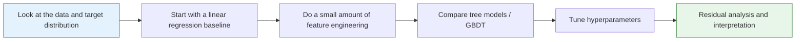

# Project 1: House Price Prediction (Regression Problem)


:::tip Project Positioning
This is your **first complete ML regression project**. You will go through the full workflow, from data exploration to model deployment. We use the built-in California Housing dataset from sklearn.
:::

## Project Overview

| Info | Description |
|------|------|
| Task type | Regression |
| Dataset | California Housing (built into sklearn) |
| Evaluation metrics | RMSE, R² |
| Skills involved | EDA, feature engineering, multi-model comparison, tuning |

---

## First, Build a Map

This project is especially good for practicing “what should a regression project actually look like?”



### A Better Beginner-Friendly Analogy

You can think of the house price prediction project like this:

- First estimate a batch of houses, then go back and see where your estimates were off

This is very similar to many real business scenarios:

- It’s not enough to output just a number
- You also need to know why that number is roughly reasonable
- And where you are most likely to make mistakes

If this is your first regression project, follow this path. It is usually the most stable.

## What You’re Really Practicing Here

This project is not just about “making a regression model run.” More importantly, you are practicing these 4 things:

1. Finding useful clues from data exploration
2. Setting up a simple baseline first
3. Improving performance through feature engineering and model comparison
4. Explaining where the model does well and where it does poorly through error analysis

### Why Is This Project Especially Good as Your First Complete Project?

Because it has several advantages:

- The task is simple and clear: regression
- The metrics are intuitive, and RMSE and R² are easy to explain
- The baseline is easy to establish
- There is a clear path for improvement later

## Recommended Order

A better order for beginners is usually:

1. Start with the simplest linear regression baseline
2. Then do basic feature engineering
3. Then try tree models or GBDT
4. Only then do hyperparameter tuning

If you jump straight to complex models at the beginning, you will often lose your feel for the problem itself.

## The Most Important Goal in the First Version Is Not a High Score

For the first version, there are really only two main goals:

1. Confirm that this problem can be modeled with regression
2. Build a baseline that all future improvements can be compared against

In other words, a first version that is “simple but complete” is more valuable than one that is “complex but hard to explain.”

## Step 1: Load and Explore the Data

```python
import pandas as pd
import numpy as np
import matplotlib.pyplot as plt
import seaborn as sns
from sklearn.datasets import fetch_california_housing

# Load data
data = fetch_california_housing()
df = pd.DataFrame(data.data, columns=data.feature_names)
df['MedHouseVal'] = data.target  # Median house value (in $100,000s)

print(f"Data shape: {df.shape}")
print(df.describe())

# Target distribution
fig, axes = plt.subplots(1, 2, figsize=(12, 4))
df['MedHouseVal'].hist(bins=50, ax=axes[0], color='steelblue', edgecolor='white')
axes[0].set_title('House Price Distribution')
axes[0].set_xlabel('Median house value (in $100,000s)')

# Correlation
corr = df.corr()['MedHouseVal'].drop('MedHouseVal').sort_values()
corr.plot.barh(ax=axes[1], color='coral')
axes[1].set_title('Correlation Between Features and House Price')
plt.tight_layout()
plt.show()
```

### Step 1.1 What Should You Ask Most at This Stage

When you first look at the data, don’t rush to make charts. First ask these questions:

- Is the target distribution skewed?
- Are there any obvious outlier ranges?
- Which features may be strongly correlated with price?
- Which features are likely to be only weak signals?

These questions will directly affect:

- What baseline to start with
- Which feature engineering steps to prioritize
- Which dimensions to inspect in error analysis

### Step 1.2 A Useful Beginner Rule to Remember

A very common mistake in first regression projects is:

- Rushing to change models immediately

A more stable order is usually:

- Look at the data first
- Understand the target
- Know what kind of distribution you are predicting

---

## Step 2: Feature Engineering

```python
# Create new features
df['rooms_per_household'] = df['AveRooms'] / df['AveOccup']
df['bedrooms_ratio'] = df['AveBedrms'] / df['AveRooms']
df['population_per_household'] = df['Population'] / df['HouseAge']

# Prepare data
from sklearn.model_selection import train_test_split

feature_cols = [c for c in df.columns if c != 'MedHouseVal']
X = df[feature_cols]
y = df['MedHouseVal']
X_train, X_test, y_train, y_test = train_test_split(X, y, test_size=0.2, random_state=42)
print(f"Training set: {X_train.shape}, Test set: {X_test.shape}")
```

### Step 2.1 Why You Should Be Conservative the First Time You Do Feature Engineering

One of the most common mistakes in regression projects is adding too many features at once, and then not being able to tell which ones actually helped.  
A more stable approach is:

- Add only 2–3 new features with strong interpretability first
- Compare against the baseline every time you add something
- If there is no clear gain, don’t keep it just because it “looks advanced”

### Step 2.2 A Feature Idea That Looks More Like Real Business Work

In house price problems, useful features are often related to “unit cost” and “relative position,” such as:

- Rooms per household
- Population per household
- Combinations of house age and location

These are more like real modeling thinking than just mechanically stacking more columns.

---

## Step 3: Compare Multiple Models

```python
from sklearn.linear_model import LinearRegression, Ridge
from sklearn.ensemble import RandomForestRegressor, GradientBoostingRegressor
from sklearn.preprocessing import StandardScaler
from sklearn.pipeline import make_pipeline
from sklearn.metrics import mean_squared_error, r2_score

models = {
    'Linear Regression': make_pipeline(StandardScaler(), LinearRegression()),
    'Ridge': make_pipeline(StandardScaler(), Ridge(alpha=1.0)),
    'Random Forest': RandomForestRegressor(n_estimators=100, random_state=42),
    'GBDT': GradientBoostingRegressor(n_estimators=100, random_state=42),
}

results = {}
for name, model in models.items():
    model.fit(X_train, y_train)
    y_pred = model.predict(X_test)
    rmse = np.sqrt(mean_squared_error(y_test, y_pred))
    r2 = r2_score(y_test, y_pred)
    results[name] = {'RMSE': rmse, 'R²': r2}
    print(f"{name:10s} | RMSE: {rmse:.4f} | R²: {r2:.4f}")

# Visualization
fig, ax = plt.subplots(figsize=(8, 5))
names = list(results.keys())
r2s = [v['R²'] for v in results.values()]
bars = ax.bar(names, r2s, color=['steelblue', 'coral', 'seagreen', 'gold'], alpha=0.8)
for bar, score in zip(bars, r2s):
    ax.text(bar.get_x() + bar.get_width()/2, bar.get_height() + 0.005,
            f'{score:.4f}', ha='center')
ax.set_ylabel('R²')
ax.set_title('Model R² Comparison')
ax.grid(axis='y', alpha=0.3)
plt.show()
```

### Step 3.1 What Should You Pay Attention to When Comparing Models

Don’t just look at which `R²` is the highest. A more reliable comparison is to look at all of these together:

- Did `RMSE` decrease significantly?
- Did model complexity increase a lot?
- Did interpretability become much worse?

When you do your first regression project, what is most worth valuing is not the “best score model,” but:

- You know why it is better than the baseline
- You know exactly how it is better

### Step 3.2 A Model Comparison Table Beginners Can Copy Directly

| Model | Advantages | What you should focus on in your first project |
|---|---|---|
| Linear Regression | Easiest to explain | Is the baseline stable? |
| Ridge | Slightly more stable | Does regularization help? |
| Random Forest | Stronger nonlinearity | Feature importance and overfitting risk |
| GBDT | Often stronger performance | Does RMSE drop noticeably? |

This table is great for beginners because it turns “model names” back into “why are we trying this?”

---

## Step 4: Hyperparameter Tuning

```python
from sklearn.model_selection import RandomizedSearchCV
from scipy.stats import randint, uniform

param_dist = {
    'n_estimators': randint(100, 500),
    'max_depth': randint(5, 20),
    'learning_rate': uniform(0.01, 0.2),
    'subsample': uniform(0.7, 0.3),
}

rs = RandomizedSearchCV(
    GradientBoostingRegressor(random_state=42),
    param_dist, n_iter=30, cv=5,
    scoring='neg_root_mean_squared_error',
    random_state=42, n_jobs=-1
)
rs.fit(X_train, y_train)

y_pred_best = rs.predict(X_test)
print(f"Tuned RMSE: {np.sqrt(mean_squared_error(y_test, y_pred_best)):.4f}")
print(f"Tuned R²: {r2_score(y_test, y_pred_best):.4f}")
print(f"Best parameters: {rs.best_params_}")
```

---

## Step 5: Result Analysis

```python
# Prediction vs actual
fig, axes = plt.subplots(1, 2, figsize=(12, 5))

axes[0].scatter(y_test, y_pred_best, s=5, alpha=0.3)
axes[0].plot([0, 5], [0, 5], 'r--')
axes[0].set_xlabel('Actual house price')
axes[0].set_ylabel('Predicted house price')
axes[0].set_title('Prediction vs Actual')

# Feature importance
importance = rs.best_estimator_.feature_importances_
sorted_idx = np.argsort(importance)
axes[1].barh(range(len(sorted_idx)), importance[sorted_idx], color='coral')
axes[1].set_yticks(range(len(sorted_idx)))
axes[1].set_yticklabels(np.array(feature_cols)[sorted_idx])
axes[1].set_title('Feature Importance')

plt.tight_layout()
plt.show()
```

### Step 5.1 Residual Analysis Shows Your Project Skills Better Than the Final Score

A lot of people stop here at `RMSE` and `R²`. But what really separates project quality is often residual analysis:

- Which price ranges have especially large errors?
- Does the model systematically underpredict high-priced homes?
- Which combinations of regional features are easiest to predict incorrectly?

This step directly tells you whether you should next:

- Add more features
- Switch models
- Or revisit the data split strategy

### Step 5.2 Another Minimal Example of “Error Bucketing”

```python
errors = pd.DataFrame({
    "y_true": [1.0, 2.5, 4.2, 3.8],
    "y_pred": [1.2, 2.0, 3.1, 4.5],
})
errors["abs_error"] = (errors["y_true"] - errors["y_pred"]).abs()
errors["bucket"] = pd.cut(errors["y_true"], bins=[0, 2, 4, 6], labels=["low", "mid", "high"])

print(errors.groupby("bucket")["abs_error"].mean())
```

This example is very suitable for beginners because it helps you build one key habit first:

- Don’t only look at the overall average error
- Also look at which kinds of samples are easier to get wrong

---

## A Very Beginner-Friendly Minimal Review Table

You can make a table like this directly:

| Version | What changed | RMSE | R² | My judgment |
|---|---|---|---|---|
| baseline | Linear regression | - | - | Establish a lower bound first |
| v2 | Added 2–3 features | - | - | See whether feature engineering really helps |
| v3 | Switched to tree model / GBDT | - | - | See whether a nonlinear model fits better |

This table turns your project from “code that ran” into “a project with a clear iteration process.”

## A Project Checklist Worth Copying for Beginners

When you do a house price prediction project for the first time, the most stable checklist is usually:

1. Has the baseline been established?
2. Do the engineered features have clear business meaning?
3. Are you comparing models using more than one metric?
4. Has residual analysis already told you what to improve next?

If you have done all 4 of these well,  
then this project is no longer “just running a regression script,” but a real end-to-end modeling exercise.

## If You Keep Improving This Project, What Is Most Worth Adding?

The most valuable additions are usually:

1. Residual distribution analysis
2. Error comparison across different regions / price ranges
3. A clear explanation of how the project evolved from baseline to best model

That makes the project feel more like a real modeling and review effort.

## What You Should Include When Delivering the Project

- A chart of “actual values vs predicted values”
- A short explanation of error sources
- A comparison table between the baseline and the improved version
- A summary of “what I would improve next if I continued”

## What Is Most Worth Showing in a Portfolio Version

If you want to turn this into a portfolio page, what matters most is not a long list of model names, but:

1. What your baseline was
2. Which improvement was the most effective
3. How `RMSE / R²` changed before and after
4. What you learned from residual analysis
5. What you plan to improve next

---

## Project Checklist

- [ ] Complete EDA: distribution, correlation, missing values
- [ ] Feature engineering: create at least 2 new features
- [ ] Compare at least 3 models
- [ ] Tune hyperparameters for the best model
- [ ] Perform residual analysis and feature importance analysis

## Recommended Version Roadmap

| Version | Goal | Delivery focus |
|---|---|---|
| Basic version | Run the minimal closed loop | Can input, process, and output, with one set of examples retained |
| Standard version | Build a presentable project | Add configuration, logging, error handling, README, and screenshots |
| Challenge version | Get close to portfolio quality | Add evaluation, comparison experiments, failed sample analysis, and a next-step roadmap |

It is recommended to finish the basic version first. Don’t try to make it big and complete all at once. Every time you improve a version, write into the README: “What capability was added, how it was verified, and what problems remain.”
