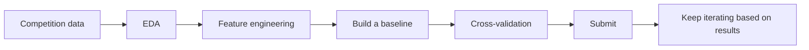

# Kaggle Competition Practice (Elective)


:::tip Section focus
Kaggle is the world’s largest data science competition platform. By joining a beginner competition, you can **connect** all the skills you learned earlier and verify them against a real scoring system.
:::

## Learning Objectives

- Understand the Kaggle platform and competition workflow
- Learn how to participate in a beginner-level competition (Titanic)
- Learn techniques from high-quality Notebooks

---

## First, Build a Map

The easiest way for beginners to go wrong on Kaggle is to focus only on the leaderboard and not know what they are actually practicing.

A better way to understand it is:



So the most important thing in this section is not “how high a score can you get,” but how to put the entire ML workflow you learned earlier into a real evaluation environment.

## What You Really Need to Practice Here

What is most valuable for beginners on Kaggle is not really “what rank did I get,” but:

- Completing a full project for the first time with real data and real evaluation rules
- Learning to turn baseline, cross-validation, feature engineering, and submission records into a closed loop
- Learning to tell whether “good local validation” and “good leaderboard score” are actually the same thing

## 1. Kaggle Platform Basics

### 1.1 Core Features

| Feature | Description |
|------|------|
| **Competitions** | Competitions (beginner / standard / prize) |
| **Datasets** | Massive free datasets |
| **Notebooks** | Online Jupyter environment (free GPU) |
| **Discussion** | Forum (learn from others’ ideas) |
| **Learn** | Official free courses |

### 1.2 Competition Workflow


---

## 2. Beginner Competition: Titanic Survival Prediction

### 2.1 Full Solution Workflow

```python
import pandas as pd
import numpy as np
from sklearn.ensemble import RandomForestClassifier, GradientBoostingClassifier
from sklearn.model_selection import cross_val_score
from sklearn.pipeline import Pipeline
from sklearn.compose import ColumnTransformer
from sklearn.preprocessing import StandardScaler, OneHotEncoder
from sklearn.impute import SimpleImputer

# 1. Load data (download from Kaggle or use seaborn)
import seaborn as sns
df = sns.load_dataset('titanic').dropna(subset=['embarked'])

# 2. Feature engineering
df['family_size'] = df['sibsp'] + df['parch'] + 1
df['is_alone'] = (df['family_size'] == 1).astype(int)

# 3. Define features
num_features = ['age', 'fare', 'family_size']
cat_features = ['sex', 'embarked', 'class']
all_features = num_features + cat_features

X = df[all_features]
y = df['survived']

# 4. Build Pipeline
preprocessor = ColumnTransformer([
    ('num', Pipeline([
        ('imputer', SimpleImputer(strategy='median')),
        ('scaler', StandardScaler()),
    ]), num_features),
    ('cat', Pipeline([
        ('imputer', SimpleImputer(strategy='most_frequent')),
        ('encoder', OneHotEncoder(drop='first', sparse_output=False)),
    ]), cat_features),
])

# 5. Model comparison
models = {
    'Random Forest': RandomForestClassifier(n_estimators=200, random_state=42),
    'GBDT': GradientBoostingClassifier(n_estimators=200, random_state=42),
}

for name, model in models.items():
    pipe = Pipeline([
        ('preprocessor', preprocessor),
        ('classifier', model),
    ])
    scores = cross_val_score(pipe, X, y, cv=5, scoring='accuracy')
    print(f"{name}: {scores.mean():.4f} ± {scores.std():.4f}")
```

### 2.1.1 What Is the Safest Goal for Your First Kaggle Competition?

When you play Kaggle for the first time, it is not recommended to set your goal as “ranking up.” A safer goal is:

1. Submit your first valid result
2. Build a clear baseline
3. Complete at least two rounds of documented improvements
4. Be able to explain why each change improved the score or why it did not

If you can do these four things, you have already learned the most important parts.

### 2.2 Generate a Submission File

```python
# Standard submission format in Kaggle competitions
# Assume test_df is the test set
# pipe.fit(X_train, y_train)
# predictions = pipe.predict(test_df[all_features])
#
# submission = pd.DataFrame({
#     'PassengerId': test_df['PassengerId'],
#     'Survived': predictions
# })
# submission.to_csv('submission.csv', index=False)
# print(f"Submission file shape: {submission.shape}")
```

---

## 3. Techniques for Improving Competition Scores

### 3.1 Score Improvement Path

| Stage | Focus | Expected Improvement |
|------|------|---------|
| Baseline | Simple model + default parameters | — |
| Feature engineering | Create new features, optimize encoding | Significant |
| Model selection | Try multiple models | Moderate |
| Hyperparameter tuning | GridSearch / Optuna | Small |
| Model ensembling | Stacking / Blending | Small but stable |

### 3.3 Common Pitfalls for Beginners on Kaggle

- Repeatedly trying things on the public leaderboard and overfitting to it
- Having no local cross-validation and only watching the online score
- Changing too many things at once, so you cannot tell what caused the improvement
- Copying a high-scoring Notebook directly, without being able to explain what you actually learned

So a safer approach is:

- First make your local validation process solid
- Change only one major factor at a time
- Turn every submission into an experiment record

### 3.2 Learn from High-Quality Notebooks

| What to Look At | Why |
|--------|--------|
| Most upvoted Notebooks | Community-approved ideas |
| EDA Notebooks | Learn data exploration techniques |
| High-ranking competitors’ shared notebooks | Learn feature engineering and ensembling strategies |
| Discussion section | Understand data leakage, scoring pitfalls, and more |

---

## 4. Recommended Beginner Competitions

| Competition | Type | Difficulty | Description |
|------|------|------|------|
| **Titanic** | Classification | Beginner | Classic starter competition with rich community resources |
| **House Prices** | Regression | Beginner | House price prediction, good for feature engineering practice |
| **Digit Recognizer** | Image classification | Beginner | MNIST, can try a simple CNN |
| **Spaceship Titanic** | Classification | Beginner | An upgraded version of Titanic |

---

## The Safest Way for Beginners to Participate in Kaggle

1. Choose only beginner-level tasks
2. Build a baseline first, and do not chase complex ensembling
3. Change only one thing at a time
4. Record what changed in each submission and why the score changed

This way, you learn a method, not just how to copy a high-scoring Notebook.

## If You Treat Kaggle as a Course Training Ground, How Should You Use It?

A very recommended way is:

1. Use Kaggle to find a real-world task
2. Use the methods from the course to build a baseline
3. Iterate using the evaluation and feature engineering ideas from the course
4. Finally, organize the results into your own project review

In this way, Kaggle will not lead you into “just chasing rankings,” but instead become the best practical amplifier for the fifth stage.

---


## Suggested Version Roadmap

| Version | Goal | Delivery Focus |
|---|---|---|
| Basic version | Get the minimum loop working | Can input, process, and output, while keeping one set of examples |
| Standard version | Form a presentable project | Add configuration, logs, error handling, README, and screenshots |
| Challenge version | Close to portfolio quality | Add evaluation, comparison experiments, failure sample analysis, and next-step roadmap |

It is recommended to finish the basic version first. Do not try to make everything complete from the start. Each time you level up, write into the README what new capabilities were added, how they were verified, and what issues remain.

## Summary

| Key Point | Description |
|------|------|
| Start with beginner competitions | Titanic / House Prices |
| Build a baseline before optimizing | Do not jump into complex models right away |
| Study excellent Notebooks | Learn from the best |
| Feature engineering matters most | It gives much more return than tuning |
| Keep submitting and iterating | Submit every improvement and check the effect |

## Hands-on Challenges

### Challenge 1: Titanic Sprint to 0.80+

Register an account on Kaggle, join the Titanic competition, and use all the skills learned in this course (feature engineering + Pipeline + model tuning) to try to reach a score of 0.80+.

### Challenge 2: House Prices Practice

Join Kaggle’s House Prices competition, use a larger dataset to practice regression tasks, and focus on missing value handling and high-dimensional categorical feature encoding.
