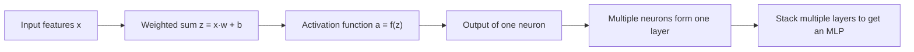
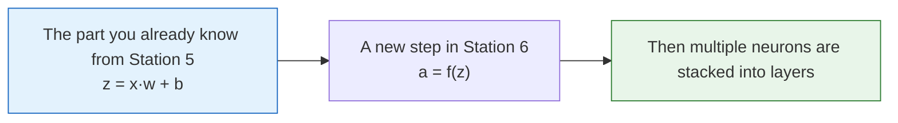
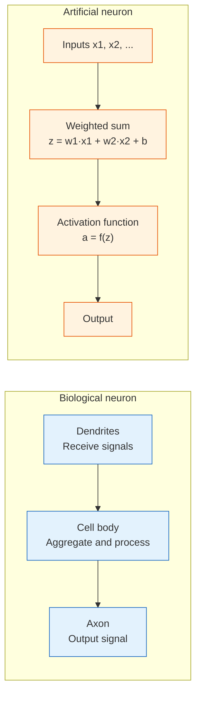
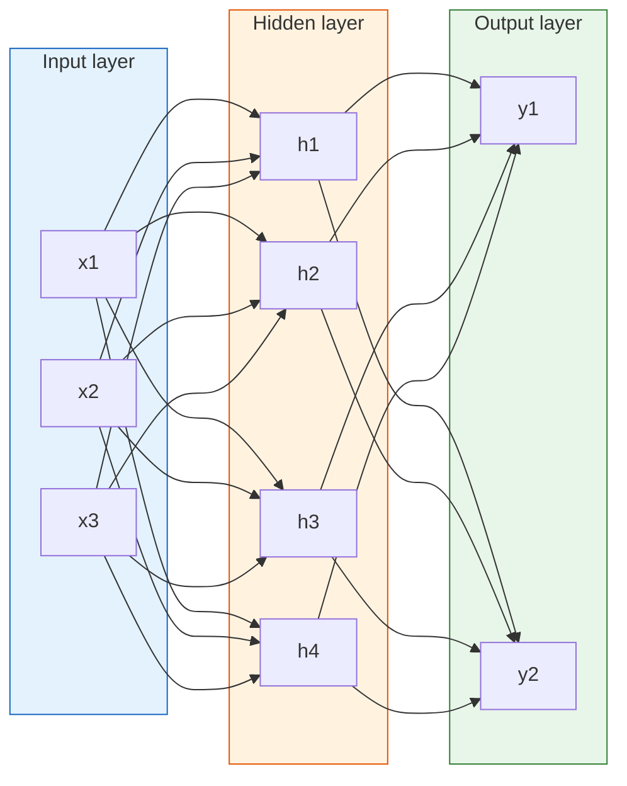
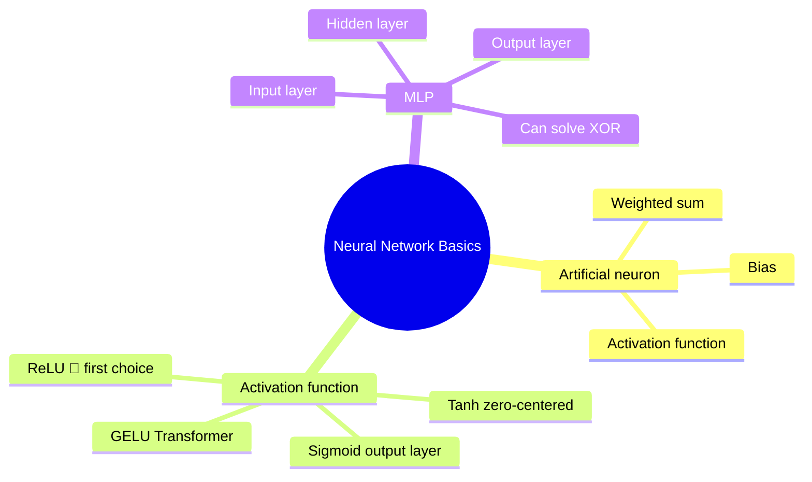

# From Neurons to Multilayer Perceptrons


:::tip Section Overview
Everything in deep learning starts with the **artificial neuron**. In this section, we begin with the simplest perceptron, learn about different activation functions, and then combine them into a multilayer perceptron (MLP) — the foundation of all neural networks.
:::

## Learning Objectives

- Understand the mapping from biological neurons to artificial neurons
- Master the perceptron model
- Master common activation functions: ReLU, Sigmoid, Tanh, and more
- Understand the structure of a multilayer perceptron (MLP)

## Historical Background: How did the neural network story begin?

The most important historical milestones in this section are:

| Year | Milestone | Key Authors | What it most importantly solved |
|---|---|---|---|
| 1943 | McCulloch-Pitts Neuron | McCulloch, Pitts | Provided the earliest computational abstraction of an artificial neuron |
| 1958 | Perceptron | Frank Rosenblatt | Proposed one of the earliest trainable single-layer neural network classifiers |
| 1969 | Perceptrons | Minsky, Papert | Systematically revealed the limitations of single-layer perceptrons on nonlinearly separable problems such as XOR |
| 1980 | Neocognitron | Fukushima | Introduced the core ideas of convolution, local receptive fields, and hierarchical features ahead of its time |

For beginners, the most important thing to remember here is:

> **The perceptron was not an “outdated model,” but the first moment in neural network history when people clearly saw what a single-layer model can and cannot do.**

So the `XOR` you see in this section is not just a toy example;  
it is one of the key turning points in the history of neural networks.

### Why did the tiny XOR problem with only 4 points become so famous?

Because it very “directly” exposed the boundary of a single-layer perceptron.

On the surface, XOR is very small:

- Only 4 input points

But its significance is exactly this:

- If a model cannot handle such a small nonlinear pattern
- Then its expressive power is not just “a little weak” — it is structurally limited

That is why XOR appears again and again in textbooks:  
not because it is itself complicated,  
but because it is like a sharp test:

> **Use a tiny example to make the fact that “a single layer is not enough” impossible to ignore.**

### Why did the perceptron first excite people, and later disappoint them?

Because when the perceptron first appeared, many people saw for the first time:

- Machines could actually seem to “learn”
- Instead of every rule having to be handwritten by humans

That was extremely exciting at the time.  
It felt like the world was being told:

> **Maybe intelligence is not only something you code, but something you can train.**

But later, problems like `XOR` poured cold water on that excitement.

Because they reminded the field:

- A single-layer model has very limited expressive power
- Being able to “learn” does not mean it can “learn everything”

So what makes this history so compelling is:

- It first ignited huge expectations
- Then it forced everyone to confront the limits of model capacity again

---

## First, build a map

For beginners, the best way to understand this section is not to memorize neural network terms, but to follow this path first:



So the first things you should understand are:

- What linear computation a neuron performs
- Why an activation function must exist
- How a single layer and multiple layers are built

## What is the most direct connection between this section and Station 5?

If you just finished Station 5, you can first think of a neuron as:

- an upgraded version of the “weighted sum” used in linear regression / logistic regression

In other words, a neuron is not a brand-new object out of nowhere. It is built on the linear-model skeleton you already know from Station 5, with one extra step added:



So the real core ideas added in this section are only two things:

- Activation functions
- Layer stacking


:::tip Reading the diagram
When reading this diagram, first split the neuron into two steps: the first step is the linear score `z = x·w + b`, and the second step is how the activation function decides whether the signal passes through. Once you do that, you will see that a neuron is not mysterious at all — it is just a “linear model + nonlinear gate.”
:::

## 1. From biology to artificial neurons



Core correspondences:

| Biological | Artificial |
|------|------|
| Dendrites (receive signals) | Input x |
| Synaptic strength | Weight w |
| Cell body (aggregation) | Weighted sum z = Σ(wi·xi) + b |
| Activation/inhibition | Activation function f(z) |
| Axon (output) | Output a = f(z) |

### 1.1 A minimal artificial neuron example

The easiest place for beginners to feel stuck is this: you know the formula, but you do not have a clear mental picture of what is actually being computed.

Let’s start with a minimal example:

```python
import numpy as np

# 3 features of one sample
x = np.array([0.8, 0.3, 0.5])

# 3 weights of one neuron
w = np.array([0.2, -0.4, 0.6])
b = 0.1

# Step 1: linear combination
z = np.dot(x, w) + b
print("z =", round(z, 4))

# Step 2: pass through activation function
relu_out = max(0, z)
print("ReLU(z) =", round(relu_out, 4))
```

You can think of this step as:

- Weights express “how important each input is”
- The bias expresses “which way to shift the overall threshold”
- The activation function decides “whether this neuron should actually fire”

### 1.1.1 If we do not talk about deep learning yet, how can we think about a neuron?

A very beginner-friendly way to understand it is:

- First think of a neuron as a linear model with a “gate”

First compute:

- `z = x·w + b`

Then decide:

- Whether to pass the result through as-is, compress it to `0~1`, or clip values below 0 directly

That “gate” is the activation function.  
So a neuron is not a mysterious new species — it is a linear score plus an extra nonlinear choice.

---

## 2. The perceptron — the simplest artificial neuron

### 2.1 Model

A perceptron is a simple model for **binary classification**:

> **z = w1·x1 + w2·x2 + ... + wn·xn + b**
>
> **output = 1 if z > 0, otherwise = 0**

```python
import numpy as np
import matplotlib.pyplot as plt

class Perceptron:
    """The simplest perceptron"""
    def __init__(self, n_features, lr=0.1):
        self.w = np.zeros(n_features)
        self.b = 0
        self.lr = lr

    def predict(self, x):
        z = np.dot(x, self.w) + self.b
        return 1 if z > 0 else 0

    def train(self, X, y, epochs=20):
        for epoch in range(epochs):
            errors = 0
            for xi, yi in zip(X, y):
                pred = self.predict(xi)
                error = yi - pred
                if error != 0:
                    self.w += self.lr * error * xi
                    self.b += self.lr * error
                    errors += 1
            if errors == 0:
                print(f"Converged at epoch {epoch+1}!")
                break

# AND gate
X = np.array([[0,0], [0,1], [1,0], [1,1]])
y = np.array([0, 0, 0, 1])

p = Perceptron(2)
p.train(X, y)
print(f"Weights: {p.w}, Bias: {p.b}")
for xi, yi in zip(X, y):
    print(f"  Input {xi} → Predicted {p.predict(xi)}, True {yi}")
```

### 2.2 Limitations of the perceptron

A perceptron can only solve **linearly separable** problems. The XOR problem cannot be solved — this is exactly why multilayer networks were introduced.

```python
# XOR problem — a perceptron cannot solve it
X_xor = np.array([[0,0], [0,1], [1,0], [1,1]])
y_xor = np.array([0, 1, 1, 0])

p_xor = Perceptron(2)
p_xor.train(X_xor, y_xor, epochs=100)

print("\nXOR prediction results:")
for xi, yi in zip(X_xor, y_xor):
    print(f"  Input {xi} → Predicted {p_xor.predict(xi)}, True {yi}")
```

### 2.3 What should you really take away from the perceptron section?

Not that “the perceptron is still worth using or not,” but that it helps you see a very important fact:

> **When you only have linear scoring, the model’s expressive power quickly hits a boundary.**

That is exactly why we later need:

- Activation functions
- Multilayer networks

So the most important teaching value of the perceptron is that it lets you see for the first time why a single layer is not enough.


:::tip Reading the diagram
The most important thing to notice in the XOR diagram is that the four points cannot be separated by a single straight line. A single-layer perceptron can only draw a linear boundary, while a multilayer network can first bend and combine the space, and then complete nonlinear classification.
:::

---

## 3. Activation functions

### 3.1 Why do we need activation functions?

Without activation functions, a multilayer network collapses into a linear model — no matter how many layers you stack, the result is equivalent to a single layer. Activation functions introduce **nonlinearity**, allowing the network to fit arbitrarily complex functions.

### 3.1.1 Why is this sentence so important?

Because it explains why “depth” is not just about stacking more layers.

If each layer is only a linear transformation, then many layers together are still essentially just one larger linear transformation.  
What makes multilayer networks meaningful is not the number of layers itself, but:

- Nonlinearity inserted between layers

So remember this key rule first:

- Without nonlinearity, deep networks cannot learn complex shapes

### 3.2 Common activation functions

```python
import numpy as np
import matplotlib.pyplot as plt

x = np.linspace(-5, 5, 200)

# Various activation functions
activations = {
    'Sigmoid': (1 / (1 + np.exp(-x)), 'σ(x) = 1/(1+e⁻ˣ)'),
    'Tanh': (np.tanh(x), 'tanh(x)'),
    'ReLU': (np.maximum(0, x), 'max(0, x)'),
    'Leaky ReLU': (np.where(x > 0, x, 0.01 * x), 'max(0.01x, x)'),
}

fig, axes = plt.subplots(2, 2, figsize=(12, 8))
colors = ['#e74c3c', '#3498db', '#2ecc71', '#9b59b6']

for ax, (name, (y, formula)), color in zip(axes.ravel(), activations.items(), colors):
    ax.plot(x, y, linewidth=2, color=color)
    ax.axhline(0, color='gray', linewidth=0.5)
    ax.axvline(0, color='gray', linewidth=0.5)
    ax.set_title(f'{name}: {formula}', fontsize=12)
    ax.set_xlim(-5, 5)
    ax.grid(True, alpha=0.3)

plt.suptitle('Common Activation Functions', fontsize=14)
plt.tight_layout()
plt.show()
```

### 3.3 Comparison and selection

| Activation function | Output range | Advantages | Disadvantages | Use case |
|---------|---------|------|------|---------|
| **ReLU** | [0, +∞) | Fast to compute, helps reduce vanishing gradients | Dead neurons | **First choice for hidden layers** |
| **Sigmoid** | (0, 1) | Interpretable as probability | Vanishing gradients, not zero-centered | Binary classification output layer |
| **Tanh** | (-1, 1) | Zero-centered | Vanishing gradients | RNNs (used less often) |
| **Leaky ReLU** | (-∞, +∞) | Helps avoid dead neurons | One more hyperparameter | Improved ReLU |
| **GELU** | Approximately (-0.17, +∞) | Smooth, good performance | Slightly slower to compute | Transformer |
| **Swish** | Approximately (-0.28, +∞) | Smooth, self-gated | Slightly slower to compute | New architectures |

:::info ReLU “dead neurons”
When the input is always negative, ReLU always outputs 0, and the gradient is also 0, so the parameters stop updating. Leaky ReLU alleviates this by giving negative values a small slope (0.01).
:::

### 3.4 Which activation function should beginners choose first?

A stable rule of thumb is:

- Use `ReLU` by default for hidden layers
- `Sigmoid` is common for binary classification output layers
- `Softmax` is common for multiclass output layers
- `GELU` is often used in Transformers

If you remember just these four points first, that is already enough to support most of the later chapters.

### 3.5 When you look at activation function plots for the first time, what should you focus on?

Do not worry about the exact formula of each curve at first. Just look at these three things:

1. What is the output range?
2. How are values below 0 handled?
3. Is the curve smooth, and is it likely to make gradients too small?

These three things directly affect:

- Whether the output can be interpreted as a probability
- Whether gradients vanish
- Whether training is relatively stable

---

## 4. Multilayer Perceptron (MLP)

### 4.1 Structure

Arrange multiple neurons **by layers**, where the output of the previous layer becomes the input of the next layer:



### 4.1.1 What makes multilayer networks so powerful?

A more beginner-friendly way to understand this is:

- The first layer learns some basic patterns
- The next layer recombines those patterns
- The deeper you go, the more abstract the representation becomes

Even in the simplest MLP, you can roughly think of it as:

- Early layers learning “intermediate representations”
- The last layer using those representations to make the final prediction

This is where “automatic feature learning” begins to happen.

### 4.2 Using NumPy to implement an MLP for XOR

```python
np.random.seed(42)

# XOR data
X = np.array([[0,0], [0,1], [1,0], [1,1]])
y = np.array([[0], [1], [1], [0]])

# Network: 2 → 4 → 1
W1 = np.random.randn(2, 4) * 0.5
b1 = np.zeros((1, 4))
W2 = np.random.randn(4, 1) * 0.5
b2 = np.zeros((1, 1))

def sigmoid(z):
    return 1 / (1 + np.exp(-z))

def sigmoid_deriv(a):
    return a * (1 - a)

lr = 1.0
losses = []

for epoch in range(5000):
    # Forward propagation
    z1 = X @ W1 + b1
    a1 = sigmoid(z1)
    z2 = a1 @ W2 + b2
    a2 = sigmoid(z2)

    # Loss
    loss = np.mean((y - a2) ** 2)
    losses.append(loss)

    # Backpropagation
    dz2 = (a2 - y) * sigmoid_deriv(a2)
    dW2 = a1.T @ dz2 / 4
    db2 = np.mean(dz2, axis=0, keepdims=True)

    dz1 = (dz2 @ W2.T) * sigmoid_deriv(a1)
    dW1 = X.T @ dz1 / 4
    db1 = np.mean(dz1, axis=0, keepdims=True)

    # Update
    W2 -= lr * dW2
    b2 -= lr * db2
    W1 -= lr * dW1
    b1 -= lr * db1

print(f"Final loss: {losses[-1]:.6f}")
print("XOR predictions:")
for xi, yi, pred in zip(X, y, a2):
    print(f"  {xi} → {pred[0]:.4f}, True {yi[0]}")

plt.plot(losses)
plt.xlabel('Epoch')
plt.ylabel('Loss')
plt.title('MLP Solving XOR')
plt.grid(True, alpha=0.3)
plt.show()
```

---

## Summary

| Concept | Key point |
|------|------|
| Artificial neuron | Weighted sum + activation function |
| Perceptron | The simplest neuron, only able to do linear classification |
| Activation function | Introduces nonlinearity; use ReLU in hidden layers |
| MLP | Stacked layers, can fit arbitrary functions |

## What should you really take away from this section?

If you only take away one sentence, I hope you remember this:

> **The starting point of neural networks is not “many layers,” but “adding nonlinearity after linear computation, and then stacking this structure repeatedly.”**

So the things that really need to be solidified in this section are:

- A neuron first computes a linear score, then passes through an activation function
- The boundary of the perceptron forces the need for multilayer networks
- Activation functions determine whether the network has real nonlinear expressive power
- MLP is the smallest prototype behind many complex structures that come later



---

## Hands-on Exercises

### Exercise 1: Implement an OR gate perceptron

Change the AND gate training data to OR gate data (0|0→0, 0|1→1, 1|0→1, 1|1→1), train the perceptron, and plot the decision boundary.

### Exercise 2: Use an MLP to classify moon-shaped data

Use `sklearn.datasets.make_moons` to generate moon-shaped data, hand-code a NumPy MLP (2→8→1), and plot the decision boundary after training.
