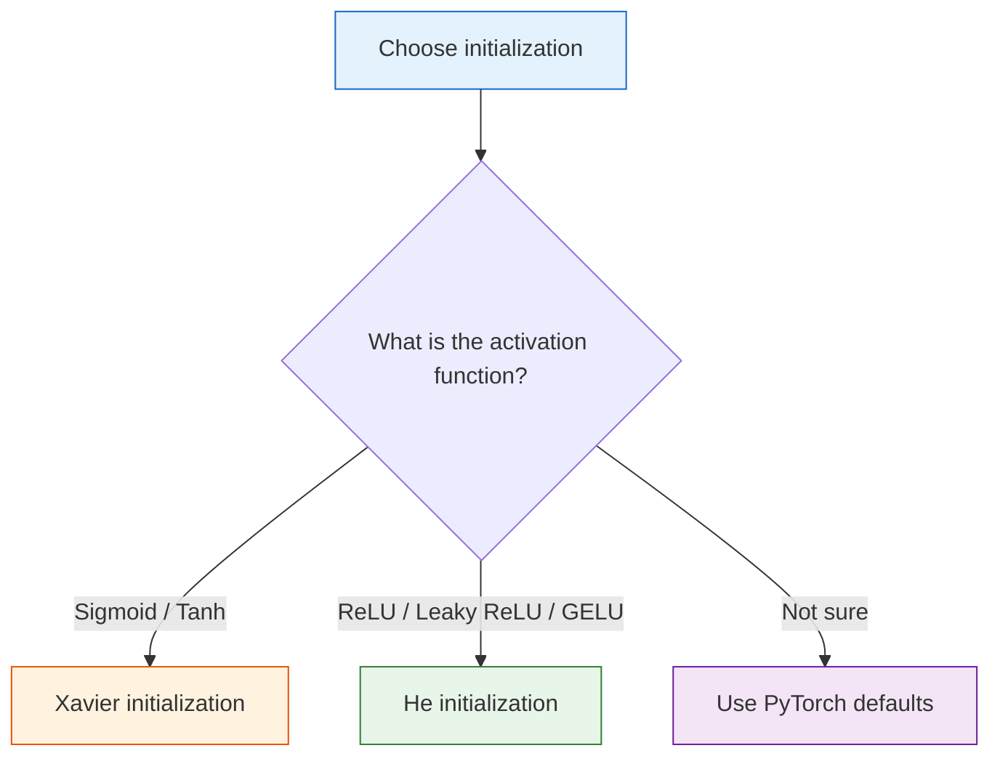

# Weight Initialization

:::tip Section Overview
One of the key factors in whether a deep network trains successfully is **weight initialization**. Bad initialization can cause vanishing or exploding gradients and make training fail completely. The good news is that PyTorch has already chosen a suitable default initialization for you.
:::

## Learning Objectives

- Understand why all-zero initialization is not allowed
- Understand Xavier / Glorot initialization
- Understand He / Kaiming initialization
- Observe the impact of initialization on training

---

## Build a Map First

The easiest way for beginners to view initialization is as “an extra detail,” but it actually directly affects whether a model can start learning smoothly.


What this section really aims to solve is:

- Why weights cannot be set arbitrarily
- Why different activation functions need different initialization strategies
- When you can safely use PyTorch defaults the first time you write a network

## How This Connects to the Previous Sections

If you connect the previous sections together, you’ll see that this section is actually answering a very natural question:

- Neurons perform forward propagation
- Backpropagation sends gradients back
- The optimizer updates parameters

But all of this has one prerequisite:

- The initial signals and gradients in the network must not be too extreme

So initialization is really answering:

> **Before model training starts, how should the first move be made so the whole game doesn’t fall apart later?**

## 1. Why Is Initialization Important?

### 1.1 The Problem with All-Zero Initialization

If all weights are 0, then all neurons produce exactly the same results and the gradients are also the same. They will **never diverge**—which is equivalent to having only one neuron.

### 1.2 Random Initialization Also Has Pitfalls

- **Too large**: activations saturate → vanishing gradients (Sigmoid/Tanh) or exploding gradients
- **Too small**: signals weaken layer by layer → gradients also weaken → training becomes very slow

### 1.2.1 A More Beginner-Friendly Intuition: Don’t Let Each Layer Be Too “Quiet” or Too “Excited”

You can think of initialization as giving each layer a starting posture:

- Too small: like having no strength from the beginning, so the signal disappears as it passes through layer after layer
- Too large: like using too much force right away, causing outputs and gradients to go out of control

So the goal of a good initialization is very simple:

- Keep forward signals from quickly shrinking or exploding
- Keep backward gradients stable enough to flow back

```python
import torch
import torch.nn as nn
import matplotlib.pyplot as plt

# Observe activation distributions under different initializations
torch.manual_seed(42)

def observe_activations(init_fn, title, activation=nn.Tanh()):
    """Observe the activation distribution of each layer in a 10-layer network"""
    layers = []
    for i in range(10):
        linear = nn.Linear(256, 256, bias=False)
        init_fn(linear.weight)
        layers.append(linear)
        layers.append(activation)

    model = nn.Sequential(*layers)

    # Record outputs of each layer
    x = torch.randn(200, 256)
    activations = []
    for i in range(0, len(layers), 2):
        x = layers[i](x)       # Linear
        x = layers[i+1](x)     # Activation
        activations.append(x.detach().numpy().flatten())

    fig, axes = plt.subplots(2, 5, figsize=(15, 5))
    for i, (ax, act) in enumerate(zip(axes.ravel(), activations)):
        ax.hist(act, bins=50, color='steelblue', alpha=0.7)
        ax.set_title(f'Layer {i+1}')
        ax.set_xlim(-1.5, 1.5)
    plt.suptitle(title, fontsize=13)
    plt.tight_layout()
    plt.show()

# Too-small initialization
observe_activations(
    lambda w: nn.init.normal_(w, 0, 0.01),
    'Too-small initialization (std=0.01) + Tanh → signal decay'
)

# Too-large initialization
observe_activations(
    lambda w: nn.init.normal_(w, 0, 1.0),
    'Too-large initialization (std=1.0) + Tanh → saturation'
)
```

---

## 2. Xavier / Glorot Initialization

### 2.1 Core Idea

Keep the **variance of the input and output of each layer** consistent, so the signal does not grow or shrink from layer to layer.

> **Sample weights from N(0, 2/(fan_in + fan_out))**
>
> fan_in = input dimension, fan_out = output dimension

### 2.1.1 What Is the Most Important Thing to Remember About Xavier, Besides the Formula?

The most important thing to remember is its goal:

- Try to keep the scale of each layer’s input and output from being too different

The formula is only one way to achieve that goal.  
So when learning it for the first time, holding on to this intuition is more important than memorizing the denominator exactly.

### 2.2 Applicable to: Sigmoid / Tanh

```python
observe_activations(
    lambda w: nn.init.xavier_normal_(w),
    'Xavier initialization + Tanh → stable signals'
)
```

---

## 3. He / Kaiming Initialization

### 3.1 Core Idea

Xavier assumes the activation function is linear. But ReLU sets about half of the neurons to 0, so a **larger variance** is needed to compensate.

> **Sample weights from N(0, 2/fan_in)**

### 3.1.1 Why Is He Initialization More Suitable for ReLU Than Xavier?

Because ReLU directly cuts part of the signal to 0.  
If you still use a more conservative initialization, the signal is even more likely to decay all the way through.

So a simple way to understand He initialization is:

- To adapt to ReLU’s “truncation” behavior, slightly increase the initial variance

### 3.2 Applicable to: ReLU and its variants

```python
observe_activations(
    lambda w: nn.init.kaiming_normal_(w, mode='fan_in', nonlinearity='relu'),
    'He initialization + ReLU → stable signals',
    activation=nn.ReLU()
)
```

---

## 4. Selection Guide

| Activation Function | Recommended Initialization | PyTorch Function |
|---------|-----------|-------------|
| **Sigmoid / Tanh** | Xavier | `nn.init.xavier_normal_` |
| **ReLU / Leaky ReLU** | He (Kaiming) | `nn.init.kaiming_normal_` |
| **GELU / Swish** | He | `nn.init.kaiming_normal_` |

### PyTorch Default Behavior

```python
# PyTorch's nn.Linear uses Kaiming Uniform by default
linear = nn.Linear(256, 128)
print(f"Default initialization range: [{linear.weight.min():.4f}, {linear.weight.max():.4f}]")

# Manually specify initialization
nn.init.kaiming_normal_(linear.weight, mode='fan_in', nonlinearity='relu')
nn.init.zeros_(linear.bias)
```

:::info Good News
PyTorch's `nn.Linear` uses Kaiming Uniform initialization by default, and so does `nn.Conv2d`. In most cases, **you do not need to initialize weights manually**—but understanding the principle can help you diagnose training issues.
:::

### 4.1 When You First Start a Project, Do You Need to Initialize Manually?

Most of the time:

- You do not need to write your own initialization from the start
- Using PyTorch defaults is usually enough

Cases where manual initialization is more worth it usually include:

- You are experimenting with deeper networks
- You suspect training is unstable
- You want to systematically compare different initialization strategies

So the most important thing in this section is not “write a lot of initialization code today,” but rather to know:

- Why default values are usually usable
- When to suspect initialization problems

### 4.2 A More Stable Default Decision Order

If you are just starting a project, you can judge things in this order:

1. Use PyTorch default initialization first
2. If training is clearly unstable, check the learning rate and optimizer
3. If it still does not work, then suspect the combination of initialization and activation function

This is more stable than “whenever a problem appears, change the initialization first,” because initialization is important, but not always the first suspect.

---

## 5. The Impact of Initialization on Training

```python
# Compare training results under different initializations
from sklearn.datasets import make_moons

X, y = make_moons(500, noise=0.2, random_state=42)
X_t = torch.FloatTensor(X)
y_t = torch.LongTensor(y)

init_methods = {
    'All zeros': lambda w: nn.init.zeros_(w),
    'N(0, 0.01)': lambda w: nn.init.normal_(w, 0, 0.01),
    'N(0, 1.0)': lambda w: nn.init.normal_(w, 0, 1.0),
    'Xavier': lambda w: nn.init.xavier_normal_(w),
    'He (Kaiming)': lambda w: nn.init.kaiming_normal_(w),
}

plt.figure(figsize=(10, 5))
for name, init_fn in init_methods.items():
    model = nn.Sequential(
        nn.Linear(2, 64), nn.ReLU(),
        nn.Linear(64, 64), nn.ReLU(),
        nn.Linear(64, 2),
    )
    # Initialize
    for m in model:
        if isinstance(m, nn.Linear):
            init_fn(m.weight)
            nn.init.zeros_(m.bias)

    optimizer = torch.optim.Adam(model.parameters(), lr=0.01)
    criterion = nn.CrossEntropyLoss()
    losses = []

    for epoch in range(200):
        loss = criterion(model(X_t), y_t)
        optimizer.zero_grad()
        loss.backward()
        optimizer.step()
        losses.append(loss.item())

    plt.plot(losses, label=name, linewidth=2)

plt.xlabel('Epoch')
plt.ylabel('Loss')
plt.title('Training curves for different initialization methods')
plt.legend()
plt.grid(True, alpha=0.3)
plt.show()
```

### 5.1 If Training Feels Wrong from the Start, Initialization Is One Thing to Suspect

Typical signals include:

- The loss is very large from the start
- Many layer outputs are almost all 0 or extremely saturated
- Gradients quickly vanish or explode

Of course, initialization is not the only cause, but it is often one of the first things worth checking.

---

## Summary

| Initialization | Principle | Use Case |
|--------|------|------|
| **All zeros** | All neurons are the same | ❌ Never use |
| **Small random** | Signal decay | ❌ Not suitable for deep networks |
| **Large random** | Exploding gradients / saturation | ❌ Not suitable |
| **Xavier** | Keep input/output variance stable | Sigmoid / Tanh |
| **He (Kaiming)** | Compensation for ReLU | **ReLU family (most common)** |



## What You Should Take Away from This Section

- Initialization is not decoration; it determines whether the network can start propagating signals healthily
- Xavier is more suited to Sigmoid / Tanh, while He is more suited to ReLU-based activations
- When you first start a project, using PyTorch defaults is completely fine, but you should understand the principle behind them

If we compress it into one sentence:

> **Initialization determines whether training can get off to a good start, not whether the model will definitely go far in the end.**

---

## Hands-on Exercises

### Exercise 1: Compare a Deep Network

Create a 20-layer MLP with ReLU activations. Use all-zero, Xavier, and He initialization respectively, and observe the distribution of activations after the forward pass (print the mean and standard deviation).

### Exercise 2: Train Deep MNIST

Use a 10-layer MLP to train MNIST, and compare the training speed and final accuracy of He initialization versus the default initialization.
