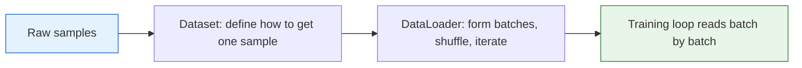

# Data Loading


## Learning Objectives

- Understand why, during training, we almost never feed all data into the model at once
- Master the roles of `Dataset` and `DataLoader`
- Be able to write the simplest custom dataset on your own
- Understand `batch_size`, `shuffle`, and train/validation splitting

---

## First, Build a Map

The most important thing to see in this section is:



So what this section is really solving is not “memorize two class names,” but:

- How data flows into the training loop in a stable way

## How This Section Connects to What Came Before and After

- In the previous sections, we already covered tensors, gradients, and models
- This section starts solving how data flows into training in batches
- The next section on the training loop will connect “model + data” together for real

So this section is really filling in the “data half” of the training loop.

## 1. Why Do We Need a Data Loader?

Imagine you are feeding a model a meal.

- Pouring in all the data at once: too much, and memory may not handle it
- Feeding it bite by bite: more stable, and better for repeated training

In deep learning, one “bite” is called a **batch**.

So we usually do not write this:

```python
pred = model(all_data_once)
```

Instead, we write this:

```python
for batch_x, batch_y in dataloader:
    pred = model(batch_x)
```

### 1.1 When You First See `batch`, What Is Most Worth Remembering?

You can start by remembering just one sentence:

> **A batch is a small group of samples the model sees for one parameter update.**

This sentence matters because later, when you see:

- `batch_size`
- `shuffle`
- `steps per epoch`

they are all revolving around this idea.

---

## 2. What Do `Dataset` and `DataLoader` Each Do?

You can think of them like this:

| Component | Analogy | Role |
|---|---|---|
| `Dataset` | Warehouse | Tells PyTorch “what the i-th data item is” |
| `DataLoader` | Delivery truck | Handles batching, shuffling, and parallel loading |

A simple way to remember it:

- `Dataset` handles “how to get one sample”
- `DataLoader` handles “how to turn samples into a batch”

### 2.1 Why Separate These Two Objects?

Because they solve two different levels of problems:

- `Dataset` is more like the “data definition layer”
- `DataLoader` is more like the “training data feeding layer”

This separation brings big benefits:

- The same dataset can use different batch strategies
- The same `DataLoader` idea can be reused across different datasets

---

## 3. Start with the Smallest `Dataset`

```python
import torch
from torch.utils.data import Dataset

class StudentDataset(Dataset):
    def __init__(self):
        # Two features: study time, number of exercises completed
        self.features = torch.tensor([
            [2.0, 1.0],
            [3.0, 2.0],
            [4.0, 3.0],
            [5.0, 5.0],
            [6.0, 6.0],
            [7.0, 8.0]
        ])

        self.labels = torch.tensor([
            [55.0],
            [60.0],
            [68.0],
            [78.0],
            [85.0],
            [92.0]
        ])

    def __len__(self):
        return len(self.features)

    def __getitem__(self, idx):
        return self.features[idx], self.labels[idx]

dataset = StudentDataset()

print("Dataset size:", len(dataset))
print("Sample 0:", dataset[0])
print("Sample 3:", dataset[3])
```

### What Must a Custom Dataset Implement?

Usually, the most basic requirement is just two methods:

- `__len__()`: returns the total number of samples
- `__getitem__(idx)`: returns the data at index `idx`

### 3.1 When You Write a `Dataset` for the First Time, What Should You Check First?

The three most important things to check are:

1. Whether `len(dataset)` is correct
2. Whether `dataset[i]` returns the structure you expect, like `(x, y)`
3. Whether each sample’s shape and dtype are correct

Because if this layer is not written correctly, problems later in `DataLoader` and the training loop become much harder to debug.

---

## 4. Hand the Dataset to `DataLoader`

```python
import torch
from torch.utils.data import Dataset, DataLoader

class StudentDataset(Dataset):
    def __init__(self):
        self.features = torch.tensor([
            [2.0, 1.0],
            [3.0, 2.0],
            [4.0, 3.0],
            [5.0, 5.0],
            [6.0, 6.0],
            [7.0, 8.0]
        ])
        self.labels = torch.tensor([
            [55.0],
            [60.0],
            [68.0],
            [78.0],
            [85.0],
            [92.0]
        ])

    def __len__(self):
        return len(self.features)

    def __getitem__(self, idx):
        return self.features[idx], self.labels[idx]

dataset = StudentDataset()
loader = DataLoader(dataset, batch_size=2, shuffle=True)

for batch_idx, (batch_x, batch_y) in enumerate(loader):
    print(f"batch {batch_idx}")
    print("batch_x:\n", batch_x)
    print("batch_y:\n", batch_y)
```

### The Two Most Important Parameters Here

| Parameter | Role |
|---|---|
| `batch_size=2` | Take 2 samples each time |
| `shuffle=True` | Shuffle the order at the start of each epoch |

### 4.1 Why Is It Especially Good to Print Shapes at the `DataLoader` Layer?

Because this is the last easy place to catch data problems before training starts.  
When you finish writing a `DataLoader` for the first time, it is a good idea to do this:

```python
for batch_x, batch_y in loader:
    print(batch_x.shape, batch_y.shape)
    break
```

This quickly tells you:

- Whether the batches are formed correctly
- Whether the label shapes are reasonable
- Whether the data is already in a form the training loop can use directly

---

## 5. Why Shuffle the Data?

If your data is originally sorted in some order, for example:

- The first 100 samples are low-score samples
- The last 100 samples are high-score samples

Then the model will keep seeing a long run of similar samples early in training, which can bias learning.  
So for training data, `shuffle=True` is usually recommended.

But validation/test data usually does not need shuffling:

```python
train_loader = DataLoader(train_dataset, batch_size=32, shuffle=True)
val_loader = DataLoader(val_dataset, batch_size=32, shuffle=False)
```

---

## 6. How Do We Split Train and Validation Sets?

PyTorch provides `random_split`:

```python
import torch
from torch.utils.data import Dataset, random_split

class StudentDataset(Dataset):
    def __init__(self):
        self.features = torch.tensor([
            [2.0, 1.0],
            [3.0, 2.0],
            [4.0, 3.0],
            [5.0, 5.0],
            [6.0, 6.0],
            [7.0, 8.0]
        ])
        self.labels = torch.tensor([
            [55.0],
            [60.0],
            [68.0],
            [78.0],
            [85.0],
            [92.0]
        ])

    def __len__(self):
        return len(self.features)

    def __getitem__(self, idx):
        return self.features[idx], self.labels[idx]

dataset = StudentDataset()

train_dataset, val_dataset = random_split(
    dataset,
    [4, 2],
    generator=torch.Generator().manual_seed(42)
)

print("Train set size:", len(train_dataset))
print("Validation set size:", len(val_dataset))
```

### Why Set a Random Seed Here?

Because without it, the split result may be different each time.  
During learning and debugging, fixing the random seed makes reproduction easier.

---

## 7. A Complete Runnable Mini Workflow

```python
import torch
from torch.utils.data import Dataset, DataLoader, random_split

class StudentDataset(Dataset):
    def __init__(self):
        self.features = torch.tensor([
            [2.0, 1.0],
            [3.0, 2.0],
            [4.0, 3.0],
            [5.0, 5.0],
            [6.0, 6.0],
            [7.0, 8.0],
            [8.0, 9.0],
            [9.0, 10.0]
        ])
        self.labels = torch.tensor([
            [55.0],
            [60.0],
            [68.0],
            [78.0],
            [85.0],
            [92.0],
            [96.0],
            [99.0]
        ])

    def __len__(self):
        return len(self.features)

    def __getitem__(self, idx):
        return self.features[idx], self.labels[idx]

dataset = StudentDataset()

train_dataset, val_dataset = random_split(
    dataset,
    [6, 2],
    generator=torch.Generator().manual_seed(42)
)

train_loader = DataLoader(train_dataset, batch_size=3, shuffle=True)
val_loader = DataLoader(val_dataset, batch_size=2, shuffle=False)

print("Training set batches:")
for x, y in train_loader:
    print(x.shape, y.shape)

print("\nValidation set batches:")
for x, y in val_loader:
    print(x.shape, y.shape)
```

---

## 8. How Should You Choose `batch_size`?

For beginners, keep this intuitive idea in mind:

- Small batch: updates happen more often, but the noise is larger
- Large batch: more stable, but uses more memory

If you are just running a teaching example, usually these are enough:

- `8`
- `16`
- `32`

When you start training larger models, then consider balancing memory and throughput.

### 8.1 A More Stable Default Mindset

At the beginner stage, think like this:

- First choose a `batch_size` your machine can easily handle
- Then check whether the loss is stable and whether the speed is acceptable
- Don’t rush to assume “a larger batch is always more advanced”

Because in the learning stage, the most important things are not peak throughput, but:

- The training flow works smoothly
- The shapes are stable
- The loss decreases normally

---

## 9. Common Beginner Mistakes

### 1. Thinking `Dataset` Means Loading All Data into Memory

Not necessarily.  
In teaching examples, we do write it that way, but in real projects, `__getitem__()` often reads from disk when accessed.

### 2. Not Shuffling the Training Set

It may still run, but it is usually not a good habit.

### 3. Only Knowing How to Write Arrays, Not Dataset Classes

For small experiments, you can be lazy. For slightly more formal projects, it is recommended to write a `Dataset`.

---

## Summary

The most important thing in this lesson is not memorizing class names, but building an awareness of the data flow:

1. Data is first organized by sample in `Dataset`
2. Then `DataLoader` forms it into batches
3. Then the batches are fed into the model one by one

In the next section, we will connect the model, loss, optimizer, and data loader to write a complete training workflow.

## What Should You Take Away from This Lesson?

If we compress it into one sentence, it is this:

> **`Dataset` decides what one piece of data looks like, and `DataLoader` decides how those data items are fed into training batch by batch.**

---

## Exercises

1. Expand the sample size in `StudentDataset` to 12 items, and split the train and validation sets again.
2. Change `batch_size` to `1`, `2`, and `4`, and observe the number of batches in each epoch.
3. Print the first batch loaded across two consecutive epochs when `shuffle=True`, and see whether the order changes.
