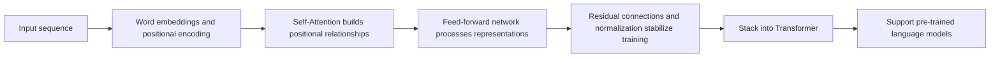

# Pre-study Guide: What Is This Transformer Chapter Really About?

This chapter addresses a very important question: why do modern NLP, large models, and many multimodal systems all rely on Transformer?

If the earlier chapters on neural networks, CNNs, and RNNs helped you understand that “deep learning models can process different types of data,” then this chapter will help you understand this: when the data is a sequence like text, why does the model need a structure that is better at capturing global relationships?

## Where This Chapter Fits in the Course

You have already learned the basics of neural networks, PyTorch, CNNs, and RNNs. In the Transformer chapter, the course begins its transition from traditional deep learning models to the core structure of the large model era.

The intuition behind RNN is “read and remember as you go.” It is a good way to explain the basic idea of sequence processing, but it hits clear bottlenecks in long texts, parallel training, and long-range dependencies. The key change brought by Transformer is this: instead of passing information only in sequence, each position can directly attend to other positions based on relevance.

## The Real Problem This Chapter Solves

This chapter is not about jumping straight into formulas. It is about building structural intuition first. You need to understand why RNN is not enough, why the attention mechanism lets the current position “look at” other positions, what roles Q/K/V play, why Self-Attention is suitable for text, and why Transformer is composed of modules such as multi-head attention, feed-forward networks, residual connections, LayerNorm, and positional encoding.

The first time you see these concepts, they may feel like a lot. But they are all serving the same purpose: helping the model see both local information and global relationships when processing sequences, while also making training more efficient in parallel.

## Recommended Learning Order for Beginners

It is recommended that you start by looking at the pain points of RNN instead of jumping directly into the Transformer architecture diagram. First ask: if a sentence is very long, how do earlier words affect later words? If each step must wait for the previous one to finish, will training become slow? Once you understand these questions, Attention will make much more sense.

Then focus on the intuition behind Q/K/V. You can think of Query as “what I want to find,” Key as “what features I have that can be matched,” and Value as “the information that will actually be passed along.” Finally, when you look at the overall Transformer structure, it will be easier to understand why it stacks modules instead of relying on just one attention layer.

## The Main Thread to Grasp in This Chapter

The main thread of this chapter can be summarized in one sentence: sequence modeling moves from “sequential passing” to “global relationships.”

Once you understand this line, when you later study BERT, GPT, pre-training, Prompt, fine-tuning, RAG, and Agent, you will know that the underlying model capability does not come out of nowhere. It is built on Transformer’s ability to model representations and contextual relationships.

## Relationship Between This Chapter and Later Chapters

Transformer is the bridge between Station 6 and Station 7. At Station 6, it is a deep learning architecture; at Station 7, it becomes the foundation of large model principles. When we later talk about pre-trained language models, the differences between BERT and GPT also ultimately come back to the differences between Transformer Encoder, Decoder, training objectives, and usage patterns.

If you do not learn this chapter solidly, common problems later will be: knowing GPT is powerful, but not knowing how context is modeled; knowing the word Attention, but not knowing why it solves the limitations of RNN; being able to call model APIs, but struggling to understand the relationship between tokens, context length, Embedding, and inference cost.

## How Beginners and Advanced Learners Should Read This Chapter

For beginners, start by grasping the main thread and the smallest runnable example. You do not need to understand every detail at once. As long as you can explain what problem this chapter solves, what the input and output are, and how the smallest project runs, you can keep moving forward.

For learners with more experience, this chapter can be used for gap-filling and engineering practice: pay attention to edge cases, failure cases, evaluation methods, code reproducibility, and how it connects to the stages before and after it. After reading, it is best to consolidate what you learned into your own project README or experiment notes.

## Suggested Study Time and Difficulty

| Study approach | Suggested time | Goal |
|---|---|---|
| Quick overview | 20–30 minutes | Understand what problem this chapter solves and where it will be used later |
| Minimal completion | 1–2 hours | Run a minimal example and complete the chapter’s project exit task |
| In-depth practice | Half a day to 1 day | Add error analysis, comparative experiments, or project README notes |

## Self-check Questions for This Chapter

| Self-check question | Passing standard |
|---|---|
| What problem does this chapter solve? | Can explain its role in the entire course in one sentence |
| What are the minimal input and output? | Can clearly explain what input the example needs and what result it produces |
| Where are the common failure points? | Can list at least one reason for an error, poor performance, or misunderstanding |
| What can you consolidate after learning? | Can write the chapter output into a project README, experiment notes, or portfolio |

## Chapter Project Exit Task

After finishing this chapter, it is recommended that you do a “handwritten attention intuition demo” or a “small text classification experiment.” The former can use simple matrices to show how one word assigns attention weights to other words; the latter can use an existing framework to run a Transformer/BERT text classification example, focusing on recording input tokens, attention mask, model output, and evaluation results.

The goal of the project is not to train a large model from scratch, but to clearly explain the core information flow of Transformer.

## Passing Criteria

By the end of this chapter, you should be able to explain the main differences between RNN and Transformer, describe in plain language what Attention and Self-Attention do, clearly explain the division of roles among Q/K/V, and connect Transformer to the later main line of BERT, GPT, and large models.

If you can draw the flow of “input token → embedding → attention → transformer block → output representation” and explain roughly what problem each step is solving, then you have reached the basic requirement for entering the large model principles stage.
