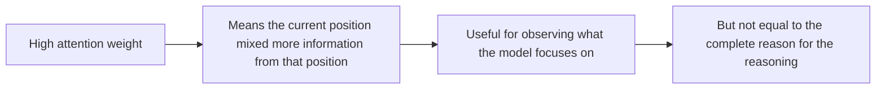

# Attention Mechanism


:::tip Section overview
If RNN is “reading and remembering step by step in order,” then attention is another way of thinking:

> **When reading the current word, directly look back at the most relevant parts of the whole sentence.**

This is one of the fundamental reasons Transformer was able to rise.
:::

## Learning objectives

- Understand why sequence modeling needs attention
- Build an intuitive understanding of Query / Key / Value
- Manually compute a minimal attention example
- Understand the roles of self-attention, multi-head attention, and masks
- Read PyTorch’s `MultiheadAttention`

## What beginners should focus on / what advanced learners should understand later

If you are a beginner, first focus on this one sentence: attention means that when the current word needs to understand itself, it looks back at which words in the whole sentence are most relevant. Don’t rush to memorize the Q/K/V formulas yet; first understand the chain of “relevance scoring -> softmax weights -> weighted aggregation.”

If you already have experience, you can further focus on: the matrix shapes of Q/K/V, why we divide by `sqrt(d_k)`, how masks prevent peeking into the future, and why multi-head attention can view relationships from multiple subspaces.

---

## Historical background: Where did Transformer come from?

The historical milestone worth knowing in this section is:

| Year | Paper | Key author(s) | What it most importantly solved |
|---|---|---|---|
| 2017 | *Attention Is All You Need* | Vaswani et al. | Replaced the main RNN pipeline with self-attention, significantly improved parallel training, and shortened the information path for long-range dependencies |

For beginners, what is most worth remembering is not the authors’ names, but this sentence:

> **Transformer matters not only because it is “stronger,” but because it changed sequence modeling from “passing information step by step” to “direct global association.”**

So the attention you see in this lesson is not a small local trick,  
but the true heart of the entire Transformer path.

---

## How this connects to the RNN storyline

### First, a story: when reading comprehension asks you a pronoun question, you do not just remember the last sentence

Imagine you are doing reading comprehension and the question asks: “Who does ‘he’ refer to in the passage?” You would not only look at the last word before it; you would go back to the whole sentence or even the whole paragraph for clues. Which name, which action, is most relevant to this “he”? That is where you focus your attention.

RNN is more like passing information along step by step, with long-range information becoming weaker over time. Attention mechanism is more like allowing the current position to directly look at all positions and assign different weights to them. In this way, the model does not need to squeeze the whole sentence into a fixed-length memory.

If you just finished learning RNN, you can first understand this section as:

- RNN is “reading and remembering step by step in order”
- Attention is “the current position directly looks at the most relevant parts globally”

So the key new idea in this section is not the formula, but:

- The current position no longer depends only on the hidden state passed in step by step
- Instead, it can directly build long-distance relationships

## 1. Why do we need attention mechanism?

### 1.1 First, look at a pain point of Seq2Seq

Early encoder-decoder structures often worked like this:

1. The encoder compresses the entire input sentence into a fixed-length vector
2. The decoder generates the output based on that vector

The problem is:

> All the information in a whole sentence gets stuffed into one fixed vector, so long sentences are very likely to lose information.

For example, when translating this sentence:

> “Although this restaurant is in a very remote location, because the owner is especially warm and friendly, the portions are generous, and the prices are reasonable, I’m still willing to go again.”

If the model still needs to remember the earlier part “the owner is especially warm and friendly” when generating the end of the sentence, a fixed vector is often not flexible enough.

### 1.2 The core improvement of attention

Attention mechanism says:

> Don’t compress the whole sentence into one point. When handling a certain step, directly look at which parts of the sentence are most relevant.

This is like answering reading-comprehension questions not by memorizing the whole article, but by:

- seeing the question
- going back to the original text
- finding the most relevant sentences

That is the intuition behind attention.

### 1.3 What you should understand first in this section is not QKV, but “why the change is needed”

In other words, don’t rush to memorize Q / K / V.  
First establish this question:

- If a fixed-length vector loses information
- If long dependencies are hard to pass along step by step

then the model needs a more flexible mechanism that can “look back anytime.”

Once this problem is clear, QKV will not feel like pure memorization.

---

## 2. What exactly are Query / Key / Value?

This is often the most confusing part for beginners.

### 2.1 A search-and-retrieval analogy

You want to find information in a database:

- **Query**: what you are looking for right now
- **Key**: the index saying “what I am generally related to”
- **Value**: the actual information to retrieve and use

The attention process can be understood as:

1. Use Query to match against all Keys
2. The stronger the match, the more relevant it is
3. Then aggregate the corresponding Values according to relevance weights

### 2.2 One-sentence version

> **Q asks the question, K gets matched, and V provides the content.**

### 2.3 What is easiest to get stuck on when learning QKV for the first time?

Usually it is not the English terms that are hard to remember, but:

- not knowing why they need to be split into 3 roles

A more stable way to understand it is:

- `Q` decides “what I care about right now”
- `K` decides “what content I roughly correspond to”
- `V` decides “what content is actually retrieved and mixed”

Once you understand this role division, the matrix form will be much easier to read later.


:::tip Reading guide
Read this image as a search-and-retrieval story: `Q` is the question you are asking now, `K` is the index tag attached to each document, and `V` is the actual content to retrieve. Attention first scores `Q` against all `K`, then mixes `V` according to the weights.
:::

---

## 3. Minimal runnable example: calculate attention by hand

### 3.1 Start by looking at the code directly

```python
import numpy as np

# Suppose there are 3 tokens
X = np.array([
    [1.0, 0.0],   # token1
    [0.0, 1.0],   # token2
    [1.0, 1.0]    # token3
])

# For teaching simplicity, let Q, K, and V all equal X directly
Q = X
K = X
V = X

scores = Q @ K.T
scaled_scores = scores / np.sqrt(K.shape[1])

def softmax(row):
    e = np.exp(row - row.max())
    return e / e.sum()

weights = np.apply_along_axis(softmax, 1, scaled_scores)
output = weights @ V

print("scores =\n", np.round(scores, 3))
print("weights =\n", np.round(weights, 3))
print("output =\n", np.round(output, 3))
```

### 3.2 The most important first line: `Q @ K.T`

This step calculates:

> How relevant the current token is to the other tokens

If two vectors point in more similar directions, their dot product is usually larger.

### 3.3 Second step: softmax

softmax turns these relevance scores into a probability distribution:

- They add up to 1
- They can be treated as “attention strength”

### 3.4 Third step: `weights @ V`

This step says:

> Instead of only looking at the current token itself, mix information from all tokens by weighting them according to relevance.

This gives a new representation.

### 3.5 Why is this one of the fundamental capabilities behind Transformer’s rise?

Because for the first time it naturally does one thing very well:

- The representation of the current position is no longer determined only by itself
- It is determined jointly by “itself + how relevant other positions are to it”

This means the model can build more flexibly:

- long-range dependencies
- multi-position interactions
- global context

---

## 4. Why do we need to “scale”?

### 4.1 The formula for scaled dot-product attention

In Transformer, the common formula is:

> `Attention(Q, K, V) = softmax(QK^T / sqrt(d_k)) V`

Here, `sqrt(d_k)` is the scaling term.

### 4.2 Why divide by this number?

Because when the dimension becomes large, dot products can become large too, and softmax may become too sharp:

- one position gets a very large weight
- other positions become almost 0

This makes training unstable.

So we scale it down to make the scores gentler.

You can think of it like this:

> The larger the vector dimension, the more “excited” the dot product becomes naturally, so we cool it down first.

---

## 5. What is Self-Attention?

### 5.1 The key idea of self-attention

When Query / Key / Value all come from the same input sequence, it is called self-attention.

This means:

> Every position in the sequence can look at other positions in the same sequence.

For example, in the sentence:

> “Xiao Wang gave the ball to Xiao Li because he caught it very steadily.”

Who does “he” refer to?  
To decide, you need to look at the other words before it.

Self-attention can directly build this kind of relationship.

### 5.2 The difference from RNN

RNN:

- passes information step by step over time

Self-attention:

- the current position looks at the global context directly

This is one reason Transformer is better at long-range dependencies.

### 5.3 What is most worth remembering about self-attention is not the name, but its capability boundary

What is most worth remembering is:

- It allows each position to directly look at the entire sequence

This sentence is important because it exactly corresponds to the weakness of RNN:

- RNN is more like passing messages step by step
- Self-Attention is more like building global connections all at once

---

## 6. What is Mask used for?

### 6.1 Why do generation tasks need a mask?

In language generation, when predicting the current position, you must not peek at future words.

For example, when predicting:

> “I love ___”

If the model has already peeked at the true answer later on, the training is no longer valid.

So decoder self-attention often adds a **causal mask**.

### 6.2 A minimal mask example

```python
import numpy as np

scores = np.array([
    [2.0, 1.0, 0.5],
    [1.2, 2.1, 0.7],
    [0.8, 1.3, 2.2]
])

# Lower triangle is visible, upper triangle is masked
mask = np.array([
    [1, 0, 0],
    [1, 1, 0],
    [1, 1, 1]
])

masked_scores = np.where(mask == 1, scores, -1e9)

def softmax(row):
    e = np.exp(row - row.max())
    return e / e.sum()

weights = np.apply_along_axis(softmax, 1, masked_scores)

print("masked weights =\n", np.round(weights, 3))
```

You will see:

- The 1st position can only see itself
- The 2nd position can only see the first two
- The 3rd position can see the first three

### 6.3 Why must mask be understood early?

Because once you enter generation tasks, if you do not understand masks, you will easily get confused about:

- why training cannot peek at the future
- why decoder attention behaves differently from encoder attention

So mask is not a side concept; it directly affects whether the generation task is being trained according to the rules.


:::tip Reading guide
When reading this image, look at the lower-triangular matrix: the 1st position can only see itself, the 2nd position can only see itself and the past, and so on. If generation tasks do not use a causal mask, it is like seeing the answers to later questions before the exam.
:::

---

## 7. Why does multi-head attention need “multiple heads”?

### 7.1 It is not that one head cannot compute enough, but that one head cannot see everything

A single attention head may only learn one type of relationship.  
The idea of multi-head attention is:

> Let the model look at relationships from multiple subspaces and multiple angles at the same time.

For example, different heads may focus more on:

- syntactic relations
- positional relations
- subject-verb-object relations
- long-range dependencies

### 7.2 An intuitive analogy

Multi-head attention is like inviting different people to a meeting to look at the problem together:

- someone looks at syntax
- someone looks at semantics
- someone looks at structure

Finally, these observations are combined, and the understanding becomes more complete.

---

## 8. `MultiheadAttention` in PyTorch

### 8.1 Minimal runnable example

```python
import torch
from torch import nn

torch.manual_seed(42)

# seq_len=4, batch=2, embed_dim=8
x = torch.randn(4, 2, 8)

attn = nn.MultiheadAttention(
    embed_dim=8,
    num_heads=2,
    batch_first=False
)

out, weights = attn(x, x, x)

print("input shape :", x.shape)
print("output shape:", out.shape)
print("weights shape:", weights.shape)
```

### 8.2 How do we read the output shapes?

- `out.shape = [4, 2, 8]`
  - Each position outputs a new 8-dimensional representation

- `weights.shape = [2, 4, 4]`
  - 2 batches
  - Each batch has a `4x4` attention matrix

That is to say:

> Each position assigns attention weights to all positions in the sequence.

---

## 9. What does attention mechanism really solve?

You can summarize it in three sentences:

1. It no longer relies on a single path to pass information step by step
2. The current position can directly use global context
3. It is easier to compute in parallel

When these three points are combined, Transformer becomes extremely powerful.

---

## 10. A common mistake: treating attention weights as the “final explanation”

Attention weights are very intuitive, so many beginners naturally think: a high weight means the model has “truly understood the reason.” Be careful with this understanding.

Attention weights only show that in this layer, this head, and this position’s computation, certain tokens were given higher weights. They are very useful for helping you understand the information mixing process, but they cannot simply be equated with a complete causal explanation.



So the most reliable way to describe attention visualizations the first time you see them is: “this head focuses more on these positions in this layer,” rather than directly saying “the model drew its conclusion because of this word.”

---

## 11. Learning loop for this section

After finishing this section, you can self-check with the table below:

| Level | What you should be able to do |
|---|---|
| Intuition | Explain why attention is more suitable than a fixed vector for long sentences |
| Code | Read the roles of `Q @ K.T`, softmax, and `weights @ V` |
| Structure | Distinguish what self-attention, mask, and multi-head attention each solve |
| Future connection | Explain why Transformer, large models, and multimodal models all rely on attention |

---

## 12. Common mistakes beginners make

### 12.1 Treating Q / K / V as three “mysterious variables”

It is enough at first to understand them as “query / index / content.”

### 12.2 Looking only at the formula and not at the matrix shapes

Attention chapters are easiest to get wrong on shapes.  
Be sure to watch:

- sequence length
- embedding dimension
- number of heads

### 12.3 Thinking attention naturally understands everything

The attention mechanism is powerful, but it is not “automatic reasoning magic.”  
Its essence is still:

- relevance scoring
- softmax
- weighted summation

Understanding this will make later Transformer learning much more solid.

---

## Summary

The most important thing in this section is not memorizing the formula, but grasping this intuition:

> **Attention mechanism allows the model, at the current moment, to selectively look back at the most relevant parts of the entire input.**

This is exactly the core reason why Transformer, large models, and multimodal models can greatly improve context modeling ability.

---

## 13. Exercises

1. Change `Q / K / V` in the minimal attention example and observe how the weights change.
2. Modify the mask example to a longer sequence and see how future positions are blocked.
3. Explain in your own words: why is self-attention easier than a plain RNN for modeling long-range dependencies?
4. Think about it: if a token has almost the same attention to all positions, what does that usually mean?
