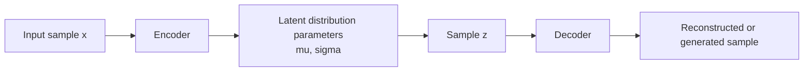

# VAE Basics [Optional]


:::tip Section overview
If GAN learns distributions through “real vs. fake” confrontation,  
VAE is more like another approach:

> **First compress the data into a continuous latent space, then sample from that latent space and reconstruct it back.**

It does not have the strong adversarial flavor of GAN, but it explains the idea of “latent space” more clearly, and it is also better for building intuition about generative model structure.
:::

## Learning objectives

- Understand the relationship between the encoder, latent variables, and decoder
- Understand why VAE learns a “distribution” instead of a single-point encoding
- Build intuition for latent space sampling through a runnable example
- Understand the difference between VAE and a standard autoencoder

---

## First, build a map

If you are coming from the earlier ideas of encoding representations, classification, or autoencoding, you can think about it like this:

- A standard encoding model is more like learning “how to compress a representation”
- VAE goes one step further and asks, “Can this representation space be sampled, interpolated, and generated from?”

So the most important change in VAE is not “adding some random numbers,” but:

- turning the latent representation from a fixed point into a samplable distribution region

The best way for a beginner to understand VAE is not to memorize the ELBO first, but to understand the structure first:



The three most important intuitions in this section are:

- The encoder does not output just a single point; it describes a region
- Whether the latent space is continuous affects whether you can sample smoothly
- VAE is especially useful for building your intuition about the connection between “generation” and “representation learning”

## 1. What is VAE actually doing?

### 1.1 A standard autoencoder is more like compression and reconstruction

It does:

- input -> compressed representation -> reconstructed output

### 1.2 VAE goes further

VAE does not just learn a fixed latent vector,  
it learns:

- a latent distribution

For example:

- mean `mu`
- variance `sigma`

This way, the model is not only able to “remember how to reconstruct,”  
but also more like it can:

- sample in latent space
- then generate new samples

### 1.3 An analogy

A standard autoencoder is like assigning each image a fixed drawer.  
VAE is more like assigning it a “small fluctuating region,” so if you sample nearby, you can still generate reasonable samples.

### 1.4 When learning VAE for the first time, what should you focus on first?

What you should grasp first is not ELBO, but this sentence:

> **What VAE wants to learn is not “the one exact point where each sample is hidden,” but “which region of latent space this kind of sample is likely to occupy.”**

Once this idea is stable, the following questions become much easier:

- Why do we need `mu` and `sigma`
- Why does the latent space need to be more regular
- Why is VAE especially good for building “latent space intuition”

---

## 2. Why does VAE emphasize latent space so much?

### 2.1 Because the key to generation is whether you can sample from the space

If the latent representation is completely discrete, scattered, or discontinuous,  
it is hard to sample smoothly and get reasonable results.

### 2.2 VAE wants to make latent space more regular

So it encourages the latent variable distribution to be closer to a standard prior,  
usually:

- a standard normal distribution

That is also why VAE latent spaces are usually better for:

- interpolation
- sampling
- generation

### 2.3 What is most worth remembering about latent space is not the dimension, but “continuity”

When beginners first learn latent space, it is easy to focus entirely on:

- how long the vector is
- how many dimensions there are

But what matters more is actually:

- whether the space is continuous
- if you move a little nearby, will the generated result also change smoothly and reasonably

This is exactly where VAE differs a lot from a standard encoder.


:::tip Reading guide
Read this image as “regions,” not “points”: a standard autoencoder is more like compressing samples into fixed positions, while VAE learns `mu` and `sigma` so that each sample corresponds to a samplable small region. The more continuous the latent space is, the more natural interpolation and generation become.
:::

---

## 3. Let’s run a minimal latent space sampling example first

This example will demonstrate the minimal form:

1. The encoder produces `mu` and `sigma`
2. Sample `z` from them
3. The decoder generates output based on `z`

```python
import math
import random

random.seed(42)


def encoder(x):
    # Minimal illustration: input x corresponds to a mean and standard deviation
    mu = x * 0.5
    sigma = 0.3 + x * 0.1
    return mu, sigma


def sample_z(mu, sigma):
    epsilon = random.gauss(0, 1)
    return mu + sigma * epsilon


def decoder(z):
    # Minimal illustration: map the latent variable back to a "generated value"
    return round(z * 2, 3)


x = 1.2
mu, sigma = encoder(x)
samples = [decoder(sample_z(mu, sigma)) for _ in range(5)]

print("mu:", round(mu, 3))
print("sigma:", round(sigma, 3))
print("generated samples:", samples)
```

### 3.1 What is the most important thing about this example?

It clearly shows the key characteristic of VAE:

- the same input does not correspond to just one fixed point
- instead, it corresponds to a distribution that can be sampled

### 3.2 Why is this more generation-like than a standard autoencoder?

Because you can sample multiple different but related results from around the latent space.  
This allows the model not only to reconstruct, but also to generate variations.

---

## 4. What is the intuitive difference between VAE and GAN?

### 4.1 VAE

It emphasizes more:

- latent space structure
- distribution modeling
- smooth sampling

### 4.2 GAN

It emphasizes more:

- adversarial training
- judging whether samples are real or fake
- generation realism

### 4.3 So the key learning focus is different

- If you want to learn latent spaces and probabilistic generation intuition, VAE is great
- If you want to learn adversarial generation and unstable training issues, GAN is great

### 4.4 Which path should beginners study first?

If you want to understand:

- why latent space can be used for interpolation
- why generative models emphasize distributions
- why “samplable” matters so much

then VAE is often a better first stepping stone than GAN.

### 4.6 If you put GAN and VAE side by side, what is the most important difference to grasp first?

A more stable way to remember it is:

- GAN is more like learning “how to fool the real-vs-fake judge”
- VAE is more like learning “how to place samples into a samplable latent space”

So:

- If you want to understand adversarial generation, GAN is the classic choice
- If you want to understand latent spaces and representation-based generation, VAE is clearer

### 4.5 Where should VAE be placed in the generative model learning order?

A more stable order is usually:

1. First understand the compression and reconstruction of a standard autoencoder
2. Then understand VAE’s “distribution-based latent space”
3. Then compare it with GAN

This makes it easier to really understand:

- reconstruction
- sampling
- latent space structure

and how these three things connect step by step.

---

## 5. The easiest pitfalls when learning VAE

### 5.1 Mistake 1: VAE is just a standard autoencoder with some randomness added

Not true.  
Its most important change is:

- learning a distribution
- making latent space samplable

### 5.2 Mistake 2: If reconstruction is clear, the latent space must be good

Not necessarily.  
Whether the latent space is regular and smooth is equally important.

### 5.3 Mistake 3: VAE is only for images

It can also be used for:

- text latent representations
- tabular data generation
- representation learning

---

## If you continue learning, the most recommended order is

1. First make the difference between a standard autoencoder and VAE clear
2. Then make the difference between VAE and GAN clear
3. Finally look at latent space interpolation, generation quality, and more modern generative approaches

## Summary

The most important thing to build in this section is a clear judgment:

> **The core value of VAE is that it learns a continuous, samplable latent space, allowing the model not only to reconstruct inputs, but also to generate and interpolate in latent space.**

Once this intuition is in place, many generative model structures will become much easier to understand.

## What you should take away from this section

- The most important thing about VAE is not just “it can generate,” but “it can learn a samplable latent space”
- It is a bridge connecting representation learning and generative models
- If you want to build intuition about generative model structure first, VAE is often the gentler starting point

---

## Exercises

1. Change the `x` value in the example to different values and see how the generated sample distribution changes.
2. Why is VAE said to emphasize “latent space structure” rather than just “whether reconstruction is accurate”?
3. Explain in your own words: what is the biggest difference between VAE and a standard autoencoder?
4. Think about it: if you want to study “how samples change smoothly in latent space,” why would VAE be a good entry point?
