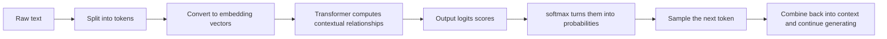

# Core Concepts of Large Models

## Learning Objectives

By the end of this section, you will be able to:

- Understand the meaning of token, context window, and next-token prediction
- Understand the intuition behind embedding, logits, and temperature
- Read a very simple example of attention calculation
- Distinguish the sources of capability among pretraining, fine-tuning, and prompt-driven methods

---

## 1. What Exactly Is a Large Model Doing?

### First, a story: an apprentice that auto-completes text

Suppose you are training a new editor to proofread text. You do not first teach him “what intelligence is”; instead, you ask him to do one thing every day:

> Look at the content already written and guess the most reasonable next word.

At first, he can only guess very short sentences. Later, after seeing a large amount of news, code, Q&A, novels, and manuals, he gradually learns what expressions sound more natural, what knowledge often appears together, and what kind of question usually needs step-by-step answers afterward.

The training intuition of a large model can be understood like this too: it is not explicitly taught “how to answer questions” from the beginning. Instead, it repeatedly practices “predict the next token based on the context” in massive amounts of text, and eventually develops abilities that look like understanding, reasoning, and writing.

Let’s say it in the least misleading way first:

> **A large language model is essentially doing “given a context, predict the next token.”**

That sounds simple, but the abilities grow from there.



This diagram helps you see the main thread first: a large model does not directly “spit out an answer”; instead, it repeatedly follows a generation loop. Later, when you see token, embedding, attention, and temperature, you can place them back into this loop for understanding.


:::tip Reading tip
It is best to read this diagram as a loop: context becomes vectors, the Transformer outputs `logits`, `softmax` turns them into probabilities, and then sampling strategies such as temperature/top-p choose the next token. Generation by a large model is not writing the full answer at once; it repeats “predict the next token” many times.
:::

For example, when you see:

> “Beijing is China’s”

you might naturally continue with:

> “capital”

What the model does is essentially similar, except that it learns this kind of prediction from a massive-scale corpus.

---

### A complete toy example of “next token”

The example below is very small, but it connects the chain of “context -> logits -> probabilities -> token selection”:

```python
import numpy as np

context = "Beijing is China's"
candidates = ["capital", "city", "university"]
logits = np.array([4.0, 2.0, 0.5])


def softmax(x):
    e = np.exp(x - x.max())
    return e / e.sum()


probs = softmax(logits)
best = candidates[np.argmax(probs)]

print("Context:", context)
for token, prob in zip(candidates, probs):
    print(f"Candidate token={token}, probability={prob:.3f}")
print("Most likely next token:", best)
```

What this example really wants to show is: the model does not “pick by feeling” from the candidates. Instead, it first gives each possible token a score, then turns the scores into a probability distribution. Real large models have many more candidate tokens, but the core flow is the same.

---

## 2. Token: What the Model Actually Sees Is Not a “Sentence,” but Split Units

Many beginners think the model reads text by “characters” or “words,” but that is not necessarily true.

More accurately:

> The model sees tokens.

A token can be:

- a character
- a word
- part of a word
- punctuation

### A toy tokenizer

```python
text = "AI fullstack course"

# This is just the simplest whitespace split; real large model tokenizers are more complex
tokens = text.split()

print("Original text:", text)
print("tokens:", tokens)
print("Number of tokens:", len(tokens))
```

Real large models usually split text more finely, because that helps handle rare words and different languages.

---

## 3. Context Window: How Far the Model Can “See” at Once

The context window can be understood as the model’s “current workbench.”

The larger the workbench:

- the more information can be placed on it at once
- the more likely the model can use longer historical content

But it is not unlimited.  
That is why many long-document tasks and RAG tasks always come back to the question: “How do we fit the context in?”

Think of it like this:

> You are solving problems on a desk. The larger the desk, the more reference materials you can spread out.


:::tip Reading tip
Think of the context window as a fixed-size workbench: system prompt, user question, chat history, retrieved materials, and output space all compete for the token budget. A larger window only means a bigger desk; it does not mean you can stuff in information arbitrarily. The key is to place the most useful information inside it.
:::

---

## 4. Embedding: First Turn Tokens into Vectors

The model cannot directly consume token strings, so they must first be turned into vectors.  
You can initially understand this process as:

> **Assign each token a coordinate in a high-dimensional space.**

Tokens with similar meanings are also closer together in a good representation space.

Although real embeddings are very complex, we can first use a small example to feel the idea of “text to vectors”:

```python
import numpy as np

embedding_table = {
    "cat": np.array([0.9, 0.1, 0.2]),
    "dog": np.array([0.85, 0.15, 0.25]),
    "car": np.array([0.1, 0.8, 0.3])
}

print("cat embedding:", embedding_table["cat"])
print("dog embedding:", embedding_table["dog"])
print("car embedding:", embedding_table["car"])
```

This is only a toy illustration, but you can already see:

- `cat` and `dog` are closer
- `car` is farther away

---

## 5. Why Is the Model Called “Autoregressive”?

Because it often generates text like this:

1. Look at the existing context
2. Predict the next token
3. Append the new token back into the context
4. Predict the next one again

So generation rolls forward step by step.

It is like playing a word-chain game:

- say one word first
- then continue based on the previous text

---

## 6. Logits, Probabilities, and Temperature

What the model computes internally first is usually not the “final probability,” but a set of scores, often called `logits`.

Then, after softmax, they become a probability distribution.

### A runnable example of temperature sampling

```python
import numpy as np

tokens = ["Beijing", "Shanghai", "Guangzhou"]
logits = np.array([3.0, 1.5, 0.5])

def softmax_with_temperature(logits, temperature=1.0):
    scaled = logits / temperature
    exp_values = np.exp(scaled - scaled.max())
    return exp_values / exp_values.sum()

for temp in [0.5, 1.0, 2.0]:
    probs = softmax_with_temperature(logits, temperature=temp)
    print(f"temperature={temp}")
    for token, prob in zip(tokens, probs):
        print(f"  {token}: {prob:.4f}")
```

### How should temperature be understood?

- Low temperature: more conservative, more likely to choose the highest-scoring option
- High temperature: more diverse, more likely to try lower-ranked options

In analogy:

- low temperature is like “very cautious answering”
- high temperature is like “more willing to think broadly”

---

## 7. Attention: Why Is It So Important?

The core intuition of attention is:

> When computing the representation of the current token, the model does not need to look at all words equally; it can “pay more attention” to the words related to it.

For example, in the sentence:

> “Xiao Wang gave the ball to Xiao Li because he caught it very steadily.”

Who does “he” refer to? You need to look at the contextual relationships.  
The attention mechanism is doing this kind of “relevance allocation.”

### A very minimal attention example

```python
import numpy as np

# Suppose there are vector representations for 3 tokens
X = np.array([
    [1.0, 0.0],   # token1
    [0.0, 1.0],   # token2
    [1.0, 1.0]    # token3
])

# For demonstration, set Q, K, V all to X directly
Q = X
K = X
V = X

scores = Q @ K.T
scaled_scores = scores / np.sqrt(K.shape[1])

def softmax(row):
    e = np.exp(row - row.max())
    return e / e.sum()

attention_weights = np.apply_along_axis(softmax, 1, scaled_scores)
output = attention_weights @ V

print("Attention scores:\n", np.round(scaled_scores, 3))
print("Attention weights:\n", np.round(attention_weights, 3))
print("Output representations:\n", np.round(output, 3))
```

You do not need to fully master the formula right now, but you should first grasp the intuition:

- first compare “who is related to whom”
- then aggregate information by weight according to relevance

---

## 8. What Do Pretraining, Fine-Tuning, and Prompts Do?

### 1. Pretraining

Let the model learn language patterns from massive amounts of text.

### 2. Fine-tuning

Continue training on a specific task or style so the model adapts better to a certain scenario.

### 3. Prompting

Do not change the model parameters; instead, guide the model through the input so it works in a desired way.

In analogy:

| Method | Analogy |
|---|---|
| Pretraining | Reading a large number of books thoroughly |
| Fine-tuning | Specialized pre-job training |
| Prompting | Giving clear instructions on the spot |

---

## 9. Why Do Large Models Seem to “Think”?

Because when the model scale, data volume, and training quality are large enough, it learns many complex patterns:

- language patterns
- common-sense associations
- instruction following
- multi-step generation structure

But note:

> The fact that a model “looks like it thinks” does not mean it thinks in exactly the same way humans do.

As engineers, what we care about more is:

- what its input-output patterns are
- when it is reliable
- when it tends to make mistakes

---

## 10. Quick Self-Check: Are These Statements True?

Before moving on to RAG and Agent, let’s judge the following statements:

| Statement | Correct? | Why |
|---|---|---|
| One of the core tasks in large model training is predicting the next token based on context | Correct | next-token prediction is the entry-level intuition for understanding LLMs |
| A token is always equal to one Chinese character or one complete English word | Incorrect | a token may be a character, a word, a word piece, or punctuation |
| The higher the temperature, the smarter the answer must be | Incorrect | high temperature only means more diversity, not better accuracy |
| Attention can be understood as relevance-based weighting | Correct | it first computes relevance, then aggregates information by weight |

---

## 11. Common Beginner Misconceptions

### 1. Thinking that a large model “directly memorizes answers”

Not quite.  
It is more like learning large-scale language distributions and patterns.

### 2. Thinking that a higher temperature means smarter

No.  
Higher temperature means more diversity, not necessarily more accuracy.

### 3. Giving up when seeing the attention formula

No need.  
First grasp the intuition of “relevance weighting,” then gradually look at the formula.

---

## Summary

The most important points in this lesson are:

1. Large models learn language by predicting the next token
2. Tokens are first turned into vectors before entering model computation
3. Attention allows the model to use context based on relevance
4. Pretraining, fine-tuning, and Prompts contribute different layers of capability

Once you understand these, when you later see RAG, Agent, and tool calling, they will no longer feel like “black-box magic.”

---

## Exercises

1. Modify the `logits` in the temperature sampling example and observe how the probability distribution changes.
2. Change the `X` in the attention example and observe how the attention weights change.
3. Explain in your own words: why does the context window directly affect RAG performance?
