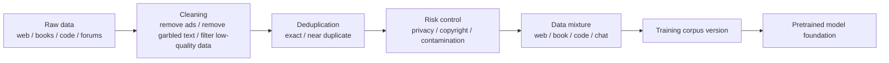

# Pretraining Data


:::tip Section overview
When many people talk about large models, they first think about:

- How many parameters it has
- How new the architecture is
- How long it was trained

But the real foundation that determines what the model “learns” and “does not learn” is often the pretraining data.

And the hardest part here is not:

- finding more text

But rather:

- what text to find
- how to clean it
- how to mix it
- how to avoid duplication and contamination

The goal of this lesson is to break the vague statement “data matters a lot” into something you can actually judge and act on.
:::

## Learning objectives

- Understand the core quality dimensions of pretraining data
- Understand why “more data” does not always mean “better data”
- Use a runnable example to understand the meaning of cleaning, deduplication, and data mixture ratios
- Build awareness of the risks of contamination, duplication, and low-quality corpora

---

## How this lesson connects to the earlier LLM / pretraining path

If you have already accepted the idea that “pretraining determines the model’s foundation,” then the most natural follow-up here is:

- Earlier, you learned that model capability comes from pretraining
- In this lesson, we ask a more specific question: what data actually feeds those capabilities?

So the real goal here is not the empty phrase “data matters,” but to answer:

- What does pretraining data actually determine?
- Why does data engineering directly affect the model ceiling?

## 1. Why does pretraining data determine the model foundation?

### First, a story: two students read different books

Imagine two students who are both smart and use the same learning method.

The first student reads high-quality textbooks, papers, technical docs, and well-edited long-form articles every day. The second student reads repeated ads, clickbait, copied webpages, and messy comments. After half a year, their expression ability, factual reliability, and problem-analysis habits will likely look very different.

Pretraining data affects a model in a similar way. The model architecture is like the learning method, compute is like learning time, and data is the material it reads every day. Different material leads to different capabilities in the end.

### 1.1 What the model learns is not only knowledge, but also language habits and the world distribution

During pretraining, the model does not automatically distinguish between:

- content that is more trustworthy
- text that is just noise
- expressions that are worth imitating

It tries to fit whatever it sees.

So pretraining data affects not only:

- knowledge coverage

but also:

- language style
- factual reliability
- bias distribution
- safety risks

### 1.2 An analogy: foundation quality sets the ceiling for all later renovation

You can think of pretraining data as the foundation.

- Fine-tuning is like renovation
- Alignment is like guardrails and rules

If the foundation itself is messy,  
then no matter how much you fine-tune later,  
you are mostly just patching an already-set base.

### 1.3 Why doesn’t “the internet is huge” mean “we can just train on it directly”?

Because real-world text contains many problems:

- duplicated content
- low-quality copies
- ads and spam pages
- template-like SEO text
- illegal or sensitive content
- evaluation set contamination

The real challenge of large models is not that data is unavailable,  
but rather:

> **How do you turn massive raw text into a high-quality, controllable, reusable data foundation?**

### 1.4 When learning pretraining data for the first time, what should you grasp first?

What you should grasp first is not specific corpus names, but this sentence:

> **During pretraining, the model cannot automatically tell what is worth learning, so data governance is the first round of value filtering on behalf of the model.**

Once this idea is stable, then later when you see:

- deduplication
- filtering
- mixture ratios
- contamination control

you will understand that these are not just engineering details — they directly shape the model foundation.

### 1.5 Put the pretraining data pipeline in one picture first



This pipeline helps make “data matters” concrete: every step changes what the model can learn, what it leans toward, and what mistakes it is likely to make.


:::tip Reading guide
Read this diagram from “there is a lot of raw data” to “there is only a small amount of trainable corpus”: cleaning, deduplication, risk filtering, contamination control, and mixing are not decorative steps. They are how we decide which patterns are worth learning and which noise must be kept out before training starts.
:::

---

## 2. Which dimensions should we look at for pretraining data?

### 2.1 Coverage: how many types of language and knowledge can the model access?

Common sources may include:

- webpages
- books
- code
- academic papers
- Q&A forums
- conversational corpora

Insufficient coverage can make the model clearly weak in some scenarios.  
For example:

- If code is underrepresented, coding ability will be weak
- If long-form writing is rare, long-document organization will be poor

### 2.2 Quality: not every token is equally valuable

A very practical rule of thumb is:

- The value of high-quality tokens often far exceeds simply stacking more low-quality tokens

If the corpus contains lots of:

- repeated sentence patterns
- mechanical concatenation
- marketing ads
- typos and broken grammar

then the model wastes compute on patterns that are not worth learning.

### 2.3 Diversity: the model should not only know one style of speaking

If all data comes from the same kind of source,  
the model will likely become biased.

For example, if it is all forum-style casual language, then:

- style may become unstable
- formal writing ability may be weak

If it is all encyclopedia-style writing, then:

- conversational feel may be lacking
- instruction following may feel unnatural

### 2.4 Safety and compliance: some content should not be handled with “just train on it first”

Data governance must also consider:

- copyright risks
- privacy information
- sensitive or harmful content
- compliance boundaries

This is not something you can fully fix later with a safety fine-tune.

### 2.5 When first learning data governance, which four words are most worth remembering?

You can start with these four words:

- coverage
- quality
- diversity
- risk

These four words are basically the smallest framework for almost all later data discussions.

---

## 3. First run a truly useful data cleaning example

The code below simulates a very small pretraining data pipeline:

1. Text normalization
2. Deduplication
3. Low-quality filtering
4. Statistics on the proportion kept from each source

```python
from collections import Counter

raw_docs = [
    {"source": "web", "text": "Click to claim a coupon!!! Click to claim a coupon!!!"},
    {"source": "web", "text": "Python is a programming language. Python is widely used."},
    {"source": "book", "text": "The transformer architecture uses self-attention to model token interactions."},
    {"source": "web", "text": "python is a programming language. python is widely used."},
    {"source": "forum", "text": "I forgot my password, and customer service said I could reset it by SMS."},
    {"source": "forum", "text": "hahahahaha"},
]


def normalize(text):
    return " ".join(text.lower().replace("！", "!").split())


def repeated_char_ratio(text):
    if len(text) < 2:
        return 0.0
    repeats = sum(text[i] == text[i - 1] for i in range(1, len(text)))
    return repeats / (len(text) - 1)


def quality_ok(text):
    if len(text.split()) < 4 and len(text) < 12:
        return False
    if "coupon" in text or "click to claim" in text:
        return False
    if repeated_char_ratio(text) > 0.6:
        return False
    return True


seen = set()
clean_docs = []
for doc in raw_docs:
    normalized = normalize(doc["text"])
    if normalized in seen:
        continue
    if not quality_ok(normalized):
        continue
    seen.add(normalized)
    clean_docs.append({"source": doc["source"], "text": normalized})

print("kept docs:")
for doc in clean_docs:
    print(doc)

print("\nsource mix:", Counter(doc["source"] for doc in clean_docs))
```

### 3.1 What steps in real engineering does this code correspond to?

Although it is very small, it corresponds to the most common actions in a pretraining pipeline:

- text normalization
- exact deduplication
- low-quality sample filtering
- source distribution statistics

This is not optional preprocessing,  
but the basic foundation of large-model data engineering.

### 3.2 Why is deduplication especially important?

Because duplicate text makes the model see the same content again and again.  
This creates two problems:

1. Training tokens are wasted
2. Certain patterns are over-amplified

This is especially common in web data,  
where reposts, mirrors, and template pages are everywhere.

### 3.3 Why should a sample like “hahahahaha” be filtered out?

Because although this is real language,  
it has almost no value for improving general capability,  
and it may also skew the distribution.

So pretraining data is not about being as raw as possible,  
but about judging “training value.”

### 3.4 Why is this small example especially worth studying again and again?

Because it shows you:

- data engineering does not start from abstract ideas
- it starts from many very concrete judgments

For example:

- Is this sample duplicated?
- Is this sample noise?
- Is the proportion from this source too imbalanced?

These judgments accumulate into differences in model capability.

---

## 4. Why does data mixture directly affect model style?

### 4.1 Tokens from different sources shape different capabilities

A rough but practical understanding is:

- Web: broad coverage, but quality varies a lot
- Books: complete structure, more stable language
- Code: strengthens program patterns and formal language ability
- Forum dialogue: improves conversational style and interactivity

So the final data mixture ratio directly affects whether the model feels more like:

- an encyclopedia
- an assistant
- a programmer

### 4.2 What happens if the mixture ratio is unreasonable?

For example:

- If code accounts for too little, coding ability becomes weak
- If forum data is too dominant, formal writing may become too casual
- If low-quality web pages are too common, the model may sound vague and template-like

That is also why before training, people often need to design:

- source mix

### 4.3 A simple example of mixture-based sampling

```python
import random

random.seed(42)

datasets = {
    "web": ["web_1", "web_2", "web_3"],
    "book": ["book_1", "book_2"],
    "code": ["code_1", "code_2"],
}

mix = {"web": 0.5, "book": 0.2, "code": 0.3}


def sample_source(mix_config):
    r = random.random()
    cumulative = 0.0
    for source, prob in mix_config.items():
        cumulative += prob
        if r <= cumulative:
            return source
    return source


draws = []
for _ in range(20):
    source = sample_source(mix)
    item = random.choice(datasets[source])
    draws.append((source, item))

print(draws)
```

This code is reminding you that:

- data mixing is not “just throw everything in”
- the sampling strategy itself is part of training design

---

## 5. Why are contamination and evaluation leakage so dangerous?

### 5.1 What is data contamination?

A very common form is:

- evaluation questions, reference answers, or close variants get mixed into the training data

Then the model looks strong during evaluation,  
but that is not generalization — it is more like having already seen the original question.

### 5.2 Why is this more serious than ordinary duplication?

Because it directly distorts your judgment of model ability.  
You may think:

- the model is better at reasoning
- the model knows more

But in reality it may just be:

- the test samples leaked into the training data

### 5.3 How can we reduce this risk in practice?

Common approaches include:

- near-duplicate detection based on hashes or n-grams
- explicit filtering of public benchmarks
- strict tracking of data sources and versions

This is also why data governance must have version awareness.

---

## 6. Pretraining data quality self-check table

When reviewing a pretraining corpus, you can use the table below for a quick judgment:

| Checkpoint | What should you ask? | What happens if it is done poorly? |
|---|---|---|
| Coverage | Does it cover the language, domain, and formats required by the task? | The model becomes obviously weak in some scenarios |
| Quality | Does it contain a lot of ads, garbled text, or template pages? | The model learns low-value patterns |
| Deduplication | Are there many reposts, mirrors, or repeated templates? | Tokens are wasted, and repeated patterns are amplified |
| Mixture ratio | Do the proportions of web, books, code, and dialogue match the target? | Style and capability become unbalanced |
| Contamination | Have evaluation sets or answers leaked into training? | Evaluation scores become falsely high, and generalization is misjudged |
| Versioning | Are the data sources and processing rules traceable? | Reproducing experiments and troubleshooting becomes difficult |

This table is worth putting into your project notes, because it shows that you do not just know “more data is better,” but can judge whether the data is suitable for training from an engineering perspective.

---

## 7. The most common pitfalls in pretraining data

### 7.1 Mistake 1: More data is always better

If the low-quality proportion is high,  
simply increasing volume may just waste compute.

### 7.2 Mistake 2: The stricter the cleaning, the safer it is

Over-cleaning also has a cost:

- diversity decreases
- rare knowledge may be removed by mistake
- language style becomes narrower

So cleaning is not about being as aggressive as possible,  
but about matching the target capability.

### 7.3 Mistake 3: Since we have fine-tuning later, pretraining data does not need that much attention

That is not correct.  
Fine-tuning is more like shaping an already existing foundation in a targeted way,  
not tearing down and rebuilding the foundation from scratch.

---

## Summary

The most important thing in this lesson is not memorizing a few data source names,  
but building this judgment:

> **Pretraining data determines what kind of world the model sees, and the core of a high-quality pretraining pipeline is not just collecting more text, but performing cleaning, deduplication, mixture control, and contamination control.**

Once this judgment is in place,  
then when you later look at pretraining objectives, training engineering, and fine-tuning data, you will know which problems should be solved at the source.

---

## 8. Exercises

1. Based on the code in this section, add a few more samples that you think should be filtered or kept, and see whether the rules are reasonable.
2. Why do we say “exact dedup” is only the first step, and real projects also need near-duplicate detection?
3. Think about it: if your model is mainly for code scenarios, how should the data mixture ratio be adjusted?
4. Explain in your own words: why does evaluation leakage make us overestimate model capability?
