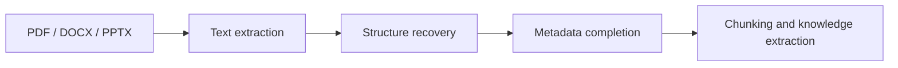

# Document Parsing and Knowledge Extraction

:::tip Section overview
One of the most common mistakes in knowledge-base projects is:

- thinking about vectorization first
- thinking about Q&A first

But if the documents are not parsed correctly, both retrieval and generation will go off track.

So the most important thing in this section is not to start with vector databases, but to build a key judgment first:

> **Documents must first be parsed into knowledge objects that are “understandable, chunkable, and traceable.”**
:::

## Learning objectives

- Understand why PDF / Word / PPT cannot be treated as plain text only
- Understand why scanned PDFs and image pages bring OCR into the pipeline
- Learn how to parse documents into structures such as “body text + hierarchy + metadata + examples”
- Understand a minimal document parsing and knowledge extraction workflow

---

## First, build a map

Document parsing is easier to understand as “file -> structure -> knowledge chunks”:



So what this section really wants to solve is:

- Why knowledge-base projects are not just “extract file content and you’re done”
- Why heading levels, page numbers, chapters, and examples all affect retrieval quality later

## 1. Why is document parsing often harder than expected?

Because the problems in different document formats are completely different:

- `PDF` may just be a “visual layout result,” and paragraph order is not naturally stable
- `DOCX` structure is usually clearer, but styles and heading levels are not always consistent
- `PPTX` often contains fragmented bullet points, unlike continuous prose
- Scanned PDFs may not even give you the actual text directly

This means a truly usable knowledge base usually has to answer first:

1. Was the text extracted?
2. Is the order correct?
3. Are headings, page numbers, and chapters preserved?
4. Which parts are examples, definitions, body text, or notes?

## 2. A beginner-friendly analogy

You can think of document parsing like this:

- organizing a big box of materials into a set of cards you can flip through

If you just dump all the papers out randomly,  
you can still search through them later, but it will be messy.  
The safer approach is to organize them into:

- topics
- chapters
- headings
- examples
- sources

Then when the system asks, “Find examples for this topic,” it has a real chance of finding the right ones.

## 3. The most common problems by file type

| File type | Most common problems |
|---|---|
| PDF | Wrong order, headers/footers mixed into body text, two-column layouts get scrambled |
| Word | Inconsistent heading levels, tables mixed with body text |
| PPT | Each slide has little information but is fragmented; often need to preserve the “slide” concept |
| Scanned PDF / image pages | Requires OCR, and is prone to character recognition errors and ordering issues |

This table is especially useful for beginners because it reminds you:

- Document processing is not “one parser to rule them all”


:::tip Reading guide
After a file enters the system, it is routed first: text PDFs, scanned PDFs, DOCX, and PPTX have different problems. Before storing into the knowledge base, you need to restore body order, heading hierarchy, page numbers, and content types—not just extract one big block of plain text.
:::

## 4. A minimal document parsing workflow example

The following example does not depend on a real third-party library,  
but it helps explain the idea of using different parsing routes for different document types.

```python
from pathlib import Path


def route_parser(filename):
    suffix = Path(filename).suffix.lower()
    if suffix == ".pdf":
        return "pdf_text_or_ocr"
    if suffix == ".docx":
        return "word_parser"
    if suffix == ".pptx":
        return "ppt_parser"
    return "unsupported"


files = [
    "lesson_1.pdf",
    "chapter_2.docx",
    "course_outline.pptx",
]

for file in files:
    print(file, "->", route_parser(file))
```

The most important value of this example is:

- it helps you build the idea of “routing” in your mind

In other words, when a file enters the system, you do not just throw it into one universal function,  
but first determine:

- what kind of file it is
- which parsing pipeline it should use

## 5. What does a real knowledge chunk look like?

What goes into the knowledge base should not just be:

- a raw text block

It should look more like this:

```python
chunks = [
    {
        "doc_id": "word_001",
        "source_type": "docx",
        "section_title": "Word Problem: Discount Calculation",
        "page_or_slide": 3,
        "content": "A store gives a 20% discount on a 100 yuan item. What is the new price?",
        "content_type": "example",
    },
    {
        "doc_id": "ppt_002",
        "source_type": "pptx",
        "section_title": "Key Takeaways",
        "page_or_slide": 8,
        "content": "Discount = Original price × discount rate.",
        "content_type": "concept",
    },
]

for chunk in chunks:
    print(chunk)
```

This example is especially helpful for beginners because it shows:

- what matters is not just getting the words
- but putting the words back into their source, chapter, page number, and content type

## 6. A more realistic parsing result schema

When building this kind of system for the first time, the easiest things to miss are:

- document-level metadata
- chapter-level structure
- knowledge-chunk-level content

A safer approach is usually to divide the parsing result into three layers:

| Layer | Minimum information to keep |
|---|---|
| Document layer | `doc_id / filename / source type / creation time / subject` |
| Chapter layer | `section_id / title / chapter path / page range` |
| Knowledge chunk layer | `chunk_id / text / content type / source page / is example` |

You can think of it like this:

- document layer is like a book cover card
- chapter layer is like a table of contents
- knowledge chunk layer is the actual card used for retrieval and generation

The following minimal structure is a good starting point for beginners:

```python
parsed_doc = {
    "doc_id": "math_pdf_001",
    "source_type": "pdf",
    "title": "Discount Word Problems Practice",
    "subject": "Math",
    "sections": [
        {
            "section_id": "s1",
            "section_title": "Basic Discount Concepts",
            "page_range": [1, 2],
            "chunks": [
                {
                    "chunk_id": "c1",
                    "content_type": "concept",
                    "page_or_slide": 1,
                    "text": "Discount = Original price × discount rate",
                },
                {
                    "chunk_id": "c2",
                    "content_type": "example",
                    "page_or_slide": 2,
                    "text": "An item costs 100 yuan. What is the price after a 20% discount?",
                },
            ],
        }
    ],
}

print(parsed_doc["sections"][0]["chunks"][1]["text"])
```

The point of this schema is not that it is “beautifully designed,” but that:

- retrieval can filter on something later
- courseware generation can tell concepts from examples
- citation traceability knows where the content came from

## 7. Why is “content type” so important?

Because your project is not ordinary Q&A,  
but something that needs to:

- find materials by topic
- find related examples
- then generate Word courseware in a fixed format

At that point, if the system can distinguish:

- `concept`
- `example`
- `exercise`
- `definition`

then courseware generation will be much more stable.

## 8. A minimal “example extraction” demo

For your project, just knowing which page a passage comes from is not enough.  
You also want to distinguish, as much as possible:

- whether it is an example
- whether it is an exercise
- whether it is a definition or formula

When you first build this, you do not need to start with a complex model.  
You can begin with a minimal rule-based version to close the loop.

```python
def guess_content_type(text):
    if "Example" in text or "Solution:" in text:
        return "example"
    if "Exercise" in text or "Think about it" in text:
        return "exercise"
    if "Definition" in text or "Formula" in text:
        return "concept"
    return "paragraph"


samples = [
    "Example 1: An item costs 100 yuan. What is the price after a 20% discount?",
    "Exercise: A shirt costs 80 yuan. What is the price after a 30% discount?",
    "Formula: Discount = Original price × discount rate",
]

for sample in samples:
    print(guess_content_type(sample), "->", sample)
```

This minimal rule-based version is not perfect,  
but it is very helpful for beginners to understand:

- “example extraction” is not magic
- it is essentially document content classification

## 9. Why do scanned files bring OCR into the pipeline?

Because scanned PDFs or image pages are not text files at their core, but rather:

- text that looks like an image

So you need to do:

- OCR to recognize the text

and then continue with:

- structure recovery
- heading hierarchy recognition
- example extraction

If you later need to process many scanned lesson plans, screenshots, or photographed materials, this step becomes critical.

For a related course section, see:
- [OCR Text Recognition](../../ch10-computer-vision/ch05-advanced/03-ocr.md)

## 10. The safest scope control for your first implementation

When you first develop this module, the most common reason for failure is not that the technology is too hard,  
but that the scope gets too large too quickly.

A safer minimal version is usually:

1. Support text-based `DOCX` first
2. Then support text-based `PDF`
3. Then support `PPTX`
4. Finally add OCR for scanned files

The benefit of this order is:

- you can first make the structure and schema work smoothly
- you will not get stuck on OCR recognition problems right away

## 11. A parsing checklist beginners can copy directly

When you parse documents for a knowledge base for the first time, the safest checklist is usually:

1. Was all the text extracted correctly?
2. Is the order of headings and body text correct?
3. Was the chapter hierarchy preserved?
4. Were page numbers / slide numbers kept?
5. Can body text and examples be distinguished?
6. Are there OCR recognition errors in scanned files?

These 6 items are higher priority than “just use a vector database first.”

## 12. If you turn this into a project, what is most worth showing?

What is most worth showing is usually not:

- “We support PDF / Word / PPT”

but rather:

1. What the original document looks like
2. What the parsed structured knowledge chunks look like
3. How examples were identified
4. Where OCR or structure recovery tends to fail

That way, others can more easily see that:

- you understand the knowledge ingestion pipeline
- you are not just capable of “reading files”

## Summary

- Document parsing is really about turning files into structured knowledge objects
- Schema design determines whether retrieval, citation, and courseware generation will be stable later
- When you start, it is more realistic to get `DOCX / text PDF / rule-based example extraction` working smoothly first than to support everything at once

## What you should take away from this section

- Document parsing is not finished just by extracting text; structure and source must also be restored
- Truly valuable knowledge chunks should carry metadata such as headings, page numbers, and content types
- If your knowledge base comes from a large number of PDF / Word / PPT / scanned files, this step is one of the most critical entry points in the whole pipeline
