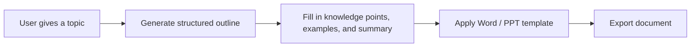

# Template-Based Document Generation (Word / PPT)


:::tip Section focus
When many beginners create “generated Word / slides,” they tend to directly ask the model to output a long block of text,  
and then hope it naturally fits:

- chapter order
- formatting requirements
- exercise placement
- slide style

This is usually not stable.

A more reliable approach is usually:

> **First let the model produce structured content, then fill that structure into a template.**
:::

## Learning Objectives

- Understand why document generation is best built with a “structure -> template -> export” workflow
- Understand the difference between Word / PPT generation and ordinary chat output
- Read a minimal template filling process
- Build an engineering intuition that “structured output comes before document layout”

---

## First, Build a Mental Map

Template-based document generation is easier to understand as “topic -> outline -> content blocks -> template export”:



So what this section really wants to solve is:

- Why you should not let the model freely “write an entire Word document”
- Why fixed templates make generation results more stable

## 1. Why Is Template-Based Generation So Important?

Because your goal is not ordinary Q&A,  
but to deliver:

- a document that looks like a course slide deck

That means the system not only needs to answer correctly,  
but also needs to satisfy:

- stable structure
- fixed sections
- fixed heading levels
- reasonable placement of examples and summaries

## 2. A Better Beginner-Friendly Analogy

You can think of document generation as:

- write the outline first, then fill in the content, and finally format it

If you start by directly writing the entire body text,  
it is very easy for things to go wrong:

- the structure becomes messy
- content gets repeated
- examples end up in the wrong place

So a more reliable approach is usually:

- define the skeleton first
- then add the flesh and blood

## 3. A Minimal Structured Courseware Object Example

```python
courseware = {
    "title": "Discount Word Problem Explanation",
    "target_audience": "Upper elementary school",
    "sections": [
        {
            "heading": "1. Knowledge Review",
            "content_type": "concept",
            "items": ["Discount = original price × discount rate"],
        },
        {
            "heading": "2. Example Explanation",
            "content_type": "example",
            "items": ["If an item originally costs 100 yuan and is 20% off, what is the price?"],
        },
        {
            "heading": "3. Classroom Practice",
            "content_type": "exercise",
            "items": ["If a shirt originally costs 80 yuan and is 30% off, how much is it?"],
        },
    ],
}

print(courseware)
```

The most important value of this example is:

- it makes clear what structure needs to be generated first

In other words, the model should not directly output the final `.docx`,  
but should first output a structured content object.

## 4. A Courseware Schema Better Suited for Real Projects

If your goal is to “generate a Word course handout in a fixed format,”  
it is recommended to add two more layers on top of the minimal object:

- page-level or chapter-level ordering
- template field mapping

A more robust courseware schema usually includes at least:

| Field | Purpose |
|---|---|
| `title` | Document title |
| `audience` | Intended audience |
| `teaching_goal` | Teaching objective |
| `sections` | Main body structure |
| `source_refs` | Reference sources |
| `template_version` | Which template is being used |

This table is especially useful for beginners because it reminds you:

- you are not generating “long text”
- you are generating a “data object that can be reliably consumed by a template”

## 5. A Minimal Template Filling Example

The example below does not use real `python-docx`;  
instead, it uses the simplest string template to make the workflow clear.

```python
template = """# {title}

Target audience: {target_audience}

{body}
"""


def render_body(sections):
    blocks = []
    for section in sections:
        blocks.append(section["heading"])
        for item in section["items"]:
            blocks.append(f"- {item}")
        blocks.append("")
    return "\\n".join(blocks)


result = template.format(
    title=courseware["title"],
    target_audience=courseware["target_audience"],
    body=render_body(courseware["sections"]),
)

print(result)
```

This example is especially suitable for beginners because it helps you first see:

- the core of templating is not the library
- it is “structure first, template second”

## 6. How Should Template Fields Be Designed?

When building this kind of system for the first time, it is strongly recommended that you write the template fields out explicitly.

| Template field | Corresponding content |
|---|---|
| `{title}` | Courseware title |
| `{target_audience}` | Intended audience |
| `{teaching_goal}` | Teaching objective |
| `{concept_block}` | Knowledge review |
| `{example_block}` | Example explanation |
| `{exercise_block}` | Classroom practice |
| `{source_block}` | Source notes |

The benefits are:

- the model knows what it needs to produce
- the template rendering layer knows what it needs to fill
- later, when you revise the system, you can tell which layer has a problem

## 7. What Extra Things Do Word / PPT Actually Need to Handle?

In real engineering work, besides the body content, you also need to handle:

- title styles
- paragraph hierarchy
- numbering
- tables
- image placeholders
- headers and footers
- slide layouts

So template-based document generation is really a two-layer problem:

1. content structure
2. document layout

## 8. A Minimal “Structured Object -> Template Fields” Example

```python
def to_template_payload(courseware):
    blocks = {"concept": [], "example": [], "exercise": []}
    for section in courseware["sections"]:
        blocks[section["content_type"]].extend(section["items"])

    return {
        "title": courseware["title"],
        "target_audience": courseware["target_audience"],
        "teaching_goal": "Understand the basic calculation method for discounts",
        "concept_block": "\n".join(f"- {x}" for x in blocks["concept"]),
        "example_block": "\n".join(f"- {x}" for x in blocks["example"]),
        "exercise_block": "\n".join(f"- {x}" for x in blocks["exercise"]),
        "source_block": "Source: internal knowledge base + external supplemental materials",
    }


payload = to_template_payload(courseware)
print(payload)
```

The key takeaway for beginners in this example is:

- a structured object is not necessarily the same as a template object
- there is often an extra layer for “field organization” in between


:::tip Reading guide
Do not let the model directly “write Word.” First produce the courseware schema, then organize it into a template payload, and finally hand it to the docx/pptx rendering layer. This makes it much easier to separate formatting errors from content errors.
:::

## 9. Why Is This Layer Closely Related to Prompt / Structured Output?

Because you will usually ask the model to first produce:

- JSON
- an outline
- a title list
- the knowledge points / examples / exercises for each section

rather than directly producing a long, free-form prose document.

The most relevant existing lessons for this part are:
- [Prompt Basics](../../ch07-llm-principles/ch05-prompt/01-prompt-basics.md)
- [Structured Output](../../ch07-llm-principles/ch05-prompt/03-structured-output.md)

## 10. The Safest Scope Control When You Build This Module for the First Time

When you build this for the first time, the safest scope is usually:

1. Generate only `Word` first
2. Support only one template first
3. Do not add automatic image layout yet
4. Do not do complex style switching yet

This makes it easier to first prove that:

- the structured object is stable
- the template fields are stable
- the export pipeline is stable

## 11. A Generation Sequence Beginners Can Follow Directly

When building this kind of system for the first time, a more reliable sequence is usually:

1. Define the courseware structure first
2. Generate structured JSON / an outline first
3. Then fill in knowledge points and examples
4. Finally export to Word / PPT

This is much more stable than directly generating `.docx` content from the start.

## 12. What Libraries Are Used in Real Projects?

This section has not yet expanded into specific library usage,  
but when you work on a project, you will likely encounter:

- `python-docx`
- `docxtpl`
- `python-pptx`

So you can think of this section as:

- first get the idea straight
- then check the official documentation for the specific libraries

## 13. If You Turn This into a Project, What Is Most Worth Showing?

What is most worth showing is usually not:

- “we can export Word”

but rather:

1. What the structured content object looks like
2. What the template looks like
3. How the final Word / PPT maps to the structure
4. Which formatting requirements are stable and controllable

That way, others can more easily see:

- that you understand template-based generation
- not just “having the model write long text”

## Summary

- The most important thing in template-based document generation is to define a stable schema first, then define template fields
- Separating “structured object -> field organization -> template rendering” into three layers makes the system much more stable
- When building this for the first time, getting a single-template Word export working smoothly is more reliable than trying to do Word and PPT at the same time

## What You Should Take Away from This Section

- The most reliable path for document generation is usually “structured output -> template rendering -> document export”
- Defining the structure first and then filling content is much more stable than letting the model freely write the entire course handout
- If your goal is to generate Word / slides, this layer is a critical part of project success
