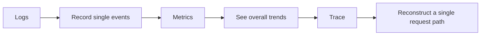

# Logging and Monitoring

:::tip Section overview
Many LLM app demos work well locally, but once they go live, one problem quickly appears:

> **When something goes wrong, you have no idea where it broke.**

The value of logging and monitoring is not “record a few more things,” but:

> When the system fails, you have a way to locate, explain, replay, and fix it.
:::

## Learning objectives

- Understand what problems logs, metrics, and tracing each solve
- Learn how to design structured log fields
- Understand which metrics are most worth monitoring in an LLM system
- Read a minimal example of logs + monitoring

---

## First, build a mental map

Logging and monitoring are easier to understand as “what happened -> how is the system performing overall -> what did a single request go through”:



So what this section really wants to solve is:

- When something goes wrong, which layer should you look at first?
- Why are logs, metrics, and traces all necessary for troubleshooting?

---

## 1. Why is this especially important?

### 1.1 Failures in LLM systems are more hidden than in normal APIs

Errors in ordinary APIs are usually pretty direct:

- 500
- timeout
- invalid parameters

But LLM systems can also have these “soft failures”:

- Answer quality gets worse
- Retrieval drifts
- Token cost skyrockets
- Mistakes happen only in certain scenarios

So if you do not have observability, the system often becomes:

> It looks alive, but in reality it is already half broken.

### 1.2 What do logging and monitoring actually solve?

A rough three-layer view is enough to start:

- Logs: what happened
- Metrics: how often, how fast, and how expensive it is
- Tracing: the full path a request took

### 1.3 A beginner-friendly analogy

You can think of observability as:

- Installing a dashboard, a dashcam, and a maintenance log in the system

Without these, when the system breaks, all you can say is:

- Something feels off

With them, you can actually know:

- Where the problem started
- Whether it is occasional or continuous
- Whether it is a single-request issue or a system-wide issue

---

## 2. Start with logs: the most basic and most often misused tool

### 2.1 What is a “structured log”?

Instead of printing just a string:

```python
print("request received")
```

It is much more useful to record structured fields:

- request_id
- user_id
- stage
- latency_ms
- model_name

### 2.2 A minimal structured log example

```python
log = {
    "trace_id": "trace_001",
    "stage": "retrieval",
    "query": "What is the refund policy?",
    "latency_ms": 120,
    "top_k": 3
}

print(log)
```

The biggest advantage of this kind of log is:

> Later, you can query and aggregate by field instead of reading text manually.

---

## 3. Metrics: the thermometer for overall system health

### 3.1 The most important metrics to monitor

For LLM systems, the most common metrics include:

- Request volume
- Error rate
- Average latency
- P95 / P99 latency
- Token usage
- Number of tool calls
- Retrieval hit rate

### 3.2 A minimal metrics aggregation example

```python
requests = [
    {"latency_ms": 800, "tokens": 600, "ok": True},
    {"latency_ms": 1200, "tokens": 750, "ok": True},
    {"latency_ms": 3000, "tokens": 900, "ok": False}
]

avg_latency = sum(r["latency_ms"] for r in requests) / len(requests)
error_rate = sum(not r["ok"] for r in requests) / len(requests)
avg_tokens = sum(r["tokens"] for r in requests) / len(requests)

print("avg_latency_ms =", avg_latency)
print("error_rate     =", error_rate)
print("avg_tokens     =", avg_tokens)
```

This is the smallest possible prototype of a monitoring dashboard.

### 3.3 A beginner-friendly metric table to remember first

| Metric | What it helps answer |
|---|---|
| Request volume | Is the system busy? |
| Error rate | Does the system fail often? |
| Average / P95 latency | Are users waiting too long? |
| Token usage | Is the cost abnormal? |
| Retrieval hit rate | Is the RAG pipeline getting worse? |
| Tool call success rate | Is the Agent action layer stable? |

This table is useful for beginners because it turns “there are many metrics” back into a few understandable questions.


:::tip Reading the diagram
Logs answer “what happened,” metrics answer “what is the overall trend,” and traces answer “where did a single request go.” When troubleshooting an LLM system, you need all three together, not just 500 errors and timeouts.
:::

---

## 4. Tracing: what exactly did a request go through?

### 4.1 Why do LLM systems especially need traces?

Because a single request usually does not go through just one module; it may pass through:

1. API entry
2. Retrieval
3. Tool calls
4. Model generation
5. Post-processing

If the final answer is wrong, you need to know:

- Was retrieval wrong?
- Or was model generation wrong?
- Or did the tool layer fail?

### 4.2 A minimal trace example

```python
trace = [
    {"trace_id": "trace_001", "stage": "api_in", "latency_ms": 20},
    {"trace_id": "trace_001", "stage": "retrieval", "latency_ms": 120},
    {"trace_id": "trace_001", "stage": "llm_generate", "latency_ms": 850},
    {"trace_id": "trace_001", "stage": "response_out", "latency_ms": 15}
]

for item in trace:
    print(item)
```

The core value of trace is:

> It lets you see the complete journey of the same request.

### 4.3 The safest default order for your first production troubleshooting session

A more reliable order is usually:

1. First check whether metrics show an overall anomaly
2. Then look at logs to see which type of request is failing
3. Finally follow the trace to inspect the full path

This is usually easier than opening a wall of logs right away.

---

## 5. A more realistic minimal observability loop

```python
import time

def timed_stage(name, fn, *args, **kwargs):
    start = time.time()
    result = fn(*args, **kwargs)
    latency_ms = int((time.time() - start) * 1000)
    log = {
        "trace_id": "trace_demo_001",
        "stage": name,
        "latency_ms": latency_ms
    }
    print(log)
    return result

def fake_retrieve(query):
    time.sleep(0.1)
    return ["refund policy"]

def fake_llm(docs):
    time.sleep(0.2)
    return f"Generate an answer based on {docs}"

docs = timed_stage("retrieval", fake_retrieve, "What is the refund policy?")
answer = timed_stage("llm_generate", fake_llm, docs)
print(answer)
```

Although this example is small, it already includes these core fields:

- trace_id
- stage
- latency

---

## 6. What else is worth monitoring in an LLM system?

Compared with a traditional API, an LLM system is usually worth monitoring for these additional things:

### 6.1 Token cost

Because it directly determines:

- How much money you spend
- Whether prompts are getting longer and longer

### 6.2 Retrieval quality

For example:

- Whether top-1 is a hit
- The rate of empty retrieval results

### 6.3 Tool call quality

For example:

- Tool call success rate
- Parameter validation failure rate
- Retry rate

### 6.4 Answer quality signals

For example:

- User follow-up rate
- User correction rate
- Thumbs-down rate

These metrics cannot replace offline evaluation, but they are still very important.

---

## 7. Why alerts should not only ask “is the service down?”

### 7.1 Many LLM issues do not directly cause a 500 error

For example:

- Answer quality keeps dropping
- Token usage suddenly doubles
- Retrieval hit rate falls sharply

The system may still be “alive,” but the business is already clearly broken.

### 7.2 So alerts are best split into two layers

- Basic availability alerts
  - Error rate
  - Timeout rate

- Business quality alerts
  - Retrieval hit rate drops
  - Average token count rises abnormally
  - User negative feedback increases abnormally

### 7.3 A beginner-friendly alert layering table

| Alert type | Typical example |
|---|---|
| Availability alert | High error rate, high timeout rate |
| Cost alert | Token usage spikes, abnormal call volume |
| Quality alert | Retrieval hit rate drops, user follow-up rate rises |

This table is useful for beginners because it reminds you:

- An LLM system can “break” in more than one way

---

## 8. If your goal is a “courseware generation assistant driven by a knowledge base,” what should you monitor first?

This kind of system is more likely than ordinary Q&A to look “fine” while actually drifting off course.

When you build it for the first time, it is especially worth watching these fields:

| Monitoring point | What it is really checking |
|---|---|
| `retrieved_count` | Whether internal materials were actually retrieved |
| `example_count` | Whether example questions were really extracted |
| `source_origin_mix` | Whether internal or external materials are dominant |
| `export_success` | Whether Word export succeeded |
| `schema_valid` | Whether the structured result matches the template requirements |

A minimal log object can look like this:

```python
log = {
    "trace_id": "trace_001",
    "topic": "discount word problems",
    "retrieved_count": 5,
    "example_count": 2,
    "schema_valid": True,
    "export_success": True,
}

print(log)
```

This example is especially good for beginners because it helps you understand:

- The monitoring focus of this kind of project is not just whether the model is fast
- It also includes whether the right materials were found, whether the structure took shape, and whether the document was exported successfully

---

## 9. A very practical checklist of log fields

If you are building an LLM service, the most practical set of fields usually includes:

| Field | Purpose |
|---|---|
| trace_id | Connect the whole request path |
| user_id / session_id | Identify the user or session |
| stage | Which step it is in |
| latency_ms | How long this step took |
| model_name | Which model was used |
| prompt_tokens / completion_tokens | Cost analysis |
| tool_name | Which tool was called |
| retrieval_topk | Retrieval settings |
| error_code | Failure type |

Not every log needs all of these, but this list is a very good starting point for design.

---

## 10. Common mistakes beginners make

### 10.1 Only logging strings, not fields

That makes later aggregation and analysis difficult.

### 10.2 Only logging successes, not failures

This makes error diagnosis very painful.

### 10.3 No trace_id

When something goes wrong, you cannot reconstruct the full request path.

### 10.4 Monitoring only availability, not business quality

This is a very common problem in LLM projects.

---

## Summary

The most important thing in this section is not “learning how to write logs,” but understanding:

> **Logs, metrics, and traces together form system observability, and they determine whether you can truly maintain a production LLM service.**

Without observability, many failures can only be guessed at;  
with observability, the system becomes maintainable.

## If you turn this into a project or system design, what is most worth showing?

What is most worth showing is usually not:

- “I connected a logging system”

But rather:

1. A trace for a single request
2. A set of key metrics
3. How a typical error case was located
4. How quality alerts and availability alerts are layered

That way, other people can more easily see:

- You understand the full observability loop
- You are not just able to print logs

---

## Exercises

1. Add an `error_code` field to `timed_stage()` in this section.
2. Design your own log structure specifically for the retrieval stage.
3. Think about this: if the service error rate does not change, but the user follow-up rate suddenly increases, what does that usually mean?
4. Explain in your own words: why can’t LLM system alerts rely only on 500 errors and timeouts?
