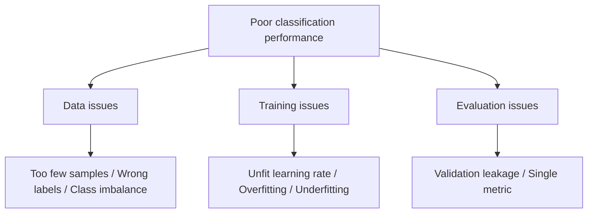

# Image Classification Training Tricks

:::tip Section Overview
An image classification project is not something you can fix just by switching models. In many cases, the real factors that determine performance are training details: whether data augmentation is reasonable, whether the learning rate is stable, whether the validation set is trustworthy, and whether error samples have been analyzed.
:::

## Learning Objectives

- Be able to identify common causes of non-converging training, overfitting, and underfitting
- Understand the roles of learning rate, batch size, data augmentation, and regularization
- Know how class imbalance and data leakage affect classification results
- Use error sample analysis to guide the next round of improvements

---

## First, Look at the Training Problem Map



## 1. Learning Rate Is the First Knob to Check

If the learning rate is too large, the loss may oscillate or even diverge; if it is too small, training will be very slow, and the model may look like it is not learning anything. When you are starting out, begin with a common default value and then observe the training curve.

```python
optimizer = torch.optim.Adam(model.parameters(), lr=1e-3)
scheduler = torch.optim.lr_scheduler.StepLR(optimizer, step_size=5, gamma=0.1)
```

If both the training loss and validation loss are high, the model may be underfitting or the learning rate may be inappropriate. If the training loss is very low but the validation loss is very high, it is usually overfitting or a problem with the data split.

## 2. Data Augmentation Should Match Real-World Scenarios

Data augmentation is not about doing as much as possible, but about simulating changes that may occur in the real world. For cat-and-dog classification, horizontal flipping is fine; but for digit recognition, rotating an image by 180 degrees at random may change the meaning. Medical images also cannot be augmented arbitrarily in ways that break imaging logic.

```python
from torchvision import transforms

train_tfms = transforms.Compose([
    transforms.RandomResizedCrop(224),
    transforms.RandomHorizontalFlip(),
    transforms.ColorJitter(brightness=0.2, contrast=0.2),
    transforms.ToTensor(),
])
```

The principle for augmentation is: apply augmentation to the training set, not to the validation set with random transforms; augmentation should preserve the label semantics; and after augmentation, it is best to manually inspect a few images.

## 3. How to Tell Overfitting from Underfitting

| Phenomenon | Possible Cause | First Step to Take |
|---|---|---|
| Both training and validation are poor | Model too weak, not enough training, learning rate issue | Train more epochs, adjust learning rate, switch backbone |
| Training is good but validation is poor | Overfitting, too little data, insufficient augmentation | Stronger augmentation, regularization, early stopping, more data |
| Training fluctuates a lot | Batch too small, learning rate too large | Lower the learning rate, increase batch size, check data |
| Validation score is unusually high | Data leakage | Check for duplicate images and whether the same subject appears across splits |


:::tip Reading Guide
This diagram breaks training problems into three lines: data, training, and evaluation. When you see poor classification performance, do not rush to change the model. First look at the loss curves, validation leakage, class imbalance, and error samples.
:::

## 4. For Class Imbalance, Check the Confusion Matrix

Accuracy can be very misleading when classes are imbalanced. For example, if 95% of images are normal samples, a model that always predicts normal can still get 95% accuracy, but it completely fails to recognize abnormal cases.

```python
from sklearn.metrics import classification_report, confusion_matrix

print(classification_report(y_true, y_pred))
print(confusion_matrix(y_true, y_pred))
```

For class imbalance, you can consider resampling, class weights, focal loss, or adding more data for minority classes. Which method to choose depends on whether the minority-class samples are reliable enough.

## 5. Error Sample Analysis

After each training run, manually inspect at least 20 error samples. Group them into categories: wrong labels, poor image quality, blurry class boundaries, the model focusing on the wrong area, or too few similar samples in the training set. Error sample analysis is often more useful for the next step than blindly switching models.

## 6. Minimal Training Log Template

In your README or experiment notes, it is recommended to keep: dataset version, training/validation split method, model architecture, input size, augmentation strategy, learning rate, batch size, number of epochs, best metric, confusion matrix, screenshots of error samples, and the next action plan.

## Common Mistakes

The first mistake is looking only at accuracy and not class-level metrics. The second mistake is using random augmentation on the validation set. The third mistake is having the same object or the same video frames appear in both training and validation, causing leakage. The fourth mistake is switching models as soon as performance looks poor, without first checking the data and training curves.

## Exercises

1. Train a small classification model and plot the train loss and val loss curves.
2. Use weak augmentation and strong augmentation on the same model, and compare validation results.
3. Output the confusion matrix and identify the two most easily confused classes.
4. Organize 10 error samples and write one possible reason for each.

## Passing Standard

After finishing this section, you should be able to identify common problems from training curves, design reasonable data augmentation, use the confusion matrix to analyze class issues, and write error sample analysis into the README of an image classification project.
