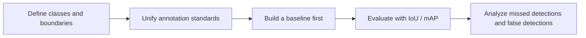

# Detection Practice

:::tip Section positioning
When you really do a detection project, the difficulty is often not just the model itself.  
More common problems are:

- How to annotate
- How to define positive and negative samples
- How to evaluate small objects
- Whether a detection box is actually correct

So the focus of this section is to take a minimal detection project from problem definition all the way to an evaluation loop.
:::

## Learning objectives

- Learn how to define a minimal object detection project
- Understand the logic of annotation, box matching, and evaluation in detection projects
- Build an IoU-driven evaluation intuition through a runnable example
- Set up a presentation scaffold for a detection project

---

## First, build a map

If you just finished the detection overview, classic detectors, and YOLO, the most natural continuation here is:

- You already know what detection tasks are solving
- Now we ask, “If we turn this into a real project, where should we start?”

So the truly important part of this section is not a new model, but:

- Class definition
- Annotation standards
- Evaluation criteria
- Error analysis

For beginners, the best order to understand detection practice is not “train a model first,” but to first see the project loop clearly:



So what this section really wants to solve is:

- How a detection project should move forward
- Which parts are more likely to go wrong than the model structure itself

## 1. What should be defined first in a detection project?

### 1.1 Class boundaries

For example, in a security scenario you might only start with:

- person
- helmet

instead of trying to cover every possible target from the beginning.

### 1.2 Annotation standards

You must first make it clear:

- How tight the box should be
- How to label occlusion
- How to handle small objects

### 1.3 Evaluation criteria

At minimum, you need to clarify:

- IoU threshold
- Recall / precision

### 1.4 When a beginner builds a detection project for the first time, how should they choose the task to make it more stable?

A more stable task usually has these characteristics:

- Not too many classes
- Clear target definitions
- False detections and missed detections that can be understood with the naked eye

So when you do your first project,  
“fewer classes, stronger definitions, easier explanation” is usually more important than “a cooler task.”

### 1.5 Why is this step more important than “choosing a model first”?

Because if these things are not settled well at the start:

- Class boundaries
- Annotation rules
- Box conventions
- IoU threshold

Then no matter how many model comparisons you do later, you may still be spinning in circles on top of messy standards.

---

## 2. Run a minimal matching evaluation example first

```python
ground_truth = [
    {"label": "person", "box": (10, 10, 30, 50)},
    {"label": "helmet", "box": (14, 8, 24, 18)},
]

predictions = [
    {"label": "person", "box": (11, 12, 31, 48), "score": 0.92},
    {"label": "helmet", "box": (15, 9, 23, 17), "score": 0.81},
    {"label": "helmet", "box": (40, 40, 50, 50), "score": 0.30},
]


def iou(box_a, box_b):
    ax1, ay1, ax2, ay2 = box_a
    bx1, by1, bx2, by2 = box_b

    inter_x1 = max(ax1, bx1)
    inter_y1 = max(ay1, by1)
    inter_x2 = min(ax2, bx2)
    inter_y2 = min(ay2, by2)

    inter_w = max(0, inter_x2 - inter_x1)
    inter_h = max(0, inter_y2 - inter_y1)
    inter_area = inter_w * inter_h

    area_a = (ax2 - ax1) * (ay2 - ay1)
    area_b = (bx2 - bx1) * (by2 - by1)
    union = area_a + area_b - inter_area
    return inter_area / union if union else 0.0


matches = []
for pred in predictions:
    best_iou = 0.0
    best_gt = None
    for gt in ground_truth:
        if gt["label"] != pred["label"]:
            continue
        cur_iou = iou(pred["box"], gt["box"])
        if cur_iou > best_iou:
            best_iou = cur_iou
            best_gt = gt
    matches.append(
        {
            "label": pred["label"],
            "score": pred["score"],
            "best_iou": round(best_iou, 4),
            "matched": best_iou >= 0.5,
        }
    )

print(matches)
```

### 2.1 What is the most important part of this code?

It shows you that detection evaluation is not:

- “The class is correct, so it’s fine”

Instead, it is:

- The class must be correct
- The box must also be accurate enough

### 2.2 Why is this the core judgment in many detection projects?

Because in real detection results,  
the final quality is often reflected in:

- Matching threshold
- Box quality

### 2.3 Why do detection projects especially need a “false detection / missed detection” perspective?

Because detection systems rarely have only two outcomes: “correct” or “incorrect.”  
More often, you’ll see:

- The box is off
- The target was missed
- An extra box was reported

That is why, when presenting a detection project, it’s best not to show only a few success cases.

### 2.4 When doing a detection project for the first time, what types of errors are most worth separating first?

A very practical way to categorize errors is:

1. Missed detection  
   There is clearly a target, but the system did not report it.

2. False detection  
   The system reported a target even though there was none.

3. Poor localization  
   The class is correct, but the box deviation is too large.

Once you separate these three, many of your next iteration directions become much clearer immediately.


:::tip Reading guide
When presenting a detection project, don’t just show success screenshots. When reading this figure, look at four parts: annotation standards, IoU/mAP evaluation, the false detection / missed detection / poor localization buckets, and whether the next round should improve data, thresholds, or the model.
:::

---

## 3. The most common pitfalls in detection projects

### 3.1 Inconsistent annotation standards

This will directly mess up both training and evaluation.

### 3.2 Small objects and occlusion are not analyzed separately

Many systems show a clear drop in performance in these scenarios.

### 3.3 Only showing one or two pretty images

A real project should also show:

- Which situations are likely to cause missed detections
- Which situations are likely to cause false detections

## 4. A progress order that beginners can directly follow

A better approach is:

1. Define the classes and annotation rules first
2. Then sample and check annotation quality
3. Build a minimal baseline first
4. Unify the IoU / mAP evaluation criteria
5. Finally, pick typical missed detections / false detections for analysis

### 4.1 If you turn it into a portfolio project, what is most worth showing?

Compared with only showing one “prediction result” image, what is more valuable is:

- Class definitions and annotation rules
- The baseline IoU / mAP
- A set of typical false detection and missed detection cases
- How you explain these failures
- What you would improve first next: data, thresholds, or model

---

## Summary

The most important thing in this section is to build a project mindset:

> **The key to a detection project is not just the model name, but whether the class definitions, annotation standards, and box-level evaluation methods are clear.**

## What you should take away from this section

- A detection project is first an annotation and evaluation project, and only then a model project
- The IoU threshold and annotation conventions directly affect how you judge whether a detection is correct
- False detection / missed detection analysis is one of the most valuable parts of a detection project to present

If we compress it into one sentence, it is:

> **The real difficulty in a detection project is often not getting the model to run, but clearly defining what counts as a correct detection.**

---

## Exercises

1. Change the IoU threshold to `0.7` and see how the matching result changes.
2. Think about why detection projects depend more on clear annotation standards than classification projects do.
3. If a project keeps missing small objects, would you check the data, input resolution, or model structure first?
4. How would you package this detection project into a portfolio piece?
