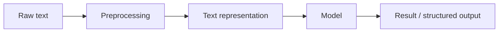

# NLP Overview


:::tip Reading guide
First think of NLP as the overall process of “text -> computable structure or result”: the same piece of text can go through different tasks such as classification, extraction, generation, and retrieval-based QA, and all later models serve these task boundaries.
:::

## Learning Objectives

By the end of this section, you will be able to:

- Explain what problems NLP solves
- Understand the most common kinds of tasks in NLP
- Understand a basic NLP workflow
- Know why text processing is often more “awkward” than tables and images
- Build intuition for “text -> structured result” through a minimal example

---

## 1. What is NLP actually doing?

NLP stands for Natural Language Processing.

Put more plainly:

> **NLP is about making computers process human language.**

“Language” here includes many forms:

- Chat messages
- Comments
- News articles
- Contracts
- Support tickets
- Emails
- Search queries
- Meeting notes

What it ultimately aims to solve is not just “recognizing words,” but going further:

- Understanding meaning
- Extracting information
- Generating answers
- Completing tasks

---

## 2. What are the most common tasks in NLP?

You can first think of NLP tasks in four major categories:

### 1. Sentence-level judgment

Input: a piece of text; output: one overall result.

For example:

- Text classification  
  “Is this a refund issue or an invoice issue?”
- Sentiment analysis  
  “Is this review positive or negative?”

### 2. Span localization

Input: a piece of text; output: some key spans within it.

For example:

- Named entity recognition  
  Extract `John Smith` and `Beijing` from “John Smith works in Beijing”
- Information extraction  
  Extract time, place, and people from an announcement

### 3. Text-to-text

Input: a piece of text; output: another piece of text.

For example:

- Machine translation
- Text summarization
- Paraphrasing
- Question answering generation

### 4. Interactive and system-level tasks

Input is not necessarily just single-turn text; it may also include state, history, and tool outputs.

For example:

- Chatbots
- RAG question-answering systems
- Agents

These tasks combine the capabilities above.

---

## 3. Why is text processing usually harder than tabular data?

### 1. Text is ambiguous

One sentence can have multiple interpretations.

For example:

> “This phone is not cheap, but the camera is really strong.”

If you only look at “not cheap,” it is easy to misjudge it as negative;  
but the whole sentence is actually more of a positive evaluation.

### 2. Text depends heavily on context

Many words do not mean much on their own; they gain specific meaning in context.

For example:

- `bank`
  can mean a financial institution or the side of a river

### 3. Text expression is not standardized

Users may describe the same thing in many different ways.

For example:

- “How do I get a refund?”
- “How do I handle a refund?”
- “Can I still refund this order?”

These texts look very different on the surface, but their intent is similar.

### 4. Text is naturally unstructured

Tabular data often has clear column meanings:

- Age
- Income
- City

But text is usually free-form human expression.  
The model must first turn it into a computable structure.

---

## 4. What does a typical NLP workflow look like?

The most basic pipeline can be understood as:



Each step here matters:

- Preprocessing  
  Clean up noisy text so it fits the current task better
- Text representation  
  Convert words into numbers
- Model  
  Learn the relationship between inputs and targets
- Output  
  Turn it into labels, answers, summaries, or entity spans

Most of the later chapters in Chapter 11 Natural Language Processing (elective track) are actually built by expanding this pipeline step by step.

---

## 5. Let’s run a minimal NLP example

The example below is very simple, but it already fully shows the core NLP workflow:

1. The input is text
2. Do a minimal amount of preprocessing
3. Use rules to recognize intent
4. Output a structured result

```python
import re

texts = [
    "Help me check today's weather in Beijing",
    "Please help me book a flight to Shanghai",
    "Calculate what 25 times 4 is",
    "Will it rain in Shenzhen tomorrow",
]


def classify_intent(text):
    text = re.sub(r"\s+", "", text)

    if "weather" in text or "rain" in text:
        return "weather_query"
    if "flight" in text or "book_ticket" in text:
        return "ticket_booking"
    if "calculate" in text or "times" in text:
        return "calculation"
    return "unknown"


for text in texts:
    print(text, "->", classify_intent(text))
```

### What should you really take away from this example?

It shows that the smallest NLP loop is actually quite straightforward:

- The input is natural language
- The system recognizes patterns in it
- The final output is structured

Even though this example only uses rules, it is already the most basic NLP system.

---

## 6. Three major development paths in NLP

### 1. Rule-based systems

Use manually written rules and logic.

Pros:

- Easy to explain
- Quick to start for small tasks

Cons:

- Hard to maintain
- Poor generalization

### 2. Traditional machine learning

First design features, then train a classifier.

For example:

- BoW
- TF-IDF
- SVM
- Logistic regression

### 3. Deep learning and pre-trained models

Let the model learn representations and contextual relationships directly.

For example:

- RNN / LSTM
- Transformer
- BERT
- GPT

So many things you will learn later are essentially answering the same question:

> **How can we make machines process human language more and more reliably?**

---

## 7. Why is NLP so closely related to LLMs, RAG, and Agents?

Because LLMs are still fundamentally processing text.  
If you do not understand these basic concepts:

- token
- semantic representation
- context
- classification
- extraction
- generation

then when you later learn about LLMs, RAG, and Agents, it is easy to stop at:

- Knowing how to call an API

instead of:

- Really understanding what they are doing

So Chapter 11 Natural Language Processing (elective track) is not a detour; it is laying the foundation for what comes next.

---

## 8. Common beginner misconceptions

### 1. Thinking NLP is the same as chatbots

Chat is only one application scenario of NLP, not the whole field.

### 2. Thinking preprocessing is just a minor detail

In many tasks, preprocessing quality directly affects the upper bound of performance.

### 3. Thinking only deep learning counts as NLP

Rule-based systems and traditional machine learning are still very valuable in many small and medium-sized tasks.

### 4. Thinking that if humans “understand” text, machines can process it directly

For machines, text must first be converted into a computable form.

---

## Summary

The most important sentence to remember from this lesson is:

> **The essence of NLP is turning natural language into something computable, modelable, and reason-able.**

Later you will see:

- Preprocessing solves “how to organize text”
- Text representation solves “how to turn text into numbers”
- Models solve “how to learn patterns from numbers”

As long as this map is clear in your mind, the later content in Chapter 11 Natural Language Processing (elective track) will be much easier to follow.

---

## Exercises

1. Explain in your own words: why is text processing often harder than tabular data?
2. Extend the rule in the example to add a `hotel_booking` intent classification.
3. Think about it: why is a chatbot only one application of NLP, not the whole field?
4. Can you break down one AI product you are familiar with into the NLP tasks it uses behind the scenes?
