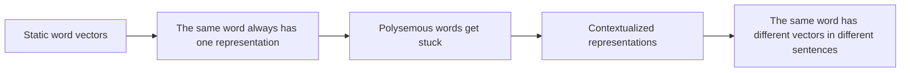

# Contextual Embeddings


:::tip Section overview
In the previous section, we saw that word embeddings can map words into a semantic space.  
But there is a big problem you will run into very quickly:

> **The same word may not mean the same thing in different contexts.**

If every word always has only one fixed vector, this is hard to handle.

That is exactly why “contextualized representations” were introduced.
:::

## Learning goals

- Understand why fixed word vectors are not enough
- Understand the core idea behind contextualized representations
- Build an intuition for “the same word, different vector” through runnable examples
- Understand why this is a key turning point from traditional NLP to modern pretraining models

---

## First, build a map

For beginners, the best way to understand this section is not “it is just a stronger word embedding,” but first to see clearly:



So what this section is really trying to solve is:

- Why fixed word vectors eventually become insufficient
- Why “word meaning depends on context” changes the main direction of NLP

### A more beginner-friendly overall analogy

You can think of static word vectors and contextualized representations as:

- Static word vectors are like a “fixed profile photo” in a dictionary
- Contextualized representations are like an actor’s “role state” in different scenes

The same actor is still the same person,  
but in different scenes, their expression, actions, and role identity change.  
Likewise:

- The same word in different sentences
- Should not always look like the same vector

## 1. What is the fundamental limitation of fixed word vectors?

### 1.1 A word may have multiple meanings

Classic example:

- `bank`

It can mean:

- a financial bank
- a river bank

If it always has only one fixed vector,  
then what should that vector be closer to?

### 1.2 So fixed word vectors struggle with polysemous words

Even if static embeddings are very good,  
they still treat:

- “open a bank account”
- “sit on the river bank”

as the same `bank` vector.

### 1.3 An analogy

A fixed word vector is like giving every person one ID photo that never changes.  
A contextualized representation is more like a dynamic work photo based on the current scene:

- One version when working at a bank
- Another version when walking by a river

---

## 2. What exactly do contextualized representations do?

### 2.1 Core idea

It is not “one vector per word,”  
but:

- one vector for each word in the current sentence

In other words,  
the representation is determined not only by the word itself,  
but also by the surrounding context.

### 2.2 Why is this important?

Because the real difficulty in NLP has never been just “what is the word,”  
but:

- what does the word mean in this sentence

### 2.3 What does this change?

This moves representation learning from:

- static lookup

to:

- dynamic semantic encoding

This is also one of the key reasons modern pretraining models can significantly improve performance on many tasks.

---

## 3. Let’s first run an intuitive “same word, different vector” example

The example below does not implement real BERT,  
but it clearly simulates the process of “word vector + contextual adjustment.”

```python
base_embeddings = {
    "bank": [0.5, 0.5],
    "money": [0.9, 0.1],
    "river": [0.1, 0.9],
}

context_shifts = {
    "finance": [0.3, -0.2],
    "nature": [-0.2, 0.3],
}


def contextualize(word, context_type):
    base = base_embeddings[word]
    shift = context_shifts[context_type]
    return [round(base[0] + shift[0], 3), round(base[1] + shift[1], 3)]


bank_in_finance = contextualize("bank", "finance")
bank_in_nature = contextualize("bank", "nature")

print("bank in finance:", bank_in_finance)
print("bank in nature :", bank_in_nature)
```

### 3.1 Of course, this code is not a real contextual model

But it captures the most important intuition:

- The word itself has a base representation
- Context pushes that representation in different directions

### 3.2 Why is this intuition important enough?

Because when you later learn BERT, GPT, and T5,  
you will keep seeing one fact:

- the final representation of a token depends on the entire context

### 3.3 What should you remember first when learning this section?

The most important things to remember first are:

1. Static embeddings are naturally weak on polysemous words
2. Contextualized representations answer “what does this word mean in this sentence”
3. This is a key step that makes modern pretraining models much stronger

### 3.4 Another minimal example showing how a context window affects representation

```python
sentences = [
    ("bank", ["open", "account", "money"], "finance"),
    ("bank", ["river", "water", "shore"], "nature"),
]


def explain_representation(word, context_words, sense):
    return {
        "word": word,
        "context": context_words,
        "sense": sense,
    }


for word, context_words, sense in sentences:
    print(explain_representation(word, context_words, sense))
```

This example is definitely not a neural network,  
but it helps beginners build a crucial awareness:

- A word’s representation must be viewed together with the surrounding context

Otherwise, it is hard to clearly say:

- which meaning the word has right now

---

## 4. What practical changes do contextualized representations bring?

### 4.1 Polysemy handling becomes more natural

The model can distinguish the representation of the same word in different sentences.

### 4.2 Sentence and paragraph understanding becomes stronger

Because the word representation is no longer isolated,  
it already incorporates contextual clues.

### 4.3 Transfer learning works better

Many downstream tasks no longer need to learn complex representations from scratch,  
but can directly use contextualized hidden states.

### 4.4 Why does this step directly raise the ceiling for many tasks?

Because the real difficulty in many NLP tasks is not:

- what a word probably means

but:

- what role it actually plays in the current context

Once the representation layer starts distinguishing this,  
many classification, extraction, and question-answering tasks become naturally more stable.

### 4.5 If we put this into tasks, which scenarios should you think of first?

Contextualized representations are especially easy for beginners to appreciate in these scenarios:

1. Polysemy classification
2. Named entity recognition
3. Question answering
4. Machine translation

Because what is truly hard in these tasks is often not:

- what the word means in a dictionary

but:

- what role it plays in this sentence

---

## 5. What is the relationship between this and static word vectors?

### 5.1 Not a complete replacement, but an upgrade in capability

Static word vectors still have educational value and are useful in some lightweight tasks.  
But on the main line of modern NLP, contextualized representations are usually stronger.

### 5.2 A simple summary

- Static embedding: fixed representation at the word level
- Contextualized representation: dynamic representation of a token in a sentence

---

## 6. The most common misconceptions

### 6.1 Misconception 1: Contextualized representations are just “bigger word vectors”

Not true.  
The key change is:

- the representation depends on context

### 6.2 Misconception 2: Different vectors for the same word are just a minor optimization

No.  
This step actually changes the performance ceiling of many tasks.

### 6.3 Misconception 3: Once you have contextualized representations, you no longer need higher-level modeling

Contextualized representations are powerful,  
but they still need to be used within specific tasks and specific models.

## If you turn this into study notes or a project, what is most worth showing?

What is usually most worth showing is not:

- “BERT is stronger”

but:

1. A comparison of the same word across different sentences
2. The difference between static embeddings and contextualized representations
3. Which tasks depend especially on this capability
4. Why this step became a watershed moment in modern NLP

That way, others can immediately see:

- You understand “why it becomes stronger”
- Not just the model names

## Summary

The most important thing in this section is to build a judgment:

> **Fixed word vectors can only answer “what a word generally looks like,” while contextualized representations begin to answer “what this word means in this sentence.”**

This step is an important threshold for modern NLP to truly enter the pretraining era.

---

## What you should take away from this section

- Contextualized representations are not “bigger word vectors,” but “representations that change with the sentence”
- They are the key turning point from traditional NLP to modern pretraining models
- When you later study BERT, GPT, and T5, you should keep this line of thinking in mind

---

## Exercises

1. Add another word `apple` to the example and simulate how its representation changes in the “fruit” and “company” contexts.
2. Explain in your own words: why do fixed word vectors struggle with polysemous words?
3. Why do contextualized representations make many downstream tasks easier?
4. Think about this: if the representation already depends on context, is the “word itself” still important? Why?
