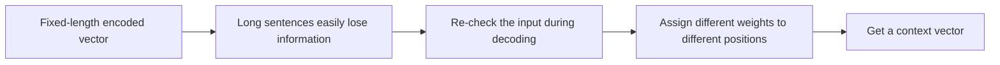

# Attention Mechanism in NLP


:::tip Section Overview
In the previous section, we mentioned a typical problem in Seq2Seq:

- After the input is compressed into a fixed vector, information from long sentences is easily lost

The attention mechanism solves exactly this bottleneck:

> **When generating each output word, the model does not have to rely on only one fixed representation. Instead, it can re-check the most relevant positions in the input sequence.**
:::

## Learning Objectives

- Understand the background for the emergence of attention mechanisms
- Understand the core intuition of “alignment” and “weighted aggregation”
- Use a runnable example to understand attention weights and context vectors
- Build an intuitive connection between attention and the later Transformer

---

## First, Build a Map

The most beginner-friendly learning order for this section is:



So what this section really wants to solve is:

- Why a fixed vector becomes a bottleneck
- Why “dynamically looking at the input” is more natural

### A Better Overall Analogy for Beginners

You can think of attention as:

- While doing reading comprehension, you look at the question and go back to the original text to find the most relevant sentence

Without attention,  
it is like you can only compress the whole article into a vague impression in the last second after reading it, and then answer the question.  
That quickly becomes exhausting.

With attention, the model is more like this:

- For the word I am generating now, which part of the input should I focus on?

## 1. Why Does Seq2Seq Need Attention?

### 1.1 Fixed-Length Encoding Easily Loses Information

If the input is:

- a very long sentence
- a complex paragraph

then compressing it into a single fixed vector will make the decoder struggle later.

### 1.2 The Decoder Should Focus on Different Things at Different Time Steps

For example, in translation:

- When generating the first word, focus on the beginning of the input
- When generating later words, focus on other positions in the input

So “looking at the same vector for the entire output process” is not very natural.

### 1.3 The Core Intuition of Attention

Each time an output is generated,  
the model asks based on the current decoder state:

- Which parts of the input sequence are most relevant to me?

Then it aggregates the relevant positions with weights to form the current context.

---

## 2. Run a Minimal Attention Example First

```python
import math

encoder_states = [
    [1.0, 0.0],
    [0.5, 0.5],
    [0.0, 1.0],
]

query = [0.7, 0.3]


def dot(a, b):
    return sum(x * y for x, y in zip(a, b))


def softmax(values):
    exps = [math.exp(v) for v in values]
    total = sum(exps)
    return [round(v / total, 4) for v in exps]


scores = [dot(state, query) for state in encoder_states]
weights = softmax(scores)

context = [0.0, 0.0]
for w, state in zip(weights, encoder_states):
    context = [context[i] + w * state[i] for i in range(len(context))]

print("scores :", [round(x, 4) for x in scores])
print("weights:", weights)
print("context:", [round(x, 4) for x in context])
```

### 2.1 What Should You Focus on in This Code?

The three key steps are:

1. Score `query` against each `encoder_state`
2. Use `softmax` to get attention weights
3. Use the weights to compute a weighted average of the encoder states

### 2.2 Why Does This Already Show the Essence of Attention?

Because it answers two core questions:

- Who should I look at?
- How much should I look?

That is the most important intuition behind attention.

### 2.3 For a Beginner Learning Attention for the First Time, What Three Things Should You Remember First?

1. `query` represents what you are currently looking for
2. `score` represents how relevant each input position is to the current need
3. `weights`, after softmax, determine “how much to look at” each position

### 2.4 Another Minimal Example of Alignment Between an Output Word and Input Words

```python
source_tokens = ["i", "love", "nlp"]
attention_weights = [0.1, 0.2, 0.7]


for token, weight in zip(source_tokens, attention_weights):
    print({"source_token": token, "weight": weight})
```

Although this example is much simpler than a real model,  
it is very helpful for beginners to first build a visual sense:

- When generating the current output word
- The model does not average over all input tokens equally
- Instead, it puts more attention on more relevant positions

---

## 3. Why Does Attention Significantly Improve Seq2Seq?

### 3.1 It Relieves the Information Bottleneck

The input no longer has to be passed to the decoder through only one fixed vector.

### 3.2 It Makes Input-Output Alignment More Natural

Many translation tasks already have a structure where “a certain output word roughly corresponds to some input words.”  
Attention makes this alignment easier to learn.

### 3.3 It Is Also the Bridge from Classic Seq2Seq to Transformer

Later, Transformer extends attention more thoroughly,  
but the intuitive foundation in this section is the same.

### 3.4 When Learning This Section for the First Time, the Most Worthwhile Thing to Look at Is the Process, Not the Formula

A more stable learning order is usually:

1. First see why fixed encoding gets stuck
2. Then see what the query is “asking for”
3. Then see how scores and weights distribute attention
4. Finally, look at how the context vector is computed

This is usually easier than staring at matrix formulas from the start.

---

## 4. The Most Common Pitfalls

### 4.1 Mistake 1: Attention Is Just a Weighted Average Trick

Not quite.  
It changes how the model accesses input information.

### 4.2 Mistake 2: With Attention, Nothing Is Ever Lost

No.  
Long sequences still remain difficult; the bottleneck is just significantly reduced.

### 4.3 Mistake 3: Attention Is the Same as Transformer

Attention is a broader concept, and Transformer is a complete architecture developed on top of it.

## If You Turn This Into Notes or a Project, What Is Most Worth Showing?

What is most worth showing is usually not:

- “attention was used” in one line

but rather:

1. The input sequence
2. The current output position
3. The weights for each input position
4. Which positions received the most focus

That way, others can immediately see:

- You understand how attention aligns to the input
- Not just that it is a buzzword

## Summary

The most important thing in this section is to build a bridging intuition:

> **The attention mechanism lets the decoder re-check the most relevant positions in the input sequence at each generation step, thereby relieving the information bottleneck of a fixed encoded vector.**

Once you understand this clearly, learning self-attention in Transformer later will become much easier.

---

## What You Should Take Away from This Section

- Attention is not a small trick; it changes how the model accesses input information
- Its most important value is relieving the bottleneck of fixed encoding
- Once you understand this section, Transformer will feel much smoother to learn

---

## Exercises

1. Change `query` and see how the attention weights change.
2. Explain in your own words: why does Seq2Seq need to “dynamically look at the input” instead of relying only on a fixed vector?
3. Why do `weights` need to go through softmax?
4. Think about it: what is the core similarity between the attention in this section and the self-attention in Transformer later?
