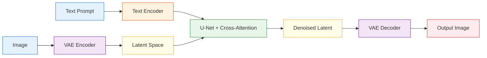

# Stable Diffusion Architecture


:::tip Section Overview
In the previous section, we learned that the core idea of diffusion models is:

> Recover structure step by step from noise.

This section answers:

> **Why can Stable Diffusion really make this practical in engineering?**

The key is not just “diffusion”, but also:

- latent space
- text conditioning
- U-Net
- VAE
- cross-attention
:::

## Learning Objectives

- Understand the overall module responsibilities in Stable Diffusion
- Understand why it diffuses in latent space instead of pixel space
- Understand what the text encoder, U-Net, and VAE each do
- Understand how cross-attention connects text to image generation
- Build a system-level map of the Stable Diffusion workflow

---

## 1. Why isn’t the original diffusion idea practical enough?

### 1.1 The most intuitive problem: pixel space is too large

If you diffuse directly in the original image pixel space:

- as resolution grows, the tensor becomes very large
- both inference and training become expensive

For example:

- `512 x 512 x 3`

is already a very large representation space.

### 1.2 The key shift in Stable Diffusion

Its most important step is:

> **Do not diffuse directly on the original image. First compress the image into latent space, and then diffuse there.**

This idea is later called:

- latent diffusion

It greatly improves engineering feasibility.

---

## 2. Let’s first look at the overall structure



A simple way to remember it is to split it into three main parts:

1. Text encoder: turns the prompt into a conditioning representation
2. U-Net: performs denoising in latent space
3. VAE: converts between image space and latent space

---

## 3. What exactly is the role of the VAE here?

### 3.1 It acts more like a compressor than the main generator

In Stable Diffusion, the VAE mainly does this:

- Encoder: compresses the image into a latent
- Decoder: decodes the latent back into an image

In other words, it mainly serves as a bridge between:

> image space and latent space.

### 3.2 Why is this step so important?

Because if diffusion is done directly in image space, the cost is too high.  
The VAE provides a much smaller and more abstract intermediate space.

You can think of it like this:

> Instead of carving directly on a huge high-resolution canvas, first compress it into a much smaller “semantic sketch board.”

### 3.3 A minimal intuition example for “compression / expansion”

```python
import numpy as np

image = np.random.randn(8, 8).astype(np.float32)

# Use average pooling to simulate compression
latent = image.reshape(4, 2, 4, 2).mean(axis=(1, 3))

# Use repeat to simulate decoding
reconstructed = np.repeat(np.repeat(latent, 2, axis=0), 2, axis=1)

print("image shape        :", image.shape)
print("latent shape       :", latent.shape)
print("reconstructed shape:", reconstructed.shape)
```

Of course, this example is not a VAE, but it is enough to help you grasp the core intuition:

- latent is smaller than the original image
- latent is a more compressed representation

---

## 4. Why is the text encoder indispensable?

### 4.1 The prompt cannot be understood directly by the U-Net

The U-Net processes numeric tensors, and it cannot directly understand natural language such as:

- “an orange cat sitting by the window”

### 4.2 So we need a text encoder first

The text encoder turns the prompt into:

- a set of semantic vectors

You can think of it as:

> **Translating language conditions into numeric conditions that the image generation pipeline can consume.**

### 4.3 A simple illustration

```python
text_condition = {
    "prompt": "an orange cat sitting by the window",
    "embedding_shape": (77, 768)
}

print(text_condition)
```

The most important thing here is not the exact dimensions, but understanding that:

- the prompt is first converted into vectors
- the visual backbone later uses these vectors

---

## 5. Why did U-Net become the backbone of diffusion?

### 5.1 U-Net is naturally good at multi-scale information processing

Typical U-Net characteristics include:

- encoder path: gradually compresses and extracts abstract features
- decoder path: gradually restores spatial details
- skip connections: help preserve details instead of losing them completely

### 5.2 Why is this a good fit for denoising?

Because denoising requires both:

- understanding global structure
- preserving local details

And U-Net is very good at exactly this kind of task.

So in Stable Diffusion, the role of U-Net is:

> **Predict noise in latent space and progressively remove it.**

---

## 6. Why is cross-attention so important?

### 6.1 Text and images are not naturally connected

If you only have:

- a text encoder
- a U-Net

but no clear mechanism for the image to “look at” the text, then the prompt control effect will be weak.

### 6.2 The intuition behind cross-attention

Its core idea is:

> Let the image denoising process refer to the text condition while updating itself.

In other words, when the image latent is updated, it does not only look at its own state; it also looks at:

- the semantic signals provided by the prompt

### 6.3 A very simple illustration

```python
latent_feature = "current image latent features"
text_feature = "orange cat + window + sunset"

fusion = f"{latent_feature} updates while referring to {text_feature}"
print(fusion)
```

Although this is only a textual illustration, it captures the essence:

- self-attention is more like “looking at yourself”
- cross-attention is more like “the image looking at the text”

---

## 7. Putting the whole workflow together

You can compress the main Stable Diffusion flow into these 5 steps:

1. prompt -> text encoder
2. randomly initialize latent noise
3. U-Net performs step-by-step denoising under text conditioning
4. obtain a cleaner latent
5. VAE Decoder decodes the latent into an image

```python
workflow = [
    "prompt -> text encoder",
    "latent noise",
    "U-Net denoise with text condition",
    "clean latent",
    "decode to image"
]

for step in workflow:
    print(step)
```

This is the most important main workflow of Stable Diffusion.

---

## 8. Why did it become such an important architecture for text-to-image generation?

### 8.1 Because it balances quality and engineering feasibility

Compared with direct pixel-space diffusion:

- latent diffusion is lighter
- training and inference are more practical

### 8.2 Because it is well suited for conditional control

Stable Diffusion is naturally good for:

- text-to-image generation
- image editing
- local inpainting
- style control

### 8.3 Because the module boundaries are clear

This is very important:

- the text encoder handles semantics
- the U-Net handles denoising
- the VAE handles spatial conversion

Clear module responsibilities make it easier for an ecosystem to grow.

---

## 9. Common misconceptions

### 9.1 Thinking Stable Diffusion is just “one big black box”

In fact, it is a collaboration of multiple modules:

- text encoder
- U-Net
- VAE
- conditioning injection mechanism

### 9.2 Not understanding the engineering value of latent diffusion

This is one of the key reasons it can actually be used.

### 9.3 Memorizing module names without understanding their responsibilities

If you do this, later learning about fine-tuning and applications will feel very vague.

---

## Summary

The most important thing in this section is not memorizing terminology, but grasping this main line:

> **The core of Stable Diffusion is conditional diffusion in latent space, where the VAE handles compression and decoding, the text encoder provides semantic conditions, the U-Net handles denoising, and cross-attention connects text to the image generation process.**

Once you understand this main line, text-to-image applications, image editing, and fine-tuning will make much more sense later.

---

## Exercises

1. Explain in your own words: why doesn’t Stable Diffusion diffuse directly in pixel space?
2. Think about it: why do the text encoder and cross-attention need to exist at the same time?
3. If you replace the U-Net with a small ordinary network, why is the result usually much worse?
4. Summarize in your own words: what are the responsibilities of the VAE, U-Net, and text encoder?
