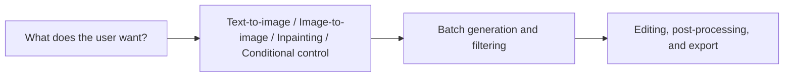

# SD Applications


:::tip Reading guide
For SD applications, first figure out whether the user is trying to “generate from scratch,” “edit based on a reference image,” “do partial repair,” or “control by conditions.” Choose the right application mode first, then talk about prompts, parameters, and workflows. That will make your project much more stable.
:::

:::tip What this section is about
In the previous two sections, we already explained:

- the principles of diffusion models
- the Stable Diffusion architecture

This section shifts the focus from “how the model works” to “how users and products use it.”

In many cases, what really determines whether a model is valuable is not just whether it can generate images, but:

> **Can it be integrated into a specific workflow?**
:::

## Learning Objectives

- Understand the most common application forms of Stable Diffusion
- Distinguish text-to-image, image-to-image, inpainting, and style control
- Understand why real-world applications are usually “model + workflow”
- Build a systematic intuition for SD product forms

---

## First, Build a Map

SD applications are easier to understand as “user goal -> generation form -> workflow”:



So what this section really wants to solve is:

- Why SD in real products is rarely just one button
- Why workflow design is often more important than a single generation

---

## 1. Why Is Stable Diffusion So Easy to Productize?

Because it is very close to user needs.  
Many user problems can be directly mapped to generation tasks:

- I want a poster
- I want to turn this sketch into a polished image
- I want to modify one part of this picture
- I want to turn this image into another style

In other words, Stable Diffusion can easily move from:

- model capability

to:

- product capability

That is the fundamental reason its application ecosystem exploded.

### 1.1 A Better Analogy for Beginners

You can think of Stable Diffusion applications as:

- a creative workbench

Text-to-image is like:

- starting from a blank canvas

Image-to-image is like:

- refining an existing sketch

Inpainting is like:

- changing only a small part of the image

Once you understand it this way, it becomes much clearer why it naturally grows into products, rather than staying as just a model demo.

---

## 2. First Type: Text-to-Image

### 2.1 The Classic Entry Point

The user inputs:

- a prompt

The system outputs:

- an image

For example:

```python
text_to_image_task = {
    "prompt": "An orange cat sitting by the window, sunset, cinematic",
    "output": "generated_image"
}

print(text_to_image_task)
```

### 2.2 Why Is This So Intuitive?

Because it makes the idea of “language intent -> image result” very direct for the first time.  
Users do not need to understand the model; as long as they can describe what they want, they can start creating.

---

## 3. Second Type: Image-to-Image (img2img)

### 3.1 The Biggest Difference from Text-to-Image

Text-to-image is more like:

- starting from scratch

Image-to-image is more like:

- transforming an existing image

For example:

```python
img2img_task = {
    "image": "rough_sketch.png",
    "prompt": "Turn it into a cyberpunk-style illustration"
}

print(img2img_task)
```

### 3.2 Why Is This Mode Valuable?

Because many creative tasks are not about “generating from zero,” but about:

- starting from a sketch
- starting from a reference image
- starting from an existing composition

Users often care more about “improving along an existing direction” than about gambling on a brand-new image.

---

## 4. Third Type: Inpainting

### 4.1 Why Does This Feature Feel So Product-Like?

Because real users often do not want to remake the whole image. They only want to change one local area.

For example:

- remove a passerby in the background
- fill in an empty tabletop
- replace a small region with something else

### 4.2 A Task Example

```python
inpainting_task = {
    "image": "scene.png",
    "mask": "mask.png",
    "prompt": "Fill the masked area with a wooden table"
}

print(inpainting_task)
```

The key new element here is:

- `mask`

In other words, the model not only needs to know “what to generate,” but also “where to change it.”

---

## 5. Fourth Type: Style Control and Conditional Control

Often, what users really want to control is not “what to draw,” but:

- what style to draw it in
- what composition to keep
- what line art to follow
- what pose to preserve

This makes many “control-based generation” workflows very important.

For example:

- line art -> finished image
- pose map -> character
- depth map -> scene

So in real applications, the user input is often not just one prompt, but a set of conditions.

### 5.1 A Selection Table That Is Good for Beginners to Remember

| User need | More suitable mode |
|---|---|
| Make a poster from scratch | Text-to-image |
| Turn an existing sketch into a polished image | Image-to-image |
| Only change a local element | Inpainting |
| Keep pose, composition, or structure fixed | Conditional control |

This table is especially useful for beginners, because it helps you translate a “feature name” directly into “when should I use it?”

---

## 6. Why Are Real SD Applications Usually Not Just “One Model + One Prompt”?

Because once you productize it, you usually add many more layers:

- prompt templates
- style presets
- negative prompts
- batch generation
- candidate filtering
- post-processing

At that point, the system becomes more like:

> **model + parameter panel + workflow.**

That is why many AI image generation products eventually look like a creative workbench, rather than a single generation button.

---

## 7. An Example of a Workflow Product

```python
poster_workflow = {
    "task": "poster generation",
    "inputs": {
        "prompt": "Tech conference poster, blue neon style",
        "style_preset": "futuristic",
        "negative_prompt": "blurry, low resolution, distorted text",
        "num_images": 4
    },
    "steps": [
        "Construct the prompt",
        "Batch sampling",
        "Filter candidate images",
        "Post-process"
    ]
}

print(poster_workflow)
```

The most important meaning of this example is:

> At the application layer, what usually matters is not “generate one image,” but “how do we reliably produce a result the user can accept?”

### 7.1 Another Minimal “Workflow Selector” Example

```python
def choose_sd_mode(request):
    if "edit image" in request or "retouch" in request:
        return "inpainting_or_img2img"
    if "sketch" in request:
        return "img2img"
    if "pose" in request or "line art" in request:
        return "controlled_generation"
    return "text_to_image"


for request in ["Make a poster", "Turn this sketch into an illustration", "Edit image: remove the person in the upper right corner"]:
    print(request, "->", choose_sd_mode(request))
```

This example is very suitable for beginners, because it reminds you that:

- the product layer first needs to determine which creative mode the user is in
- then it decides the parameters and process that follow

---

## 8. Why Do Applications Often Need Batch Generation?

Because image generation is naturally stochastic.  
With the same prompt:

- this time may be great
- next time may be average
- the time after that may go off-topic

So many applications do not generate only one image. Instead, they:

- generate multiple images at once
- let the user choose

This is the product-level way of dealing with the randomness of the model.

---

## 9. The Most Common Failure Points in Stable Diffusion Applications

### 9.1 Text Control Is Not Stable Enough

The more complex the user description is, the easier it is for the result to drift.

### 9.2 Local Details Are Hard to Control

Especially:

- text
- hands
- fine structures

### 9.3 The User’s Real Problem Is Often Not “Generation,” but “Editing”

This is also why many products increasingly emphasize:

- img2img
- inpainting
- control

rather than only single-shot text-to-image.

## If You Turn This into a Project, What Is Most Worth Showing?

What is most worth showing is usually not:

- “I can generate images”

but:

1. How different creative needs are routed to different workflows
2. How candidate images are generated in batches and filtered
3. How the editing stage is connected
4. How the final result is exported

This makes it easier for others to see that:

- you understand a creative workbench
- not just a single image generation button

---

## Summary

The most important thing in this section is not memorizing a few application names, but understanding:

> **The value of Stable Diffusion applications lies in how they can be organized into different creative workflows, not just in single-image generation.**

Once you look at it from a workflow perspective, it becomes much easier to understand why it can grow into such a rich set of product forms.

---

## Exercises

1. Design one application scenario of your own for text-to-image, image-to-image, and inpainting.
2. Think about why real SD products usually support generating multiple candidate images at once.
3. Explain in your own words why we say SD products are more like a “workbench” than “one model button.”
4. If you were building an e-commerce product image tool, which type of SD application would you need more? Why?
